## 🎯 학습목표

- 알고리즘, 프로그램, 의사코드를 구분한다.
- Maximum, Linear Search, Binary Search를 추적하고 설명한다.
- 입력 크기 $n$에 대한 기본 연산 수를 센다.
- $O$, $\Omega$, $\Theta$의 의미를 수식과 말로 표현한다.

## Part A. 알고리즘이란 무엇인가

::: {.callout-tip title="강의를 관통하는 질문"}
답만 맞는 절차를 넘어, **왜 맞고 얼마나 잘 확장되는가?**
:::

같은 문제도 선택에 따라 답이 달라질 수 있다. 67센트를 거슬러 줄 때 25, 10, 5, 1센트 동전으로
큰 동전부터 고르면(greedy) 6개가 필요하다.

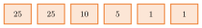{fig-alt="25,25,10,5,1,1 여섯 개의 동전이 나열된 다이어그램" width="45%"}

하지만 동전 체계가 $\{1,3,4\}$이고 목표가 6이면, 큰 동전부터 고르는 greedy는 $4+1+1=6$(3개)를
주지만 $3+3=6$(2개)이 더 좋다. **최적임은 증명으로, 최적이 아님은 반례로 판단한다** — 그럴듯한
알고리즘이 항상 정확하거나 최적이지는 않다.

작은 입력에서는 구현 상수의 차이가 커 보이지만, 입력 크기 $n$이 커지면 성장률이 지배한다.

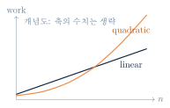{fig-alt="linear로 표시된 파란 곡선과 quadratic으로 표시된 주황 곡선이 n이 커질수록 벌어지는 개념도" width="45%"}

알고리즘은 실행 가능성뿐 아니라 **정확성(correctness)**과 **확장성(scalability)**을 함께
결정한다.

### 알고리즘과 프로그램

::: {.callout-note title="정의"}
**Algorithm**은 입력을 받아 원하는 출력을 만드는 명확하고 유한한 절차다.
:::

{fig-alt="입력, 알고리즘, 출력 세 상자가 화살표로 연결된 다이어그램" width="55%"}

핵심은 특정 언어가 아니라 **문제 해결 규칙**이라는 데 있다. 이를 명세·알고리즘·프로그램 세
층위로 더 정확히 나눌 수 있다.

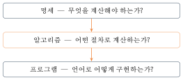{fig-alt="명세, 알고리즘, 프로그램 세 단이 화살표로 이어진 다이어그램" width="60%"}

같은 알고리즘을 Python, C, Java 등 여러 언어로 구현할 수 있다. 프로그램은 알고리즘을 특정
언어와 실행 환경에서 구현한 **실행 가능한 표현**이다.

프로그램을 시작하면 컴퓨터가 알고리즘의 단계들을 **실행(execute)**한다. 컴퓨터로 실행하면
빠르고 반복 가능하며 실제 구현의 동작을 확인할 수 있고, 손으로 실행(trace)하면 변수 값을 표로
추적하며 논리 오류와 비용을 이해하는 강력한 도구가 된다.

알고리즘 설계는 문제 모델링 → 전략 설계 → 정당성 설명 → 비용 분석의 순서를 밟는 창의적
활동이다.

{fig-alt="네 개의 상자가 화살표로 순서대로 이어진 다이어그램" width="70%"}

알고리즘을 발명하는 만능 알고리즘은 없다. 좋은 예제를 많이 **추적하고, 변형하고, 구현하는
연습**이 설계 감각을 만든다.

### 알고리즘의 성질

좋은 알고리즘은 아래 일곱 조건을 만족해야 한다(교재마다 분류 방식은 다를 수 있다).

| 분류 | 조건 | 의미 |
|---|---|---|
| 입출력 계약 | Input | 0개 이상의 입력 |
| 입출력 계약 | Output | 1개 이상의 결과 |
| 실행 가능성 | Definiteness | 각 단계가 모호하지 않음 |
| 실행 가능성 | Finiteness | 유한 단계 후 종료 |
| 실행 가능성 | Effectiveness | 각 단계가 실제 수행 가능 |
| 문제 해결 품질 | Correctness | 허용된 모든 입력에 올바른 결과 |
| 문제 해결 품질 | Generality | 특정 예가 아닌 문제 부류에 적용 |

"멈춘다"와 "맞는다"는 서로 독립적인 성질이다 — 입력과 무관하게 항상 0을 반환하는 Maximum
절차는 항상 멈추지만 틀리고, 정답을 찾은 뒤에도 무한 반복하는 절차는 맞을 수 있지만 멈추지
않는다.

- **부분 정확성(Partial correctness)**: 종료한다면 postcondition이 참이다.
- **종료성(Termination)**: 알고리즘이 실제로 유한 단계 후 멈춘다.
- **전체 정확성(Total correctness)**: 부분 정확성과 종료성이 모두 성립한다 — 즉 precondition이
  참이면 종료하며 postcondition이 참이다. 이 강의의 초점은 전체 정확성이다.

::: {.callout-caution collapse="true" title="확인 문제: 알고리즘 성질 Checkpoint"}
다음 각 사례가 가장 직접적으로 위반한 성질을 고르라.

1. "리스트에서 적당히 큰 값을 고른다."
2. 양의 정수 $n$에 대해 $n,n-1,n-2,\ldots$를 계속 출력한다.
3. 예제 $[7,12,3]$에서는 맞지만 음수만 있는 입력에는 0을 반환한다.

**정답**

1. Definiteness — "적당히"가 모호하다.
2. Finiteness — 종료 조건이 없다.
3. Correctness/Generality — 특정 예에만 맞고 일반 입력에는 틀린다.
:::

알고리즘은 언어와 독립적인 유한한 문제 해결 절차이고, 프로그램은 그 알고리즘의 구체적
구현이다. 좋은 알고리즘은 명확성, 정확성, 유한성을 포함한 기준을 만족한다. 다음으로
자연어보다 정확하고 코드보다 가벼운 표현을 만들어 보자.

## Part B. 의사코드(Pseudocode)

자연어는 읽기 쉽지만 모호할 수 있다 — "원하는 값을 찾는다"는 해결책이 아니다. 실제 코드는
실행 가능하지만 문법·자료형·라이브러리 세부사항이 논리와 섞인다. **Pseudocode**는 실행
순서와 핵심 연산을 정확히 드러내되 특정 프로그래밍 언어에는 묶이지 않는다.

이 강의의 의사코드 규약은 다음과 같다.

| 표기 | 의미 |
|---|---|
| `Procedure F(args)` | 절차 이름과 입력 선언 |
| `x ← expr` | 오른쪽을 계산해 x에 대입 |
| `If` / `Else` | 조건에 따른 분기 |
| `For` / `While` | 정해진 범위 / 조건 동안 반복 |
| `Return value` | 호출자에게 결과 반환 |
| `{comment}` | 실행되지 않는 설명 |

들여쓰기가 블록의 시작과 끝을 나타낸다.

### 제어 흐름 읽기

`If`/`Else`는 조건이 참이면 한 경로만 실행한다.



`While`은 조건을 다시 검사하며 반복한다. `For`는 초기화 → 조건 검사 → 본문 → 증감의 반복으로,
`While`로 표현할 수 있다. 반복 중 경계값을 바꾸는 코드는 피한다.



::: {.callout-caution collapse="true" title="확인 문제: 의사코드 Checkpoint"}
"리스트 $A$에서 $x$를 찾는다"를 최소한 다음 질문에 답하도록 고쳐라.

1. 어디서부터 어떤 순서로 비교하는가?
2. 같음을 발견하면 무엇을 반환하는가?
3. 끝까지 없으면 무엇을 반환하는가?
4. 언제 반복이 끝나는가?

**정답**

1. 왼쪽 끝 인덱스부터 오른쪽으로 하나씩 비교한다.
2. 그 인덱스를 즉시 반환한다.
3. $\NotFound$를 반환한다.
4. 값을 찾거나 배열 끝에 도달하면 끝난다.
:::

의사코드는 아이디어를 숨기는 장식이 아니라, **모든 실행 경로를 검토하는 도구**다.

## Part C. Maximum 찾기

::: {.callout-note title="문제 (Specification)"}
**Input**: 비어 있지 않은 정수 배열 $A[1..n]$\
**Output**: $\max\{A[1],\ldots,A[n]\}$
:::

아이디어는 답 전체를 기억하지 말고 지금까지 필요한 정보만 유지하는 것이다.

1. 첫 원소를 지금까지의 최댓값 $v$로 둔다.
2. 다음 원소가 $v$보다 크면 $v$를 갱신한다.
3. 모든 원소를 본 뒤 $v$를 반환한다.



변수 $v$의 의미를 한 문장으로 설명할 수 있어야 코드를 추적할 수 있다 — $v$는 **지금까지 본
원소의 최댓값**이다.

**실행 추적** ($A=[7,12,3,15,8]$, 1-based indexing):

| $i$ | 현재 $A[i]$ | 현재 최댓값 $v$ | 비교 결과 |
|---|---|---|---|
| 1 | 7  | --  | 초기화: $v\gets7$ |
| 2 | 12 | 7   | 업데이트: $7\to12$ |
| 3 | 3  | 12  | 유지: $v=12$ |
| 4 | 15 | 12  | 업데이트: $12\to15$ |
| 5 | 8  | 15  | 유지: $v=15$ |

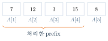{fig-alt="7,12,3,15,8 다섯 칸 배열 아래 처리한 prefix를 표시하는 중괄호가 그려진 다이어그램" width="45%"}

**왜 맞는가 (proof-sketch)**: loop invariant는 "반복의 각 단계가 끝날 때 $v=\max\{A[1],\ldots,A[i]\}$이다."

- **초기화**: $i=1$일 때 $v=A[1]$이므로 참이다.
- **유지**: $A[i]$가 더 크면 바꾸고, 아니면 그대로 둔다.
- **종료**: $i=n$까지 처리하면 $v$는 배열 전체의 최댓값이다.

정확성 증명은 "몇 번 해 보니 맞았다"보다 강한 보증이다. 복잡도는 Part H에서 Linear Search,
Binary Search와 함께 분석한다.

## Part D. 탐색 문제: Linear Search와 Binary Search

::: {.callout-note title="문제 (Search)"}
**Input**: 배열 $A[1..n]$, 찾을 값 $x$\
**Output**: $A[i]=x$인 인덱스 $i$, 없으면 $\NotFound$
:::

중복 원소가 있다면 "첫 번째 인덱스"처럼 요구사항을 명시한다. 정렬 여부는 사용할 수 있는
알고리즘을 바꾼다.

### Linear Search

왼쪽부터 하나씩 비교한다. **정렬되지 않은 배열에서도 정확히 동작**한다.



**실행 추적** ($A=[3,6,9,12,15,18,21,24]$에서 $x=12$ 찾기):

::: {.panel-tabset}
## 1단계

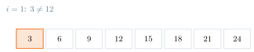{fig-alt="3,6,9,12,15,18,21,24 배열에서 첫 칸 3이 강조된 상태" width="70%"}

## 2단계

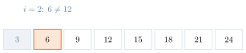{fig-alt="3이 회색으로 지워지고 6이 강조된 상태" width="70%"}

## 3단계

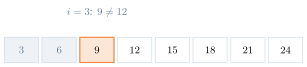{fig-alt="3과 6이 회색으로 지워지고 9가 강조된 상태" width="70%"}

## 4단계

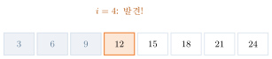{fig-alt="3,6,9가 회색으로 지워지고 12가 강조되어 발견되었음을 표시한 상태" width="70%"}
:::

찾는 즉시 인덱스를 반환하고 종료한다. **장점**: 정렬이 필요 없고, 한 번의 탐색을 위해 준비
비용이 없으며, 첫 일치에서 즉시 종료한다. **한계**: 마지막에 있거나 없으면 전부 봐야 하고,
입력이 두 배면 최악 비교 수도 두 배다. 단순하지만 전제가 적다 — "느리다"가 아니라 **비교
횟수가 입력 크기에 선형**이라고 말하자.

### Binary Search

정렬되지 않은 배열에서는 "중간값보다 작다"는 사실이 왼쪽/오른쪽 위치에 대한 정보를 주지
않는다. 중간값과 비교해서 절반을 버리려면 배열이 **오름차순 정렬**되어 있어야 한다.

{fig-alt="3,6,9,12,15,18,21,24 오름차순 배열 아래 값 증가 방향 화살표가 그려진 다이어그램" width="70%"}

::: {.callout-warning title="전제(Precondition)"}
$A[1]\le A[2]\le\cdots\le A[n]$이고, $A[i]$에 효율적인 임의 접근(random access)이 가능하다.
:::



**실행 추적** (같은 배열에서 $x=18$ 찾기):

::: {.panel-tabset}
## 1단계

![$low=1,\ mid=4,\ high=8$: $A[4]=12<18$.](../figures/01-introduction/09-binary-search-trace-step1.svg){fig-alt="8칸 배열에서 mid=4인 12가 강조되고 low·high 표시가 붙은 상태" width="70%"}

## 2단계

![$A[mid]<x$이므로 $A[1..4]$ 제거, $low=5,\ high=8$.](../figures/01-introduction/09-binary-search-trace-step2.svg){fig-alt="왼쪽 절반이 회색으로 지워지고 새 low·high 범위가 표시된 상태" width="70%"}

## 3단계

![새 구간 $[5,8]$의 $mid=6$: $A[6]=18=18$.](../figures/01-introduction/09-binary-search-trace-step3.svg){fig-alt="남은 구간에서 mid=6인 18이 강조된 상태" width="70%"}

## 4단계

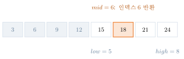{fig-alt="18이 발견되어 강조 표시된 최종 상태" width="70%"}
:::

**Invariant**: $x$가 배열에 있다면, 매 반복 시작 시 $x$는 $A[low..high]$ 안에 있다.
$A[mid]<x$이면 정렬 때문에 $mid$ 이하에는 $x$가 없고, $A[mid]>x$이면 $mid$ 이상에는 $x$가
없다. 매번 후보 구간이 절반가량 줄어든다. $low>high$가 되면 후보가 없으므로 $\NotFound$가
정확하다.

::: {.callout-caution collapse="true" title="확인 문제: 탐색 선택 Checkpoint"}
| 상황 | Linear | Binary |
|---|---|---|
| 정렬되지 않은 작은 배열, 한 번 탐색 | 적합 | 정렬 비용 필요 |
| 정렬된 큰 배열, 반복 탐색 | 가능 | 적합 |
| 연결 리스트에서 임의 중간 접근 불가 | 적합 | 부적합 |

더 빠른 성장률만 보지 말고 **전제조건, 자료구조, 준비 비용, 탐색 횟수**를 함께 본다.
:::

## Part E. 왜 복잡도인가?

복잡도는 계산 비용의 함수다. **Time complexity**는 입력 크기 $n$에 따라 필요한 기본 연산
수가 어떻게 변하는지, **Space complexity**는 입력 외에 필요한 추가 메모리가 어떻게 변하는지
묻는다.

::: {.callout-warning title="오늘의 비용 모델"}
비교, 대입, 산술 같은 기본 연산 하나는 상수 시간이라고 가정한다. 복잡도를 말할 때는 항상 이
가정을 함께 명시해야 한다.
:::

두 프로그램의 예측 시간이 $T_A(n)=30n+8$, $T_B(n)=n^2+1$ ($\mu s$)라 하자. **Benchmark**는
특정 기계·언어·입력에서 실제 성능을 보여 주고, **Analysis**는 구현 세부를 넘어 입력 규모에
따른 추세를 설명한다. 수백만 개를 처리한다면 $T_A$를 선택한다 — 작은 $n$의 승자가 큰 $n$에서도
이긴다는 보장은 없다.

같은 크기 $n$에서도 데이터 배치가 다르면 수행 연산 수가 달라진다.

- **최선 경우(Best case)**: 가장 유리한 입력의 비용
- **평균 경우(Average case)**: 입력 분포를 가정한 기대 비용
- **최악 경우(Worst case)**: 가장 불리한 입력의 비용

worst case를 자주 쓰는 이유는 모든 크기-$n$ 입력에 대한 상한을 주며 별도 확률 분포가 필요
없기 때문이다.

::: {.callout-caution collapse="true" title="확인 문제: 복잡도 정리"}
분석을 시작할 때 먼저 답해야 할 네 가지는?

**정답**

1. 입력 크기 $n$은 무엇인가?
2. 어떤 연산을 셀 것인가?
3. best, average, worst 중 무엇인가?
4. 시간과 공간 중 무엇을 분석하는가?
:::

복잡도는 초 단위 측정값이 아니라, **입력 크기에 따른 자원 증가 함수**다.

## Part F. 성장 차수(Orders of Growth)

$n^2+1$이 처음에는 $30n+8$보다 작아도 결국 이를 넘어선다 — 충분히 큰 $n$에서는 최고차항의
성장률이 지배한다.

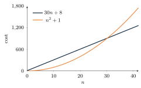{fig-alt="x축 n, y축 cost인 좌표평면에 파란 직선과 주황 이차곡선이 교차하는 그래프" width="60%"}

자주 만나는 성장률은 충분히 큰 $n$과 고정된 $c>1$에 대해 다음 순서로 커진다.

$$1 \;<\; \log n \;<\; n \;<\; n\log n \;<\; n^2 \;<\; c^n \;<\; n!$$

| 표기 | 이름 |
|---|---|
| $\Theta(1)$ | constant |
| $\Theta(\log n)$ | logarithmic |
| $\Theta(n)$ | linear |
| $\Theta(n\log n)$ | **linearithmic**(로그 밑은 상수배 차이이므로 점근적 차수에 영향을 주지 않는다) |
| $\Theta(n^k)$ ($k>0$ 상수) | polynomial |
| $\Theta(c^n)$ | exponential |
| $\Theta(n!)$ | factorial |

::: {.callout-warning title="흔한 실수: $n\log n$은 \"n log n\"이 아니라 linearithmic"}
$\Theta(n\log n)$의 표준 명칭은 **linearithmic**이다. "엔 로그 엔" 같은 즉흥적 이름 대신 이
용어로 다른 강의·교재와 소통한다.
:::

기본 연산 하나가 정확히 1 ns 걸린다고 가정하면, 다항식까지는 큰 입력도 감당할 만하지만
$n^2$부터는 빠르게 무거워진다.

| 복잡도 | $n=10$ | $n=10^3$ | $n=10^6$ |
|---|---|---|---|
| $\log_2 n$ | 3.32 ns | 9.97 ns | 19.93 ns |
| $n$ | 10 ns | 1 $\mu$s | 1 ms |
| $n\log_2 n$ | 33.2 ns | 9.97 $\mu$s | 19.93 ms |
| $n^2$ | 100 ns | 1 ms | 16분 40초 |

선형과 $n\log n$은 큰 입력도 다루지만, $n^2$은 같은 입력에서 급격히 무거워진다. 지수·팩토리얼은
더 극단적이다.

| 복잡도 | 작은 입력 | 중간 입력 | 큰 입력 |
|---|---|---|---|
| $2^n$ | $n=10$: 1.024 $\mu$s | $n=30$: 1.074초 | $n=50$: 13.0일 |
| $n!$ | $n=10$: 3.63 ms | $n=15$: 21분 48초 | $n=20$: 77.1년 |

하드웨어가 빨라도 지수·팩토리얼 성장은 곧 압도한다. 성장률은 실용성의 1차 필터다.

## Part G. 점근 표기: Big-O, Big-Omega, Big-Theta

함수 $f,g:\mathbb{N}\to\mathbb{R}_{\ge0}$에 대해

$$f(n)\in O(g(n)) \iff \exists c>0,\;\exists n_0\in\mathbb{N},\;\forall n\ge n_0:\; f(n)\le c\,g(n).$$

어떤 지점 $n_0$ 이후에는 $f$가 $g$의 상수배 위로 올라가지 않는다는 뜻이다. $O(g)$는 함수들의
**집합**이다. 관례적으로 $f(n)=O(g(n))$도 쓰지만, 이 $=$는 일반적인 수치 등식이 아니라 집합
소속을 나타내는 약식 표기다 — 엄밀하게는 $f\in O(g)$라고 쓴다.

::: {.callout-warning title="흔한 실수: $O$는 \"대략 같다\"가 아니다"}
$O$는 **상한**이다. $f\in O(g)$는 $f$가 $g$보다 빠르게 자라지 않는다는 뜻일 뿐, $f$와 $g$가
"거의 같은 크기"라는 뜻이 아니다. 정확한 점근 차수(tight bound)를 말하려면 $\Theta$가 필요하다.
:::

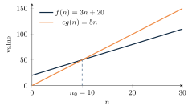{fig-alt="f(n)=3n+20 파란 직선이 cg(n)=5n 주황 직선 아래로 내려가는 지점 n0=10을 표시한 그래프" width="55%"}

**증명 예 (witness 제시)**: $30n+8\in O(n)$임을 보이자.

1. 보일 것: $30n+8\le cn$을 만족하는 $c,n_0$가 존재.
2. $c=31$, $n_0=8$을 선택한다.
3. $n\ge8$이면 $30n+8\le30n+n=31n=cn$이다.

따라서 정의에 의해 $30n+8\in O(n)$이다. $c,n_0$는 유일하거나 최소일 필요가 없지만, 선택한
값이 실제로 작동함은 보여야 한다.

$n\ge1$일 때 상한을 만드는 표준 패턴은 다음과 같다.

$$
\left|a_kn^k+\cdots+a_0\right| \le (|a_k|+\cdots+|a_0|)n^k \in O(n^k), \qquad
1+2+\cdots+n \le n\cdot n=n^2 \in O(n^2)
$$

$$
n!\le n^n\in O(n^n), \qquad \log(n!)\le\log(n^n)=n\log n\in O(n\log n)
$$

상한이 항상 tight한 것은 아니다 — 예를 들어 $1+\cdots+n$은 사실 $\Theta(n^2)$이다.

**Big-$\Omega$ (하한)**: $f(n)\in\Omega(g(n))$은 $\exists c>0,n_0$가 있어 모든 $n\ge n_0$에서
$0\le cg(n)\le f(n)$인 것이다.

**Big-$\Theta$ (tight bound)**: $f(n)\in\Theta(g(n))$은 $\exists c_1,c_2>0,n_0$가 있어
$0\le c_1g(n)\le f(n)\le c_2g(n)$ ($n\ge n_0$)인 것이다. 동치로, $f\in\Theta(g)$는
$f\in O(g)$이고 $f\in\Omega(g)$인 것과 같다.

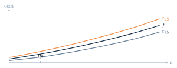{fig-alt="cost 축과 n 축 위에 c2g, f, c1g 세 곡선이 위에서부터 순서대로 그려진 그래프" width="55%"}

$O$는 위에서 누르고, $\Omega$는 아래에서 받치고, $\Theta$는 양쪽에서 같은 성장률로 조인다.
이제 이 표기를 앞서 추적한 세 알고리즘에 적용해 보자.

## Part H. 세 알고리즘의 복잡도와 구현

### Maximum의 복잡도

| 연산 | 실행 횟수 | 비용 |
|---|---|---|
| $v\gets A[1]$ | 1 | $c_1$ |
| $A[i]>v$ 비교 | $n-1$ | $c_2(n-1)$ |
| $v\gets A[i]$ | 최대 $n-1$ | $\le c_3(n-1)$ |
| return | 1 | $c_4$ |

$$T(n)\le(c_2+c_3)(n-1)+c_1+c_4\in O(n), \qquad T(n)\in\Omega(n).$$

비교 한 번은 최대 한 개의 최댓값 후보만 제거한다. 처음에 $n$개의 후보가 있으므로 하나만
남기려면 적어도 $n-1$번의 비교가 필요하다. 따라서 best case와 worst case 모두
$T(n)\in\Theta(n)$이다.

**구현**: 세 언어 모두 이 섹션의 손 추적과 같은 예제 입력 `[7, 12, 3, 15, 8]`을 쓴다. 의사코드는
1-based 인덱스를 쓰지만($v\gets A[1]$, $i$는 2..n) C/Java/Python 배열은 모두 0-based다 —
`v`는 `a[0]`에서 시작하고 `i`는 1..n-1로 한 칸씩 어긋난다(코드 주석 참고).

::: {.panel-tabset}
## Python
```{.python}

```
## Java
```{.java}

```
## C
```{.c}

```
:::

**실행 결과** (실제 컴파일·실행 캡처 — `gcc -Wall`, `javac`/`java`, `python3`):

::: {.panel-tabset}
## Python
```{.default}

```
## Java
```{.default}

```
## C
```{.default}

```
:::

### Linear Search의 복잡도

핵심 연산을 $A[i]=x$ 비교로 잡는다.

| 경우 | 비교 횟수 | 차수 |
|---|---|---|
| best case: $x=A[1]$ | 1 | $\Theta(1)$ |
| worst case: 마지막 또는 없음 | $n$ | $\Theta(n)$ |
| average case: 각 위치가 균등, 항상 존재 | $(n+1)/2$ | $\Theta(n)$ |

평균 분석에는 **입력 분포 가정**이 필요하다. "평균"이라는 말만으로는 분석이 완성되지 않는다.

**구현**: 세 언어 모두 같은 예제 입력 `[3, 6, 9, 12, 15, 18, 21, 24]`, `x=12`를 쓴다. 의사코드는
1-based 인덱스를 쓰지만 C/Java/Python 배열은 모두 0-based다 — `i`는 0..n-1로 한 칸 어긋나고,
$\NotFound$는 `-1`로 표현한다(코드 주석 참고).

::: {.panel-tabset}
## Python
```{.python}

```
## Java
```{.java}

```
## C
```{.c}

```
:::

**실행 결과** (실제 컴파일·실행 캡처 — `gcc -Wall`, `javac`/`java`, `python3`):

::: {.panel-tabset}
## Python
```{.default}

```
## Java
```{.default}

```
## C
```{.default}

```
:::

### Binary Search의 복잡도

첫 비교에서 찾으면 best case time은 $\Theta(1)$이다. worst case를 위해 $n=2^k$라고 하면
후보 수는 매 반복마다 절반이 된다.

$$2^k \to 2^{k-1}\to\cdots\to2^1\to2^0=1$$

$k$번 줄인 뒤 하나가 되므로 $k=\log_2n$이다. 일반적인 $n$에서도 반복 횟수는 최대
$\lceil\log_2 n\rceil+O(1)$이다. 정렬된 임의 접근 배열에서 Binary Search의 worst case time은
$\Theta(\log n)$이다.

**구현**: 세 언어 모두 이 섹션의 추적과 같은 예제 입력 `[3, 6, 9, 12, 15, 18, 21, 24]`, `x=18`을
쓴다. `low`, `high`는 0-based inclusive 경계이며(`low`는 0, `high`는 `n-1`부터 시작), `mid`는
의사코드와 같은 overflow-safe한 `low + (high-low)/2` 형태를 쓴다(코드 주석 참고).

::: {.panel-tabset}
## Python
```{.python}

```
## Java
```{.java}

```
## C
```{.c}

```
:::

**실행 결과** (실제 컴파일·실행 캡처 — `gcc -Wall`, `javac`/`java`, `python3`):

::: {.panel-tabset}
## Python
```{.default}

```
## Java
```{.default}

```
## C
```{.default}

```
:::

### 세 알고리즘 비교

| 알고리즘 | 핵심 아이디어 | 전제 | worst time |
|---|---|---|---|
| Maximum | 후보 1개 유지 | 비어 있지 않음 | $\Theta(n)$ |
| Linear Search | 왼쪽부터 비교 | 정렬 불필요, 순차 접근 가능 | $\Theta(n)$ |
| Binary Search | 후보 구간 절반 제거 | 정렬 + 효율적 임의 접근 | $\Theta(\log n)$ |

세 분석 모두 **상태**, **반복당 일**, **반복 횟수**를 분리하면 쉬워진다.

::: {.callout-caution collapse="true" title="확인 문제: 복잡도 Checkpoint"}
다음 주장 중 참인 것을 고르고, 거짓이면 고쳐 보자.

1. $n\in O(n^2)$이므로 선형 알고리즘의 정확한 차수는 $O(n^2)$이다.
2. Binary Search는 어떤 배열에서도 $\Theta(\log n)$이다.
3. Maximum은 입력 값과 무관하게 $n-1$번 비교한다.

**정답**

1. 상한으로는 참이나, 정확한(tight) 차수는 $\Theta(n)$이다.
2. 거짓 — 정렬·임의 접근이 전제일 때만 best case $\Theta(1)$, worst case $\Theta(\log n)$이다.
3. 참.
:::

## 개념 지도

{fig-alt="문제·명세, 알고리즘, 정확성, 복잡도 네 상자가 화살표로 순서대로 이어진 다이어그램" width="80%"}

## 💡 배움 포인트

- 의사코드는 절차를 명확하게, invariant는 왜 맞는지를 설명한다.
- 입력 크기와 기본 연산을 정한 뒤 반복 횟수를 센다.
- $O$는 상한, $\Omega$는 하한, $\Theta$는 tight bound다 — $O$를 "대략 같다"로 오해하지 않는다.
- Linear Search worst case는 $\Theta(n)$이다. Binary Search는 정렬된 임의 접근 배열에서
  best case $\Theta(1)$, worst case $\Theta(\log n)$이다.
- $\Theta(n\log n)$의 올바른 이름은 linearithmic이다.

## 🧪 직접 해보기

::: {.callout-caution collapse="true" title="설명 Quiz"}
먼저 혼자 90초, 그다음 옆 사람과 근거를 비교해 보자.

1. 알고리즘과 프로그램의 차이는?
2. Maximum에서 $v$가 유지하는 invariant는?
3. 정렬된 임의 접근 배열 $[2,5,8,12,16,23,38]$에서 16을 Binary Search로 찾을 때 비교하는
   값들은?
4. $4n^2+3n+7$의 tight bound는?
5. $f\in O(g)$와 $f\in\Theta(g)$의 차이는?

**정답**

1. 알고리즘은 언어 독립적 절차, 프로그램은 그 구체적 구현이다.
2. 처리한 prefix의 최댓값이 $v$다.
3. $mid=4,6,5$이므로 $12\to23\to16$을 차례로 비교한다. 정렬과 효율적인 임의 접근이 전제다.
4. $\Theta(n^2)$.
5. $O$는 점근적 상한이고, $\Theta$는 상·하한이 일치하는 tight bound다.
:::

::: {.callout-tip collapse="true" title="Exit Ticket"}
오늘 가장 헷갈린 개념 하나와, 그것을 확인할 수 있는 짧은 예 하나를 적어 보자.
:::

## 요약

알고리즘은 언어와 독립적인 유한한 문제 해결 절차이고, 프로그램은 그 구체적 구현이다. 의사코드는
손 타이핑 없이 절차를 정확히 드러내는 중간 표현이다. Maximum·Linear Search·Binary Search를
손으로 추적하며 loop invariant로 정확성을 논증했고, 상태·반복당 일·반복 횟수를 분리해 각각
$\Theta(n)$, $\Theta(n)$, $\Theta(\log n)$의 worst-case 복잡도를 얻었다. 점근 표기에서 $O$는
상한, $\Omega$는 하한, $\Theta$는 상·하한이 일치하는 tight bound이며, $O$를 "대략 같다"로
읽는 것은 흔한 오개념이다. 다음 강의에서는 재귀 구조와 recurrence를 통해 더 복잡한 알고리즘의
비용을 분석한다.
