## 🎯 학습목표

- 재귀 mission, base case, recursive case, progress measure를 정의한다.
- 호출 스택의 push와 반환 과정을 추적한다.
- 귀납법으로 정확성을, 점화식으로 효율성을 설명한다.
- Binary Search, Hanoi, DFS/backtracking, Flood Fill, Power Set에 재귀를 적용한다.
- 재귀 구현과 반복 구현의 시간·공간 trade-off를 비교한다.

## Part A. 재귀의 기본 원리

**Iteration**은 반복문이 상태를 갱신한다(`for (i=1; i<=n; ++i)`). **Recursion**은 작은 동일
문제의 답을 사용한다($S(n)=n+S(n-1)$). 둘은 계산 능력은 같지만 문제를 표현하는 관점이 다르다.

::: {.callout-tip title="Mission"}
$F(n)$은 크기 $n$인 문제의 답을 반환한다. 재귀 호출은 이 mission을 더 작은 입력에 위임한다.
호출 문법보다 중요한 것은 **작은 답으로 큰 답을 만드는 관계**다.
:::

재귀의 세 요소:

1. **Base case**: 직접 답할 수 있는 가장 작은 입력.
2. **Recursive case**: 작은 동일 문제를 호출하고 결과를 결합한다.
3. **Progress measure**: 각 호출에서 입력 크기나 남은 선택 수가 감소한다.

::: {.callout-warning title="흔한 실수: base case가 있어도 무한 재귀"}
`f(n) = 1 + f(n)` 또는 `f(n) = f(n+1)`처럼, base case가 있어도 호출이 그곳으로 **도달하지
않으면** 종료하지 않는다. 결국 call stack overflow가 발생한다 — progress measure가 실제로
줄어드는지 확인해야 한다.
:::

::: {.callout-caution collapse="true" title="확인 문제: 재귀 설계 체크리스트"}
새 재귀 함수를 작성하기 전에 아래 다섯 질문에 답할 수 있는가?

1. mission을 한 문장으로 썼는가?
2. base case가 모든 경로를 막는가?
3. recursive call이 mission과 같은가?
4. progress measure가 엄격히 감소하는가?
5. 반환값/변경 상태를 어떻게 결합·복구하는가?

**정답**: 정해진 답은 없다 — 이 다섯 질문 자체가 이 장 전체에서 반복해서 쓸 설계 도구다.
:::

코드가 짧다는 사실과 실행이 빠르다는 사실은 다르다.

## Part B. 재귀의 실행: 호출 스택

::: {.callout-tip title="Mission"}
`sum(n)`은 $1$부터 $n$까지의 합을 반환한다.
:::

- **Base**: $sum(0)=0$.
- **Recurse**: $sum(n)=n+sum(n-1)$.
- **Progress**: $n\to n-1$.

::: {.panel-tabset}
## Python
```{.python}

```
## Java
```{.java}

```
## C
```{.c}

```
:::

**Precondition**: $n\ge0$(음수 입력 정책은 별도로 정해야 한다). 분석 가정: 수학적 합이 정수
범위를 넘지 않는다.

**실행 결과** (실제 컴파일·실행 캡처 — `gcc -Wall`, `javac`/`java`, `python3`):

::: {.panel-tabset}
## Python
```{.default}

```
## Java
```{.default}

```
## C
```{.default}

```
:::

$sum(4)$를 손으로 실행하면 먼저 $4+3+2+1+sum(0)$까지 호출이 내려간 뒤, $sum(0)=0$에서
반환하며 보류된 덧셈이 풀린다: $4+3+2+1+0=10$.

**호출 스택 Push**: 재귀 호출마다 새 frame이 쌓인다.

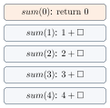{fig-alt="sum(4), sum(3), sum(2), sum(1), sum(0) 다섯 개의 stack frame이 아래에서 위로 쌓인 다이어그램" width="30%"}

**호출 스택 Pop**: base case에 도달하면 반환값이 caller로 전달되며 frame이 제거된다. 반환값
전달과 frame 제거는 같은 순간에 일어난다.

::: {.panel-tabset}
## 1단계

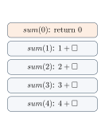{fig-alt="sum(4)부터 sum(1)까지 네 frame이 쌓이고 맨 위 sum(0)이 강조되어 0을 반환하는 상태" width="30%"}

## 2단계

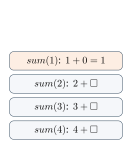{fig-alt="sum(0) frame이 제거되고 sum(1)이 1을 반환하며 강조된 상태" width="30%"}

## 3단계

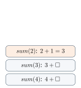{fig-alt="sum(1) frame이 제거되고 sum(2)가 3을 반환하며 강조된 상태" width="30%"}

## 4단계

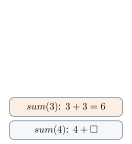{fig-alt="sum(2) frame이 제거되고 sum(3)이 6을 반환하며 강조된 상태" width="30%"}

## 5단계

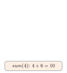{fig-alt="모든 frame이 제거되고 sum(4)만 남아 10을 반환하며 강조된 최종 상태" width="30%"}
:::

**활성 레코드(Activation Record)**는 호출마다 독립적인 매개변수 $n$, 돌아갈 명령 위치, 보류된
계산을 담는다. 호출(아래로): $sum(4)\to sum(3)\to sum(2)\to sum(1)\to sum(0)$. 반환(위로):
$0\to1\to3\to6\to10$. caller는 기다리다가, 반환값을 받으며 frame이 제거되는 순간 보류된
계산을 재개한다.

::: {.callout-caution collapse="true" title="확인 문제: 호출 스택 Checkpoint"}
1. `sum(4)`가 `sum(3)`을 호출하는 순간 7을 반환한다?
2. 모든 호출이 같은 지역변수 $n$을 공유한다?
3. base case에서는 recursive call이 없다?

**정답**

1. 거짓 — 반환을 기다린다.
2. 거짓 — frame마다 독립적으로 저장된다.
3. 참.
:::

## Part C. 정확성: 귀납법과 재귀

재귀와 귀납법은 같은 계단을 오른다.

| | 귀납법 | 재귀 |
|---|---|---|
| Base | 가장 작은 입력에서 직접 확인 | base case |
| Hypothesis | 작은 입력에서 명제가 맞다고 가정 | 재귀 호출의 반환값을 신뢰 |
| Step | 그 결과를 사용해 현재 입력도 맞음을 보임 | 반환값을 결합해 현재 결과를 만듦 |

$sum(n)$의 정확성: $n=0$이면 0을 반환하므로 맞다. $sum(n-1)$이 $1+\cdots+(n-1)$이라고
가정하면, $n$을 더한 값은 $1+\cdots+n$이다.

| 코드 | 증명 역할 |
|---|---|
| `if (n == 0) return 0;` | base case |
| `sum(n - 1)` | induction hypothesis 사용 |
| `n + ...` | induction step의 결합 |

**Factorial의 정확성**: $n!=1$($n=0$), $n!=n\cdot(n-1)!$($n>0$). $factorial(n-1)=(n-1)!$이라
가정하면 반환값은 $n(n-1)!=n!$이고, 입력 $n-1$은 감소하므로 종료한다.

::: {.callout-note title="정확성과 효율성은 별개"}
**Correctness**: 모든 허용 입력에서 mission을 달성하는가? **Efficiency**: 시간·공간이 입력에
따라 얼마나 증가하는가? Fibonacci의 순진한 재귀는 맞지만(Part D) 매우 비효율적이다 — 정확성과
효율성은 독립적으로 확인해야 한다.
:::

## Part D. 기본 예제 비교

`factorial`은 `sum`과 같은 선형 재귀 패턴이다: base case $n=0\Rightarrow1$, recursive case
$n\cdot factorial(n-1)$, progress $n$ 감소. Time과 depth 모두 $\Theta(n)$이다. 거듭제곱
$x^n$의 재귀 `power(x,n)`도 같은 모양이다: base $n=0\Rightarrow1$, recursive
$x\cdot power(x,n-1)$, time/depth $\Theta(n)$(중간 곱셈과 결과에 overflow가 없다고 가정).

**Fibonacci**: $F_0=0$, $F_1=1$, $F_n=F_{n-1}+F_{n-2}$. Base $n<2\Rightarrow n$, recursive
$fib(n-1)+fib(n-2)$, progress $n$이 1 또는 2 감소 — 이번에는 호출이 **분기**한다.

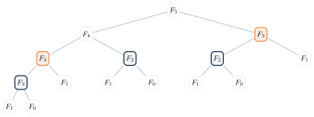{fig-alt="F5를 루트로 F4, F3가 자식이 되고 그 아래로 F3, F2, F1, F0가 반복해서 나타나는 이진 트리, 반복되는 F3와 F2가 색으로 강조됨" width="70%"}

$T(n)=\Theta(\varphi^n)$이 정확한 tight bound이고, $O(2^n)$은 편리하지만 느슨한 상한이다.
같은 입력의 답을 저장하는 **메모이제이션(Memoization)**을 쓰면 $\Theta(\varphi^n)$이
$\Theta(n)$으로 줄어든다 — Dynamic Programming에서 체계적으로 다룬다.

문자열도 재귀로 다룰 수 있다: `length(s)`(base 널 문자, recursive suffix 길이+1),
`print_chars(s)`(호출 **전**에 출력 → 순방향), `print_reverse(s)`(호출 **후**에 출력 →
역방향 — `"ABC"`는 출력 없이 끝까지 호출한 뒤 $C\to CB\to CBA$로 반환), `print_binary(n)`(base
$n<2$, recursive $n/2$ 먼저 호출한 뒤 $n\bmod2$ 출력 — $13$은 $6\to3\to1$을 먼저 호출한 뒤
나머지 $1,0,1,1$을 출력, $n\ge1$에서 time/depth $\Theta(\log n)$).

::: {.callout-caution collapse="true" title="확인 문제: 기본 예제 Checkpoint"}
| 문제 | 입력 감소 | 호출 수 | 시간 |
|---|---|---|---|
| factorial | $n-1$ | 1 | $\Theta(n)$ |
| string | suffix | 1 | $\Theta(n)$ |
| binary print | $n/2$ | 1 | $\Theta(\log(n+1))$ |
| Fibonacci | $n-1,n-2$ | 2 | $\Theta(\varphi^n)$ |

**정답**: 표 자체가 정답이다 — 호출의 형태(선형 vs 분기)를 수행시간 함수로 옮기면 다음 절의
점화식이 된다.
:::

## Part E. 점화식과 분석 방법

현재 호출의 시간은 **작은 호출들의 시간 + 현재 호출의 일**이다:
$T(n)=\sum T(\text{subproblem size})+\text{local work}$. 점화식에는 재귀가 멈추는 base
cost도 함께 둔다(예: $T(1)=\Theta(1)$).

$T(n)=T(n-1)+\Theta(1)$은 호출 경로가 하나인 **선형 재귀**, $T(n)=T(n-1)+T(n-2)+\Theta(1)$은
호출 트리가 갈라지는 **분기 재귀**다. 깊이만 보고 시간을 판단하면 안 된다 — 분기 재귀는 깊이가
얕아도 leaf 수가 지수적으로 늘 수 있다.

**반복대치(iterated substitution)** 두 예:

$$T(1)=\Theta(1),\quad T(n)=T(n-1)+n \;\Rightarrow\; T(n)=T(1)+2+\cdots+n=\frac{n(n+1)}2=\Theta(n^2).$$

$$T(1)=\Theta(1),\quad T(n)=2T(n/2)+n \;\Rightarrow\; T(n)=2^kT(n/2^k)+kn,\; k=\log_2n \;\Rightarrow\; T(n)=\Theta(n\log n).$$

패턴이 base case에 닿을 때까지 펼치는 방식이다. 일반적인 $n$의 floor/ceiling은 점근적 결과를
바꾸지 않는다.

**재귀 트리**로 같은 식 $T(n)=2T(n/2)+n$을 보면 level별 일이 직접 보인다.

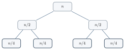{fig-alt="루트 n에서 시작해 n/2 두 개, n/4 네 개로 갈라지는 이진 트리, 오른쪽에 level 0은 n, level 1은 n, level 2는 n이라는 계산이 표시됨" width="60%"}

네 개의 $n/4$는 서로 다른 호출이다. $n\log_2n+\text{leaf cost}=\Theta(n\log n)$.

**추정 후 증명**: $T(n)\le cn\log n$이라고 추정하면
$T(n)\le2c\frac n2\log\frac n2+n=cn\log n-cn+n$이고, $c\ge1$이면 원하는 상한을 얻는다(base
case와 충분히 큰 $n$도 확인해야 한다).

::: {.callout-warning title="흔한 실수: 귀납가정을 강화해야 할 때"}
$T(1)=\Theta(1)$, $T(n)=2T(n/2)+1$에서 단순히 $T(n)\le cn$을 대입하면 $cn+1$이 남아 그대로
증명되지 않는다. $T(n)\le cn-2$로 **강화**하면
$T(n)\le2(cn/2-2)+1=cn-3<cn-2$로 성립한다 — 추정을 여유 있게 잡아야 induction step이 닫히는
경우가 있다.
:::

| 방법 | 잘 맞는 경우 | 장점 |
|---|---|---|
| 반복대치 | 패턴이 단순 | 정확한 합 |
| 재귀 트리 | level별 일이 보임 | 직관 |
| 추정+증명 | 답을 예상 가능 | 엄밀한 확인 |
| Master Theorem | 표준 분할형 | 빠른 분류 |

## Part F. Master Theorem

$$T(1)=\Theta(1),\qquad T(n)=aT(n/b)+f(n).$$

$a$는 생기는 하위 문제 수, $n/b$는 각 하위 문제 크기, $f(n)$은 분할·결합 등 현재 노드의
일이다(설명을 위해 $n$을 $b$의 거듭제곱으로 둔다 — floor/ceiling은 점근적 결과를 바꾸지
않는다). 깊이 $\log_bn$에서 leaf 수는 $a^{\log_bn}=n^{\log_ba}$이고, leaf 하나의 비용이
상수라면 이것이 재귀 호출 부분의 총 규모다.

{fig-alt="재귀 작업과 현재 작업 두 상자가 양방향 화살표로 연결된 다이어그램" width="55%"}

세 예제:

1. **leaf가 지배**: $T(n)=2T(n/3)+\Theta(1)$. $n^{\log_32}$가 상수보다 크므로
   $T(n)=\Theta(n^{\log_32})$.
2. **root가 지배**: $T(n)=2T(n/4)+\Theta(n)$, $n^{\log_42}=n^{1/2}$. 현재 작업 $n$이 더 크고
   정규성 조건($2(n/4)=n/2$)도 만족하므로 $T(n)=\Theta(n)$.
3. **level별 균형**: $T(n)=2T(n/2)+\Theta(n)$. $n^{\log_22}=n$과 결합 비용이 균형을 이루므로
   $\Theta(n\log n)$이다 — **Merge Sort는 절반을 재귀 정렬한 뒤 선형 시간에 합치므로 정확히
   이 식을 따른다.**

| 경우 | 조건($\epsilon>0$) | 결과 | 직관 |
|---|---|---|---|
| Case 1 | $f(n)=O(n^{\log_ba-\epsilon})$ | $\Theta(n^{\log_ba})$ | leaf가 지배 |
| Case 2 | $f(n)=\Theta(n^{\log_ba})$ | $\Theta(n^{\log_ba}\log n)$ | level별 균형 |
| Case 3 | $f(n)=\Omega(n^{\log_ba+\epsilon})$ | $\Theta(f(n))$ | root가 지배 |

다항식 차이를 가정하는 기본형이다. Case 3에는 $af(n/b)\le cf(n)$인 어떤 $c<1$이 존재하는
**정규성 조건**이 필요하다.

::: {.callout-tip title="다리: Merge Sort가 바로 이 Case 2다"}
위 예제 3의 $T(n)=2T(n/2)+\Theta(n)$은 그림만 다를 뿐 **정렬 장의 Merge Sort**가 정확히
만족하는 식이다 — 절반씩 재귀 정렬(2개의 크기 $n/2$ 하위 문제) 후 $\Theta(n)$ 선형 시간에
합친다. Case 2(level별 균형)에 해당하므로 결과는 $\Theta(n\log n)$이다. 이 장에서 배운
Master Theorem 분류표를 그대로 재사용하는 첫 예가 정렬 장의 Merge Sort다.
:::

## Part G. 재귀적으로 문제 설계하기

배열 구간, 트리의 subtree, 미로의 현재 cell, 남은 선택 집합도 **같은 형태의 더 작은 문제**를
만든다 — 자료가 아니라 **문제의 구조**가 재귀적이다.

"배열에서 찾기" 대신 암시적 상태를 명시적 매개변수로 바꾼다.

::: {.callout-note title="문제 (Specification)"}
`search(A,x,begin,end)`는 정렬된 $A[begin..end]$에서 $x$와 같은 원소의 인덱스를 반환한다.
$A[begin..end]$는 비감소 순서로 정렬되어 있고, $begin,end$는 모두 포함되는(inclusive)
인덱스다. 중복값이 있으면 임의의 matching index를 반환한다.
:::

**반복형 이진 탐색**은 상태 $begin,end$를 loop가 갱신한다: $mid=begin+(end-begin)/2$(정수
overflow를 피하는 형태). Best time $\Theta(1)$, worst time $\Theta(\log n)$, extra space
$\Theta(1)$이다.

**재귀형 이진 탐색**은 같은 mid 공식을 쓰되 상태를 매개변수로 넘긴다.

::: {.panel-tabset}
## Python
```{.python}

```
## Java
```{.java}

```
## C
```{.c}

```
:::

최초 호출은 0-based 배열에서 `bsearch(A,x,0,n-1)`이다.

**실행 결과** (실제 컴파일·실행 캡처 — `gcc -Wall`, `javac`/`java`, `python3`):

::: {.panel-tabset}
## Python
```{.default}

```
## Java
```{.default}

```
## C
```{.default}

```
:::

**실행 추적** ($A=[2,5,8,12,16,23,38]$에서 $x=16$ 찾기):

::: {.panel-tabset}
## 1단계

![$begin=0,\ mid=3,\ end=6$: $A[mid]=12<16$.](../figures/02-recursion/06-binary-search-reduction-step1.svg){fig-alt="7칸 배열에서 mid=3인 12가 강조되고 begin·end 표시가 붙은 상태" width="65%"}

## 2단계

![왼쪽 절반 제거, $begin=4,\ end=6,\ mid=5$: $A[mid]=23>16$.](../figures/02-recursion/06-binary-search-reduction-step2.svg){fig-alt="왼쪽 네 칸이 회색으로 지워지고 mid=5인 23이 강조된 상태" width="65%"}

## 3단계

![$begin=mid=end=4$: $A[mid]=16=x$, 발견.](../figures/02-recursion/06-binary-search-reduction-step3.svg){fig-alt="구간이 index 4 하나로 좁혀지고 16이 강조되어 발견된 최종 상태" width="65%"}
:::

비교 결과에 맞는 **한쪽 inclusive 구간만** 다음 호출로 넘긴다.

| | iterative | recursive |
|---|---|---|
| worst time | $\Theta(\log n)$ | $\Theta(\log n)$ |
| worst extra space | $\Theta(1)$ | $\Theta(\log n)$ stack |
| 표현 | 상태 갱신 | 구간 mission |

Binary Search는 한 개의 작은 문제를 선택했다. Hanoi는 두 개의 작은 호출과 하나의 현재 작업을
결합한다.

## Part H. Hanoi

- 한 번에 원판 하나만 이동.
- 작은 원판 위에 큰 원판을 놓을 수 없음.
- 시작 peg의 $n$개를 목적 peg로 이동.

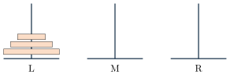{fig-alt="L, M, R 세 peg 중 L에 세 개의 원판이 크기 순으로 쌓인 다이어그램" width="45%"}

$n=1$은 한 번 이동. $n$개라면 가장 큰 원판을 움직이기 전에 위의 $n-1$개를 임시 peg로 치워야
한다. 세 단계 구조:

1. $n-1$개: start → temp
2. 원판 $n$: start → dest
3. $n-1$개: temp → dest

::: {.callout-tip title="Mission"}
$H(n,s,d,t)$는 $n$개를 $s$에서 $d$로 옮긴다($t$는 임시 peg).
:::

::: {.panel-tabset}
## Python
```{.python}

```
## Java
```{.java}

```
## C
```{.c}

```
:::

**실행 결과** (실제 컴파일·실행 캡처 — `gcc -Wall`, `javac`/`java`, `python3`):

::: {.panel-tabset}
## Python
```{.default}

```
## Java
```{.default}

```
## C
```{.default}

```
:::

**$n=3$의 핵심 상태**:

::: {.panel-tabset}
## 초기 상태

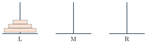{fig-alt="L peg에 세 원판이 쌓여 있고 M, R은 비어 있는 초기 상태" width="70%"}

## 첫 재귀 완료

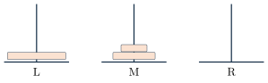{fig-alt="가장 큰 원판만 L에 남고 작은 두 원판이 M으로 옮겨진 상태" width="70%"}

## 전체 완료

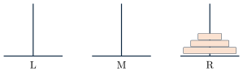{fig-alt="세 원판이 모두 R로 옮겨진 최종 상태" width="70%"}
:::

**재귀 호출과 현재 작업**: 두 $H(2)$ 호출 사이에 현재 작업 "move disk 3"이 있다. 각 $H(2)$
내부에도 두 재귀 호출 사이의 local move가 있으며, 모든 호출은 서로 다른 실행이다.

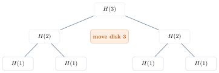{fig-alt="H(3)을 루트로 두 개의 H(2)가 자식이 되고 각각 두 개의 H(1)을 자식으로 갖는 트리, 두 H(2) 사이에 move disk 3이 표시됨" width="60%"}

**점화식과 해**: $T(1)=1$, $T(n)=2T(n-1)+1 \Rightarrow T(n)=2^n-1=\Theta(2^n)$. $n=30$이면 약
10억 번 이동이다.

::: {.callout-warning title="흔한 실수: 이동 횟수는 $2n-1$이 아니라 $2^n-1$"}
Hanoi의 최소 이동 횟수는 $n$에 **선형**이 아니라 **지수**다: $2^n-1$. 모든 이동 순서를 실제로
생성하거나 출력한다면 출력 크기가 $2^n-1$이므로 $\Omega(2^n)$ 시간이 필요하다(최소 이동
횟수만 계산하는 문제는 별도다).
:::

재귀 코드는 "작은 문제 2회 + 현재 이동 1회"를 그대로 표현한다. 정확성은 귀납법과 잘 맞지만,
자연스러운 표현이 효율적이라는 뜻은 아니다. 지금까지 호출 구조가 고정되어 있었다. Maze에서는
선택 결과에 따라 탐색 경로가 달라진다.

## Part I. 미로 탐색(Maze)과 Backtracking

::: {.callout-note title="문제 (Specification)"}
**Input**: grid, start $(r,c)$, exit. **Output**: 경로 존재 여부. `path(r,c)`는 현재 cell에서
출구로 갈 수 있으면 true를 반환한다.
:::

경로가 존재하려면 현재 cell이 출구이거나, 방문하지 않은 통로 이웃 중 하나에서 출구까지 경로가
존재해야 한다: $P(r,c)=exit(r,c)\lor\bigvee_{(r',c')\in N(r,c)}P(r',c')$.

::: {.callout-warning title="흔한 실수: visited 없이 격자를 탐색"}
격자에는 cycle이 있다: $A\to B\to A\to B\to\cdots$. 재귀 호출 **전에** 현재 cell을 visited로
표시해야 각 cell이 최대 한 번 확장되고 종료가 보장된다. Boolean 존재 여부만 반환한다면
visited를 unmark할 필요는 없다(경로 자체를 출력하려면 다른 역할의 current path가 필요하다).
:::

경로를 남기려면 (1) current를 candidate path로 표시, (2) 이웃을 재귀적으로 explore, (3) 모두
실패하면 dead end로 바꾸고 돌아간다 — 성공 상태와 방문했지만 실패한 상태를 구분한다.

**구현**: 세 언어 모두 이 절의 트레이스 그림과 같은 6×6 미로를 코드 안에 고정 grid로 둔다
(`'#'`은 벽, `'.'`은 통로, 시작 $(0,0)$, 출구 $(5,5)$). `visited`와 candidate path는 전역이
아니라 호출자가 만들어 매개변수로 넘기는 지역 배열이라 자기완결적으로 실행된다 — Hanoi와
같은 원칙이다. choose(현재 cell을 visited로 표시하고 path에 추가) → explore(네 이웃을
순서대로 재귀 탐색) → unchoose(모든 이웃이 실패하면 path에서 제거)의 구조를 코드 주석에
그대로 남겼다. 이웃 순서(위·아래·왼쪽·오른쪽)는 임의로 고정한 것이며, 실제 실행은 이 순서
때문에 트레이스 그림의 첫 dead end(위쪽 경로가 막힌 뒤 되돌아가는 지점)와 같은 지점에서
막다른 길을 만난다 — 이후의 구체적인 되돌아가기 순서는 이웃 순서 선택에 따라 그림과 다를 수
있지만, 미로 자체와 최종적으로 경로가 존재한다는 결론은 그림과 같다.

::: {.panel-tabset}
## Python
```{.python}

```
## Java
```{.java}

```
## C
```{.c}

```
:::

**실행 결과** (실제 컴파일·실행 캡처 — `gcc -Wall`, `javac`/`java`, `python3`):

::: {.panel-tabset}
## Python
```{.default}

```
## Java
```{.default}

```
## C
```{.default}

```
:::

**6×6 미로: 탐색과 되돌아가기**

::: {.panel-tabset}
## 1단계

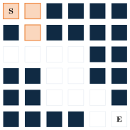{fig-alt="6x6 격자에서 시작점 S부터 세 칸이 후보 경로로 표시된 상태" width="45%"}

## 2단계

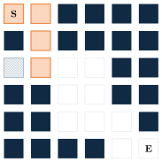{fig-alt="후보 경로 끝에 막다른 칸이 dead로 표시된 상태" width="45%"}

## 3단계

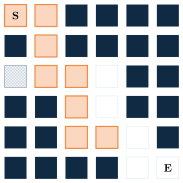{fig-alt="다른 방향으로 경로가 확장되고 추가 dead end가 표시된 상태" width="45%"}

## 4단계

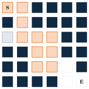{fig-alt="시작 S부터 출구 E까지 이어진 전체 경로가 표시된 최종 상태" width="45%"}
:::

**Backtracking 패턴**: choose → explore → unchoose/mark dead. 선택이 실패하면 호출 전 상태로
복구하거나, 다시 탐색할 필요가 없도록 blocked로 확정한다. 미로 탐색은 grid 위의 **DFS**다.

**복잡도**: 상하좌우 constant-degree adjacency를 쓴다. visited를 쓰면 각 열린 cell을 최대 한
번 확장: $O(RC)$. 저장 grid 외 recursion stack은 최악 $O(RC)$. visited가 없으면 종료하지
않거나 같은 경로를 반복한다 — 정확한 상태 표현이 종료성과 효율성을 동시에 만든다.

## Part J. Blob과 Flood Fill

0은 background, 1은 image pixel이다. 여기서는 **8-neighbor connectivity**를 쓴다 — 대각선까지
연결되면 같은 blob이다.

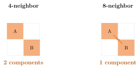{fig-alt="4-neighbor에서 대각선으로만 맞닿은 두 pixel A, B가 별개 component 2개로, 8-neighbor에서는 대각선 연결로 component 1개로 표시된 비교 다이어그램" width="65%"}

::: {.callout-tip title="Mission"}
`count(r,c)`는 $(r,c)$와 8-neighbor로 연결된 아직 세지 않은 image pixel 수를 반환한다. **Base**:
범위 밖/0/이미 셈 → 0. **Recurse**: 현재를 mark하고 이웃 8개의 count를 합함. **Progress**:
미방문 pixel 수 감소.
:::

**Blob Flood Fill 추적**:

::: {.panel-tabset}
## 1단계

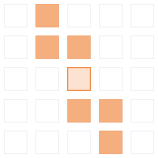{fig-alt="격자에서 시작 pixel 하나가 count됨으로 표시된 상태" width="40%"}

## 2단계

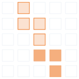{fig-alt="시작 pixel 위쪽으로 연결된 세 pixel이 추가로 count된 상태" width="40%"}

## 3단계

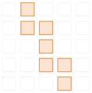{fig-alt="8-neighbor로 연결된 일곱 pixel 전부가 count되어 표시된 최종 상태" width="40%"}
:::

**복잡도**: 8-neighbor로 reachable한 pixel 수를 $k$라 하면 time $O(k)$, 전체 $R\times C$ grid
상한은 $O(RC)$, recursion depth는 최악 $O(k)$. marking은 중복 계산과 cycle을 막는다.
4-neighbor를 쓰면 연결 성분과 $k$가 달라질 수 있다. Grid의 이웃을 탐색하던 재귀를 선택 공간의
두 branch로 일반화하면 다음 절의 Power Set이 된다.

## Part K. 멱집합(Power Set)

$S=\{a,b,c\}$일 때 $\mathcal P(S)=\{\emptyset,\{a\},\{b\},\{c\},\{a,b\},\{a,c\},\{b,c\},\{a,b,c\}\}$다.
원소마다 include/exclude 두 선택이 있으므로 $2^n$개다.

::: {.callout-tip title="Mission"}
`power(k)`는 $data[k..n-1]$의 모든 선택을 완성해, 이미 정한 $include[0..k-1]$과 함께 출력한다.
:::

base case는 empty set도 한 줄로 출력한다.

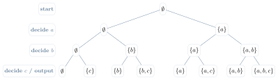{fig-alt="루트 공집합에서 시작해 a, b, c를 차례로 exclude/include하며 8개의 leaf(부분집합)에 도달하는 이진 트리" width="75%"}

**구현**: 세 언어 모두 고정 입력 `{a,b,c}`를 쓴다. `include`는 전역이 아니라 호출자(`main`)가
만들어 매개변수로 넘기는 지역 배열이다. **매 단계에서 exclude를 include보다 먼저 재귀 호출하는
순서**가 그대로 위 상태공간 트리의 왼쪽→오른쪽 leaf 순서를 만든다 — 실행 결과의 여덟 줄이
$\emptyset,\{c\},\{b\},\{b,c\},\{a\},\{a,c\},\{a,b\},\{a,b,c\}$ 순서로 나오는 것을 확인할 수
있다.

::: {.panel-tabset}
## Python
```{.python}

```
## Java
```{.java}

```
## C
```{.c}

```
:::

**실행 결과** (실제 컴파일·실행 캡처 — `gcc -Wall`, `javac`/`java`, `python3`):

::: {.panel-tabset}
## Python
```{.default}

```
## Java
```{.default}

```
## C
```{.default}

```
:::

**출력 크기가 Lower Bound다**: 부분집합 수만 $2^n$이므로 leaf 하나를 생성하는 데만
$\Omega(2^n)$이 필요하다. 길이 $n$의 include 배열을 매번 출력하면 $\Theta(n2^n)$이지만, 선택
원소를 증분적으로 유지·출력하면 표현과 출력량에 따라 비용이 달라진다 — $\Theta(n2^n)$은 모든
출력 방식에 필수인 bound가 아니다.

**확장: 순열(Permutation)과 Undo**. 순열은 남은 원소 중 하나를 choose한다:
`swap(k,i); perm(k+1); swap(k,i);`.

::: {.callout-tip title="Mutable-state invariant"}
호출 전에는 현재 partial solution을 나타낸다. 반환 뒤에는 **같은 상태로 복구**되어 다음 선택을
시험할 수 있어야 한다 — choose → explore → unchoose가 호출 전후 invariant를 지킨다.
:::

## Part L. 재귀와 반복

| 기준 | Recursion | Iteration |
|---|---|---|
| 표현 | 구조를 직접 반영 | 상태 전이 명시 |
| 호출 overhead | 있음 | 작음 |
| stack | 암시적 call stack | 보통 $O(1)$ 또는 explicit |
| 깊이 위험 | stack overflow | 명시적 메모리 관리 |

**Tail call**은 재귀 호출 뒤 할 일이 없는 호출이다. 일부 언어/컴파일러는 frame을 재사용할 수
있지만 C/C++에서 최적화는 보장되지 않는다 — 시스템 stack 제한을 설계 근거로 삼지 말자.

모든 재귀는 반복으로 바꿀 수 있다. 단순 선형 재귀는 loop로 바꾸어 extra space $O(1)$이 될 수
있다. tree traversal·DFS·backtracking은 pending work를 기억할 명시적 stack 또는 동등한 구조가
필요하다 — 재귀 문법을 없앤다고 점근적 메모리 요구가 자동으로 사라지지는 않는다.

**재귀가 자연스러움**: tree, divide-and-conquer, backtracking, DFS. **반복이 유리**: 단순 선형
순회, 매우 깊은 호출, stack 제한 시스템. 정확성·명확성·시간·공간을 함께 비교한다.

## 개념 지도

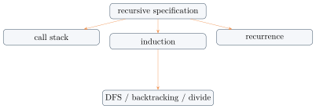{fig-alt="recursive specification 상자에서 call stack, induction, recurrence 세 상자로 화살표가 뻗고, induction에서 DFS/backtracking/divide 상자로 이어지는 다이어그램" width="55%"}

## 💡 배움 포인트

- 재귀는 mission-base case-recursive case-progress measure로 설계하는 **작은 동일 문제의
  명세**다.
- 호출 스택의 push는 답을 기다리며 frame을 쌓는 과정, pop은 반환값이 전달되며 frame이 제거되는
  과정이다 — 둘은 같은 순간에 일어난다.
- 재귀 코드의 정확성은 귀납법(base/hypothesis/step)과 한 줄씩 대응하고, 효율성은 별개의 점화식
  분석이 필요하다.
- 점화식은 반복대치·재귀 트리·추정후증명·Master Theorem 중 구조에 맞는 방법으로 푼다. Master
  Theorem Case 2($T(n)=2T(n/2)+\Theta(n)$)는 정렬 장 Merge Sort에서 다시 등장한다.
- Hanoi의 이동 횟수는 $2n-1$이 아니라 $2^n-1$이다. Maze/Blob의 backtracking은 choose → explore
  → unchoose(또는 mark dead)로 요약된다.
- 재귀 문법을 없앤다고 점근적 메모리 요구가 자동으로 사라지지 않는다 — 재귀 vs 반복은
  표현·overhead·깊이 위험을 함께 비교해 선택한다.

## 🧪 직접 해보기

::: {.callout-caution collapse="true" title="개념과 코드 추적 Quiz"}
1. base case가 있어도 무한 재귀가 가능한 이유는?
2. $sum(3)$의 push 순서와 return 값은?
3. `print`가 재귀 호출 전/후에 있으면 문자열 출력 순서는?
4. 재귀 정확성 증명에서 induction hypothesis의 역할은?
5. Binary Search의 precondition과 worst-case recursion depth는?
6. visited 없이 cycle이 있는 maze를 탐색하면?
7. $F_5$ 호출 트리에서 중복되는 부분문제 하나는?

**정답**

1. progress measure가 줄지 않아 base case에 도달하지 않을 수 있다.
2. push: $sum(3)\to sum(2)\to sum(1)\to sum(0)$; return: $0\to1\to3\to6$.
3. 호출 전이면 순방향, 반환 뒤이면 역방향으로 출력한다.
4. 작은 입력의 mission이 맞다고 가정해 현재 입력의 결합이 맞음을 보인다.
5. 비감소 정렬된 inclusive 구간과 임의 접근이 필요하며, worst-case depth는 $\Theta(\log n)$.
6. 같은 cell을 반복해 종료하지 않거나 중복 탐색한다.
7. 예: $F_3$ 또는 $F_2$.
:::

::: {.callout-caution collapse="true" title="점화식과 설계 Quiz"}
1. $T(n)=T(n-1)+n$을 푼다.
2. $T(n)=2T(n/4)+n$에 Master Theorem을 적용한다.
3. 배열 구간의 최댓값을 재귀적으로 정의하라.
4. $\{x,y\}$의 상태공간 트리와 네 subset을 그려라.

**정답**

1. $\Theta(n^2)$.
2. $\Theta(n)$ — root가 지배하며 정규성 조건도 만족한다.
3. 예: $max(b,e)=\max(A[b],max(b+1,e))$, base는 $b=e$.
4. $\emptyset,\{x\},\{y\},\{x,y\}$; level마다 $x,y$를 exclude/include한다.
:::

::: {.callout-tip collapse="true" title="Exit Ticket"}
오늘 가장 헷갈린 개념 하나와, 그것을 확인할 수 있는 짧은 예 하나를 적어 보자.
:::

## 요약

재귀는 mission-base case-recursive case-progress measure로 문제를 작은 동일 문제로 명세하는
방법이다. 호출 스택은 push(호출이 쌓임)와 pop(반환값이 전달되며 frame이 제거됨)으로 실행되고,
정확성은 귀납법과, 효율성은 점화식과 대응한다. 선형 재귀(factorial, 문자열)와 분기 재귀
(Fibonacci)는 같은 형태가 아니므로 깊이만으로 시간을 판단할 수 없고, 점화식은 반복대치·재귀
트리·추정후증명·Master Theorem 중 알맞은 방법으로 푼다 — Master Theorem의 표준 3-case는 정렬 장
Merge Sort의 Case 2로 다시 쓰인다. Binary Search·Hanoi·Maze/Blob·Power Set은 각각 한 개의
작은 문제, 두 개의 작은 호출과 현재 작업, backtracking(choose-explore-unchoose), 두 갈래
선택 공간이라는 서로 다른 재귀 모양을 보여준다. 재귀와 반복은 계산 능력이 같지만
표현·overhead·깊이 위험이 다르므로 상황에 맞게 선택해야 한다.
