## 🎯 학습목표

- permutation 보존과 ordered output으로 정렬 문제를 명세한다.
- stability, auxiliary space, in-place, adaptivity, worst-case 보장, key 제약으로 정렬 알고리즘을 비교한다.
- Selection, Bubble, Insertion, Merge, Quick, Heap, Counting, Radix Sort의 invariant를 추적하고 분석한다.
- 비교 정렬의 $\Omega(n\log n)$ 하한을 결정 트리로 설명한다.
- Java/C 정렬 API에서 안전한 comparator를 선택하고 작성한다.

## Part A. 정렬 문제와 평가 기준

::: {.callout-note title="정의"}
정렬은 입력 sequence를 key의 순서에 맞게 재배열하는 문제다.

$$\langle a_1,\dots,a_n\rangle \longmapsto \langle a'_1,\dots,a'_n\rangle,\qquad a'_1\preceq\cdots\preceq a'_n$$

출력은 입력 record들의 **permutation**이어야 하고, 모든 인접 key가 지정된 순서를 만족해야 한다. Record 정렬에서는 key만 복사하는 것이 아니라 record 전체가 함께 이동해야 한다.
:::

**Record**는 정체성을 가지며 함께 이동해야 하는 전체 데이터이고, **Key**는 순서를 결정하는 record의 일부다. 비교 관계는 모든 쌍을 비교할 수 있고 결과가 일관되며 추이적이어야 한다. 서로 다른 record라도 comparator가 0(동등)을 반환하면 같은 equivalence class에 속할 수 있다 — 예를 들어 `Student(name, grade, id)`를 grade 내림차순, 동점이면 id 오름차순으로 정렬할 때가 그렇다.

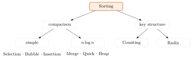{fig-alt="Sorting을 뿌리로 comparison과 key structure로 나뉘고, comparison은 다시 simple(Selection/Bubble/Insertion)과 n log n(Merge/Quick/Heap)으로, key structure는 Counting과 Radix로 나뉘는 트리 다이어그램" width="70%"}

### 정렬 알고리즘을 보는 여섯 기준

| 기준 | 의미 |
|---|---|
| best / average / worst time | 입력에 따라 달라지는 시간 보장 |
| auxiliary space | 입력 저장 공간을 제외한 추가 메모리 |
| stable 여부 | 같은 key를 가진 record의 상대 순서 보존 |
| in-place 여부 | 보통 $O(1)$ 또는 재귀 스택 정도만 추가 사용 |
| adaptive 여부 | 이미 정렬된 정도를 이용해 더 빨라지는가 |
| comparison 기반 여부 | key 비교 결과만 쓰는가, 범위·digit 구조를 쓰는가 |

같은 $\Theta(n\log n)$이라도 보장, 메모리, 데이터 이동 비용은 다르다. "배열 안에서 정렬"과 "추가 메모리가 전혀 없음"은 같은 말이 아니다 — Quick Sort도 recursion stack을 쓴다.

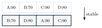{fig-alt="90,70,90,80 순서의 레코드가 정렬 후 70,80,90,90이 되며 두 개의 90 레코드(A와 C)의 상대 순서가 보존됨을 화살표로 표시한 다이어그램" width="60%"}

::: {.callout-caution collapse="true" title="확인 문제: 정렬의 성질"}
1. 이름순 정렬 뒤 같은 이름 안에서 학번순을 보존하려면?
2. $O(1)$ auxiliary space가 필수라면 무엇을 확인해야 하는가?
3. 이미 거의 정렬된 입력이라면 어떤 성질이 중요한가?

**답**: 1. stable, 2. in-place, 3. adaptive
:::

## Part B. 기본 Comparison Sort

### Selection Sort

::: {.callout-tip title="Mission과 Loop Invariant"}
아직 정렬되지 않은 구간에서 최댓값을 골라 오른쪽 끝으로 보낸다. 각 pass 뒤 sorted suffix에는 가장 큰 원소들이 최종 위치에 있고, active prefix는 남은 입력 record들의 permutation이다.
:::



**실행 추적** ($[29,10,14,37,13]$, 1-based indexing):

| Pass | 배열 상태 | 설명 |
|---|---|---|
| 시작 | 29, 10, 14, **37**, 13 | 최댓값 37을 찾는다 |
| 1 | **29**, 10, 14, 13, 37 | pass 1: $[29,10,14,13,37]$ |
| 2 | **13**, 10, 14, 29, 37 | pass 2: $[13,10,14,29,37]$ |
| 3 | 13, 10, **14**, 29, 37 | pass 3: 14는 이미 제자리다 |
| 4 | 10, 13, 14, 29, 37 | pass 4: 13과 10을 swap하여 정렬 완료 |

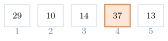{fig-alt="5칸 배열 29,10,14,37,13에서 37이 주황으로 강조된 1단계 상태" width="55%"}
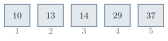{fig-alt="10,13,14,29,37로 완전히 정렬되어 모두 회색으로 표시된 마지막 상태" width="55%"}

**왜 맞는가 (proof-sketch)**: loop invariant — pass 시작 시 $A[last+1..n]$은 이미 최종 위치의 가장 큰 원소들이고 $A[1..last]$는 나머지의 permutation이다. 매 pass가 $A[1..last]$의 최댓값을 찾아 $A[last]$와 swap하면 invariant가 한 칸 넓어지고, $last=1$에서 전체가 정렬된다.

**복잡도**: 비교 횟수는 입력의 기존 순서와 무관하게 항상 $\sum_{last=2}^{n}(last-1)=\frac{n(n-1)}{2}$ 이므로 best = average = worst $= \Theta(n^2)$. swap은 최대 $n-1$회뿐이라 write가 비싼 환경에서는 장점이다. 기본 구현은 **unstable**이다 — $[2_a,2_b,1]$에서 첫 최댓값 $2_a$를 끝과 swap하면 $[1,2_b,2_a]$가 되어 동등 record의 순서가 뒤집힌다.

**구현**: 세 언어 모두 같은 예제 입력 `[29, 10, 14, 37, 13, 5, 21, 8]`을 쓴다. 의사코드는 1-based 인덱스를 쓰지만 C/Java/Python 배열은 모두 0-based다 — `last`가 가리키는 위치 자체는 언어마다 1칸 어긋나도 최댓값을 찾는 범위(`1..last`)는 그대로이므로 결과는 같다(코드 주석 참고).

::: {.panel-tabset}
## Python
```{.python}

```
## Java
```{.java}

```
## C
```{.c}

```
:::

**실행 결과** (실제 컴파일·실행 캡처 — `gcc -Wall`, `javac`/`java`, `python3`):

::: {.panel-tabset}
## Python
```{.default}

```
## Java
```{.default}

```
## C
```{.default}

```
:::

### Bubble Sort

::: {.callout-tip title="Mission과 Invariant"}
인접한 역전 쌍을 교환하여 큰 원소를 오른쪽으로 떠오르게 한다. 한 pass를 마치면 active 구간의 최댓값이 오른쪽 끝에 있다.
:::



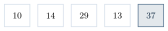{fig-alt="29,10,14,37,13 배열에서 인접 교환을 거쳐 첫 pass 종료 시 37이 오른쪽 끝에 확정된 상태" width="55%"}

**왜 맞는가 (proof-sketch)**: 한 pass에서 $A[i]>A[i+1]$일 때만 교환하므로, pass가 끝나면 그 구간의 최댓값이 반드시 오른쪽 끝까지 밀려 있다. swapped 플래그가 한 번도 켜지지 않으면 인접한 모든 쌍이 이미 순서대로라는 뜻이므로 정렬이 끝났음이 증명된다(조기 종료).

**복잡도**: 조기 종료 구현은 best $\Theta(n)$(이미 정렬된 입력), average/worst $\Theta(n^2)$다. $A[i]>A[i+1]$일 때만 swap하므로 같은 key는 서로 지나치지 않아 **stable**이다.

**구현**: 세 언어 모두 같은 예제 입력 `[29, 10, 14, 37, 13, 5, 21, 8]`을 쓴다(Selection Sort와 동일). 의사코드는 1-based 인덱스를 쓰지만 C/Java/Python 배열은 모두 0-based다 — `last`, `i` 모두 언어마다 1칸씩 어긋나지만 비교 범위($A[i]$와 $A[i+1]$)의 모양은 그대로다(코드 주석 참고).

::: {.panel-tabset}
## Python
```{.python}

```
## Java
```{.java}

```
## C
```{.c}

```
:::

**실행 결과** (실제 컴파일·실행 캡처 — `gcc -Wall`, `javac`/`java`, `python3`):

::: {.panel-tabset}
## Python
```{.default}

```
## Java
```{.default}

```
## C
```{.default}

```
:::

### Insertion Sort

::: {.callout-tip title="Mission과 Invariant"}
$A[1..i-1]$가 정렬되었다고 믿고 $A[i]$를 올바른 위치에 삽입한다. 각 반복 시작 시 prefix $A[1..i-1]$는 원래 prefix의 정렬된 permutation이다.
:::



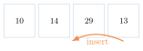{fig-alt="10,14,29,13 네 장의 카드 중 13을 꺼내 앞쪽으로 삽입하는 화살표가 그려진 다이어그램" width="45%"}
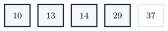{fig-alt="10,14,29,13,37 배열에서 13을 꺼내고 29,14를 오른쪽으로 shift한 뒤 올바른 위치에 삽입해 10,13,14,29,37이 되는 5단계 상태" width="55%"}

**왜 맞는가 (proof-sketch)**: while 루프는 $A[j]>key$인 동안만 오른쪽으로 shift하므로, 종료 시 $A[j+1]$은 key가 들어갈 정확한 위치다. $A[j]>key$가 strict 조건이라 같은 key는 서로 지나치지 않으므로 **stable**이다.

**복잡도**: $\text{inversion}=\#\{(i,j): i<j \land A[i]>A[j]\}$라 하면 element shift 수는 정확히 inversion 수 $I$와 같아 $T(n,I)=\Theta(n+I)$다. best $I=0 \Rightarrow \Theta(n)$(adaptive), worst $I=\Theta(n^2) \Rightarrow \Theta(n^2)$.

**구현**: 세 언어 모두 같은 예제 입력 `[29, 10, 14, 37, 13, 5, 21, 8]`을 쓴다. 의사코드는 1-based 인덱스를 쓰지만 C/Java/Python 배열은 모두 0-based다 — $i$는 1..n-1, $j$는 i-1 downto 0로 각각 한 칸씩 어긋난다(코드 주석 참고).

::: {.panel-tabset}
## Python
```{.python}

```
## Java
```{.java}

```
## C
```{.c}

```
:::

**실행 결과** (실제 컴파일·실행 캡처 — `gcc -Wall`, `javac`/`java`, `python3`):

::: {.panel-tabset}
## Python
```{.default}

```
## Java
```{.default}

```
## C
```{.default}

```
:::

::: {.callout-caution collapse="true" title="확인 문제: 단순 정렬 Checkpoint"}
$A=[5,2_a,4,2_b]$에 대해 답하라.

1. 최댓값을 오른쪽에 두는 Selection의 첫 pass 결과는?
2. Bubble의 왼쪽→오른쪽 첫 pass 결과는?
3. Insertion에서 두 번째 2를 삽입할 때 어떤 원소가 shift되는가?

**답**: 1. $[2_b,2_a,4,5]$ — equal record가 역전될 수 있다(unstable). 2. $[2_a,4,2_b,5]$. 3. 5와 4만 shift하고 $2_a$는 움직이지 않는다.
:::

| | Selection | Bubble | Insertion |
|---|---|---|---|
| best | $\Theta(n^2)$ | $\Theta(n)$ | $\Theta(n)$ |
| worst | $\Theta(n^2)$ | $\Theta(n^2)$ | $\Theta(n^2)$ |
| stable | No | Yes | Yes |
| 핵심 이동 | 최종 swap | 인접 swap | shift + insert |

## Part C. Divide-and-Conquer와 비교 하한

Merge Sort와 Quick Sort는 모두 divide-conquer-combine 구조를 따르지만 나누는 방식이 다르다: Merge Sort는 **먼저 균형 있게 나누고** 나중에 선형 시간에 합치고, Quick Sort는 **partition 결과에 따라** 분할 크기가 결정된다.

### Merge Sort

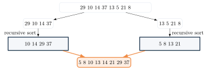{fig-alt="8개 원소 배열이 반으로 나뉘어 각각 재귀 정렬된 뒤 주황 화살표로 합쳐지는 다이어그램" width="70%"}



::: {.callout-warning title="흔한 실수: overflow-safe midpoint"}
`mid = low + (high - low) / 2`처럼 **뺄셈 뒤 더하는** 형태를 써야 한다. `mid = (low + high) / 2`는 `low + high`가 정수 overflow를 일으킬 수 있어 위험하다.
:::

Merge는 정렬된 두 구간 $A[low..mid]$, $A[mid+1..high]$를 $A[low..high]$에 안정적으로 합친다.



![두 정렬된 배열 L=[10,14,29,37], R=[5,8,13,21]을 두 pointer로 병합한다.](../figures/03-sorting/07-merge-pointers-step1.svg){fig-alt="L과 R 두 배열 위에서 R의 5가 선택되어 out 배열의 첫 칸에 놓이는 1단계 상태" width="55%"}
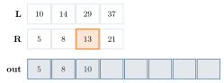{fig-alt="out 배열이 5,8,10,13,14,21,29,37로 완전히 채워진 마지막 상태" width="55%"}

**왜 맞는가 (proof-sketch)**: $L[i]\le R[j]$이면 왼쪽 record를 먼저 선택하므로 동률일 때도 relative order가 보존되어 **stable**이다. 각 원소는 정확히 한 번만 output으로 이동하므로 merge 자체는 $\Theta(|L|+|R|)$이다.

**복잡도**: 각 level의 merge 비용 합은 $\Theta(n)$, level 수는 $\Theta(\log n)$이므로 $T(n)=2T(n/2)+\Theta(n)=\Theta(n\log n)$(Master Theorem Case 2). best = average = worst다.

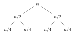{fig-alt="루트 n에서 시작해 n/2, n/4로 절반씩 줄어드는 이진 재귀 트리" width="55%"}

배열 구현은 보통 $\Theta(n)$ buffer와 $\Theta(\log n)$ recursion stack을 쓰며 buffer가 지배한다. linked list와 external sorting에 특히 자연스럽다 — 예측 가능한 시간과 stability를 얻는 대신 추가 공간을 쓰는 trade-off다.

**구현**: 세 언어 모두 같은 예제 입력 `[29, 10, 14, 37, 13, 5, 21, 8]`을 쓴다. `low`, `high`는 0-based inclusive 경계로, 처음 호출은 `merge_sort(A, 0, n-1)`이다 — 의사코드의 `MergeSort(A,1,n)`과 같은 모양의 재귀이며, overflow-safe한 `mid = low + (high-low)/2` 형태를 그대로 쓴다(코드 주석 참고).

::: {.panel-tabset}
## Python
```{.python}

```
## Java
```{.java}

```
## C
```{.c}

```
:::

**실행 결과** (실제 컴파일·실행 캡처 — `gcc -Wall`, `javac`/`java`, `python3`):

::: {.panel-tabset}
## Python
```{.default}

```
## Java
```{.default}

```
## C
```{.default}

```
:::

### Quick Sort

::: {.callout-tip title="Mission"}
pivot을 골라 $\le pivot$과 $>pivot$ 구간으로 분할하고 각 구간만 재귀 정렬한다. 합치기 단계에는 별도 merge가 필요 없다.
:::



Lomuto partition은 scan invariant를 유지한다: $A[low..i]\le pivot$, $A[i+1..j-1]>pivot$, $A[j..high-1]$은 아직 미처리, $A[high]$는 pivot이다.



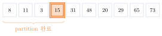{fig-alt="10개 원소 배열에서 pivot 15가 index 4에 최종 위치하고 왼쪽 partition이 완료된 상태를 중괄호로 표시한 다이어그램" width="70%"}

**복잡도**: best(계속 균형 분할)와 expected(randomized pivot) 모두 $\Theta(n\log n)$이지만, worst($0:n-1$로 계속 치우침)는 $\Theta(n^2)$다. "average"를 말하려면 입력 분포나 randomized pivot이라는 확률적 가정이 필요하다. 기본 구현은 **unstable**이며 recursion stack은 expected $\Theta(\log n)$, worst $\Theta(n)$이다.

::: {.callout-warning title="흔한 실수: 중복 key와 pivot 전략"}
현재 Lomuto의 $A[j]\le pivot$ 조건은 같은 key가 많을 때 한쪽으로 몰릴 수 있다 — 이 경우 3-way partition $(<,=,>)$이 효과적이다. random pivot이나 median-of-three는 adversarial 패턴을 확률적으로 피하는 데 도움이 된다. cache locality가 좋고 expected time이 $\Theta(n\log n)$이지만, worst-case 보장이 필요하면 Heap/Merge 또는 introspective sort를 고려한다.
:::

**구현**: 세 언어 모두 이 섹션의 partition trace와 같은 예제 입력 `[31, 8, 48, 73, 11, 3, 20, 29, 65, 15]`(pivot=15)을 쓴다. `low`, `high`는 0-based inclusive 경계이며 Lomuto partition의 인덱스 모양은 의사코드와 동일하다(코드 주석 참고).

::: {.panel-tabset}
## Python
```{.python}

```
## Java
```{.java}

```
## C
```{.c}

```
:::

**실행 결과** (실제 컴파일·실행 캡처 — `gcc -Wall`, `javac`/`java`, `python3`): 입력의 마지막 원소 15가 Lomuto pivot이 되어, 위 partition trace의 pivot=15와 일치한다.

::: {.panel-tabset}
## Python
```{.default}

```
## Java
```{.default}

```
## C
```{.default}

```
:::

### 비교 정렬의 하한

표준 결정 트리 증명은 $n$개의 key가 모두 서로 다르고, 알고리즘이 "$a_i<a_j$인가?"의 답만 얻는 경우를 본다. 한 비교는 yes/no 두 갈래이고, 실행은 decision tree의 root-to-leaf path이며, 서로 다른 permutation은 서로 다른 leaf에 도달해야 한다.

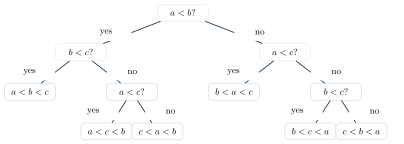{fig-alt="a<b?로 시작해 b<c?, a<c? 순으로 분기하여 6개의 leaf(a<b<c부터 c<b<a까지)에 도달하는 이진 결정 트리" width="70%"}

::: {.callout-warning title="흔한 실수: 하한은 O가 아니라 Ω"}
비교 정렬의 하한은 $O(n\log n)$이 **아니라 $\Omega(n\log n)$**이다 — $O$는 상한이므로 "적어도 이만큼 걸린다"는 하한 주장에는 맞지 않는다.
:::

$n!$개의 입력 순서를 구별하려면 leaf가 적어도 $n!$개 필요하다. 높이 $h$인 binary tree의 leaf 수는 $\le 2^h$이므로 $2^h\ge n!$, 즉 $h\ge\log_2(n!)$이다. $n!\ge(n/2)^{n/2}$이므로 $\log_2(n!)=\Theta(n\log n)$이고, 따라서 어떤 comparison sort도 worst case에 $\Omega(n\log n)$ comparisons가 필요하다.

이 하한은 **key를 비교만 한다는 모델**의 하한이지 모든 정렬의 하한이 아니다 — Counting/Radix Sort는 key 범위나 digit을 직접 사용하므로 조건이 맞으면 $\Theta(n+k)$ 또는 $\Theta(d(n+b))$가 가능하다(Part E).

## Part D. Heap과 Heapsort

::: {.callout-warning title="Index convention"}
이 단원에서는 heap array를 **1-based**로 표현한다: $parent(i)=\lfloor i/2\rfloor$, $left(i)=2i$, $right(i)=2i+1$. (0-based라면 $parent=\lfloor(i-1)/2\rfloor$, children $2i+1, 2i+2$지만 이 단원에서는 쓰지 않는다.)
:::

Heap은 **complete binary tree**다 — 마지막 level을 제외하면 모두 가득 차고, 마지막 level은 왼쪽부터 채운다. 이 complete-shape 덕분에 pointer 없이 compact array로 표현할 수 있다(배열 compactness는 heap-order property가 아니라 complete shape에서 나온다). Max-Heap은 $A[parent(i)]\ge A[i]$(root가 최댓값), Min-Heap은 그 반대다. heap property는 **형제 사이의 순서는 말하지 않는다**.

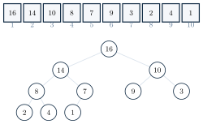{fig-alt="16,14,10,8,7,9,3,2,4,1 배열과 그 아래 대응하는 완전 이진 트리가 나란히 그려진 다이어그램" width="60%"}

### MAX-HEAPIFY

::: {.callout-tip title="전제(Precondition)"}
node $i$만 heap property를 어겼고 왼쪽·오른쪽 subtree는 이미 max-heap일 때, $A[i]$를 아래로 내려 전체를 고친다. 임의의 망가진 배열 전체를 한 번의 HEAPIFY로 고칠 수 있는 것은 아니다.
:::



재귀 대신 반복형으로도 쓸 수 있다 — 같은 경로를 따르되 recursion call overhead가 없다.



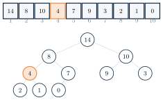{fig-alt="4를 root로 시작해 14, 8과 순서대로 swap하며 index 4에서 멈추는 4단계 array/tree 상태" width="55%"}

**왜 맞는가 (proof-sketch)**: 두 child 중 더 큰 값을 parent 위치로 올렸으므로, swap 뒤 위쪽 node는 두 child보다 크거나 같아 max-heap property를 만족한다. 유일하게 남을 수 있는 위반은 선택한 child subtree로 내려간다 — 두 subtree가 이미 heap이라는 precondition 아래, 한 root-to-leaf path만 검사하면 된다.

**복잡도**: 한 level당 $O(1)$, heap 높이 $\lfloor\log_2 n\rfloor$이므로 $T(n)=\Theta(\log n)$(worst case). 현재 node가 이미 두 child보다 크면 더 일찍 멈출 수 있다.

### BUILD-MAX-HEAP

1-based heap에서 index $\lfloor n/2\rfloor+1,\dots,n$은 모두 leaf이므로, $i=\lfloor n/2\rfloor$부터 $1$까지 역순으로 HEAPIFY하면 모든 child index가 parent보다 커서 child는 이미 처리되었거나 leaf다 — 즉 MAX-HEAPIFY의 precondition이 항상 성립한다.



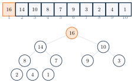{fig-alt="i=5부터 i=1까지 5단계에 걸쳐 배열이 점차 max-heap 16,14,10,8,7,9,3,2,4,1로 바뀌는 array/tree 상태" width="55%"}

::: {.callout-warning title="흔한 실수: BUILD-MAX-HEAP은 O(n log n)이 아니라 Θ(n)"}
"$n/2$개의 node × 각 $O(\log n)$" 논증은 **느슨한 상한** $O(n\log n)$만 준다. 대부분의 node는 아래쪽에 있어 높이가 0 또는 1이므로 모두가 root 높이만큼 내려가지 않는다.

**정밀한 합**: 높이 $h$인 node 수는 최대 $n/2^{h+1}$개이므로

$$\sum_{h=0}^{\lfloor\log n\rfloor}\frac{n}{2^{h+1}}\,O(h)=O(n)\sum_{h\ge0}\frac{h}{2^{h+1}}=O(n)$$

일반적인 배열 표현의 모든 원소가 결과 heap에 참여하므로 선형 입력 크기의 작업이 필요하다. 따라서 $\Theta(n)$이다. "호출 수 × 최악 비용"은 맞지만 느슨할 수 있다 — node 높이별 비용을 합하면 정확한 차수가 나온다.
:::

### Heapsort

Heapsort의 아이디어는 세 단계다: (1) $\Theta(n)$에 max-heap을 만든다. (2) root의 최댓값을 active heap의 마지막과 swap한다. (3) heap size를 1 줄이고 root를 HEAPIFY한다. Invariant: 오른쪽 suffix는 최종 위치가 확정된 큰 원소들이며, 왼쪽 prefix는 max-heap이다.



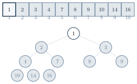{fig-alt="16을 시작으로 14, 10을 차례로 추출하여 배열 뒤쪽에 확정하고 나머지 동일한 extract+heapify를 반복해 최종적으로 1,2,3,4,7,8,9,10,14,16으로 정렬되는 5단계 상태" width="55%"}

**복잡도**: $\underbrace{\Theta(n)}_{build}+\underbrace{(n-1)\Theta(\log n)}_{extract+heapify}=\Theta(n\log n)$이며 best = average = worst다. iterative MAX-HEAPIFY는 $\Theta(1)$ auxiliary space, recursive MAX-HEAPIFY는 worst-case $\Theta(\log n)$ call stack을 쓴다. 기본 구현은 **unstable**이며, random access가 필요해 locality는 Quick Sort보다 불리할 수 있다.

**구현**: 세 언어 모두 이 섹션의 heap trace와 같은 예제 입력 `[16, 14, 10, 8, 7, 9, 3, 2, 4, 1]`(이미 max-heap 상태)을 쓴다. 이 단원은 heap 배열을 1-based로 쓰기로 정했으므로(Index convention 참고), 코드도 배열 index 0을 비워두고 1..n을 heap으로 써서 의사코드의 parent/left/right 공식을 그대로 재현한다(코드 주석 참고).

::: {.panel-tabset}
## Python
```{.python}

```
## Java
```{.java}

```
## C
```{.c}

```
:::

**실행 결과** (실제 컴파일·실행 캡처 — `gcc -Wall`, `javac`/`java`, `python3`):

::: {.panel-tabset}
## Python
```{.default}

```
## Java
```{.default}

```
## C
```{.default}

```
:::

| | Merge | Quick | Heap |
|---|---|---|---|
| worst time | $\Theta(n\log n)$ | $\Theta(n^2)$ | $\Theta(n\log n)$ |
| auxiliary | $\Theta(n)$ | $\Theta(\log n)$ expected, $\Theta(n)$ worst | $\Theta(1)$ iterative, $\Theta(\log n)$ recursive |
| stable | Yes | No | No |
| 실용 강점 | 보장·external | locality·expected 속도 | 보장·in-place |

::: {.callout-tip title="다리: Heap은 Priority Queue다"}
지금까지 heap을 정렬 장치로 봤지만, 본질은 **Priority Queue ADT**다 — `Insert`, `ExtractMax`, `Maximum` 연산이 각각 $\Theta(\log n)$, $\Theta(\log n)$, $\Theta(1)$이다. Heapsort는 이 ADT의 한 응용일 뿐이다. 그래프 장의 Prim·Dijkstra와 상태공간 탐색 장의 A\*가 모두 이 min-priority queue를 핵심 자료구조로 다시 쓴다.
:::

## Part E. Key 구조를 이용한 정렬과 실무 API

### Counting Sort

::: {.callout-tip title="Mission"}
각 key가 정수 $0..k$ 범위이고 $k$가 충분히 작다는 구조를 이용한다. count array 길이는 $k+1$이며, $min..max$ 범위라면 길이 $max-min+1$의 offset $key-min$으로 index화할 수 있다(range가 작아야 한다).
:::



누적 count는 key의 오른쪽 끝 위치다. 오른쪽부터 배치하고 감소시키면 equal record의 상대 순서가 보존되어 **stable**이다.

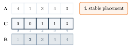{fig-alt="A=4,1,3,4,3 배열에서 C 배열이 빈도 0,1,0,2,2에서 누적합 0,1,1,3,5로 바뀐 뒤 B=1,3,3,4,4로 stable하게 배치되는 4단계 상태" width="60%"}

**복잡도**: $T(n,k)=\Theta(n+k)$, $S(n,k)=\Theta(n+k)$. stable record version은 output $B$와 count $C$ 때문에 auxiliary $\Theta(n+k)$가 필요하다. $k=O(n)$이면 선형 시간이며, 이는 비교 정렬 하한과 모순되지 않는다 — key 범위라는 추가 구조를 쓰기 때문이다.

**구현**: 세 언어 모두 이 섹션의 Count → Prefix → Place trace와 같은 예제 입력 `[4, 1, 3, 4, 3]`($k=4$)을 쓴다. 의사코드의 $A[1..n]$과 같은 모양을 유지하기 위해 내부적으로 1-based 작업 배열을 쓴다(코드 주석 참고).

::: {.panel-tabset}
## Python
```{.python}

```
## Java
```{.java}

```
## C
```{.c}

```
:::

**실행 결과** (실제 컴파일·실행 캡처 — `gcc -Wall`, `javac`/`java`, `python3`):

::: {.panel-tabset}
## Python
```{.default}

```
## Java
```{.default}

```
## C
```{.default}

```
:::

### Radix Sort

가장 낮은 자리(LSD)부터 높은 자리로 이동하며 각 자리에서 stable sort를 수행한다: $\text{ones}\rightarrow\text{tens}\rightarrow\text{hundreds}$. 짧은 수는 leading zero로 본다($2\to002$).

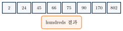{fig-alt="170,90,802,2,24,45,75,66 배열이 ones 결과, tens 결과, hundreds 결과 순으로 재배열되어 최종적으로 2,24,45,66,75,90,170,802가 되는 3단계 상태" width="70%"}

::: {.callout-warning title="흔한 실수: 왜 내부 정렬이 stable이어야 하는가"}
tens 자리로 정렬할 때 ones 자리에서 만든 순서를 같은 tens group 안에 보존해야 한다. 예를 들어 ones pass 뒤 $170$이 $75$보다 먼저라면(둘 다 tens digit이 7), stable한 tens sort는 tens=7 group 안에서 $[170,75]$의 순서를 유지해야 전체 lexicographic order가 만들어진다.
:::

**복잡도**: digit 수 $d$, 진법/버킷 수 $b$일 때 Counting Sort를 내부적으로 쓰면 $T(n)=\Theta(d(n+b))$다. 고정 길이 word에서 $d,b$를 상수로 다루면 $\Theta(n)$이지만, 일반적으로는 두 parameter를 포함한 전체 bound를 유지해야 한다. signed integer, variable length, locale string은 별도의 encoding/order 설계가 필요하다.

ones→tens→hundreds 각 자리에서 실제로 수행하는 것은 1.6.1과 같은 아이디어의 stable Counting Sort다 — 다만 이 절의 코드는 감소 후 배치(decrement-then-place) 방식을, 1.6.1의 코드는 배치 후 감소(place-then-decrement) 방식을 쓴다는 인덱싱 스타일 차이만 있을 뿐 둘 다 stable하고 정확하다.

**구현**: 세 언어 모두 이 섹션의 ones→tens→hundreds trace와 같은 예제 입력 `[170, 90, 802, 2, 24, 45, 75, 66]`을 쓴다. 이 섹션은 (본문에서 설명하듯) 별도 formal 의사코드가 없어, ones→tens→hundreds 각 자리마다 stable counting sort를 수행하는 형태로 직접 작성했다.

::: {.panel-tabset}
## Python
```{.python}

```
## Java
```{.java}

```
## C
```{.c}

```
:::

**실행 결과** (실제 컴파일·실행 캡처 — `gcc -Wall`, `javac`/`java`, `python3`):

::: {.panel-tabset}
## Python
```{.default}

```
## Java
```{.default}

```
## C
```{.default}

```
:::

### 알고리즘 선택 Checklist

1. 먼저 표준 라이브러리를 고려한다.
2. worst-case, stability, memory 요구를 확인한다.
3. 입력 크기·분포·정렬 정도·key range를 확인한다.
4. comparator의 total order와 overflow 안전성을 검증한다.

### Java/C 정렬 API와 Comparator

Java는 표준 라이브러리부터 시작한다 — `Arrays.sort`(primitive/객체)와 `List.sort`가 기본이다. `Comparable`은 자연 순서 **한 가지**만 정의하지만, `Comparator`는 그 외의 정렬 기준을 자유롭게 정의하고 `thenComparing`으로 체이닝할 수 있다.

::: {.callout-warning title="흔한 실수: Comparator는 class extends가 아니라 interface"}
`Comparator`를 별도 클래스로 `extends`하는 것은 오래된 오개념이다. `Comparator<T>`는 **functional interface**이므로 람다나 `Comparator.comparingInt(...).thenComparing(...)` 체이닝으로 작성한다.
:::

C에서 함수 포인터는 callback이다 — `qsort`는 시그니처 `int compare(const void *a, const void *b)`의 비교 함수를 받는다.

::: {.callout-warning title="흔한 실수: comparator에 단순 뺄셈(a - b) 금지"}
정수 comparator에서 `return a - b;`는 두 값이 충분히 멀면 **overflow**로 잘못된 부호를 반환할 수 있다. `(a > b) - (a < b)`처럼 **relational comparison**을 쓰거나 Java Comparator 방식을 따라야 한다.
:::

**구현** — Java `Comparator.thenComparing` 체이닝(중복 key 포함)과 C `qsort`의 relational comparator, 그리고 Python `key=` 관용구가 같은 두 성질(extreme value의 오름차순 정렬, 중복 key가 있는 다중 key 정렬의 stability)을 확인한다. `Fruit`는 `Comparable`도 구현해 `compareTo`(name 기준)를 정의하지만 아래 `main`에서는 쓰지 않는다 — `compareTo`는 자연 순서(natural order) 한 가지를 정의하는 `Comparable`의 예시일 뿐이고, 실제 정렬 기준 선택은 그 위 문단에서 설명한 `Comparator`로 한다.

::: {.panel-tabset}
## Python
```{.python}

```
## Java
```{.java}

```
## C
```{.c}

```
:::

**실행 결과** (실제 컴파일·실행 캡처 — `gcc -Wall`, `javac`/`java`, `python3`):

::: {.panel-tabset}
## Python
```{.default}

```
## Java
```{.default}

```
## C
```{.default}

```
:::

## 개념 지도

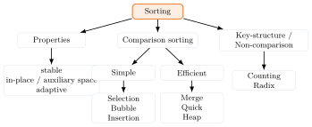{fig-alt="Sorting을 중심으로 Properties, Comparison sorting, Key-structure/Non-comparison 세 갈래로 나뉘고 각각 세부 항목으로 이어지는 개념 지도" width="80%"}

## 💡 배움 포인트

- 정렬은 "순서를 만드는 코드"가 아니라 입력 구조와 보장 조건 사이의 **선택**이다.
- Selection은 최종 위치를 직접 선택하고, Bubble은 인접 역전을 반복 제거하며, Insertion은 정렬된 prefix를 한 칸씩 확장한다 — 셋 다 $\Theta(n^2)$지만 stability와 adaptivity가 다르다.
- Merge Sort는 균형 있게 먼저 나누고 나중에 합쳐 stable·예측 가능한 $\Theta(n\log n)$을 얻는 대신 $\Theta(n)$ 공간을 쓴다. Quick Sort는 partition 결과에 따라 분할이 결정되어 expected $\Theta(n\log n)$과 좋은 locality를 얻는 대신 worst-case 보장이 없다.
- 비교 정렬의 하한은 $\Omega(n\log n)$이다(상한 $O$가 아니다) — Counting/Radix Sort가 이 하한을 피해가는 것은 비교가 아닌 key 구조를 직접 쓰기 때문이다.
- BUILD-MAX-HEAP은 "$n/2$개 노드 × $O(\log n)$"의 느슨한 $O(n\log n)$이 아니라, 노드 높이별 비용을 정확히 합하면 $\Theta(n)$이다.
- Java/C에서 정수 comparator는 `a - b`가 아니라 relational comparison을 쓰고, Java `Comparator`는 `class extends`가 아니라 functional interface다.

## 🧪 직접 해보기

::: {.callout-caution collapse="true" title="Hand Trace Quiz 1: 단순 정렬"}
$A=[5,2_a,4,2_b]$에 대해 답하라.

1. 최댓값을 오른쪽에 두는 Selection의 첫 pass 결과는?
2. Bubble의 왼쪽→오른쪽 첫 pass 결과는?
3. Insertion에서 두 번째 2를 삽입할 때 어떤 원소가 shift되는가?

**정답**

1. Selection $[2_b,2_a,4,5]$ — equal record가 역전될 수 있다(unstable).
2. Bubble $[2_a,4,2_b,5]$.
3. Insertion은 5와 4만 shift하고 $2_a$는 움직이지 않는다.
:::

::: {.callout-caution collapse="true" title="Hand Trace Quiz 2: Divide와 Heap"}
1. $[2,7]$과 $[3,5]$를 $A[low..high]$에 merge할 때 처음 세 output은?
2. Lomuto partition에서 pivot의 반환 index는 무엇을 보장하는가?
3. 1-based heap에서 index 4의 parent와 children index는?
4. $[4,14,10,8,7,9,3,2,1,0]$을 index 1에서 MAX-HEAPIFY한 결과는?

**정답**

1. $2,3,5$.
2. pivot의 최종 index이며 왼쪽은 $\le pivot$, 오른쪽은 $>pivot$이다.
3. parent는 2, children은 8·9다.
4. $[14,8,10,4,7,9,3,2,1,0]$.
:::

::: {.callout-caution collapse="true" title="복잡도·성질 Quiz"}
1. comparison sort의 worst-case 하한은?
2. BUILD-MAX-HEAP의 tight bound는?
3. stable이 기본 보장되는 두 알고리즘을 고르라: Quick, Merge, Heap, Insertion
4. $k=\Theta(n)$일 때 Counting Sort 시간은?
5. Counting과 LSD Radix가 요구하는 key 조건은?

**정답**

1. $\Omega(n\log n)$.
2. $\Theta(n)$.
3. Merge·Insertion.
4. $\Theta(n)$.
5. Counting은 작은 finite integer range, LSD Radix는 digit 표현과 stable pass가 필요하다.
:::

::: {.callout-caution collapse="true" title="Java/C Code Quiz"}
```c
return *(const int *)a - *(const int *)b;
```
무엇이 위험하며 어떻게 고칠까?

```java
Comparator<Fruit> c =
    Comparator.comparingInt(f -> f.quantity);
```
동점일 때 name으로 정렬하려면 무엇을 이어 붙일까?

**정답**

1. C는 relational comparison `(x>y)-(x<y)`로 바꿔야 한다(overflow 위험).
2. Java는 `.thenComparing(f -> f.name)`을 이어 붙인다.
:::

## 요약

정렬 문제는 permutation 보존과 order 만족으로 명세되며, stability·auxiliary space·in-place·adaptivity·comparison 기반 여부라는 여섯 기준으로 알고리즘을 비교한다. Selection·Bubble·Insertion은 $\Theta(n^2)$의 단순 정렬이고, Merge·Quick·Heap은 $\Theta(n\log n)$ 대역이지만 stability·worst-case 보장·공간 사용이 서로 다르다. 비교 정렬은 결정 트리 논증으로 $\Omega(n\log n)$ 하한을 가지며, 이 하한은 Counting·Radix처럼 key 구조를 직접 쓰는 정렬에는 적용되지 않는다. 실무에서는 표준 라이브러리(Java `Arrays.sort`/`Comparator`, C `qsort`)와 안전한 comparator(overflow 없는 relational comparison) 선택이 핵심이다.
