## 🎯 학습목표

- Selection 문제를 rank(순서통계량)로 명세하고 정렬 기반 baseline과 비교한다.
- Quickselect가 partition 뒤 한쪽만 재귀하는 이유와, 정렬 장의 Lomuto partition을 그대로 재사용하는 지점을 설명한다.
- 고정 pivot Quickselect의 입력 의존적 성능과 RandomizedSelect의 pivot-선택에 대한 기대 선형시간을 구분한다.
- Median of Medians가 결정적으로 좋은 pivot을 만들어 최악의 경우에도 선형시간을 보장하는 원리를 추적한다.
- $T(n)\le T(n/5)+T(7n/10)+O(n)$ 형태의 재귀식이 표준 Master Theorem으로 풀리지 않는 이유와, 대입법(substitution)으로 $\Theta(n)$을 증명하는 논리를 설명한다.

## Part A. Selection 문제와 Order Statistics

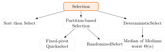{fig-alt="Selection을 뿌리로 Sort then Select, Partition-based Selection, DeterministicSelect 세 갈래로 나뉘고, Partition-based Selection은 다시 Fixed-pivot Quickselect와 RandomizedSelect로, DeterministicSelect는 worst Θ(n)의 Median of Medians로 이어지는 트리 다이어그램" width="75%"}

::: {.callout-note title="정의"}
multiset $S$를 nondecreasing order로 나열했을 때 $i$번째 값을 **$i$th order statistic**(순서통계량)이라 한다. minimum은 1st, maximum은 $n$th order statistic이다. 중복 값도 각각 하나의 원소 instance로 세므로, 여러 rank가 같은 값을 가질 수 있다.
:::

median은 하나의 convention이 아니다: 홀수 $n$이면 $((n+1)/2)$th order statistic이 median이고, 짝수 $n$이면 lower median($n/2$th), upper median($n/2+1$th), 또는 둘의 통계적 평균 중 하나를 골라야 한다. 두 중앙값의 산술 평균은 입력 원소가 아닐 수 있으므로, 우연히 입력 값과 같지 않은 한 order statistic이 아니다 — Selection의 출력은 반드시 어떤 rank convention을 반환하는지 명시해야 한다.

**문제**: 배열 $A[p..r]$와 $1\le i\le r-p+1$이 주어질 때, 그 subarray에서 $i$번째로 작은 값을 반환한다.

| | |
|---|---|
| Input | inclusive range $A[p..r]$, 1-based subarray-relative rank $i$ |
| Output | multiset $A[p..r]$의 $i$th order-statistic 값 |
| Side effect | partition 기반 구현은 배열과 record 위치를 재배열할 수 있다 |

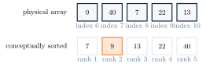{fig-alt="9,40,7,22,13의 physical array에서 index 6..10이 표시되고, 그 아래 conceptually sorted된 7,9,13,22,40 배열에 rank 1..5가 표시되며 rank 2인 9가 강조된 다이어그램" width="60%"}

rank 2는 index 2나 $p+1$을 뜻하지 않는다 — partition 전 정답은 어떤 physical index에도 있을 수 있다. 전체 순서를 만들 필요가 없다는 직관을 이제 정확한 rank 문제로 정의했으니, 가장 단순한 기준선부터 세운다.

### 가장 단순한 해법: SelectBySorting



$$T(n)=\Theta(n\log n),\qquad n=r-p+1$$

일반 comparison model의 정렬을 기준으로 한 비용이다(key 범위 같은 추가 구조를 이용하는 정렬은 별도). minimum/maximum은 한 번의 scan으로 $\Theta(n)$에 찾을 수 있는데, 왜 임의의 $i$th order statistic은 전체를 정렬해야 할까? 전체 정렬이 후속 작업에도 필요하다면 sort-then-select가 합리적이지만, rank 하나만 필요하다면 정렬은 과하다.

::: {.callout-tip title="다리: 정렬 장의 partition을 그대로 쓴다"}
정렬 장(Quick Sort)은 partition 뒤 **양쪽 모두** 재귀한다 — $T(q)+T(n-q-1)$. Selection은 목표 rank가 있는 **한쪽만** 재귀할 수 있다면 어떨까? 전체 순서가 필요하지 않다면, partition 뒤 목표 rank가 없는 쪽은 통째로 버릴 수 있다.
:::

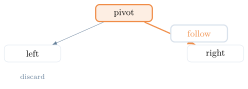{fig-alt="pivot 노드에서 왼쪽은 회색 화살표로 discard 표시되고 오른쪽은 굵은 주황 화살표로 follow 표시된 다이어그램" width="60%"}

**구현**: 세 언어 모두 이 장의 공통 예제 입력 `[31, 8, 48, 73, 11, 3, 20, 29, 65, 15]`(10개)을 쓴다. 의사코드는 1-based rank $i$를 쓰지만, 이 장의 모든 코드는 정렬 장과 같은 관례로 0-based `rank`(0..n-1)를 쓴다 — $i$와 `rank`의 변환은 Part E에서 다시 정리한다(코드 주석 참고).

::: {.panel-tabset}
## Python
```{.python}

```
## Java
```{.java}

```
## C
```{.c}

```
:::

**실행 결과** (실제 컴파일·실행 캡처 — `gcc -Wall`, `javac`/`java`, `python3`):

::: {.panel-tabset}
## Python
```{.default}

```
## Java
```{.default}

```
## C
```{.default}

```
:::

## Part B. Quickselect

### 핵심 아이디어: 한쪽만 남기는 partition

Fixed-pivot Quickselect는 현재 subarray의 마지막 원소 $A[r]$를 pivot으로 쓴다. 정렬 장의 Lomuto partition을 그대로 적용하면

$$A[p..q-1]\le A[q],\qquad A[q+1..r]>A[q]$$

가 성립하고, 선택한 pivot instance는 최종 index $q$에 고정된다. 이 pivot의 **현재 subarray 안에서의 rank**는

$$k=q-p+1$$

이다(같은 값의 다른 instance는 왼쪽에 있을 수 있다). Quickselect는 목표가 있는 한쪽만 재귀하는 selection framework이고, fixed-pivot 버전은 $A[r]$ 같은 결정적 규칙을 쓰며 확률 가정 없이는 expected $\Theta(n)$을 보장하지 않는다.

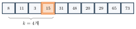{fig-alt="8,11,3 세 원소 다음에 pivot 15가 오고 그 다음 31,48,20,29,65,73이 이어지는 배열에서, pivot까지의 구간에 k=4개라는 중괄호 표시가 붙은 다이어그램" width="65%"}

세 가지 분기로 나뉜다: $i=k$이면 pivot $A[q]$가 정답이고, $i<k$이면 $A[p..q-1]$에서 같은 rank $i$를 찾고, $i>k$이면 $A[q+1..r]$에서 새 rank $i-k$를 찾는다. 어느 경우에도 두 recursive subarray를 동시에 탐색하지 않는다.

{fig-alt="왼쪽에 k개라고 적힌 discard 블록과 오른쪽에 새 rank i-k라고 적힌 target 블록 사이에 화살표가 그려진 다이어그램" width="60%"}



### 실행 추적

공통 입력 $A=[31,8,48,73,11,3,20,29,65,15]$에 $A[r]=15$로 Lomuto Partition을 한 번 적용하면 $p=1,\ r=10,\ q=4,\ k=4$가 된다. 이 결과를 공유한 뒤 Example 1(고정 pivot으로 2번째 값)과 Example 2(RandomizedSelect로 7번째 값, Part C에서 formal하게 다룰 알고리즘의 미리보기)가 서로 다른 pivot 정책으로 갈라진다.

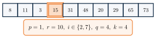{fig-alt="8,11,3,15,31,48,20,29,65,73 배열에서 15가 pivot으로 강조되고 p=1,r=10,i∈{2,7},q=4,k=4라는 콜아웃이 붙은 다이어그램" width="65%"}

**Example 1: Fixed-pivot으로 2번째 값 찾기.** $[8,11,3]$에서 pivot 3으로 partition하면 $q=1,\ k=1<i=2$이므로 $A[2..3]=[11,8]$에서 새 rank 1을 찾는다. 그다음 $[11,8]$에서 pivot 8($A[r]$)로 partition하면 $q=2,\ k=q-p+1=1=i$이므로 pivot이 정답이다 — 원래 배열의 2nd order-statistic 값은 **8**이다.

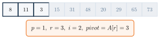{fig-alt="8,11,3이 active, 15부터 73까지가 discard로 표시된 1단계 상태" width="55%"}
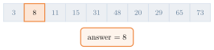{fig-alt="8이 target으로 강조되고 나머지가 모두 discard된 마지막 상태, answer=8" width="55%"}

**Example 2: RandomizedSelect로 7번째 값 찾기(미리보기).** $A[5..10]=[31,48,20,29,65,73]$, $i=7-4=3$에서 무작위로 $s=8$(값 29)을 뽑아 $A[r]$과 swap한 뒤 같은 Lomuto를 적용하면 $q=6,\ k=2<i$이므로 $A[7..10]$에서 새 rank 1. 다시 무작위로 $s=7$(값 31)을 뽑아 partition하면 $q=7,\ k=1=i$이므로 pivot이 정답이다 — 원래 배열의 7th order-statistic 값은 **31**이다. 무작위 pivot을 뽑는다는 점만 다를 뿐, partition 뒤 처리 방식은 fixed-pivot과 동일하다(formal 의사코드와 성능 분석은 Part C).

![Example 2 7단계: 무작위 draw s=8(pivot 29), s=7(pivot 31)을 차례로 A[r]과 swap한 뒤 같은 Lomuto를 적용해 31을 반환한다.](../figures/04-selection/08-randomized-trace-step1.svg){fig-alt="31,48,20,29,65,73이 active인 상태에서 p=5,r=10,i=3, 무작위 draw s=8, pivot 29라는 콜아웃이 붙은 1단계 상태" width="65%"}
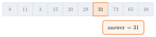{fig-alt="31이 target으로 강조되고 73,65,48이 discard된 마지막 상태, answer=31" width="65%"}

두 trace의 pivot 정책 비교: fixed-pivot Quickselect는 매 call에서 $A[r]$을 쓰지만($[8,11,3]$에서 pivot 3, $[11,8]$에서 pivot 8), RandomizedSelect는 uniform index $s$를 뽑아 $A[s]\leftrightarrow A[r]$로 swap한 뒤 같은 Lomuto를 적용한다. Quickselect는 한쪽만 남기는 구조이고, pivot을 고르는 정책은 별도의 알고리즘 설계 결정이다.

::: {.callout-caution collapse="true" title="확인 문제: Quickselect Trace Checkpoint"}
$A[p..r]=[2,5,7,\boxed{9},12,18]$, $p=1$, $q=4$라 하자($k=q-p+1=4$).

1. $i=2$이면 어디서 무엇을 찾는가?
2. $i=4$이면?
3. $i=6$이면 어디서 무엇을 찾는가?

**답**: 1. $A[p..q-1]$에서 rank 2. 2. pivot 9를 반환. 3. $A[q+1..r]$에서 rank $6-4=2$. ($p\ne1$인 경우에도 full-array 시작점이 아니라 반드시 $q-p+1$로 $k$를 계산한다.)
:::

### 왜 맞는가 (proof-sketch)

distinct-key 입력이라면 partition 뒤 $A[p..q-1]<A[q]<A[q+1..r]$이 성립하므로, pivot은 현재 subarray의 정확한 $k$th order statistic이다(일반 Lomuto contract는 왼쪽이 $\le A[q]$인데, strict inequality는 distinct-key 가정에서만 쓴다).

**Recursive Invariant**: 각 recursive call의 subarray에는 원래 요청한 값이 있고, $i$는 그 subarray 안에서의 상대 rank다.

- **Initialization**: 유효한 최초 호출은 요청한 order-statistic instance를 포함한다.
- **Maintenance**: $i<k$면 left에서 rank $i$, $i>k$면 정확히 $k$개를 제거하고 right에서 rank $i-k$를 찾는다.
- **Termination**: $i=k$이거나 한 원소만 남는다. 모든 recursive call의 subarray는 엄격히 작아진다.

Invariant는 partial correctness를, subarray 크기 감소는 termination을 보장한다 — 둘을 합치면 total correctness다.

::: {.callout-warning title="흔한 실수: 중복 key와 2-way partition"}
Lomuto의 $\le pivot$ 규칙에서는 같은 값들이 pivot 한쪽에 몰릴 수 있다. 선택한 pivot instance의 index $q$는 확정되지만, 같은 **값**의 order-statistic rank는 하나의 index가 아니라 interval일 수 있다 — 예를 들어 $[2,4_a,4_b,4_c,9]$에서 값 4는 rank 2–4를 모두 덮는다. "값의 rank"를 단일 숫자로 단순화하면 혼동을 부른다.

3-way partition으로 일반화하면 이 문제가 명확해진다: $A[p..lt-1]<v,\ A[lt..gt]=v,\ A[gt+1..r]>v$라 하고 $L=lt-p,\ E=gt-lt+1$이라 하면, $i\le L$이면 left, $i\le L+E$이면 값 $v$, 아니면 right에서 rank $i-L-E$를 찾는다. 정답이 포함된 한쪽만 남긴다는 사실은 정확성뿐 아니라 수행시간도 결정한다 — RandomizedSelect와 DeterministicSelect의 실제 구현(Part C, D)이 이 3-way partition을 쓴다.
:::

### 복잡도

한 call의 partition은 $\Theta(n)$이고 다음 call은 한쪽뿐이므로

$$T(n)=T(s)+\Theta(n),\qquad 0\le s\le n-1$$

이다. $s$는 실제로 유지한 한쪽의 크기이며, pivot 정책과 목표 rank에 따라 달라진다(항상 더 큰 partition을 뜻하지 않는다).

**Balanced case** $T(n)=T(n/2)+\Theta(n)$은 **정렬 장의 Quick Sort와 다르다** — $2T(n/2)$가 아니다. 목표 rank가 없는 절반은 즉시 버리기 때문이다.

$$cn+c\frac n2+c\frac n4+\cdots<2cn=\Theta(n)$$

{fig-alt="n, n/2, n/4, n/8 순으로 폭이 절반씩 줄어드는 막대 네 개가 쌓인 다이어그램" width="55%"}

::: {.callout-tip title="다리: 재귀 장의 재귀식 분석 도구를 다시 쓴다"}
$T(n)=T(n/2)+\Theta(n)=\Theta(n)$은 재귀 장에서 배운 재귀 트리·반복대치로도 바로 확인된다. 하지만 매번 최솟값 또는 최댓값이 pivot이면 $T(n)=T(n-1)+\Theta(n)=\Theta(n^2)$이다 — distinct key가 정렬되거나 역정렬된 입력에서 마지막 원소를 pivot으로 고정하면 이런 상황이 반복될 수 있다. **고정된 pivot 규칙은 입력에 취약할 수 있다.** Balanced case는 가능한 좋은 실행이지, fixed rule의 average-case 보장이 아니다.
:::

| retained side | recurrence | time |
|---|---|---|
| balanced | $T(n/2)+\Theta(n)$ | $\Theta(n)$ |
| maximally unbalanced | $T(n-1)+\Theta(n)$ | $\Theta(n^2)$ |

Pivot rank를 무작위화하면 입력 배열과 나쁜 선택 사이의 상관관계를 끊을 수 있다 — Part C의 RandomizedSelect다.

**구현**: 세 언어 모두 공통 예제 입력을 쓰고, `rank`는 0-based다. 정렬 장의 quick_sort partition(pivot=`a[high]`)과 **같은 Lomuto partition**을 그대로 재사용하며, 재귀 대신 while 루프로 "한쪽만 남기는" 진행을 표현한다(코드 주석 참고).

::: {.panel-tabset}
## Python
```{.python}

```
## Java
```{.java}

```
## C
```{.c}

```
:::

**실행 결과** (실제 컴파일·실행 캡처 — `gcc -Wall`, `javac`/`java`, `python3`): rank 1(0-based, 1-based $i=2$)은 8, rank 6(0-based, 1-based $i=7$)은 31 — 위 Example 1의 답과 정확히 일치한다.

::: {.panel-tabset}
## Python
```{.default}

```
## Java
```{.default}

```
## C
```{.default}

```
:::

## Part C. Randomized Selection의 성능



invalid rank는 caller error로 처리하거나 명시적 예외를 반환해야 한다.

### 좋은 pivot은 상수 확률로 나온다

충분히 큰 $n$에서 pivot rank의 적어도 대략 절반은 가운데 구간 $[n/4,3n/4]$에 있다. 그런 pivot은 다음 문제 크기를 최대 $3n/4$로 줄이고, successive level에서 good pivot 사이의 기대 간격은 상수다. 알고리즘이 같은 배열에서 good pivot이 나올 때까지 retry하는 것은 **아니다** — 모든 pivot 뒤 즉시 재귀한다.

::: {.callout-tip title="Expected Recurrence의 의미 (advanced)"}
uniform random pivot에서 한 보수적 upper bound는

$$\mathbb E[T(n)]\le\frac1n\sum_{k=1}^{n}\mathbb E\!\left[T\!\left(\max\{k-1,n-k\}\right)\right]+cn$$

이다. `max`는 고정된 목표 rank가 실제로 따르는 한쪽 대신 **더 큰 쪽을 쓰는 worst-target upper bound**다. good-pivot scale argument로 expected $O(n)$을 얻고, exact unrestricted selection의 $\Omega(n)$과 합쳐 expected $\Theta(n)$을 얻는다.
:::

::: {.callout-warning title="흔한 실수: Expected와 Worst를 혼동하지 말자"}
randomness는 **pivot 선택**에 있다 — "평균적인 입력"을 가정하는 것이 아니다. expected $\Theta(n)$이어도 특정 random choice 수열은 $\Theta(n^2)$일 수 있다. recursion stack은 expected $O(\log n)$, worst $O(n)$이다. adversarial latency guarantee가 필요하면(모든 실행에서의 선형 상한이 필요하다면) randomness가 아니라 pivot 품질 자체를 구조적으로 보장하는 deterministic 전략(Part D)을 써야 한다.
:::

**구현**: 의사코드는 개념을 보여주기 위해 2-way Lomuto partition 위에서 재귀 형태로 적었지만, 실제 코드는 앞서 흔한 실수에서 다룬 3-way partition($<,=,>$)을 반복문으로 구현한다 — "무작위 pivot으로 한쪽만 남긴다"는 아이디어는 같고, 중복 key를 명확히 다루기 위해 partition 방식만 정교화했다. `rank`는 0-based이며, 무작위인 것은 내부 pivot 선택뿐이고 결과는 어떤 pivot을 뽑든 항상 정확하다(코드 주석 참고).

::: {.panel-tabset}
## Python
```{.python}

```
## Java
```{.java}

```
## C
```{.c}

```
:::

**실행 결과** (실제 컴파일·실행 캡처 — `gcc -Wall`, `javac`/`java`, `python3`): rank 1은 8, rank 6은 31 — Fixed-pivot Quickselect와 같은 값이다(무작위 pivot이 어떤 값이든 정답은 하나다).

::: {.panel-tabset}
## Python
```{.default}

```
## Java
```{.default}

```
## C
```{.default}

```
:::

## Part D. Deterministic Linear Selection (Median of Medians)

random choice에 의존하지 않고 partition이 너무 기울어지지 않게 만들고 싶다면 어떻게 할까?

::: {.callout-warning title="순환 질문"}
정확한 median을 pivot으로 쓰면 완벽한 $1:1$ partition을 얻지만, median을 찾는 일이 바로 selection 문제다 — 정답을 pivot으로 찾기 위해 정답을 먼저 구할 수는 없다.
:::

해결책은 "**충분히 좋은** pivot을 **싸게**" 찾는 것이다: (1) 5개씩 묶어 작은 median들을 만들고, (2) 그 median들의 median을 재귀적으로 찾고, (3) 이 값이 양쪽에서 일정 비율을 제거하도록 보장한다. 이 기법을 **Median of Medians**라 하고, 이를 쓰는 역사적 algorithm 이름은 **BFPRT Selection**이며, 본문에서는 pseudocode 이름인 **DeterministicSelect**로 통일한다. 목표는 worst-case $\Theta(n)$이다.

### 전체 단계와 그룹 구성

DeterministicSelect의 전체 단계: (1) $n\le5$이면 직접 정렬해 반환, (2) 최대 5개씩 group 구성, (3) 각 group의 median 수집, (4) medians의 median $M$을 재귀 선택, (5) $M$으로 원본을 3-way partition, (6) 목표 rank가 있는 한쪽만 재귀. 크기 5 이하의 정렬은 $\Theta(1)$이고 group 수는 $\lceil n/5\rceil$이므로 median 수집은 전체 $\Theta(n)$이다.

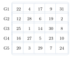{fig-alt="22,4,17,9,31부터 20,3,29,7,24까지 5행 5열로 배치되고 각 행이 G1부터 G5까지 라벨된 group box로 묶인 다이어그램" width="35%"}

각 group을 정렬하면 3번째 값이 그 group의 median(lower median, $\lceil 5/2\rceil=3$rd)이다. 다섯 group의 median $17,12,14,16,20$을 모아 다시 정렬하면 $12,14,16,17,20$이고, 그 median(=medians의 median) $M=16$이 원본의 pivot이 된다.

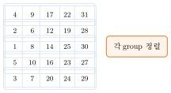{fig-alt="G1..G5 각 group의 원소들이 나열되고 가운데 열(3번째 값)이 강조된 1단계 상태" width="55%"}
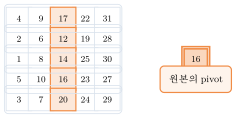{fig-alt="다섯 median 12,14,16,17,20 중 16이 M으로 강조되고 원본의 pivot이라는 콜아웃이 붙은 마지막 상태" width="60%"}

::: {.callout-warning title="흔한 실수: 이 M이 항상 진짜 중앙값은 아니다"}
위 25개 예제에서는 $M=16$이 우연히 전체 배열의 진짜 median(13th)과 같지만, 이는 이 예제 고유의 우연이지 Median of Medians의 일반적 성질이 아니다. 이 기법이 보장하는 것은 "충분히 좋은 pivot"(양쪽에서 일정 비율을 제거)이지 "정확한 median"이 아니다.
:::

마지막 group은 1–4개일 수 있다. 크기 $g$인 group을 정렬한 뒤 $\lceil g/2\rceil$th 원소를 lower median으로 선택한다(예: $g=4$이면 2nd, $g=2$이면 1st). 이는 구현 correctness에는 포함되지만, 분석에서는 incomplete group과 $M$ 자신이 속한 group을 $O(1)$ 예외로 처리한다 — 불완전 group에는 아래에서 다룰 "3개 보장"을 적용하지 않는다.

아래 의사코드는 이 6단계 전체를 하나로 이어 보여준다: 앞부분이 group을 구성하고 medians의 median $M$을 재귀로 구하고 나면, 곧바로 그 $M$으로 원본을 3-way partition해 한쪽만 재귀하는 뒷부분으로 이어진다 — 별개의 두 알고리즘이 아니라 한 procedure다.



$p+i-1$은 유효한 absolute index이고, $M$은 원본 $A[p..r]$에 실제로 존재하는 값이다. $M$을 구한 뒤에는 그 값으로 원본을 3-way partition해

$$A[p..lt-1]<M,\quad A[lt..gt]=M,\quad A[gt+1..r]>M$$

을 얻고, $L=lt-p,\ E=gt-lt+1$이라 하면 $i\le L$이면 왼쪽, $i\le L+E$이면 $M$, 아니면 오른쪽에서 rank $i-L-E$를 재귀로 찾는다. 이제 group median 수집이 원본 원소를 양쪽에서 얼마나 제거하는지 계산할 차례다.

### Pivot 보장: 왜 양쪽에서 일정 비율이 제거되는가

medians를 정렬했을 때 $M$은 lower median이므로, 적어도 절반은 $M$ 이상이고 대칭적으로 적어도 절반은 $M$ 이하다.

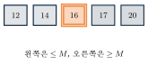{fig-alt="12,14가 guaranteed less로, M=16이 중앙에, 17,20이 guaranteed greater로 표시된 다이어그램" width="40%"}

full group을 정렬했을 때 median이 $M$ 이상이면, 그 median과 오른쪽 두 값(더 큰 값들)까지 총 **3개**가 $M$ 이상이다.

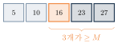{fig-alt="unknown 값 두 개, median 16, guaranteed greater 값 두 개가 나열되고 오른쪽 세 개가 M 이상이라는 중괄호 표시가 붙은 다이어그램" width="35%"}

median의 절반 $\times$ full group 규모 $n/5$ $\times$ group당 보장 3개를 곱하면

$$\underbrace{\frac12}_{\text{median의 절반}}\cdot\underbrace{\frac n5}_{\text{full group 규모}}\cdot\underbrace{3}_{\text{group당 보장}}\approx\frac{3n}{10}$$

이다. 즉 $\le M$ 쪽과 $\ge M$ 쪽 모두 각각 적어도 $3n/10-O(1)$개를 보장하며(incomplete final group, $M$의 group, even median convention이 $O(1)$ 예외를 만든다), 따라서

$$\text{largest retained side}\le n-\left(\frac{3n}{10}-O(1)\right)=\frac{7n}{10}+O(1)$$

이다.

::: {.callout-caution collapse="true" title="확인 문제: Pivot 보장 Checkpoint"}
1. 왜 "median 중 절반"만 세는가?
2. 한 qualifying group에서 왜 3개인가?
3. 다음 selection 문제의 최대 크기 비율은?

**답**: 1. $M$의 한쪽에 있는 median만 확실히 셀 수 있다(반대쪽 median은 $M$보다 작을 수도 커질 수도 있다). 2. 5개 group의 median과, 정렬된 group에서 그 median보다 큰 두 값. 3. $7/10+O(1/n)$.
:::

### 왜 여기엔 Master Theorem을 못 쓰나

지금까지의 보장을 재귀식으로 옮기면

$$T(n)\le T\!\left(\lceil n/5\rceil\right)+T\!\left(7n/10+O(1)\right)+\Theta(n)$$

이다. 두 재귀 부분문제의 **크기가 다르다**($n/5$와 $7n/10$). 재귀 장의 Master Theorem 기본형은 **같은 크기** 부분문제 $a$개, 즉 $a\,T(n/b)+f(n)$ 꼴만 다룬다.

| 형태 | Master Theorem 적용 가능 여부 |
|---|---|
| $a\,T(n/b)+f(n)$ | 적용 가능 |
| $T(n/5)+T(7n/10)+f(n)$ | **적용 불가** — substitution으로 |

::: {.callout-warning title="흔한 실수: 표준 Master Theorem을 억지로 적용하지 않는다"}
Master Theorem은 만능이 아니다. 부분문제 크기가 다르면 재귀 장에서 함께 배운 재귀 트리나 substitution(대입법)으로 돌아간다. 핵심은 부분문제 크기의 **비율 합**이

$$\frac15+\frac7{10}=\frac9{10}<1$$

이라는 점이다 — 재귀로 전달되는 총 크기가 매 level 일정 비율(90%)로 줄어들기 때문에 선형 overhead가 흡수되어 선형 시간이 나온다. (다만 fraction 합이 1 미만이라는 사실만으로 임의의 재귀식이 자동으로 증명되는 것은 아니다 — 아래 substitution으로 직접 확인해야 한다.)
:::

재귀식의 세 항은 각각 다음에 대응한다.

| 항 | 의미 |
|---|---|
| $T(\lceil n/5\rceil)$ | 약 $n/5$개 median에서 $M$을 재귀적으로 선택 |
| $T(7n/10+O(1))$ | 원본에서 partition 뒤 유지될 수 있는 쪽의 upper bound |
| $\Theta(n)$ | group sort · median 수집 · 3-way partition |

**Substitution으로 $O(n)$ 확인 (advanced)**: 모든 $m<n$에 대해 $T(m)\le cm$을 가정하고, ceiling과 예외를 상수 $b$로 묶으면

$$T(n)\le c\left(\frac n5+1\right)+c\left(\frac{7n}{10}+b\right)+an\le 0.9cn+an+O(c)$$

이다. $c>10a$를 먼저 택하고 충분히 큰 $n$을 택하면 $0.1cn$이 $an+O(c)$를 흡수해 $T(n)\le cn$이 성립한다.

**최종 bound는 $\Theta(n)$이다**: upper bound는 위 재귀식으로 $O(n)$이고, lower bound는 unrestricted 입력에서의 exact comparison-based selection은 모든 원소가 결과 결정에 참여해야 하는 입력이 있어 $\Omega(n)$이다. 둘을 합쳐

$$T(n)=\Theta(n)\quad\text{(worst case)}$$

이다. (approximate quantile이나 전처리된 static data structure의 query에는 이 per-query lower bound를 그대로 적용하지 않는다.)

**구현**: 코드는 group median을 별도 배열 $B$ 대신 $A[lo..lo+groups)$ 구간에 in-place로 모아 공간과 호출 오버헤드를 줄인다 — 3-way partition은 Part C와 같은 로직이다. `rank`는 0-based이며 최악의 경우에도 $\Theta(n)$을 보장한다(코드 주석 참고).

::: {.panel-tabset}
## Python
```{.python}

```
## Java
```{.java}

```
## C
```{.c}

```
:::

**실행 결과** (실제 컴파일·실행 캡처 — `gcc -Wall`, `javac`/`java`, `python3`): 25개 그룹 예제에서 rank 6(0-based, 7번째로 작은 값)의 답은 7이다 — pivot 선택 과정에서 나온 $M=16$과는 별개로, 최종 목표 rank의 답을 보여준다.

::: {.panel-tabset}
## Python
```{.default}

```
## Java
```{.default}

```
## C
```{.default}

```
:::

::: {.callout-tip title="참고: 왜 group size가 5인가"}
group 크기 3은 recursive fraction 합이 $1/3+2/3=1$이라 선형 overhead를 흡수할 여유가 없다. group 크기 5는 $1/5+7/10=9/10<1$로 선형 시간을 보장한다. 7은 가능하지만 median 계산 비용의 상수가 커진다. 5는 이 표준 논증이 선형 bound를 주는 가장 작은 홀수 group 크기다(더 큰 홀수 group도 가능하지만 상수 비용이 달라진다).
:::

## Part E. 전략 비교와 요약

| Algorithm | Pivot 정책 | Typical/expected | Worst |
|---|---|---|---|
| SelectBySorting | comparison sort | $\Theta(n\log n)$ | $\Theta(n\log n)$ |
| Fixed Quickselect | 예: 마지막 원소 | input-dependent | $\Theta(n^2)$ |
| RandomizedSelect | uniform random | expected $\Theta(n)$ | $\Theta(n^2)$ |
| DeterministicSelect(BFPRT) | Median of Medians | $\Theta(n)$ | $\Theta(n)$ |

::: {.callout-warning title="흔한 실수: 평균·기대·최악을 섞어 쓰지 않는다"}
RandomizedSelect만 uniform pivot choice에 대한 **distribution-free expected guarantee**를 갖는다 — "평균 입력"이 아니라 알고리즘 내부의 무작위성에 대한 기대값이다. Fixed Quickselect에는 입력 분포 가정 없는 expected bound가 없다("input-dependent"라고만 말할 수 있다). DeterministicSelect의 "worst-case $\Theta(n)$"은 어떤 입력, 어떤 실행에서도 성립하는 보장이다. 세 용어를 서로 바꿔 쓰면 안 된다.
:::

공간과 사용 맥락: SelectBySorting은 space·determinism이 내부 정렬에 의존하며 이후 전체 순서가 필요할 때 적합하다. Fixed Quickselect는 deterministic이고 stack이 worst $O(n)$이며 입력과 pivot behavior를 통제할 수 있을 때 쓴다. RandomizedSelect는 randomized이고 stack이 expected $O(\log n)$·worst $O(n)$이며 일반적인 one-rank query에 적합하다. DeterministicSelect는 deterministic이고, group median을 in-place로 모으면 stack이 $O(\log n)$이며(별도 배열 $B$를 쓰는 구현은 active storage $O(n)$까지 커질 수 있다) recursive call은 sequential하고 longest active branch의 깊이는 $O(\log n)$이다.

**Selection 전략 Checklist**

1. 한 rank만 필요한가, 이후 전체 정렬도 필요한가?
2. expected time이면 충분한가, latency worst-case 보장이 필요한가?
3. 입력이 adversarial할 수 있는가?
4. duplicates가 많은가? — 그렇다면 3-way partition이 유리하다.
5. 입력을 바꿀 수 있는가? immutable이면 copy 비용도 포함한다.

::: {.callout-tip title="참고: Introselect — 두 전략을 결합하기"}
Introselect는 hybrid selection 전략의 family다. 보통은 빠른 partition 정책(예: RandomizedSelect)을 쓰다가, recursion depth나 진행이 나빠지면 guaranteed fallback(DeterministicSelect류)으로 전환한다. 특정 표준 라이브러리의 내부 알고리즘은 버전과 구현에 따라 달라질 수 있다.
:::

::: {.callout-note title="Index convention: 1-based rank ↔ 0-based rank"}
이 장의 pseudocode는 **1-based relative rank** $1\le i\le n$을 쓰지만, 이 장의 모든 C/Java/Python 코드는 **0-based rank** $0\le \text{rank}<n$을 쓴다(정렬 장·Part A–D의 코드와 같은 관례). 변환은 $\text{rank}=i-1$, $i=\text{rank}+1$이다. empty/null/negative 또는 `rank >= length`는 거부한다.
:::

## 개념 지도

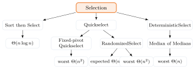{fig-alt="Selection을 중심으로 Sort then Select, Quickselect, DeterministicSelect 세 갈래로 나뉘고 각각 시간 복잡도로 이어지는 개념 지도" width="55%"}

## 💡 배움 포인트

- Selection은 "정렬의 부분집합"이 아니라 **필요한 rank 하나만 남기고 나머지 순서는 만들지 않는** 별개의 문제다 — SelectBySorting의 $\Theta(n\log n)$을 partition 기반 방법은 $\Theta(n)$으로 낮춘다.
- Quickselect는 정렬 장의 Lomuto partition을 그대로 재사용하되, partition 뒤 **양쪽이 아니라 목표 rank가 있는 한쪽만** 재귀한다 — 그래서 balanced case가 $2T(n/2)$가 아니라 $T(n/2)+\Theta(n)=\Theta(n)$이다.
- Fixed-pivot Quickselect는 입력에 따라 $\Theta(n^2)$까지 나빠질 수 있고, RandomizedSelect는 pivot 선택의 무작위성에 대해 expected $\Theta(n)$을 보장한다 — 둘 다 worst-case 보장은 $\Theta(n^2)$이다.
- Median of Medians는 5개씩 묶은 group의 median들의 median을 pivot으로 써서, 양쪽에서 각각 최소 $3n/10-O(1)$을 제거하는 것을 **결정적으로** 보장한다.
- $T(n)\le T(n/5)+T(7n/10)+\Theta(n)$은 부분문제 크기가 달라 표준 Master Theorem으로 못 푼다 — 비율 합 $1/5+7/10=9/10<1$과 substitution으로 $O(n)$을, 비교 기반 하한 $\Omega(n)$과 합쳐 worst-case $\Theta(n)$을 얻는다.

## 🧪 직접 해보기

::: {.callout-caution collapse="true" title="Hand Trace Quiz"}
partition 결과가 $[3,5,8,\boxed{12},17,20,25]$이고 현재 $p=1$, $q=4$다.

1. $k$는?
2. $i=2,4,7$일 때 각각 다음 행동은?
3. 오른쪽으로 갈 때 새 rank는 어떻게 계산하는가?
4. 3-way partition에서 equal interval이 rank 3–5라면 $i=4$의 답은?

**정답**

1. $k=q-p+1=4$.
2. $i=2$는 $A[p..q-1]$에서 rank 2, $i=4$는 pivot 12를 반환, $i=7$은 $A[q+1..r]$에서 rank $7-4=3$.
3. 새 rank $=i-k$(이미 left+pivot의 $k$개를 제거했으므로).
4. equal interval(rank 3–5)에 $i=4$가 포함되므로 답은 그 구간의 값(pivot과 같은 값) 12다.
:::

::: {.callout-caution collapse="true" title="Complexity Quiz"}
1. balanced Quickselect가 왜 $2T(n/2)$가 아닌가?
2. worst recurrence와 그 해는?
3. RandomizedSelect의 expected bound는 무엇에 대한 기대값인가?
4. Fixed last-element Quickselect와 RandomizedSelect의 pseudocode 차이는?
5. BFPRT recurrence의 세 항은 어디서 오는가?

**정답**

1. 목표 rank가 있는 한쪽만 재귀하므로 balanced recurrence는 $T(n/2)+\Theta(n)$이다.
2. worst는 $T(n-1)+\Theta(n)=\Theta(n^2)$.
3. 현재 subarray에서 uniform하게 선택한 pivot index들의 random choice에 대한 평균이다(입력 분포에 대한 평균이 아니다).
4. Fixed 버전은 곧바로 $A[r]$을 pivot으로 쓴다. RandomizedSelect는 uniform하게 뽑은 $s$의 값을 $A[r]$과 swap한 뒤 같은 Lomuto를 호출한다.
5. $T(\lceil n/5\rceil)$은 medians의 median 선택, $T(7n/10+O(1))$은 원본에서 유지될 수 있는 쪽의 upper bound, $\Theta(n)$은 grouping·median 수집·3-way partition이다.
:::

::: {.callout-caution collapse="true" title="Group of Five · Concept · Code Quiz"}
1. 5개 group의 median 위치는?
2. 왜 약 $3n/10$을 제거하는가?
3. group size 3은 왜 불리한가?
4. RandomizedSelect의 expected와 DeterministicSelect의 worst guarantee는 어떻게 다른가?
5. 언제 sort가 더 적절한가?
6. 강의 pseudocode의 1-based $i=4$는 코드의 0-based rank로 몇인가?

**정답**

1. 각 group을 정렬했을 때 3번째 값($\lceil5/2\rceil$th, lower median)이다.
2. median의 절반 $\times$ full group 규모 $n/5$ $\times$ group당 보장 3개를 곱하면 각 방향 $3n/10-O(1)$이 나온다.
3. group size 3의 recursive fraction 합은 $1/3+2/3=1$로, 선형 overhead를 흡수할 여유가 없다(size 5는 $9/10$).
4. RandomizedSelect의 expected는 알고리즘 내부 무작위 pivot 선택에 대한 평균이고, 특정 실행은 여전히 $\Theta(n^2)$일 수 있다. DeterministicSelect의 worst $\Theta(n)$은 어떤 입력·어떤 실행에서도 성립하는 보장이다.
5. rank 하나가 아니라 이후 작업에 전체 순서가 필요하면 sort가 합리적이다.
6. 강의 $i=4$는 코드의 0-based relative rank 3이다($\text{rank}=i-1$).
:::

## 요약

Selection 문제는 배열 전체를 정렬하지 않고 $i$th order statistic(순서통계량) 하나를 찾는 문제로 명세된다. SelectBySorting은 $\Theta(n\log n)$의 baseline이고, Quickselect는 정렬 장의 Lomuto partition을 재사용하되 partition 뒤 목표 rank가 있는 한쪽만 재귀해 시간을 낮춘다 — fixed pivot은 입력에 따라 $\Theta(n^2)$까지 나빠질 수 있고, RandomizedSelect는 pivot 선택의 무작위성에 대해 expected $\Theta(n)$을 보장하지만 worst-case는 여전히 $\Theta(n^2)$이다. Median of Medians는 5개씩 묶은 group의 median들의 median을 pivot으로 삼아 양쪽에서 최소 $3n/10-O(1)$을 결정적으로 제거하고, 이로부터 얻는 재귀식 $T(n)\le T(n/5)+T(7n/10)+\Theta(n)$은 부분문제 크기가 달라 표준 Master Theorem으로 풀리지 않는다 — 비율 합 $9/10<1$에 기반한 substitution으로 $O(n)$을, 비교 기반 하한 $\Omega(n)$과 합쳐 worst-case $\Theta(n)$을 증명한다(DeterministicSelect/BFPRT). 실제 선택은 한 rank만 필요한지, expected로 충분한지 아니면 worst-case 보장이 필요한지, 입력이 adversarial할 수 있는지에 따라 달라진다.
