## 🎯 학습목표

- 재귀의 중복되는 부분 문제를 저장하는 것이 동적 계획법임을 설명한다.
- State, Transition, Base Case, Evaluation Order, Answer/Reconstruction 다섯 요소로 DP를 설계한다.
- Fibonacci·Matrix Path·LCS·Maximum Subarray를 메모이제이션(top-down)과 tabulation(bottom-up)으로 구현한다.
- Optimal Substructure와 Overlapping Subproblems를 구분하고, 분할정복·탐욕과 DP를 비교한다.
- LCS의 답을 표에서 역추적하고, 공간을 rolling variable로 최적화한다.

## Part A. 왜 동적 계획법인가?

::: {.callout-tip title="강의를 관통하는 질문"}
올바른 재귀가 왜 느릴 수 있을까? 그리고 "느림"을 고치는 데 알고리즘 자체를 바꿀 필요가 없다면,
무엇을 바꿔야 할까?
:::

2장(재귀)에서 이미 본 Fibonacci의 순진한 재귀는 정확하지만, 같은 부분 문제를 몇 번이고 다시
계산한다. 동적 계획법(Dynamic Programming, DP)의 핵심은 **알고리즘의 답을 바꾸는 것이 아니라,
이미 계산한 부분 문제의 답을 저장해서 다시 계산하지 않는 것**이다. 이번 장에서는 이 아이디어를
Recurrence(재귀 관계식) → Memoization(메모이제이션) → Tabulation(테이블화)의 흐름으로
정리하고, 이후 모든 DP 문제를 같은 다섯 요소 템플릿으로 설계한다.

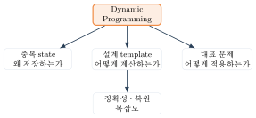{fig-alt="재귀에서 시작해 중복 부분 문제 인식, Memoization과 Tabulation, 대표 DP 문제로 이어지는 트리 형태의 로드맵 다이어그램" width="90%"}

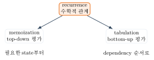{fig-alt="Recurrence 노드에서 Memoization과 Tabulation 두 갈래로 뻗어나가는 관계도, 두 방식 모두 같은 재귀 관계식으로 되돌아옴을 화살표로 표시" width="80%"}

## Part B. Memoization, Tabulation, DP 설계 절차

### Fibonacci로 살펴보는 재귀의 비효율

::: {.callout-note title="정의: Fibonacci 컨벤션"}
이 책에서 $F(0)=0$, $F(1)=1$, $F(n)=F(n-1)+F(n-2)$ $(n\ge2)$로 고정한다. (2장의 Fibonacci
호출 트리도 같은 컨벤션을 썼다.)
:::

DP 설계는 항상 같은 다섯 질문에 답하는 것으로 시작한다.

| 요소 | 의미 |
|---|---|
| **State** | 부분 문제를 무엇으로 식별하는가 |
| **Transition** | 더 작은 state들로부터 현재 state를 어떻게 계산하는가 |
| **Base Case** | 더 이상 나눌 수 없는 state의 값은 무엇인가 |
| **Evaluation Order** | state들을 어떤 순서로 계산해야 의존성이 먼저 준비되는가 |
| **Answer** | 원래 문제의 답은 어느 state(들)에 있는가 — 복원이 필요하면 어떻게 |

**Fibonacci**로 적용하면:

| State | Transition | Base | Order | Answer |
|---|---|---|---|---|
| $F(i)$ | $F(i-1)+F(i-2)$ | $F(0)=0,\ F(1)=1$ | $i=2,\dots,n$(또는 top-down) | $F(n)$, 복원 없음 |



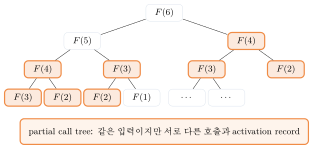{fig-alt="F(6)을 루트로 F(5), F(4)가 자식이 되고 그 아래로 F(4), F(3), F(2), F(1)이 반복해서 나타나는 이진 트리, 반복되는 노드가 색으로 강조됨" width="70%"}

중복 호출을 세어 보면 $F(3)$은 2번, $F(2)$는 3번, $F(1)$은 5번, $F(0)$은 3번 다시 계산된다 —
입력이 커질수록 중복은 기하급수적으로 늘어난다. 비용은 $T(n)=T(n-1)+T(n-2)+\Theta(1)$이고, 느슨한
상한은 $O(2^n)$이지만 실제로는 더 tight한 $\Theta(\varphi^n)$이다($\varphi=(1+\sqrt5)/2$, 황금비).
호출 깊이는 $\Theta(n)$이다.

::: {.callout-caution collapse="true" title="확인 문제: Fibonacci Checkpoint"}
| 질문 | 답 |
|---|---|
| $F(6)$의 값은? | $8$ |
| 순진한 재귀에서 $F(2)$는 몇 번 계산되는가? | $3$번 |
| 시간 복잡도의 tight bound는? | $\Theta(\varphi^n)$ |
:::

### Memoization: Top-Down

이미 계산한 state를 저장해 두었다가, 같은 state를 다시 요청받으면 저장된 값을 즉시 반환한다.
"State를 처음 만났을 때만 계산한다"는 원칙이다.



`memo[i]`가 아직 계산되지 않았음을 나타내는 sentinel(실제 Fibonacci 값과 절대 겹치지 않는 값,
예: 최소 정수)이 필요하다 — sentinel 없이 `0`으로 초기화하면 `F(0)=0`이 "미계산"과 구분되지
않는다.

**실행 추적** ($F(6)$을 top-down으로 메모이제이션):

::: {.panel-tabset}
## 1단계

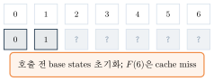{fig-alt="0번과 1번 칸만 채워지고 나머지는 물음표로 표시된 캐시 상태" width="80%"}

## 2단계

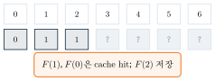{fig-alt="0,1,2번 칸이 채워지고 나머지는 물음표인 캐시 상태" width="80%"}

## 3단계

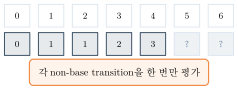{fig-alt="0부터 4번 칸까지 채워지고 5,6번은 물음표인 캐시 상태" width="80%"}

## 4단계

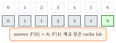{fig-alt="0번부터 6번까지 모두 채워지고 6번 칸이 정답으로 강조된 캐시 상태" width="80%"}
:::

각 state는 정확히 한 번만 계산되고, 그 다음부터는 $\Theta(1)$ cache hit이다. 총 $(n+1)$개
state × $\Theta(1)$ transition = $\Theta(n)$.

### Tabulation: Bottom-Up

같은 evaluation order를 반대 방향에서 접근한다 — 작은 state부터 순서대로 채워서, 재귀 호출
없이 반복문만으로 계산한다.



**실행 추적** (같은 $F(6)$을 bottom-up으로 tabulation):

::: {.panel-tabset}
## 1단계

![Base case $dp[0]=0,\ dp[1]=1$만 채워진 상태.](../figures/05-dynamic-programming/05-bottomup-trace-step1.svg){fig-alt="0,1번 칸만 채워진 테이블 상태" width="80%"}

## 2단계

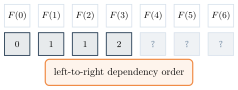{fig-alt="0부터 3번 칸까지 채워진 테이블 상태" width="80%"}

## 3단계

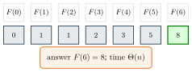{fig-alt="0번부터 6번까지 모두 채워지고 6번 칸이 정답으로 강조된 테이블 상태" width="80%"}
:::

**Rolling Variables**: $dp[i]$는 오직 $dp[i-1]$과 $dp[i-2]$에만 의존하므로, 표 전체를 유지할
필요가 없다 — `prev2`, `prev1` 두 변수만 굴리면(rolling) 공간이 $\Theta(n)$에서 $\Theta(1)$로
줄어든다. **먼저 `current`를 계산한 다음** `prev2←prev1, prev1←current` 순서로 갱신해야 한다 —
순서를 바꾸면 갱신 전 `prev1` 값이 유실된다.

::: {.callout-caution collapse="true" title="확인 문제: Memoization vs Bottom-Up"}
| | Top-Down(Memoization) | Bottom-Up(Tabulation) |
|---|---|---|
| 계산 순서 | 필요한 것만, 재귀로 | 전체를, 반복문으로 |
| 재귀 오버헤드 | 있음(호출 스택) | 없음 |
| 공간 최적화 여지 | 제한적(호출 스택 남음) | rolling variable로 쉽게 |
| 계산하지 않는 state | 건너뛸 수 있음 | 항상 전부 계산 |
:::

**구현**: 세 언어 모두 같은 예제 입력 $n=6$을 쓴다. 하나의 프로그램이 memo와 bottom-up 두 방식을
모두 구현하고 함께 출력해, 같은 입력에서 두 결과가 일치함을 직접 비교할 수 있게 한다.

::: {.panel-tabset}
## Python
```{.python}



```
## Java
```{.java}

```
```{.java}

```
## C
```{.c}

```
```{.c}

```
:::

**실행 결과** (실제 컴파일·실행 캡처 — `gcc -Wall`, `javac`/`java`, `python3`):

::: {.panel-tabset}
## Python
```{.default}

```
## Java
```{.default}

```
## C
```{.default}

```
:::

### DP 설계 절차 (일반형)

앞선 Fibonacci 예시의 다섯 요소를 일반화하면, 이후 이 책의 모든 DP 절은 다음 순서로 진행된다:

1. **State 정의** — 부분 문제를 식별할 최소한의 정보는 무엇인가.
2. **Transition 유도** — 더 작은 state들로부터 현재 state를 어떻게 계산하는가(재귀 관계식).
3. **Base Case 명시** — 더 이상 나눌 수 없는 state의 값.
4. **Evaluation Order 확정** — 모든 의존 state가 먼저 계산되도록 하는 순서.
5. **Answer 확인** — 원래 문제의 답이 있는 state, 필요하면 복원(reconstruction) 방법.

::: {.callout-tip title="Engineering Check"}
1. State가 원래 문제를 정확히 표현하는가(정보 손실 없는가)?
2. Transition이 모든 경우(경계 포함)를 다루는가?
3. Base case가 누락 없이 정의되었는가?
4. Evaluation order에서 순환(cycle) 의존이 없는가?
5. Answer가 정확한 state를 가리키는가, 복원이 필요하면 어떤 정보를 남겨야 하는가?
:::

복잡도는 항상 **state 수 × state당 transition 비용**으로 어림잡을 수 있다 — 이 곱셈적 형태를
기억해 두면 이후 대표 문제들의 복잡도를 유도할 때 State/Transition만 정하면 복잡도가 거의
자동으로 따라온다.

::: {.callout-warning title="흔한 실수: DP 설계 오류"}
State 정의가 모호하거나(정보 손실), base case를 빠뜨리거나(경계 밖 접근), evaluation order가
의존 관계를 위반하면(아직 계산 안 된 state 참조) 틀린 답을 내거나 무한 재귀에 빠진다. 아래
Matrix Path·LCS·Maximum Subarray 절에서 이 실수들이 실제로 어떻게 나타나는지 짚는다.
:::

## Part C. Optimal Substructure와 대표 DP 문제

### Optimal Substructure와 Overlapping Subproblems

::: {.callout-note title="정의: Optimal Substructure"}
문제의 최적해가 그 부분 문제들의 최적해로 구성될 때, 그 문제는 optimal substructure를 가진다.
(증명은 보통 "교체 논증": 부분해가 최적이 아니면 더 나은 부분해로 교체해 전체를 개선할 수 있음을
보인다.)
:::

::: {.callout-note title="정의: Overlapping Subproblems"}
재귀적으로 문제를 나눌 때 같은 부분 문제가 여러 경로에서 반복해서 나타나는 성질. DP는 이 중복을
저장으로 제거해 이득을 얻는다 — 부분 문제가 겹치지 않는다면 저장할 것이 없다.
:::

| | Quick Sort | Matrix Path |
|---|---|---|
| 부분 문제 | partition 기준 좌/우 구간 | $(i-1,j)$와 $(i,j-1)$ |
| 부분 문제 관계 | **분리(disjoint)** — 겹치지 않음 | **중복(overlapping)** — 여러 경로가 같은 $(i,j)$를 거침 |
| 저장이 필요한가 | 아니오 | 예 — 그래야 DP |

Quick Sort도 재귀적으로 문제를 나누고 optimal substructure를 갖지만, 좌우 부분 배열은 서로 겹치지
않으므로 저장할 이유가 없다 — **optimal substructure만으로는 DP가 아니다**. DP가 되려면
overlapping subproblems가 함께 있어야 한다.

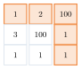{fig-alt="3x3 격자에서 지역적으로 작은 값을 따라가 합 105가 되는 경로가 강조된 다이어그램" width="45%"} 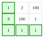{fig-alt="같은 3x3 격자에서 전역 최적 경로(합 7)가 강조된 다이어그램" width="45%"}

### Matrix Minimum Path Sum

::: {.callout-note title="문제 (Matrix Minimum Path Sum)"}
**Input**: $n\times m$ 행렬 $M$ (모든 칸에 비용이 있다).\
**Output**: $(1,1)$에서 $(n,m)$까지 **오른쪽 또는 아래로만** 이동해 도달할 때, 지나는 칸의 합이
최소가 되는 경로의 합(과 그 경로).
:::

| State | Transition | Base | Order | Answer |
|---|---|---|---|---|
| $dp[i][j]$ | $M[i][j]+\min(dp[i-1][j],dp[i][j-1])$ | 첫 row/column은 누적합 | row-major(또는 column-major) | $dp[n][m]$ + parent 배열로 경로 복원 |

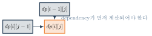{fig-alt="격자에서 한 칸이 위쪽 칸과 왼쪽 칸으로부터 화살표를 받는 의존 관계 다이어그램" width="60%"}

::: {.callout-warning title="흔한 실수: 첫 row/column의 잘못된 초기화"}
`if (i==1 || j==1) return M[i][j]`는 **틀렸다** — 시작 cell에서 첫 row/column을 따라가려면
지나온 칸들의 **누적합**이어야 한다(`M[i][j]` 자체가 아니다). 이 경계 조건을 놓치면 첫 row/column
전체가 잘못된 값을 갖는다.
:::



이 naive 재귀는 정확하지만 exponential하다 — 같은 $(i,j)$가 여러 경로를 통해 반복해서
재계산된다.

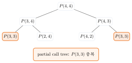{fig-alt="P(3,3)을 루트로 P(2,3)과 P(3,2)가 자식이 되고 그 아래에서 같은 상태가 반복되는 호출 트리" width="65%"}

**메모이제이션(Top-Down)**: 경계를 포함한 정확한 recurrence로 $(i,j)$를 계산하되, sentinel
`seen[i][j]`로 이미 계산된 state를 즉시 반환한다.



memo table은 $\Theta(nm)$ 공간, 재귀 호출 스택은 $\Theta(n+m)$이다. (음수 값이 가능하면
`-1` 같은 sentinel 값이 실제 결과와 겹칠 수 있으므로, 별도 `visited` 배열을 sentinel로 쓴다 —
이 코드가 바로 그렇게 한다.)

**실행 결과 (메모이제이션)**:

::: {.panel-tabset}
## Python
```{.python}

```
## Java
```{.java}

```
## C
```{.c}

```
:::

**실행 결과** (실제 컴파일·실행 캡처 — `gcc -Wall`, `javac`/`java`, `python3`):

::: {.panel-tabset}
## Python
```{.default}

```
## Java
```{.default}

```
## C
```{.default}

```
:::

**Tabulation(Bottom-Up)**: row-major 순서라면, 위쪽 row와 현재 row의 왼쪽 cell이 항상 먼저
계산되어 있다.



**실행 추적** (표가 row 단위로 누적되는 과정):

::: {.panel-tabset}
## 1단계

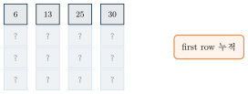{fig-alt="4x4 격자의 첫 row만 채워진 테이블" width="60%"}

## 2단계

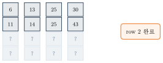{fig-alt="4x4 격자의 두 row가 채워진 테이블" width="60%"}

## 3단계

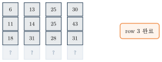{fig-alt="4x4 격자의 세 row가 채워진 테이블" width="60%"}

## 4단계

![answer: $dp[4][4]=40$.](../figures/05-dynamic-programming/10-matrix-row-progression-step4.svg){fig-alt="4x4 격자가 모두 채워지고 마지막 칸 40이 정답으로 강조된 테이블" width="60%"}
:::

대표적으로 $dp[3][3]$은 $M[3][3]+\min(dp[2][3],dp[3][2])=3+\min(25,31)=28$로 계산된다.

![$dp[3][3]$ 계산의 확대: 위쪽 25와 왼쪽 31 중 더 작은 25를 골라 $M[3][3]=3$을 더한다.](../figures/05-dynamic-programming/11-matrix-representative-cell.svg){fig-alt="dp[3][3] 칸이 위쪽 25, 왼쪽 31 두 이전 칸으로부터 화살표를 받는 확대 다이어그램" width="55%"}

경로 복원은 각 칸에서 어느 방향(위/왼쪽)이 선택되었는지 parent 배열에 남겨 두었다가 $(n,m)$에서
$(1,1)$까지 거슬러 올라가며 재구성한다.

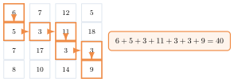{fig-alt="원본 행렬 위에 최소 경로가 강조되고 합계 40이 표시된 다이어그램" width="65%"}

**1-Row Space Optimization**: $dp[i][\cdot]$는 오직 $dp[i-1][\cdot]$와 같은 row의 왼쪽 값에만
의존하므로, 전체 표 대신 **한 row($\Theta(m)$ 공간)**만 유지하며 왼쪽에서 오른쪽으로 갱신하면
된다(`dp[j] ← M[i][j]+min(dp[j],dp[j-1])`) — 반드시 왼쪽에서 오른쪽 순서로 갱신해야
`dp[j-1]`이 이번 row의 새 값이 된다.

**실행 결과 (Bottom-Up)**:

::: {.panel-tabset}
## Python
```{.python}

```
## Java
```{.java}

```
## C
```{.c}

```
:::

**실행 결과** (실제 컴파일·실행 캡처 — `gcc -Wall`, `javac`/`java`, `python3`):

::: {.panel-tabset}
## Python
```{.default}

```
## Java
```{.default}

```
## C
```{.default}

```
:::

::: {.callout-caution collapse="true" title="확인 문제: Matrix Path Checkpoint"}
행렬 $M=\begin{pmatrix}6&7&12&5\\5&3&11&18\\7&17&3&3\\8&10&14&9\end{pmatrix}$에서:

| 질문 | 답 |
|---|---|
| $dp[1][3]$ | $25$ |
| $dp[3][1]$ | $18$ |
| $dp[3][3]$ | $28$ |
:::

### Longest Common Subsequence (LCS)

::: {.callout-note title="정의: Substring vs Subsequence"}
Substring은 원문에서 **연속된** 구간이고, subsequence는 순서만 유지하면 되며 **연속일 필요가
없다**. LCS는 subsequence 문제다.
:::

::: {.callout-note title="문제 (LCS)"}
**Input**: 문자열 $X$ (길이 $m$), $Y$ (길이 $n$).\
**Output**: 두 문자열에 공통으로 나타나는 가장 긴 subsequence의 길이(와 그 문자열 하나).
:::

예: $X=$"ABCBDAB", $Y=$"BDCABA" — LCS 길이는 $4$이고, "BCBA"와 "BDAB" 모두 유효한 답이다(이
책은 동점일 때 위쪽을 우선하는 tie-break로 하나를 고정한다).

| State | Transition | Base | Order | Answer |
|---|---|---|---|---|
| $dp[i][j]$: $X[1..i]$와 $Y[1..j]$의 LCS 길이 | match: $dp[i-1][j-1]+1$; mismatch: $\max(dp[i-1][j],dp[i][j-1])$ | $dp[0][j]=dp[i][0]=0$ | $i=1..m$ 바깥, $j=1..n$ 안쪽 | $dp[m][n]$ + 표 역추적으로 문자열 복원 |

| |$\epsilon$|B|D|C|A|B|A|
|---|---|---|---|---|---|---|---|
|$\epsilon$|0|0|0|0|0|0|0|
|A|0|.|.|.|.|.|.|
|B|0|.|.|.|.|.|.|
|C|0|.|.|.|.|.|.|
|B|0|.|.|.|.|.|.|
|D|0|.|.|.|.|.|.|
|A|0|.|.|.|.|.|.|
|B|0|.|.|.|.|.|.|

첫 row/column은 빈 문자열과의 LCS이므로 항상 $0$이다.

**Case 1 (마지막 문자가 같다)**: $X[i]=Y[j]\Rightarrow dp[i][j]=dp[i-1][j-1]+1$ — 공통 문자
하나를 답 끝에 추가하고 두 prefix를 모두 줄인다.

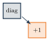{fig-alt="대각선 위 칸에서 화살표가 현재 칸으로 향하고 +1이 표시된 다이어그램" width="35%"}

**Case 2 (마지막 문자가 다르다)**: $X[i]\ne Y[j]\Rightarrow dp[i][j]=\max\{dp[i-1][j],dp[i][j-1]\}$
— 최적해는 $X[i]$를 쓰지 않는 경우 또는 $Y[j]$를 쓰지 않는 경우 중 적어도 하나에 포함된다.
"임의로 하나를 버린다"가 아니라 두 최적 prefix를 **비교**하는 것이다.



comparison은 assignment가 아니다 — 이 naive 재귀는 $O(2^{m+n})$ 수준의 exponential 호출을
만든다.

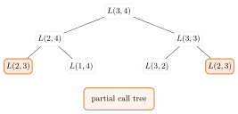{fig-alt="L(3,4)를 루트로 L(2,4)와 L(3,3)이 자식이 되고 그 아래에서 L(2,3)이 두 번 나타나는 호출 트리" width="65%"}

**Bottom-Up**:



::: {.callout-tip title="Notation bridge"}
수학의 $X[1..i]$, $Y[1..j]$는 1-based prefix다. C/Java/Python 문자열 인덱스는 0-based이므로
현재 문자는 `X[i-1]`, `Y[j-1]`로 연결한다.
:::

복잡도는 $(m+1)(n+1)\times\Theta(1)=\Theta(mn)$이다.

**실행 추적** (표가 $X=$"ABCBDAB", $Y=$"BDCABA"에서 채워지는 과정):

::: {.panel-tabset}
## 1단계

| |$\epsilon$|B|D|C|A|B|A|
|---|---|---|---|---|---|---|---|
|$\epsilon$|0|0|0|0|0|0|0|
|A|0|0|0|0|1|1|1|
|B|0|.|.|.|.|.|.|
|C|0|.|.|.|.|.|.|
|B|0|.|.|.|.|.|.|
|D|0|.|.|.|.|.|.|
|A|0|.|.|.|.|.|.|
|B|0|.|.|.|.|.|.|

첫 두 row(빈 문자열, "A")까지 채워졌다.

## 2단계

| |$\epsilon$|B|D|C|A|B|A|
|---|---|---|---|---|---|---|---|
|$\epsilon$|0|0|0|0|0|0|0|
|A|0|0|0|0|1|1|1|
|B|0|1|1|1|1|2|2|
|C|0|1|1|2|2|2|2|
|B|0|1|1|2|2|3|3|
|D|0|.|.|.|.|.|.|
|A|0|.|.|.|.|.|.|
|B|0|.|.|.|.|.|.|

절반 가량의 row가 채워졌다 — 각 칸은 항상 왼쪽·위쪽·대각선 세 칸이 먼저 계산되어 있다.

## 3단계

| |$\epsilon$|B|D|C|A|B|A|
|---|---|---|---|---|---|---|---|
|$\epsilon$|0|0|0|0|0|0|0|
|A|0|0|0|0|1|1|1|
|B|0|1|1|1|1|2|2|
|C|0|1|1|2|2|2|2|
|B|0|1|1|2|2|3|3|
|D|0|1|2|2|2|3|3|
|A|0|1|2|2|3|3|4|
|B|0|1|2|2|3|4|4|

answer: $dp[7][6]=4$.
:::

::: {.callout-note}
위 세 표는 `\only`로 감싼 순수 LaTeX `tabular`에서 그대로 옮긴 값이다(다이어그램이 아니라 수치
표이므로 TikZ SVG 대신 표로 직접 제시한다 — 다른 DP 트레이스는 SVG 시퀀스를 쓴다).
:::

**구현**: 세 언어 모두 같은 예제 입력 $X=$"ABCBDAB", $Y=$"BDCABA"를 쓴다.

::: {.panel-tabset}
## Python
```{.python}

```
## Java
```{.java}

```
## C
```{.c}

```
:::

**실행 결과** (실제 컴파일·실행 캡처 — `gcc -Wall`, `javac`/`java`, `python3`):

::: {.panel-tabset}
## Python
```{.default}

```
## Java
```{.default}

```
## C
```{.default}

```
:::

## Part D. LCS 복원과 Maximum Subarray

### LCS Reconstruction

**길이**와 **실제 LCS 문자열**은 다른 문제다 — $dp[m][n]$은 길이만 알려주므로, 실제 문자열을
얻으려면 표를 거슬러 올라가야 한다.

**Backtracking 규칙**: match면 대각선으로, mismatch면 더 큰 값 방향으로, **동점이면 위쪽을
우선**한다.

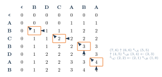{fig-alt="LCS 표 위에 (8,8)=A, (6,7)=B, (5,5)=C, (4,3)=B 네 칸이 강조되고 화살표로 역추적 경로가 표시된 다이어그램, 오른쪽에 선택된 문자 A,B,C,B를 역순으로 뒤집어 BCBA를 얻는 과정이 텍스트로 표시됨" width="90%"}

**검증**: 얻은 문자열이 실제로 $X$와 $Y$ 모두의 subsequence인지, 길이가 $dp[m][n]$과 일치하는지
확인한다.

**Space Optimization**: 길이만 필요하다면 이전 row 하나만 유지해 $\Theta(\min(m,n))$ 공간으로
줄일 수 있다 — 단, 이 경우 실제 문자열 복원에 필요한 정보(어느 방향에서 왔는지)는 잃는다.
문자열까지 복원하려면 Hirschberg's Algorithm(부록 참고)처럼 더 정교한 기법이 필요하다.

### Maximum Subarray (Kadane's Algorithm)

::: {.callout-note title="문제 (Maximum Sum Contiguous Subarray)"}
**Input**: 정수 배열 $A[0..n-1]$.\
**Output**: **비어 있지 않은** 연속 구간 중 합이 최대인 구간과 그 합.
:::

::: {.callout-warning title="흔한 실수: Nonempty convention"}
모든 원소가 음수이면 답은 $0$(빈 구간)이 아니라 **가장 큰 단일 원소**다 — "비어 있지 않은
구간"이라는 조건을 반드시 지켜야 한다.
:::



모든 구간 $(i,j)$의 합을 직접 계산하면 $\Theta(n^2)$ time, $\Theta(1)$ auxiliary space다 —
prefix sum을 미리 구해도 여전히 $\Theta(n^2)$개 구간을 모두 봐야 하므로 시간은 그대로다.

| State | Transition | Base | Order | Answer |
|---|---|---|---|---|
| $bestEndingAt[i]$: index $i$에서 **반드시 끝나는** 최대합 | $\max(A[i],\ bestEndingAt[i-1]+A[i])$ | $bestEndingAt[0]=A[0]$ | 왼쪽→오른쪽 $i=1,\dots,n-1$ | $bestOverall=\max_i bestEndingAt[i]$ + 경계 변수로 구간 복원 |

::: {.callout-warning title="흔한 실수: State와 Answer를 구분하지 않음"}
`bestEndingAt[i]`는 반드시 index $i$에서 끝나는 부분합(state)이고, `bestOverall`은 지금까지
본 모든 끝점 중 최댓값(answer)이다. 이 둘을 하나의 변수로 섞으면 "현재까지 최댓값"과 "현재
지점에서 끝나는 값"이 뒤섞여 갱신 로직이 틀린다.
:::

매 $i$에서 두 선택이 있다: 이전 구간을 **확장(extend)**하거나 현재 위치에서 **새로 시작(restart)**
한다. `restart`가 더 크면 새 구간을 시작하고, 그렇지 않으면 확장한다.

**Kadane Trace** ($A=[-2,1,-3,4,-1,2,1,-5,4]$, 인덱스 0-based):

| $i$ | $A[i]$ | extend | restart | $bestEndingAt[i]$ | $bestOverall$ |
|---|---|---|---|---|---|
| 0 | $-2$ | — | — | $-2$ | $-2$ |
| 1 | $1$ | $-1$ | $1$ | $1$ | $1$ |
| 2 | $-3$ | $-2$ | $-3$ | $-2$ | $1$ |
| 3 | $4$ | $2$ | $4$ | $4$ | $4$ |
| 4 | $-1$ | $3$ | $-1$ | $3$ | $4$ |
| 5 | $2$ | $5$ | $2$ | $5$ | $5$ |
| 6 | $1$ | $6$ | $1$ | $6$ | $6$ |
| 7 | $-5$ | $1$ | $-5$ | $1$ | $6$ |
| 8 | $4$ | $5$ | $4$ | $5$ | $6$ |

$i=3$에서 restart($4$)가 이어가기($2$)보다 커서 새 구간이 index 3에서 시작되고, 이 구간이
끝까지 확장되며 $i=6$에서 $bestOverall=6$을 달성한 뒤 갱신되지 않는다 — 최종 구간은
$[3,6]$(0-based), 즉 $[4,-1,2,1]$, 합 $6$.

::: {.callout-caution collapse="true" title="확인 문제: All-Negative Checkpoint"}
$A=[-8,-3,-6,-2,-5,-4]$일 때 답은? — 가장 큰 단일 원소 $-2$(0-based index 3)가 답이다.
:::

::: {.callout-tip title="Kadane Code Contract"}
결과는 (합, 시작 인덱스, 끝 인덱스) 세 값이다. $n=0$은 잘못된 입력이다. 오버플로를 줄이려면
`long`/`long long`을 쓴다. 합이 같으면 **더 짧은 구간**, 그래도 같으면 **더 작은 시작
인덱스**를 우선한다(tie-break).
:::

**구현**: 세 언어 모두 같은 예제 입력을 쓰고, brute force와 Kadane 두 결과가 일치함을 함께
출력해 직접 비교한다.

::: {.panel-tabset}
## Python
```{.python}



```
## Java
```{.java}

```
```{.java}

```
## C
```{.c}

```
```{.c}

```
:::

**실행 결과** (실제 컴파일·실행 캡처 — `gcc -Wall`, `javac`/`java`, `python3`):

::: {.panel-tabset}
## Python
```{.default}

```
## Java
```{.default}

```
## C
```{.default}

```
:::

| 방법 | 시간 | 공간 |
|---|---|---|
| Brute Force | $\Theta(n^2)$ | $\Theta(1)$ |
| 분할정복 | $\Theta(n\log n)$ | $\Theta(\log n)$ |
| Kadane(DP) | $\Theta(n)$ | $\Theta(1)$ |

## Part E. 비교, 요약, Quiz

### 네 예제의 State와 Transition

| 문제 | State | Transition |
|---|---|---|
| Fibonacci | $F(i)$ | $F(i-1)+F(i-2)$ |
| Matrix Path | $dp[i][j]$ | $M[i][j]+\min(dp[i-1][j],dp[i][j-1])$ |
| LCS | $dp[i][j]$ | match: $dp[i-1][j-1]+1$; mismatch: $\max(dp[i-1][j],dp[i][j-1])$ |
| Maximum Subarray | $bestEndingAt[i]$ | $\max(A[i],bestEndingAt[i-1]+A[i])$ |

### 네 예제의 Base·Order·Answer

| 문제 | Base | Order | Answer |
|---|---|---|---|
| Fibonacci | $F(0)=0,F(1)=1$ | $i=2,\dots,n$ | $F(n)$ |
| Matrix Path | 첫 row/column 누적합 | row-major | $dp[n][m]$ + 복원 |
| LCS | $dp[0][j]=dp[i][0]=0$ | $i$ 바깥, $j$ 안쪽 | $dp[m][n]$ + 복원 |
| Maximum Subarray | $bestEndingAt[0]=A[0]$ | 왼쪽→오른쪽 | $\max_i bestEndingAt[i]$ + 경계 |

### 복잡도와 Reconstruction 비교

| 문제 | 시간 | 공간 | Reconstruction |
|---|---|---|---|
| Fibonacci | $\Theta(n)$ | $\Theta(n)$ 또는 $\Theta(1)$(rolling) | 없음 |
| Matrix Path | $\Theta(nm)$ | $\Theta(nm)$ | parent 배열 또는 재계산 backtracking |
| LCS | $\Theta(mn)$ | $\Theta(mn)$ | 표 역추적 |
| Maximum Subarray | $\Theta(n)$ | $\Theta(1)$ | 경계 변수 |

**Top-Down vs Bottom-Up 선택 기준**: 상태 공간의 일부만 실제로 방문된다면 top-down이 유리하고
(방문하지 않는 state는 계산하지 않는다), 대부분의 state를 어차피 다 써야 한다면 재귀 오버헤드가
없는 bottom-up이 유리하다. Bottom-up은 rolling variable 공간 최적화도 더 쉽다.

| | 분할정복(D&C) | 동적 계획법(DP) | 탐욕(Greedy) |
|---|---|---|---|
| 부분 문제 관계 | 분리(disjoint) | 중복(overlapping) | 부분 문제를 명시적으로 풀지 않음 |
| 대표 분석 도구 | Master Theorem | State×Transition 복잡도 | 교환 논증(exchange argument) |
| 되돌아보는가 | 아니오(합치기만) | 예(저장된 하위 최적해 재사용) | 아니오(한 번의 지역 선택) |

**개념 다리**: 재귀 관계식을 세운다는 점은 분할정복과 DP 모두 같다. 차이는 부분 문제가 겹치지
않으면(정렬 장의 Quick Sort, Merge Sort처럼) Master Theorem으로 분석하는 분할정복이고, 부분
문제가 겹치면(Matrix Path, LCS처럼) **그 중복을 저장하는 것이 동적 계획법**이라는 점이다.

::: {.callout-tip title="DP 설계 Checklist"}
1. State가 부분 문제를 정보 손실 없이 식별하는가?
2. Transition이 모든 경계 경우를 포함하는가?
3. Base case가 빠짐없이 정의되었는가?
4. Evaluation order가 의존 관계를 위반하지 않는가(순환 없음)?
5. Answer가 정확한 state를 가리키는가?
6. 복원(reconstruction)이 필요하면, 그에 필요한 정보를 어디에 남겨야 하는가?
:::

## 개념 지도

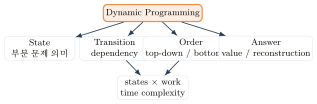{fig-alt="Dynamic Programming을 중심 노드로 State, Transition, Order, Answer 네 갈래가 뻗어나가고 이들이 다시 복잡도 노드로 모이는 다이어그램" width="80%"}

## 💡 배움 포인트

- 재귀와 DP는 같은 재귀 관계식을 공유한다 — 차이는 중복되는 부분 문제를 저장하는지 여부다.
- DP 설계는 항상 State → Transition → Base Case → Evaluation Order → Answer 순서로 진행한다.
- Optimal substructure만으로는 DP가 아니다 — overlapping subproblems가 함께 있어야 저장이 이득이 된다.
- Top-down(메모이제이션)과 bottom-up(tabulation)은 같은 evaluation order를 반대 방향에서 접근한 것이다.
- 길이(값)와 실제 해(reconstruction)는 다른 문제다 — 복원하려면 역추적에 필요한 정보를 남겨야 한다.

## 🧪 직접 해보기

::: {.callout-caution collapse="true" title="Fibonacci·Matrix Path Quiz"}
1. $F(7)$의 값과, 이를 top-down 메모이제이션으로 계산할 때 실제로 계산되는 서로 다른 state의 개수는?
2. Matrix Path에서 `if (i==1 && j==1) return M[i][j]`만 있고 첫 row/column 처리가 없다면 어떤 칸에서 잘못된 값이 나오는가?
3. Matrix Path의 evaluation order를 column-major로 바꾸면 정답이 달라지는가?
4. Rolling variable 최적화가 Matrix Path에도 그대로 적용되는가? 왜 그런가/아닌가?

**정답**

1. $F(7)=13$. 서로 다른 state는 $F(0),\dots,F(7)$ 8개뿐이다(memo가 있으므로 중복 계산 없음).
2. 첫 row($i=1,j>1$)와 첫 column($i>1,j=1$)이 각각 누적합이 아니라 `M[i][j]` 값 자체로 잘못
   채워진다.
3. 아니다 — row-major든 column-major든 $(i-1,j)$와 $(i,j-1)$이 먼저 계산되기만 하면 되므로
   결과는 같다.
4. 아니다 — Fibonacci는 1차원 state라 이전 두 값만 있으면 되지만, Matrix Path는 2차원이라 최소
   "이전 row 전체"가 필요하다(1-Row Space Optimization).
:::

::: {.callout-caution collapse="true" title="LCS Quiz"}
1. $X=$"ABCBDAB", $Y=$"BDCABA"의 LCS 길이는?
2. mismatch일 때 transition에 $\min$을 쓰면 어떤 문제가 생기는가?
3. 답 문자열을 얻으려면 $dp$ 표에서 어떻게 움직여야 하는가?
4. 동점(tie)일 때 위쪽을 우선하는 규칙을 아래쪽 우선으로 바꾸면 길이도 달라지는가?

**정답**

1. $4$ (예: "BCBA").
2. $\min$을 쓰면 두 최적 prefix 중 더 나쁜 쪽을 선택하게 되어, 실제로는 존재하는 더 긴 공통
   부분열을 놓친다(흔한 실수 — 반드시 $\max$).
3. match면 대각선, mismatch면 더 큰 값 방향으로, 표의 오른쪽 아래에서 왼쪽 위로 이동한다.
4. 아니다 — 어느 tie-break를 선택해도 길이($dp[m][n]$)는 같다. 실제로 복원되는 문자열이
   달라질 수 있을 뿐이다.
:::

::: {.callout-caution collapse="true" title="Maximum Subarray·Concept Quiz"}
1. 모든 원소가 음수인 배열 $[-8,-3,-6,-2,-5,-4]$의 답은?
2. `bestEndingAt[i]`와 `bestOverall`을 하나의 변수로 합치면 왜 틀리는가?
3. Optimal substructure는 있지만 overlapping subproblems가 없는 문제의 예는?
4. DP와 분할정복의 핵심 차이를 한 문장으로 말하면?

**정답**

1. $-2$(index 3의 단일 원소) — nonempty convention.
2. 매 위치에서 "여기서 끝나는 최적"과 "지금까지 본 전역 최적"이 다른 개념인데, 하나로 합치면
   확장(extend)해야 할 때 전역 최댓값을 기준으로 잘못 판단하게 된다.
3. Quick Sort/Merge Sort — partition/분할 후 좌우 부분 배열이 서로 겹치지 않는다.
4. 부분 문제가 겹치지 않으면 분할정복, 겹치면(그 중복을 저장하는) 동적 계획법이다.
:::

::: {.callout-tip collapse="true" title="Exit Ticket"}
오늘 배운 DP 설계 다섯 요소(State/Transition/Base/Order/Answer) 중, 여러분이 직접 문제를 풀 때
가장 놓치기 쉬울 것 같은 요소 하나와 그 이유를 적어 보자.
:::

## 요약

동적 계획법은 재귀와 같은 재귀 관계식에서 출발하되, 중복되는 부분 문제(overlapping
subproblems)를 저장해 다시 계산하지 않는다는 점이 다르다. 모든 DP 문제는 State →
Transition → Base Case → Evaluation Order → Answer/Reconstruction 다섯 요소로 설계할 수
있다. Fibonacci로 이 템플릿을 도입하고, Memoization(top-down)과 Tabulation(bottom-up)이
같은 evaluation order를 반대 방향에서 접근한 것임을 확인했다. Matrix Path와 LCS는 2차원
state와 reconstruction(경로·문자열 복원)을 보여주었고, Maximum Subarray(Kadane's Algorithm)는
state와 answer를 분리해야 하는 이유를 보여주었다. Optimal substructure만으로는 DP가 아니며,
부분 문제가 겹칠 때만 저장이 이득이 된다 — 이 구분이 3장의 분할정복(Master Theorem으로
분석)과 이 장의 DP를 가르는 기준이다.
