## 🎯 학습목표

- tree 용어(root/parent/child/sibling/leaf/ancestor/subtree)와 depth·level·height convention을 정확히 사용한다.
- full·perfect·complete binary tree를 구분하고, 네 traversal을 추적해 시간·공간 비용을 설명한다.
- BST의 SEARCH·INSERT·DELETE를 손으로 추적하고, plain BST의 입력 의존적 height를 설명한다.
- AVL의 balance factor와 LL/RR/LR/RL rotation, Red-Black의 다섯 invariant와 $O(\log n)$ height 직관을 설명한다.
- B-Tree의 split·promotion·borrow·merge를 추적하고, BST·AVL·RB·B-Tree를 workload에 맞게 선택한다.

## Part A. Tree와 용어

::: {.callout-tip title="Mission"}
한 번의 비교로 후보 영역을 줄이고, 구조적 관계를 유지한다.
:::

Tree는 계층을 표현한다(file system, organization hierarchy, syntax tree). 검색을 조직하기도 하고(symbol table, memory allocator, search index), 저장장치까지 확장된다(database page와 B-Tree index).

::: {.callout-note title="정의: Rooted Tree"}
하나의 root가 있고, root를 제외한 각 node는 정확히 하나의 parent를 가지며, root에서 각 node까지 unique path가 있다.
:::

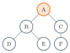{fig-alt="A를 root로 B,C가 자식이고 B의 자식이 D,E, C의 자식이 F,G인 트리 다이어그램" width="45%"}

같은 그림에서 여러 관계를 구분해보자: A는 root이고 degree 2다. A는 parent이고 B와 C는 A의 child이자 서로 sibling이다. D와 E는 leaf이고 B는 internal node다. C의 subtree는 $\{C,F,G\}$이고 A는 G의 ancestor다.

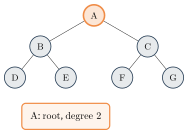{fig-alt="A가 주황으로 강조되고 root, degree 2라는 콜아웃이 붙은 1단계 상태" width="45%"}
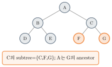{fig-alt="C,F,G가 주황으로 강조되고 C의 subtree, A는 G의 ancestor라는 콜아웃이 붙은 마지막 상태" width="45%"}

**Ancestor·Descendant**는 parent/child를 여러 edge로 확장한 transitive relation이다 — A는 E의 ancestor이고 E는 A의 descendant다. **Subtree**는 한 node와 모든 descendant, 그리고 그 edge로 이루어진 tree다(예: node B와 $\{B,D,E\}$). Node degree는 child 수이고, tree degree는 모든 node degree의 최댓값이다.

::: {.callout-warning title="Depth · Level · Height Convention"}
$$\operatorname{depth}(v)=\text{root에서 }v\text{까지 edge 수}$$

**root depth $=0$**, level $=$ depth+1이다. node height는 가장 깊은 descendant leaf까지 edge 수이고, **leaf height $=0$, empty tree height $=-1$**이다. tree height는 root height다. 교재에 따라 level과 height를 node 수로 세기도 하지만, 이 장은 **edge-height를 끝까지 사용**한다.
:::

node가 $n\ge1$개인 tree는 다음을 만족한다: (1) connected이며 cycle이 없다, (2) edge가 정확히 $n-1$개다, (3) 임의의 두 node 사이에 **unique simple path**가 있다. 세 문장은 서로 연결된다 — edge를 하나 추가하면 cycle이, 하나 제거하면 disconnect가 생긴다.

::: {.callout-caution collapse="true" title="확인 문제: Tree Basics Checkpoint"}
1. 12개 node인 tree의 edge 수는?
2. root depth 0일 때 depth 3 leaf의 level은?
3. leaf와 internal node의 차이는?
4. 두 node 사이의 path가 유일하다는 말에서 필요한 정확한 용어는?

**답**: 1. 11개. 2. level 4. 3. child가 0인지 아닌지. 4. unique simple path.
:::

## Part B. Binary Tree의 형태와 표현

각 node는 최대 두 child를 가지고, left child와 right child는 서로 구별된다 — child가 하나뿐이어도 left인지 right인지가 구조의 일부다.

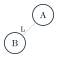{fig-alt="A에서 B로 L 표시가 붙은 edge가 내려가는 다이어그램" width="30%"}
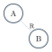{fig-alt="A에서 B로 R 표시가 붙은 edge가 내려가는 다이어그램" width="30%"}

Binary tree 응용: expression tree(operator가 internal node, operand가 leaf), Huffman tree(prefix-free code를 만드는 weighted tree), heap(complete binary tree를 array로 저장), search tree(order invariant로 후보를 줄임).

::: {.callout-warning title="흔한 실수: Full이라고 모든 leaf가 같은 depth는 아니다"}
| 용어 | 정의 |
|---|---|
| Full | 모든 node의 child 수가 0 또는 2 |
| Perfect | 모든 internal node가 두 child이고 모든 leaf가 같은 depth |
| Complete | 마지막 level 전까지 가득 차고 마지막 level은 왼쪽부터 채움 |

Full이라고 해서 반드시 모든 leaf가 같은 depth인 것은 아니다 — full이지만 perfect가 아닌 tree가 존재한다.
:::

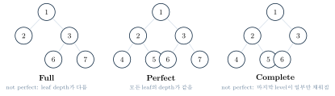{fig-alt="7개 node의 full tree, perfect tree, 6개 node의 complete tree가 나란히 그려진 다이어그램" width="80%"}

edge-height가 $h$인 perfect tree는 level $0,\ldots,h$가 모두 차므로

$$n=1+2+\cdots+2^h=2^{h+1}-1$$

이다(height를 level 수 $H=h+1$로 세는 교재에서는 $n=2^H-1$). 일반 full tree에는 이 공식이 성립하지 않는다.

**Linked representation**은 key/data, left, right가 필수고 parent는 optional이며 sparse arbitrary tree에 자연스럽다.

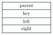{fig-alt="parent, key, left, right 네 칸으로 나뉜 레코드 다이어그램" width="30%"}

parent pointer는 successor·predecessor·upward navigation을 쉽게 하지만, node당 memory가 늘고 rotation·transplant마다 일관되게 갱신해야 한다 — **pointer를 추가하면 연산은 편해지지만 invariant도 하나 늘어난다.**

::: {.callout-tip title="다리: 정렬 장의 heap array representation"}
complete tree라면 array로도 표현할 수 있다 — index 관계로 parent/child를 계산한다(1-based: parent $\lfloor i/2\rfloor$, children $2i,2i+1$). 정렬 장에서 다룬 heap array 표현과 정확히 같은 아이디어다. 다만 AVL·Red-Black Tree처럼 rotation이 있고 shape가 sparse한 구조에는 array가 아니라 **linked representation**이 자연스럽다.
:::

## Part C. Traversal

::: {.callout-tip title="Mission"}
현재 node를 처리하는 시점을 left/right subtree 처리와의 순서로 결정한다.
:::

아래 고정 tree A(B(D,E), C(F,G))로 네 traversal을 비교한다.

| Traversal | 결과 |
|---|---|
| Preorder | A B D E C F G |
| Inorder | D B E A F C G |
| Postorder | D E B F G C A |
| Level-order | A B C D E F G |

**Preorder**: node를 먼저 처리한 뒤 left, right subtree에 같은 mission을 적용한다.



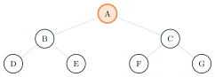{fig-alt="A만 강조되고 visited: A인 1단계 상태" width="40%"}
{fig-alt="모든 노드가 처리 완료로 표시되고 visited: A,B,D,E,C,F,G인 마지막 상태" width="40%"}

**Inorder**: left subtree를 마친 뒤 node, 그다음 right subtree를 처리한다.



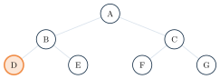{fig-alt="D만 강조되고 visited: D인 1단계 상태" width="40%"}
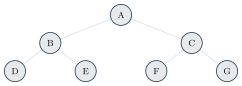{fig-alt="모든 노드가 처리 완료로 표시되고 visited: D,B,E,A,F,C,G인 마지막 상태" width="40%"}

**Postorder**: 두 subtree의 결과가 준비된 뒤 node를 처리한다.



{fig-alt="D만 강조되고 visited: D인 1단계 상태" width="40%"}
{fig-alt="모든 노드가 처리 완료로 표시되고 visited: D,E,B,F,G,C,A인 마지막 상태" width="40%"}

**복잡도(DFS 세 traversal 공통)**: 각 node에서 $\Theta(1)$ work를 정확히 한 번 수행하므로 시간은 $\Theta(n)$이다. recursion stack은 현재 root-to-node path이므로 $O(h)$ — balanced tree는 $O(\log n)$, degenerate tree는 $O(n)$이다.

**Level-order**는 재귀가 아니라 queue를 쓴다.



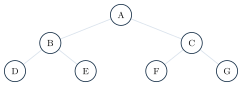{fig-alt="A,B,C,D,E,F,G 고정 tree" width="40%"}

| step | current | queue before → after | visited |
|---|---|---|---|
| 0 | -- | [] → [A] | [] |
| 1 | A | [A] → [B,C] | [A] |
| 2 | B | [B,C] → [C,D,E] | [A,B] |
| 3–7 | C,D,E,F,G | [C,D,E] → ... → [] | [A,B,C,D,E,F,G] |

time은 node와 edge를 한 번씩 다루므로 $\Theta(n)$이고, queue에는 frontier가 저장되어 auxiliary space는 $O(w)$($w$는 maximum width) — perfect tree에서는 마지막 level 때문에 $w=\Theta(n)$일 수 있다.

**Expression Tree**: operator가 internal node, operand가 leaf다.

{fig-alt="곱셈이 루트이고 왼쪽에 덧셈(x,y), 오른쪽에 나눗셈(왼쪽 덧셈(a,b), 오른쪽 c)이 있는 트리" width="45%"}

Prefix(preorder) `* + x y / + a b c`, infix(inorder) `(x + y) * ((a + b) / c)`, postfix(postorder) `x y + a b + c / *`다. 단순 inorder `x + y * a + b / c`는 원래 grouping을 보존하지 않으므로, 각 operator subtree를 괄호로 감싸야 한다.

**구현**: 세 언어 모두 같은 예제 tree A(B(D,E),C(F,G))를 쓴다.

::: {.panel-tabset}
## Python
```{.python}

```
## Java
```{.java}

```
## C
```{.c}

```
:::

**실행 결과** (실제 컴파일·실행 캡처 — `gcc -Wall`, `javac`/`java`, `python3`):

::: {.panel-tabset}
## Python
```{.default}

```
## Java
```{.default}

```
## C
```{.default}

```
:::

::: {.callout-caution collapse="true" title="확인 문제: Traversal Checkpoint"}
1. 고정 tree의 inorder에서 A 바로 앞 key는?
2. postorder의 마지막 node는?
3. recursive DFS와 BFS의 auxiliary space는?
4. expression tree의 postfix는?

**답**: 1. E. 2. root A. 3. $O(h)$와 $O(w)$. 4. `x y + a b + c / *`.
:::

## Part D. Java 구현 노트

BinaryTree의 API contract: generic data는 non-null, empty tree height $=-1$, leaf height $=0$이다. constructor는 subtree를 **deep copy**해 ownership을 분리한다 — 원본처럼 subtree root를 공유하면 한 tree의 변경이 다른 tree에 보일 수 있기 때문이다. traversal은 immutable `List<E>`를 반환한다.

$$\operatorname{size}(x)=1+\operatorname{size}(x.left)+\operatorname{size}(x.right),\qquad \operatorname{height}(x)=1+\max(h(x.left),h(x.right)),\ h(\NIL)=-1$$

둘 다 모든 node를 보므로 $\Theta(n)$이고, height를 자주 쓰는 balanced tree는 node에 height를 저장하고 갱신한다(Part I에서 다시 나온다). subtree API는 두 선택지가 있다 — shared view는 빠르지만 mutation aliasing 문제가 있고, deep copy는 비용 $\Theta(k)$지만 ownership이 명확하다. 이 구현은 교육용 안전성을 위해 deep copy를 쓴다.

## Part E. Dynamic Set과 구조 선택

$$\text{Dictionary ADT}\ \Longrightarrow\ \text{Dynamic Set Operations}\ \Longrightarrow\ \text{BST Implementation}$$

Dynamic Set 연산은 SEARCH·INSERT·DELETE와 (선택) UPDATE, 그리고 MINIMUM/MAXIMUM·SUCCESSOR/PREDECESSOR·ordered iteration이다. value만 바뀌고 ordering key가 같으면 제자리 update가 가능하지만, key가 ordering에 영향을 주면 기존 위치에서 삭제 후 새 key로 삽입해야 한다.

| 구조 | Search | Insert | Delete | Ordered ops | 핵심 |
|---|---|---|---|---|---|
| unsorted list | $\Theta(n)$ | $\Theta(1)^*$ | $\Theta(n)$ | 비효율 | 작고 단순 |
| sorted array | $\Theta(\log n)$ | $\Theta(n)$ | $\Theta(n)$ | 좋음 | read-heavy |
| BST | $\Theta(h)$ | $\Theta(h)$ | $\Theta(h)$ | 좋음 | shape 의존 |
| balanced BST | $\Theta(\log n)$ | $\Theta(\log n)$ | $\Theta(\log n)$ | 좋음 | memory map |
| hash table | expected $\Theta(1)$ | expected $\Theta(1)$ | expected $\Theta(1)$ | 어려움 | 해시 테이블(추후) |
| B-Tree | $\Theta(\log_t n)$ | $\Theta(\log_t n)$ | $\Theta(\log_t n)$ | 좋음 | page I/O |

$^*$duplicate 검사 없는 append만 $\Theta(1)$이다 — distinct-set의 duplicate 검사를 포함하면 $\Theta(n)$이다. hash는 expected bound, B-Tree는 고정 $t$와 occupancy 아래 worst-case page I/O다.

$$\text{operation cost}=\Theta(\text{root에서 이동한 path length})=\Theta(h)$$

balanced height는 $\Theta(\log n)$, degenerate height는 $\Theta(n)$이다. B-Tree는 고정 $t$와 occupancy 아래 height와 worst-case page I/O가 $\Theta(\log_t n)$이다.

::: {.callout-caution collapse="true" title="확인 문제: Dynamic Set Checkpoint"}
1. successor가 필요한 workload에 hash table만 쓰기 어려운 이유는?
2. sorted array insert가 느린 이유는?
3. key 변경 시 언제 재삽입이 필요한가?

**답**: 1. order가 없다. 2. 원소 shift가 필요하다. 3. ordering key가 바뀔 때.
:::

## Part F. BST 기본 연산

::: {.callout-note title="정의: BST Property(distinct-key)"}
모든 node $x$에 대해 $\forall k\in x.left:\ k<x.key$, $\forall k\in x.right:\ k>x.key$다. **본문과 코드는 duplicate를 거부한다** — count field나 항상 한쪽 삽입 정책도 가능하지만, 정책을 섞으면 안 된다.
:::

아래 12-key 고정 BST를 이 장 전체(Part F~G)에서 예제로 쓴다.

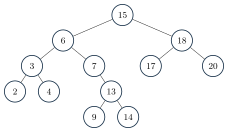{fig-alt="15를 루트로 왼쪽에 6,3,2,4,7,13,9,14가, 오른쪽에 18,17,20이 있는 BST" width="55%"}

inorder $2,3,4,6,7,9,13,14,15,17,18,20$은 정렬 순서와 같다 — left subtree key는 root보다 작고, root를 출력한 뒤, right subtree key는 root보다 크기 때문이다.

::: {.callout-caution collapse="true" title="확인 문제"}
모든 binary tree를 inorder하면 정렬되는가? **아니다.** BST invariant가 필요하다.
:::





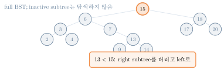{fig-alt="15가 강조되고 13<15: right subtree를 버리고 left로라는 콜아웃이 붙은 1단계, 나머지 노드는 inactive" width="55%"}
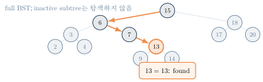{fig-alt="13이 최종 강조되고 13=13: found라는 콜아웃이 붙은 마지막 상태, active edge 경로가 표시됨" width="55%"}

**MINIMUM·MAXIMUM**: minimum은 left child를 NIL까지 따라간다(예제에서 2), maximum은 right child를 NIL까지 따라간다(예제에서 20). 시간은 $\Theta(h)$이고, empty tree의 Java API는 `OptionalInt.empty()`를 반환한다.



Maximum은 left를 right로 바꾼 symmetric algorithm이다.

**SUCCESSOR**는 두 case다: (1) $x.right\ne\NIL$이면 $\operatorname{minimum}(x.right)$, (2) right subtree가 없으면 parent를 올라가며 현재 node가 처음으로 ancestor의 left subtree에 놓이는 그 ancestor다. $x.key$보다 큰 key 중 가장 작은 key라는 정의와 일치한다.

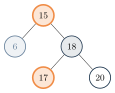{fig-alt="15와 17이 강조된 case1 트리와 나란히 4와 6이 강조된 case2 설명이 함께 표시된 다이어그램" width="55%"}
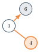{fig-alt="6,3,4 세 노드가 위로 올라가는 화살표로 연결된 보조 다이어그램" width="30%"}

$$succ(15)=17,\quad succ(6)=7,\quad succ(4)=6,\quad succ(20)=\NIL$$

parent pointer가 있으면 upward walk가 직접 가능하고, 없으면 root부터 search path를 기억하거나 다시 탐색해야 한다. predecessor는 left/right와 min/max를 바꾼 symmetric operation이다.

::: {.callout-caution collapse="true" title="확인 문제: BST 기본 연산 Checkpoint"}
1. search(14)의 path는?
2. minimum과 maximum은?
3. predecessor(15)는?
4. successor(20)는?

**답**: 1. $15\to6\to7\to13\to14$. 2. 2와 20. 3. 14. 4. NIL.
:::

## Part G. BST INSERT와 DELETE

INSERT는 두 cursor를 쓴다: $x$는 search cursor(다음 비교 node), $y$는 $x$의 parent 후보(마지막 non-NIL node)다 — **새 key가 들어갈 NIL slot을 찾되 parent를 잃지 않는다.**



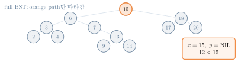{fig-alt="15가 강조되고 x=15,y=NIL, 12&lt;15라는 콜아웃이 붙은 1단계, 나머지는 inactive" width="55%"}
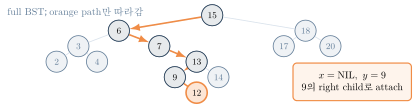{fig-alt="9까지의 경로가 active edge로 표시되고 새 노드 12가 9의 right child로 추가된 마지막 상태" width="55%"}

search path의 비교가 lower/upper bound를 좁히고, 마지막 $y$의 올바른 NIL side에 연결하면 모든 ancestor bound가 유지된다 — path length만큼 비교하므로 $\Theta(h)$다.

::: {.callout-caution collapse="true" title="확인 문제"}
**INSERT 14를 시도하면?** 기존 node 14에 도달해 `DUPLICATE`를 반환하고 tree는 바뀌지 않는다(distinct-key 정책).
:::

DELETE는 세 case다: (1) child 0개 — node 제거, (2) child 1개 — child subtree를 target 위치로 올림, (3) child 2개 — right subtree minimum인 successor로 대체. 어려운 이유는 target 아래의 모든 subtree와 parent/root pointer를 잃지 않아야 하기 때문이다.



Transplant는 node $u$의 parent link를 $v$로 바꾸며 root case도 같은 helper가 처리한다.

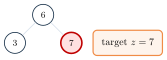{fig-alt="6의 두 자식 3,7 중 7이 target으로 표시된 삭제 전 상태" width="35%"}
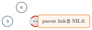{fig-alt="7 자리가 NIL로 바뀐 삭제 후 상태" width="35%"}

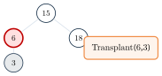{fig-alt="15의 왼쪽 자식 6(target)이 자식 3을 가진 삭제 전 상태" width="35%"}
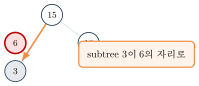{fig-alt="3이 6의 자리로 직접 연결된 삭제 후 상태" width="35%"}

**DELETE Case 3**(15 삭제, successor 17 선택): $y=min(15.right)=17$이고 따라서 $y.left=\NIL$이다.

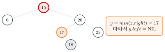{fig-alt="15가 target, 17이 current로 표시되고 15의 왼쪽에 6, 오른쪽에 20(자식 17,25), 17의 자식 18이 있는 다이어그램" width="55%"}

Transplant sequence: $y=17$, $y.right=18$이므로 `TRANSPLANT`$(17,18)$로 $20.left=18$; $y.right\gets z.right$로 $17.right=20$과 parent 갱신; `TRANSPLANT`$(15,17)$; $y.left\gets z.left$로 $17.left=$ 기존 left subtree와 parent 갱신. **key copy가 아니라 successor node 자체를 옮겨** satellite data와 identity를 분명히 한다.

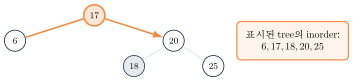{fig-alt="17이 새 루트가 되고 왼쪽에 6, 오른쪽에 20(자식 18,25)이 연결된 최종 트리" width="55%"}

**정확성 직관**: Case 1/2는 child subtree 전체가 올라가도 기존 ancestor bounds 안에 있다. Case 3는 successor $y$가 $z$보다 큰 최소 key이고 $y.left=\NIL$이다 — $z.left$의 모든 key $<y$, 남은 $z.right$의 모든 key $>y$다. 삭제 뒤 inorder가 strictly increasing이면 BST order가 보존된 것이다.

::: {.callout-caution collapse="true" title="확인 문제: BST INSERT·DELETE Checkpoint"}
1. root 하나뿐인 tree에서 root 삭제는 누가 처리하는가?
2. successor가 left child를 가질 수 없는 이유는?
3. 두 operation의 시간은?

**답**: 1. Transplant의 root branch. 2. right subtree minimum이므로. 3. $\Theta(h)$.
:::

**구현**: 세 언어 모두 이 장의 고정 BST 예제(`15,6,3,2,4,7,13,9,14,18,17,20` 삽입 후 `12` 삽입)를 쓰고, successor/predecessor/delete 예제도 위 trace와 같은 키를 쓴다.

::: {.panel-tabset}
## Python
```{.python}

```
## Java
```{.java}

```
## C
```{.c}

```
:::

**실행 결과** (실제 컴파일·실행 캡처 — `gcc -Wall`, `javac`/`java`, `python3`):

::: {.panel-tabset}
## Python
```{.default}

```
## Java
```{.default}

```
## C
```{.default}

```
:::

## Part H. 왜 Balanced Tree인가?

::: {.callout-tip title="다리: 재귀 장의 재귀식 분석"}
BST 연산은 모두 $\Theta(h)$다. 문제는 height $h$가 입력 순서에 따라 얼마든지 커질 수 있다는 점이다 — 재귀 장에서 다룬 "worst-case를 만드는 입력" 논증과 같은 방식으로, 정렬된 입력을 순서대로 삽입하면 tree가 사실상 linked list가 된다.
:::

정렬된 키 `1,2,3,4,5,6,7`을 순서대로 삽입하면 매번 새 key가 가장 오른쪽에 붙어 height가 계속 늘어난다.

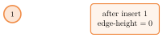{fig-alt="1만 있는 트리, after insert 1, edge-height=0이라는 콜아웃이 붙은 1단계" width="50%"}
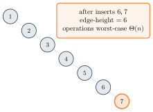{fig-alt="1부터 7까지 오른쪽으로 계속 이어진 사슬 모양 트리, edge-height=6, worst-case Θ(n)이라는 콜아웃이 붙은 마지막 상태" width="50%"}

같은 key set `{1,...,7}`이라도 삽입 순서 `4,2,6,1,3,5,7`이면 height 2, 연산 $\Theta(\log n)$이 된다 — **plain BST는 input order에 따라 shape가 바뀌며 balance를 보장하지 않는다.**

::: {.callout-warning title="Balanced Search Tree의 목표"}
모든 INSERT/DELETE 뒤 height를 $O(\log n)$으로 유지한다. AVL은 height difference를 엄격히 제한하고, RB Tree는 color invariant로 더 느슨하게 제한한다 — 둘 다 같은 left/right rotation으로 inorder order를 보존한다. **공통 primitive, 다른 repair policy**: rotation의 pointer 변환은 같지만, 언제 rotation을 실행하고 어떤 invariant(height/BF 또는 color/black-height)를 복구하는가가 다르다.
:::

::: {.callout-caution collapse="true" title="확인 문제"}
random insertion의 평균적 모양이 괜찮을 수 있어도 왜 balanced tree가 필요한가? **답**: 확률적·입력 의존 직관은 worst-case guarantee가 아니다. adversarial 또는 정렬 입력에도 $O(\log n)$ height가 필요하다.
:::

## Part I. AVL Tree

::: {.callout-note title="정의: AVL Invariant"}
$$BF(x)=h(x.left)-h(x.right),\qquad |BF(x)|\le1$$

$BF=+2$는 left-heavy, $BF=-2$는 right-heavy를 뜻한다(empty height $=-1$, leaf height $=0$).
:::

::: {.callout-warning title="흔한 실수: BF 부호 convention"}
이 장은 원본의 right-left 대신 **$BF=h(left)-h(right)$**(left-right)를 쓴다. 모든 case와 코드가 이 부호를 따른다.
:::

height를 매번 subtree 순회로 계산하면 update 하나가 비싸지므로, **height를 node에 저장**하고 rotation 뒤 영향을 받은 node의 height를 아래에서 위 순서로 재계산한다.

$$h(x)=1+\max(h(x.left),h(x.right))$$

**Right Rotation**은 inorder를 보존한다.

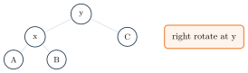{fig-alt="y를 루트로 왼쪽에 x(자식 A,B), 오른쪽에 C가 있는 트리" width="35%"}
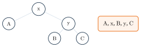{fig-alt="x를 루트로 왼쪽에 A, 오른쪽에 y(자식 B,C)가 있는 트리" width="35%"}

$$\text{inorder before}=\text{inorder after}=A,x,B,y,C$$



Left rotation은 모든 left/right를 바꾼 symmetric operation이다.

**네 case**(모두 $BF(z)$와 자식 방향으로 판별):

| $BF(z)$ | child 방향 | case | rotation |
|---|---|---|---|
| $+2$ | left-left | LL | right$(z)$ |
| $-2$ | right-right | RR | left$(z)$ |
| $+2$ | left-right | LR | left(child), right$(z)$ |
| $-2$ | right-left | RL | right(child), left$(z)$ |

**LL case**: left-heavy $z=30$, left-left → `RIGHT-ROTATE`$(30)$.

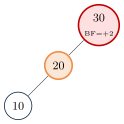{fig-alt="30이 위반 표시, 자식 20(강조), 20의 자식 10인 트리" width="30%"}
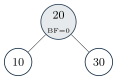{fig-alt="20을 루트로 10,30이 자식인 균형 잡힌 트리" width="30%"}

**RR case**: right-heavy $z=10$, right-right → `LEFT-ROTATE`$(10)$.

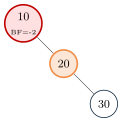{fig-alt="10이 위반 표시, 자식 20(강조), 20의 자식 30인 트리" width="30%"}
{fig-alt="20을 루트로 10,30이 자식인 균형 잡힌 트리" width="30%"}

두 경우 모두 before/after inorder $=10,20,30$이고, 교정 후 $h(10)=h(30)=0$, $h(20)=1$, 모든 $BF=0$이다.

**LR case**(double rotation): `LEFT-ROTATE`$(10)$ 후 `RIGHT-ROTATE`$(30)$.

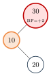{fig-alt="30이 위반, 자식 10(강조), 10의 자식 20인 트리" width="30%"}
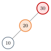{fig-alt="30 아래 20(강조), 20의 자식 10으로 바뀐 중간 상태" width="30%"}
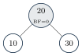{fig-alt="20을 루트로 10,30이 자식인 균형 잡힌 트리" width="30%"}

**RL case**(double rotation): `RIGHT-ROTATE`$(30)$ 후 `LEFT-ROTATE`$(10)$.

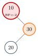{fig-alt="10이 위반, 자식 30(강조), 30의 자식 20인 트리" width="30%"}
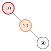{fig-alt="10 아래 20(강조), 20의 자식 30으로 바뀐 중간 상태" width="30%"}
{fig-alt="20을 루트로 10,30이 자식인 균형 잡힌 트리" width="30%"}

두 double rotation 모두 before/after inorder $=10,20,30$이고, 교정 후 $h(10)=h(30)=0$, $h(20)=1$, 모든 $BF=0$이다.

**AVL INSERT workflow**: (1) ordinary BST insertion, (2) path를 거슬러 height update, (3) 첫 unbalanced ancestor $z$ 탐색, (4) key 방향으로 LL/RR/LR/RL 판별, (5) $O(1)$ rotation, (6) 새 subtree root를 parent에 연결. search path $O(\log n)$ + height update $O(\log n)$ + rotation $O(1)$(1~2회)로 **total $O(\log n)$**이다.

::: {.callout-warning title="AVL DELETE는 왜 더 까다로운가?"}
ordinary BST delete 후 upward height update를 하는 것은 같지만, subtree height 감소가 여러 ancestor의 balance를 바꿀 수 있어 삽입과 달리 **여러 ancestor에서 rotation이 필요할 수 있다**(그래도 total은 $O(\log n)$).
:::

::: {.callout-caution collapse="true" title="확인 문제: AVL Checkpoint"}
1. $BF=left-right$에서 $BF=-2$는 어느 쪽 heavy인가?
2. 30,10,20 삽입은 무슨 case인가?
3. rotation 전후 반드시 같은 traversal은?

**답**: 1. right-heavy. 2. LR. 3. inorder.
:::

**구현**: 세 언어 모두 위 LL/RR/LR/RL 네 예제(각각 3-key 삽입 순서)와 15-key 순차 삽입(정렬 입력이어도 height가 $O(\log n)$으로 유지되는지 확인)을 쓴다.

::: {.panel-tabset}
## Python
```{.python}

```
## Java
```{.java}

```
## C
```{.c}

```
:::

**실행 결과** (실제 컴파일·실행 캡처 — `gcc -Wall`, `javac`/`java`, `python3`): 15개를 순차 삽입해도 height가 3에 머문다(plain BST라면 14가 됐을 값).

::: {.panel-tabset}
## Python
```{.default}

```
## Java
```{.default}

```
## C
```{.default}

```
:::

## Part J. Red-Black Tree

::: {.callout-note title="정의: Red-Black Tree의 다섯 Invariant"}
1. 모든 node는 red 또는 black이다.
2. root는 black이다.
3. 모든 NIL leaf는 black이다.
4. red node의 두 child는 black이다(red-red 금지).
5. 한 node에서 descendant NIL까지 모든 path의 black node 수가 같다.
:::

**NIL은 data leaf가 아니다** — ordinary leaf는 key를 가진 internal node이고, NIL은 모든 missing child를 나타내는 black sentinel이다. 구현은 shared sentinel 하나를 쓸 수 있다.

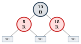{fig-alt="10B를 루트로 5R,15R이 자식이고 각각 NIL 사각형 두 개를 가리키는 트리" width="45%"}

$$bh(x)=x\text{를 제외하고 descendant NIL까지 만나는 black node 수}$$

NIL은 black count에 포함되고, invariant 5 때문에 어느 descendant NIL path를 골라도 같다.

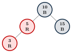{fig-alt="10B 아래 5R, 5R 아래 3R로 두 red가 연속된 위반 트리" width="35%"}

::: {.callout-tip title="RB Path는 Black Path의 두 배를 넘지 않는다"}
red node 다음에는 반드시 black node가 오므로(invariant 4), 한 root-to-NIL path에서 red node 수는 black node 수보다 많을 수 없다. 가장 긴 path가 red와 black을 번갈아 써도 $h\le 2\,bh(root)$다.

**Black-height가 node 수를 강제한다**: $N(b)$를 black-height $b$인 subtree의 최소 internal node 수라 하면 $N(0)=0$, $N(b)\ge1+2N(b-1)$이고 귀납적으로 $N(b)\ge2^b-1$이다. 따라서

$$n\ge2^{bh(root)}-1\ \Rightarrow\ bh(root)\le\log_2(n+1)\ \Rightarrow\ h\le2\log_2(n+1).$$
:::

::: {.callout-warning title="왜 새 node를 Red로 삽입하는가?"}
black으로 삽입하면 새 path의 black count가 즉시 1 증가해 invariant 5를 곧바로 깬다. red로 삽입하면 black-height는 유지되고, parent도 red일 때만 red-red violation이 생긴다 — **고쳐야 할 invariant를 하나로 제한**한다. 마지막에는 root를 black으로 만든다.
:::

RB INSERT 용어: $z$(current), $p$(parent), $g$(grandparent), $u$(uncle)다. 모든 child와 root parent는 black NIL sentinel을 가리켜 parent/uncle 접근을 일관되게 한다.

**Case 1(uncle이 red)**: $p,u\to$ black, $g\to$ red, $z\gets g$로 옮긴다 — violation이 위로 이동할 수 있다.

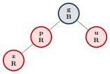{fig-alt="g가 B, p가 R이고 그 자식 z가 R, 형제 u도 R인 트리" width="35%"}
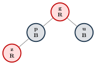{fig-alt="g가 R로, p와 u가 B로 바뀐 트리" width="35%"}

**Case 2(inner) → Case 3(outer)**: $z$가 inner child면 parent를 rotation해 outer shape로 바꾸고(case 2), $p$를 black·$g$를 red로 recolor한 뒤 $g$를 rotation한다(case 3). parent가 grandparent의 right child인 경우 left/right를 모두 바꾼 mirror다.

**RB Insert 41, 38, 31**: uncle black, outer case로 곧바로 처리된다.

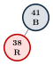{fig-alt="41B 아래 38R 하나만 있는 트리" width="25%"}
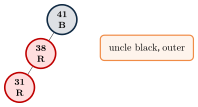{fig-alt="41B 아래 38R, 38의 자식 31R인 트리, uncle black outer라는 콜아웃" width="30%"}
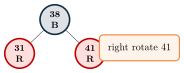{fig-alt="38B를 루트로 31R,41R이 자식인 트리, right rotate 41이라는 콜아웃" width="30%"}

**RB Insert 12(recolor)**: uncle red이므로 recolor만 한다.

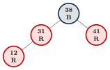{fig-alt="38B 아래 31R(자식 12R), 41R인 트리" width="35%"}
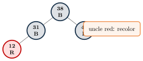{fig-alt="38B 아래 31B(자식 12R), 41B로 바뀐 트리, uncle red recolor라는 콜아웃" width="35%"}

**RB Insert 19(inner → outer)**: 12의 right child로 19가 들어가 inner case가 되어 left rotate 12(case 2) 후 right rotate 31(case 3)로 마무리한다.

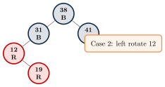{fig-alt="38B 아래 31B(자식 12R, 12의 자식 19R), 41B인 트리, Case 2 left rotate 12라는 콜아웃" width="45%"}
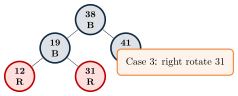{fig-alt="38B 아래 19B(자식 12R,31R), 41B인 트리, Case 3 right rotate 31이라는 콜아웃" width="45%"}

**RB Insert 8과 최종 검증**: 8 삽입이 12/31에서 uncle-red recolor를 한 번 더 일으킨 뒤, root는 black이고 red-red가 없으며 모든 path의 black-height가 같다.

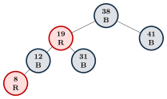{fig-alt="38B를 루트로 19R(자식 12B(자식 8R), 31B), 41B인 최종 트리" width="55%"}

::: {.callout-tip title="RB INSERT Fixup 요약"}
공통: $p=z.parent$, $g=p.parent$, $u=$ uncle. $u$가 red이면 $p,u$를 black, $g$를 red로 하고 $z\gets g$.

| branch($p=g.left$) | branch($p=g.right$, mirror) |
|---|---|
| inner: $z=p.right$ → `LEFT-ROTATE`$(p)$ | inner: $z=p.left$ → `RIGHT-ROTATE`$(p)$ |
| outer: $p$ black, $g$ red → `RIGHT-ROTATE`$(g)$ | outer: $p$ black, $g$ red → `LEFT-ROTATE`$(g)$ |

반복이 끝나면 root를 black으로 만든다.
:::

::: {.callout-warning title="RB DELETE 범위"}
RB Tree가 delete를 지원하지만, 이 장의 본문 추적 목표는 **insertion fixup**이다. sibling color와 near/far nephew에 따라 case가 더 많아지며, 상세 fixup 로직은 실제 구현 코드(아래 panel-tabset)와 Appendix 수준에서만 다룬다.
:::

**구현**: RB Tree는 이 장에서 **전용 pseudocode 블록이 없다**(insertion/deletion을 prose와 그림으로만 설명) — 대신 코드가 위에서 다룬 z/p/g/u fixup 로직을 그대로 구현한다. 세 언어 모두 `41,38,31,12,19,8` 삽입 예제를 쓴다.

::: {.panel-tabset}
## Python
```{.python}

```
## Java
```{.java}

```
## C
```{.c}

```
:::

**실행 결과** (실제 컴파일·실행 캡처 — `gcc -Wall`, `javac`/`java`, `python3`): root가 38(B)로 위 최종 tree와 일치한다.

::: {.panel-tabset}
## Python
```{.default}

```
## Java
```{.default}

```
## C
```{.default}

```
:::

## Part K. B-Tree

storage(disk·SSD·database)는 block/page 단위로 접근하고, I/O가 CPU comparison보다 훨씬 비싸다. B-Tree는 한 page에 많은 key/child를 저장해 fan-out을 키우고 height와 page access를 줄인다. 예를 들어 4 KB page에서 metadata 32B, key/child pointer 각 8B라면 $32+8k+8(k+1)\le4096$에서 약 253 key·254 child가 들어가고, 절반 occupancy에서도 fan-out 약 127로 몇 level만에 수백만 key 영역을 가를 수 있다.

::: {.callout-note title="정의: Minimum Degree $t$"}
B-Tree의 minimum degree가 $t\ge2$일 때, node당 최대 $2t-1$ key·internal node당 최대 $2t$ child, root 제외 node는 최소 $t-1$ key, non-root internal node는 최소 $t$ child, nonempty root는 최소 1 key이고 **모든 leaf는 같은 depth**다. 이 장은 눈으로 확인하기 쉬운 $t=2$(2-3-4 tree, node당 1–3 key)를 예제로 쓴다.
:::

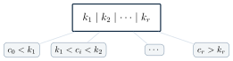{fig-alt="k1,k2,...,kr 키를 가진 노드 아래 c0,c1,...,cr 자식 범위가 표시된 다이어그램" width="55%"}



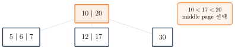{fig-alt="10|20 노드가 강조되고 10&lt;17&lt;20 middle page 선택이라는 콜아웃이 붙은 1단계, 자식 5|6|7, 12|17, 30 표시" width="60%"}
{fig-alt="12|17 노드가 강조되고 page 안에서 17 발견, 2 page accesses라는 콜아웃이 붙은 마지막 상태" width="60%"}

**Cost**: fixed minimum degree $t$와 occupancy invariant 아래 worst-case height와 page access는 $\Theta(\log_t n)$이다(root cache 제외). node 내부는 linear scan 또는 binary search가 가능하고, 큰 $t$는 height를 줄이지만 page 내부 comparison은 늘 수 있다.

B-Tree의 삽입은 **세 procedure가 함께 구성하는 하나의 흐름**이다: `BTreeInsert`가 진입점으로서 root가 가득 찼는지만 확인하고(가득 찼으면 새 root를 만들어 그 밑에서 미리 한 번 분할한다), 실제 삽입은 `InsertNonFull`에 위임한다. `InsertNonFull`은 현재 node가 가득 차 있지 않다고 보장된 상태에서 시작해 적절한 leaf까지 재귀로 내려가며 key를 끼워 넣는데, 내려갈 child가 가득 차 있으면 그 전에 `SplitChild`를 불러 먼저 분할한다. `SplitChild` 자체는 형식적 의사코드 없이 아래 원리로만 설명한다 — full child $y=[a\mid m\mid b]$를 내려가기 전에 median $m$을 parent로 promotion하고, left half는 $y$에 남기고 right half는 새 node $z$로 분리한다(leaf가 아니면 child pointer도 함께 분할).



::: {.callout-tip title="Split-Before-Descend"}
`InsertNonFull`이 내려갈 child가 full이면 `SplitChild`로 먼저 split하므로, leaf에 도착했을 때는 항상 삽입할 여유가 있다 — **"먼저 분할하고 나서 내려간다"**는 순서 자체가 이 알고리즘의 핵심이다.
:::

**Insert 10, 20, 5, 6**: 세 번째 삽입에서 root가 가득 차(5,10,20) split이 일어난다.

![10 삽입 후 20 삽입: root가 [10,20]인 상태.](../figures/06-search-trees/49-btree-insert-step1.svg){fig-alt="10 하나만 있는 노드" width="20%"}
{fig-alt="10,20 두 키가 있는 노드" width="20%"}
![5 삽입 후 root가 [5,10,20]로 가득 참(root full).](../figures/06-search-trees/51-btree-insert-step3.svg){fig-alt="5,10,20 세 키로 가득 찬 노드, root full이라는 콜아웃" width="25%"}
![10 promotion 후 6 삽입: 10이 새 root, [5,6]과 [20]이 두 child.](../figures/06-search-trees/52-btree-insert-step4.svg){fig-alt="10을 루트로 5,6과 20 두 child로 분리된 트리, 10 promotion 후 6 삽입이라는 콜아웃" width="35%"}

**Insert 12, 30, 7, 17**: split-before-descend로 20이 promotion되어 root가 [10,20]이 된다.

![12,30,7 삽입 후 root(10) 아래 [5,6,7]과 [12,20,30](곧 full).](../figures/06-search-trees/53-btree-insert2-step1.svg){fig-alt="10을 루트로 5,6,7과 12,20,30 두 child가 있는 삽입 전 상태" width="40%"}
![split-before-descend로 20 up, 17 삽입 후: root [10,20], child [5,6,7]/[12,17]/[30].](../figures/06-search-trees/54-btree-insert2-step2.svg){fig-alt="10,20을 루트로 5,6,7 / 12,17 / 30 세 child로 나뉜 트리, split before descent 20 up then insert 17이라는 콜아웃" width="55%"}

{fig-alt="10,20을 루트로 5,6,7 / 12,17 / 30 세 child가 있는 최종 트리" width="55%"}

**DELETE**는 key가 leaf에 있으면 직접 삭제하고, internal node에 있으면 left child($\ge t$ key)에서 predecessor, right child($\ge t$ key)에서 successor를 빌려오거나 둘 다 $t-1$이면 separator와 merge 후 재귀한다. key가 현재 node에 없으면 내려갈 child가 $t-1$일 때 먼저 borrow 또는 merge한다.

::: {.callout-warning title="이 강의의 범위"}
전체 deletion pseudocode와 모든 경계 case를 구현하지 않는다. 핵심은 descent 전에 occupancy를 확보하는 **borrow/redistribution**과 **merge**이며, insertion보다 pointer·separator 갱신이 훨씬 복잡하다.
:::

![Borrow from right sibling 전: [5]가 $t-1$ key.](../figures/06-search-trees/56-btree-borrow-before.svg){fig-alt="10,20을 루트로 5, 12|15, 30 세 child가 있고 5가 t-1 keys라는 콜아웃이 붙은 상태" width="55%"}
![Borrow 후: parent key 10이 내려가고 sibling의 최솟값 12가 올라와 [5,10]과 [15]가 된다.](../figures/06-search-trees/57-btree-borrow-after.svg){fig-alt="12,20을 루트로 5,10 / 15 / 30 세 child로 바뀐 상태, after borrowing이라는 콜아웃" width="55%"}

parent key 10이 내려가고 right sibling의 가장 작은 key 12가 올라온다(separator movement).

{fig-alt="10을 루트로 5, 15 두 child가 있고 둘 다 t-1 keys라는 콜아웃이 붙은 상태" width="35%"}
{fig-alt="5,10,15 세 키를 가진 단일 노드로 병합된 상태, merge 후 old root는 empty, 유일한 child가 new root라는 콜아웃" width="35%"}

::: {.callout-tip title="Merge 뒤 Root Shrink"}
merge 뒤 root가 key 0개이고 child 1개면 그 child가 새 root다.
:::

::: {.callout-caution collapse="true" title="확인 문제: B-Tree Checkpoint"}
1. $t=3$인 non-root node의 key 수 범위는?
2. search I/O가 무엇에 비례하는가?
3. borrow에서 parent separator는 어떻게 움직이는가?
4. merge 후 root가 비면?

**답**: 1. 2–5. 2. worst-case $\Theta(\log_t n)$ page I/O. 3. parent key는 child로 내려가고 sibling key는 올라온다. 4. 유일한 child가 새 root가 된다.
:::

**구현**: 세 언어 모두 $t=2$, `10,20,5,6,12,30,7,17` 삽입 예제를 쓴다.

::: {.panel-tabset}
## Python
```{.python}

```
## Java
```{.java}

```
## C
```{.c}

```
:::

**실행 결과** (실제 컴파일·실행 캡처 — `gcc -Wall`, `javac`/`java`, `python3`): root `[10,20]`, child `[5,6,7]/[12,17]/[30]`이 위 "최종 B-Tree invariant 확인" 그림과 일치한다.

::: {.panel-tabset}
## Python
```{.default}

```
## Java
```{.default}

```
## C
```{.default}

```
:::

## Part L. 비교와 선택

| Structure | Height | SEARCH/INSERT/DELETE | Cost model · guarantee |
|---|---|---|---|
| plain BST | worst $\Theta(n)$ | $\Theta(h)$ | CPU · balance 없음 |
| AVL | $\Theta(\log n)$ | $\Theta(\log n)$ | CPU · strict BF |
| RB Tree | $\Theta(\log n)$ | $\Theta(\log n)$ | CPU · color invariant |
| B-Tree | $\Theta(\log_t n)$ | worst $\Theta(\log_t n)$ page I/O | page · fixed $t$, occupancy |

::: {.callout-warning title="흔한 실수: CPU와 page I/O를 같은 숫자로 해석하지 않는다"}
B-Tree bound는 고정 minimum degree와 occupancy invariant를 전제로 한다.
:::

| 관점 | AVL | RB Tree |
|---|---|---|
| balance | 더 엄격 | 더 느슨 |
| height/search | 보통 더 짧은 path | $h\le2\log_2(n+1)$ |
| insert rotation | 최대 double rotation | 상수 회전 + recolor |
| delete | 여러 ancestor 가능 | 여러 fixup case |
| 적합 | search-heavy | update-heavy ordered map |

| Structure | 대표 application | 선택 이유 |
|---|---|---|
| plain BST | 교육용·작은 ordered set | 단순하지만 worst-case balance 없음 |
| AVL | read-heavy in-memory dictionary | 더 엄격한 height |
| RB Tree | update-heavy ordered map | 회전과 recolor의 균형 |
| B-Tree/B+Tree | database·filesystem index | page I/O와 range scan |
| Hash table | compiler symbol table의 equality lookup | expected $\Theta(1)$, order 없음 |

AVL/RB는 pointer와 CPU/cache locality가, B-Tree는 page와 I/O 수가 핵심 cost model이다. Hash는 min/max/successor와 ordered iteration이 어렵다.

**Selection 전략**: (1) 한 rank만 필요한가, 이후 전체 정렬도 필요한가? (2) expected time이면 충분한가, worst-case 보장이 필요한가? (3) 입력이 adversarial할 수 있는가? (4) update가 빈번한가?

::: {.callout-caution collapse="true" title="확인 문제: 구조 선택 Checkpoint"}
1. memory-resident search-heavy dictionary?
2. update-heavy ordered map?
3. database page index?
4. adversarial input 가능 plain BST?

**답**: 1. AVL. 2. RB Tree. 3. B-Tree. 4. balance guarantee가 없으므로 피하거나 self-balancing tree를 쓴다.
:::

## 개념 지도

{fig-alt="Search Trees를 중심으로 BST, Balanced(AVL/RB), B-Tree 세 갈래로 나뉘고 각각 order traversal, rotation invariant, split borrow/merge로 이어지는 개념 지도" width="70%"}

## 💡 배움 포인트

- Tree는 root-to-node unique path로 후보를 줄이는 구조다 — depth 0/height -1의 edge-height convention을 이 장 전체에서 일관되게 쓴다.
- Full·Perfect·Complete는 서로 다른 조건이다 — full이라고 모든 leaf가 같은 depth인 것은 아니다.
- BST의 SEARCH·INSERT·DELETE는 모두 $\Theta(h)$이지만, plain BST는 입력 순서에 따라 $h$가 $\Theta(n)$까지 나빠질 수 있다 — 정렬된 입력을 순서대로 삽입하면 사실상 linked list가 된다.
- AVL은 $BF=h(left)-h(right)$를 $\pm1$로 엄격히 제한해 LL/RR/LR/RL 네 case의 rotation으로 $O(\log n)$ height를 보장한다.
- Red-Black Tree는 다섯 색 invariant로 더 느슨하게 균형을 유지하면서 $h\le2\log_2(n+1)$을 보장한다 — 같은 rotation을 쓰지만 언제·왜 실행하는지가 AVL과 다르다.
- B-Tree는 CPU comparison이 아니라 page I/O를 최소화하도록 설계된 구조다 — fan-out을 키워 height와 disk access 수를 줄인다.

## 🧪 직접 해보기

::: {.callout-caution collapse="true" title="Tree Basics Quiz"}
1. 9-node tree의 edge 수는?
2. root depth와 leaf height convention은?
3. full/perfect/complete 차이는?
4. edge-height 3 perfect tree의 node 수는?

**정답**

1. edge 8개.
2. root depth 0, leaf height 0.
3. full은 child 0/2, perfect는 모든 leaf가 같은 depth, complete는 마지막 level만 왼쪽부터 부분적으로 채움.
4. $2^{4}-1=15$.
:::

::: {.callout-caution collapse="true" title="Traversal Quiz"}
fixed tree A(B(D,E),C(F,G))에 대해

1. preorder, inorder, postorder, level-order는?
2. DFS stack과 BFS queue space는?
3. expression tree의 정확한 infix에 괄호가 필요한 이유는?

**정답**

1. preorder A B D E C F G, inorder D B E A F C G, postorder D E B F G C A, level-order A B C D E F G.
2. DFS $O(h)$, BFS $O(w)$.
3. 괄호 없는 inorder는 operator precedence·grouping을 보존하지 못하므로 각 operator subtree를 괄호로 감싸야 한다.
:::

::: {.callout-caution collapse="true" title="BST Quiz"}
1. search(13)의 path는?
2. successor(15), predecessor(15)는?
3. INSERT의 $x/y$ 역할은?
4. INSERT 12의 마지막 non-NIL parent는?
5. 왜 고정 BST에서 key 14를 successful insertion 예제로 쓸 수 없는가?
6. DELETE case 3에서 successor의 left가 NIL인 이유는?

**정답**

1. $15\to6\to7\to13$.
2. successor(15)=17, predecessor(15)=14.
3. $x$는 search cursor, $y$는 마지막 non-NIL parent 후보다.
4. 9.
5. 14는 이미 존재하며 distinct-key 정책이 duplicate를 거부하므로 successful insertion 예제가 될 수 없다.
6. successor는 right subtree의 minimum이므로 정의상 left child를 가질 수 없다.
:::

::: {.callout-caution collapse="true" title="AVL·RB Quiz"}
1. $BF=left-right$에서 sequence 30,10,20은 어떤 case인가?
2. rotation이 보존하는 key order는?
3. RB insert에서 uncle red이면?
4. $n$ internal node인 RB height bound는?

**정답**

1. LR.
2. inorder(rotation 전후 동일).
3. $p,u$를 black, $g$를 red로 하고 $z\gets g$로 위로 이동한다.
4. $h\le2\log_2(n+1)$.
:::

::: {.callout-caution collapse="true" title="B-Tree Quiz"}
1. $t=2$ node의 최대 key 수는?
2. split에서 어느 key가 promotion되는가?
3. minimum child로 내려가기 전 가능한 두 repair는?
4. large fan-out이 중요한 이유는?

**정답**

1. 3개($2t-1$).
2. median key.
3. borrow(sibling에서 빌려오기) 또는 merge.
4. page I/O가 CPU comparison보다 훨씬 비싸므로, height를 줄여 page access 수를 최소화하기 위해서다.
:::

## 요약

Tree는 root-to-node unique path 구조이며, root depth 0·leaf height 0·empty tree height -1의 edge-height convention을 이 장 전체에서 쓴다. Binary tree는 full·perfect·complete로 구분되고, 네 traversal(preorder/inorder/postorder/level-order)은 모두 $\Theta(n)$ 시간에 각각 $O(h)$(재귀 stack) 또는 $O(w)$(queue) 공간을 쓴다. BST는 SEARCH·INSERT·DELETE를 모두 $\Theta(h)$에 지원하지만, plain BST는 입력 순서에 따라 $h$가 $\Theta(n)$까지 나빠질 수 있다는 것이 이 장의 핵심 동기다. AVL은 balance factor를 $\pm1$로 엄격히 제한해 LL/RR/LR/RL rotation으로, Red-Black Tree는 다섯 색 invariant로 더 느슨하게 균형을 유지해 각각 $O(\log n)$ height를 보장한다 — 둘 다 같은 rotation을 공유하지만 복구 시점과 대상 invariant가 다르다. B-Tree는 CPU가 아니라 page I/O를 최소화하도록 설계되어, minimum degree $t$ 아래 split·promotion(삽입)과 borrow·merge(삭제)로 모든 leaf가 같은 depth인 balanced multiway tree를 유지한다. 실제 선택은 메모리 상주 여부, read/update 비율, adversarial 입력 가능성, page I/O 여부에 따라 달라진다.
