## 🎯 학습목표

- key, hash code, bucket index, compression을 구분하고 hash table의 강점과 한계(순서 없음, worst case)를 조건과 함께 말한다.
- division·multiplication·polynomial(Horner) hash를 계산하고, collision이 필연적인 이유(pigeonhole)를 설명한다.
- separate chaining과 세 open-addressing probe(선형/제곱/이중 해시)를 손으로 추적하고 EMPTY·DELETED·probing load를 구분한다.
- expected·amortized·worst-case 비용을 조건과 함께 구분하고, resize가 단순 복사가 아닌 이유를 설명한다.
- Java/C 구현의 equality·mutable-key 위험·resize invariant를 검증하고, workload에 따라 검색 트리와 hash table을 선택한다.

## Part A. 왜 Hash Table인가?

::: {.callout-tip title="Mission"}
key의 순서는 필요 없고 exact-match search만 매우 빠르게 하고 싶다면?
:::

| key $\to$ value | 알고리즘 속 dictionary |
|---|---|
| username $\to$ profile | compiler symbol table |
| URL $\to$ cached response | memoization cache |
| student ID $\to$ record | frequency counter |

::: {.callout-tip title="다리: 검색 트리 장의 dynamic set 비교"}
검색 트리 장에서 구조를 비교하며 hash table 행을 "추후"로 남겨두었다. 이제 그 행을 채운다.

| 구조 | Equality search | Ordered ops | Worst guarantee | 주 cost model |
|---|---|---|---|---|
| unsorted list | $\Theta(n)$ | 약함 | $\Theta(n)$ | CPU |
| sorted array | $\Theta(\log n)$ | 좋음 | search $\Theta(\log n)$ | CPU |
| AVL/RB Tree | $\Theta(\log n)$ | 좋음 | $\Theta(\log n)$ | CPU |
| B-Tree | $\Theta(\log_t n)$ | 좋음 | $\Theta(\log_t n)$ page I/O | page |
| **hash table** | **expected $\Theta(1)$** | **기본 없음** | **$\Theta(n)$** | **CPU/memory** |

B-Tree는 page/block I/O를 줄인다. in-memory tree의 comparison 상수와 같은 cost model로 비교하지 않는다.
:::

::: {.callout-note title="Hash Table의 강점과 제약"}
**강점**: equality search에 적합하다. resize가 없으면 suitable hashing과 controlled load 아래 SEARCH/PUT/DELETE는 expected $\Theta(1)$이다. resize 포함 PUT은 amortized expected $\Theta(1)$이다. 단순한 Map API와 좋은 locality가 가능하다.

**제약**: natural order, range, MIN/MAX가 없다. worst case는 $\Theta(n)$이다. hash quality와 load factor에 민감하다. iteration order를 보장하지 않을 수 있다.
:::

::: {.callout-caution collapse="true" title="확인 문제: Hashing Fundamentals Checkpoint"}
1. leaderboard의 sorted iteration에는 hash table만으로 충분한가?
2. username exact lookup에는 왜 좋은 후보인가?
3. "hash operation은 $\Theta(1)$이다"에서 빠진 조건은?

**답**: 

1. 아니다, order가 필요하다. 
2. equality lookup에 적합하다. 
3. resize가 없으면 suitable hashing/controlled load 아래 expected $\Theta(1)$, resize 포함 PUT은 amortized expected $\Theta(1)$이며 individual resizing PUT과 worst case는 $\Theta(n)$일 수 있다.
:::

## Part B. Hashing의 기본 모델

$$U=\text{key universe},\qquad K\subseteq U,\qquad |T|=m,\qquad h:U\longrightarrow\{0,1,\ldots,m-1\}$$

$U$는 가능한 모든 key, $K$는 현재 저장된 key다. slot/bucket index는 $0$부터 $m-1$이고, table에는 key만이 아니라 보통 key–value entry가 저장된다.

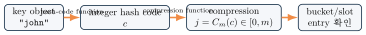{fig-alt="key object에서 integer hash code로, compression 함수로 bucket index로, 마지막으로 entry 확인으로 이어지는 4단계 파이프라인 다이어그램" width="80%"}

Hash-code 계산과 compression은 서로 다른 단계다. 같은 hash code라도 capacity가 바뀌면 bucket index가 달라질 수 있다.

작고 dense한 universe라면 key 자체를 index로 쓰는 **direct addressing**으로 SEARCH/INSERT/DELETE를 $\Theta(1)$에 할 수 있다. 하지만 $U=0\ldots999999$인데 저장 key가 20개뿐이면 거의 모든 공간을 낭비한다 — hashing은 이런 큰 sparse universe를 작은 $m$으로 compress한다.

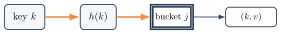{fig-alt="key, h(k), bucket, entry 네 상자가 화살표로 이어진 다이어그램" width="60%"}

::: {.callout-warning title="표현 교정"}
"원소 값이 저장 자리를 결정한다"보다 "key에서 계산한 hash value가 **후보** bucket을 결정하고, collision 정책이 **실제** 위치를 결정한다"가 정확하다.
:::

Map API의 의미는 다음과 같다: `put(k,v)`는 key가 없으면 insert, 있으면 value update, `get(k)`는 equal key의 value 또는 NOT_FOUND, `remove(k)`는 entry 제거와 size 감소다. **같은 logical key의 재삽입은 collision entry 추가가 아니라 update다** — 서로 다른 key가 같은 index를 얻는 것이 collision이다.

::: {.callout-caution collapse="true" title="확인 문제: Hashing Model Checkpoint"}
1. capacity가 16일 때 유효 index 범위는?
2. equal key의 hash code가 같아야 하는 이유는?
3. resize가 단순 memory copy가 아닌 이유는?

**답**: 

1. $0\ldots15$. 
2. 같은 lookup path를 만들어야 한다. 
3. index가 capacity에 의존해 모든 active entry를 재배치해야 한다.
:::

## Part C. Hash Function 설계

좋은 hash function의 조건은 다섯 가지다: (1) deterministic — 같은 key는 같은 hash value, (2) fast to compute, (3) stored key를 table 전체에 가능한 한 균등하게 분산, (4) key의 모든 관련 bit/character를 사용하고 pattern을 섞는 mixing, (5) equal key는 반드시 equal hash를 가져야 한다.

::: {.callout-tip title="목표는 collision 제거가 아니다"}
목표는 collision **제거**가 아니라 빈도와 집중을 줄이는 것이다. 유한 table에서는 collision이 필연적이며 resolution policy가 반드시 필요하다.
:::

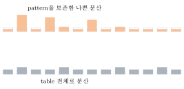{fig-alt="위쪽은 몇몇 막대가 유독 높은 나쁜 분산, 아래쪽은 막대 높이가 고른 좋은 분산을 보여주는 두 막대그래프" width="65%"}

일반 hash table hash와 cryptographic hash는 목적이 다르다 — 전자는 속도·분산·equality lookup을 우선하고, 후자는 preimage/collision resistance 같은 보안 성질을 우선한다.

::: {.callout-warning title="흔한 실수: cryptographic hash가 항상 필요하다는 오해"}
SHA-256을 모든 일반 hash table에 반드시 사용할 필요는 없다. workload와 threat model이 다르다 — 다만 이 장 뒤쪽(Part K)에서 다루는 hash flooding처럼 신뢰할 수 없는 입력을 다룰 때는 보안 관점이 다시 중요해진다.
:::

분석을 위해 **simple uniform hashing assumption**을 둔다:

$$\Pr[h(k)=j]=\frac1m\qquad (j=0,\ldots,m-1)$$

각 key가 각 bucket에 독립적·균등하게 배정된다고 이상화한 분석 모델이다 — 실제 함수가 완전히 random이라는 주장은 아니다. 이 가정이 성립하고 $\alpha=n/m$을 bounded constant로 유지할 때 expected cost를 분석한다.

| 용어 | 무엇에 대해 평균을 내는가? |
|---|---|
| average-case | 명시한 input distribution |
| expected | randomized hashing/algorithm의 randomness |
| amortized | 어떤 operation sequence 전체의 총비용 |
| worst-case | 허용된 가장 나쁜 input/state |

::: {.callout-tip title="다리: 선택 장의 RandomizedSelect"}
선택 장의 RandomizedSelect처럼 expected는 probability model이 필요하다. 이 장 뒤쪽(Part M)의 resize amortization은 probability 없이 operation sequence의 비용을 합한다 — 같은 "평균"이라는 말이 서로 다른 두 가지를 가리킨다는 점을 혼동하지 않는다.
:::

::: {.callout-caution collapse="true" title="확인 문제: Hash Function Checkpoint"}
1. deterministic과 uniform distribution은 같은 뜻인가?
2. cryptographic collision resistance가 일반 table hash의 필수 조건인가?
3. expected와 amortized를 한 문장으로 구분하라.

**답**: 

1. 아니다. 
2. 아니다. 
3. expected는 randomness에 대한 기댓값, amortized는 연산열 총비용의 평균이다.
:::

## Part D. Integer와 String Hashing

**Division method**: $h(k)=k\bmod m$. 단순하고 빠르지만 $m$과 key pattern의 공약수에 민감하다. modulo 방식에서 prime $m$은 pattern 회피에 유용할 수 있지만 **절대 규칙은 아니다** — 현대 구현은 bit mixing과 power-of-two capacity를 함께 쓰기도 한다. 예: $m=13$일 때 $h(25)=12$, $h(29)=3$.

**Multiplication method**: $h(k)=\left\lfloor m\,\operatorname{frac}(kA)\right\rfloor$, $\operatorname{frac}(x)=x-\lfloor x\rfloor$, $0<A<1$. Knuth의 제안 중 하나는 $A\approx(\sqrt5-1)/2$이지만, 특정 상수가 모든 dataset에 완벽하다는 뜻은 아니다.

Multiplication trace $k=25,\ m=13$: $25A\approx15.451$ → frac $=0.451$ → $13\times0.451\approx5.861$ → $\lfloor5.861\rfloor=5$.

::: {.panel-tabset}
## 1단계

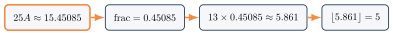{fig-alt="25A≈15.45085 상자가 강조된 상태" width="90%"}

## 2단계

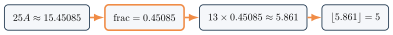{fig-alt="frac=0.45085 상자가 강조된 상태" width="90%"}

## 3단계

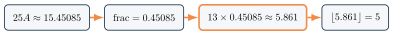{fig-alt="13*0.45085≈5.861 상자가 강조된 상태" width="90%"}

## 4단계

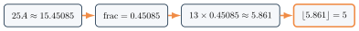{fig-alt="25A, frac, 13*frac, floor 네 단계를 거쳐 최종 index 5에 도달하는 계산 트레이스의 마지막 상태" width="90%"}
:::

문자열 hash로 **ASCII 합**을 쓰면 실패한다: `"abcd"`와 `"dbac"`는 항상 같은 합(394)이라 order를 잃고, 짧은 문자열은 가능한 합의 range가 좁아 collision이 늘어난다. 첫 몇 글자만 쓰는 것도 실패한다.

{fig-alt="Apple과 Apply가 같은 prefix App으로 연결된 다이어그램" width="45%"}

모든 character를 순서와 함께 반영해야 한다. **Polynomial (Horner) string hash**:

$$H(S)=S[0]B^{L-1}+S[1]B^{L-2}+\cdots+S[L-1] = (\cdots((S[0]B+S[1])B+S[2])\cdots)B+S[L-1]$$

모든 character와 순서를 반영하고 $\Theta(L)$ time에 계산한다. 작은 홀수 multiplier(예: 31, 37, 131)는 계산이 빠르고 단순한 bit/pattern 상관을 줄이는 실용적 선택이지만, 특정 multiplier가 모든 dataset에 최적이라는 뜻은 아니다.



Java의 공식 contract에서 equal string은 equal hash code를 가진다. hash code를 실제 table index로 줄이는 단계(compression)는 collection 구현의 별도 책임이다 — Part B의 파이프라인 그림에서 본 두 단계의 분리와 같은 이야기다.

**구현**: 세 언어 모두 ASCII 합과 Horner hash를 나란히 계산해, 합만으로는 "abcd"/"dbac"를 구분하지 못하지만 다항식 hash는 구분함을 보인다. multiplier $B=131$을 쓴다.

::: {.panel-tabset}
## Python
```{.python}

```
## Java
```{.java}

```
## C
```{.c}

```
:::

**실행 결과** (실제 컴파일·실행 캡처 — `gcc -Wall`, `javac`/`java`, `python3`): ASCII 합은 "abcd"/"dbac" 모두 394로 같지만, 다항식 hash는 서로 다르다.

::: {.panel-tabset}
## Python
```{.default}

```
## Java
```{.default}

```
## C
```{.default}

```
:::

::: {.callout-caution collapse="true" title="확인 문제: Integer와 String Hash Checkpoint"}
1. ASCII 합이 anagram을 구분하지 못하는 이유는?
2. Horner 방식의 한 iteration은?
3. multiplication 예제의 index는?

**답**: 

1. 문자 순서를 버리기 때문이다. 
2. `hash = hash*B + code(c)`. 3. 5.
:::

## Part E. Collision은 왜 생기는가?

$m=13$에서 keys $25,13,16,15,7$을 삽입하면 각각 home slot $12,0,3,2,7$을 얻는다.

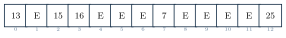{fig-alt="13칸짜리 hash table에서 0,2,3,7,12번 슬롯에 각각 13,15,16,7,25가 채워지고 나머지는 비어있는 다이어그램" width="70%"}

이제 $29$를 삽입하면 $h(29)=29\bmod13=3$인데 slot 3은 이미 $16$이 차지하고 있다 — collision이다.

$29$를 삽입하려는데 $h(29)=3$이 이미 점유되어 있어 collision이 발생하고, 이후 resolution policy가 실제 위치를 정한다.

::: {.panel-tabset}
## 1단계

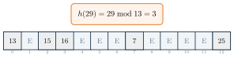{fig-alt="slot 3이 16으로 점유된 상태에서 h(29)=3이라는 콜아웃이 붙은 상태" width="75%"}

## 2단계

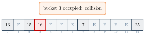{fig-alt="slot 3이 충돌로 표시되고 bucket 3 occupied: collision이라는 콜아웃이 붙은 상태" width="75%"}

## 3단계

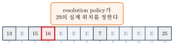{fig-alt="slot 3이 16으로 점유된 상태에서 29를 삽입하려다 충돌이 표시되고 resolution policy가 실제 위치를 정한다는 콜아웃이 붙은 마지막 상태" width="75%"}
:::

$$h(k_1)=h(k_2),\quad k_1\ne k_2.$$

**Pigeonhole principle**: $|U|>m$이면 $h(k_1)=h(k_2)$인 서로 다른 $k_1,k_2$가 반드시 존재한다.

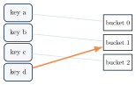{fig-alt="key a,b,c,d가 bucket 0,1,2로 향하는 화살표 중 두 key가 같은 bucket을 가리키는 다이어그램" width="35%"}

::: {.callout-tip title="Collision은 오류가 아니다"}
Collision은 hash table의 오류가 아니라 유한 table로 compress할 때 정상적으로 해결해야 하는 현상이다.
:::

| 개념 | 조건 | 처리 |
|---|---|---|
| collision probability | collision이 생길 가능성 | hash quality/load로 관리 |
| actual collision | $k_1\ne k_2$, same index | chaining/probing |
| duplicate key | $k_1$과 $k_2$가 logically equal | map value update |

같은 hash code가 equality를 의미하지 않는다. equality check는 collision resolution 안에서 반드시 수행한다.

| 방법 | collision 뒤 이동 | 대표 강점 | 대표 위험 |
|---|---|---|---|
| chaining | bucket collection | 높은 load 허용 | pointer/allocation |
| linear | $+1,+2,\ldots$ | locality | primary clustering |
| quadratic | 제곱 offset | run 완화 | coverage/secondary cluster |
| double hash | key별 step | sequence 분산 | step–capacity 조건 |

네 방법 모두 같은 home collision에서 시작하며 equality 검사와 bounded search가 필요하다 — 차이는 collision 뒤의 이동 정책이다.

::: {.callout-note title="확인: \"추가 공간이 전혀 없다\"는 부정확하다"}
"Open addressing은 추가 공간이 전혀 없다"가 부정확한 이유는? linked node는 피하지만 빈 capacity와 EMPTY/DELETED metadata가 필요하기 때문이다.
:::

## Part F. Separate Chaining

$h(k)=k\bmod7$인 table에서 head insertion으로 $10\to17\to24$ 순서로 삽입하면 bucket 3의 chain은 $24\to17\to10$(최근 삽입이 앞)이 된다.

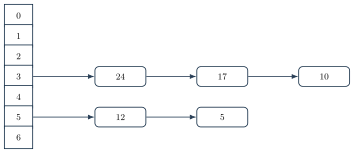{fig-alt="7개 bucket 중 bucket 3에서 24,17,10 순서로 연결된 chain, bucket 5에 12,5가 연결된 chain을 보여주는 다이어그램" width="70%"}



`ChainedPut`은 먼저 `ChainedSearch`로 같은 key가 있는지 확인한 뒤, 있으면 value만 갱신하고 없으면 chain head에 새 entry를 넣는다 — **같은 logical key의 재삽입은 새 collision entry가 아니라 update**라는 Part B의 duplicate policy가 여기서 구체화된다.

10 삽입(빈 bucket) → 17 삽입(collision, head insert) → 24 삽입(collision, head insert)까지 3단계.

::: {.panel-tabset}
## 1단계

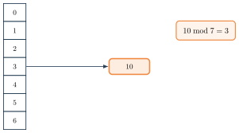{fig-alt="bucket 3에 10 하나만 연결된 상태" width="70%"}

## 2단계

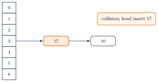{fig-alt="bucket 3에 17,10 순서로 연결되고 collision; head insert 17이라는 콜아웃이 붙은 상태" width="70%"}

## 3단계

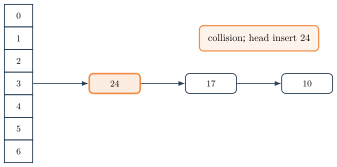{fig-alt="bucket 3에 24,17,10 순서로 연결된 최종 상태와 collision; head insert 24라는 콜아웃이 붙은 상태" width="70%"}
:::

SEARCH 17(24와 비교 후 17에서 발견) → DELETE 17(unlink) 이후 24와 10이 직접 연결되는 4단계.

::: {.panel-tabset}
## 1단계

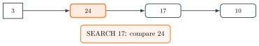{fig-alt="24가 강조되고 SEARCH 17: compare 24라는 콜아웃이 붙은 상태" width="70%"}

## 2단계

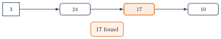{fig-alt="17이 강조되고 17 found라는 콜아웃이 붙은 상태" width="70%"}

## 3단계

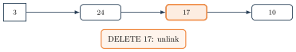{fig-alt="17이 강조되고 DELETE 17: unlink라는 콜아웃이 붙은 상태" width="70%"}

## 4단계

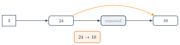{fig-alt="17이 제거되고 24와 10이 직접 연결된 최종 상태, 24 -> 10이라는 콜아웃이 붙은 상태" width="70%"}
:::

Chain으로는 singly linked list(단순, head insertion), dynamic array/small vector(locality), sorted chain(조기 종료 가능하지만 insert 비용 증가), extreme collision에서는 balanced tree까지 고려할 수 있다. head insertion 자체는 $\Theta(1)$이지만, duplicate update를 지원하려면 먼저 equal key를 찾아야 한다.

$\alpha=n/m$을 average chain length라 하면, simple uniform hashing 아래 resize 제외 unsuccessful/successful search와 map put/update는 모두 $\Theta(1+\alpha)$, unchecked head insert만 $\Theta(1)$이다. $\alpha$를 bounded constant로 유지하면 resize 없는 연산은 expected $\Theta(1)$이다 — 특정한 $m\approx n/10$이 보편 최적이라는 뜻은 아니다.

{fig-alt="bucket 하나에 6개 key가 모두 연결된 chain 다이어그램" width="55%"}

**구현**: $m=7$ table에 $10,17,24$를 순서대로 삽입해 bucket 3 chain을 만들고, duplicate update와 delete를 확인한다.

::: {.panel-tabset}
## Python
```{.python}

```
## Java
```{.java}

```
## C
```{.c}

```
:::

**실행 결과** (실제 컴파일·실행 캡처 — `gcc -Wall`, `javac`/`java`, `python3`): bucket 3 chain이 위 그림과 같은 `24,17,10` 순서로 나온다.

::: {.panel-tabset}
## Python
```{.default}

```
## Java
```{.default}

```
## C
```{.default}

```
:::

::: {.callout-caution collapse="true" title="확인 문제: Separate Chaining Checkpoint"}
1. $m=7,n=12$이면 $\alpha$는?
2. head insertion map put이 항상 $\Theta(1)$이 아닌 이유는?
3. bucket 3의 search order는?

**답**: 
1. $12/7$. 
2. duplicate/update 여부를 확인하는 search가 필요하다. 
3. $24,17,10$.
:::

## Part G. Open Addressing

Probe function $h(k,i)$, $i=0,1,\ldots,m-1$은 collision마다 다음 후보 slot을 생성한다. SEARCH와 INSERT는 같은 key에 같은 sequence를 써야 하고, sequence가 충분한 slot을 방문하도록 capacity와 parameter를 설계해야 한다. $m$번 probe 후에는 failure 또는 resize한다.

Slot은 세 상태를 가진다: **EMPTY**(한 번도 사용되지 않음, search 종료 가능), **OCCUPIED**(active entry, equality 검사), **DELETED**(tombstone, search는 계속하고 insert 후보로 기억). EMPTY와 DELETED를 같은 `null` 상태로 표현하면 probe chain을 끊어 false negative를 만들 수 있다 — **EMPTY는 종료, DELETED는 계속**이 정확성의 핵심 규칙이다.





두 pseudocode의 `Probe(key,i)`는 여기서 formal하게 정의되지 않는다 — Part H·I·J에서 각각 선형/제곱/이중 해시라는 서로 다른 구체적 수식으로 채워지는 자리다. `HashSearch`/`HashPut`은 어떤 probe 방식을 쓰든 같은 공통 구조(EMPTY에서 종료, OCCUPIED면 equality 확인, DELETED는 통과)를 공유하므로, 검색 트리 장의 B-Tree가 `SplitChild`/`InsertNonFull`을 이름으로만 부르고 본문에서 관계를 설명했던 것과 같은 방식으로 여기서도 `Probe`를 억지로 하나의 알고리즘에 합치지 않고 자리만 잡아둔다.

첫 tombstone을 발견해도 즉시 거기 쓰지 않는다 — 같은 key가 tombstone 뒤에 이미 있을 수 있기 때문이다.

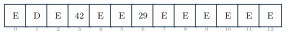{fig-alt="D, 42, 29 등이 섞인 13칸 hash table 한 줄" width="70%"}

첫 DELETED를 기억하되 EMPTY 또는 full probe까지 duplicate search를 계속한 뒤 재사용한다. entry마다 별도 linked-node allocation과 pointer는 피할 수 있지만, empty capacity slack과 slot state metadata, resize 중 새 table이 필요하다: $n<\text{usable capacity}\le m$.

::: {.callout-caution collapse="true" title="확인 문제: Open Addressing Checkpoint"}
1. SEARCH가 EMPTY에서 멈출 수 있는 이유는?
2. DELETED에서는 왜 계속해야 하는가?
3. $m$번 probe 후에도 자리가 없으면?

**답**: 

1. probe chain에 그 key가 있었다면 EMPTY 이전에 있어야 하기 때문이다. 
2. 뒤에 active key가 있을 수 있기 때문이다. 
3. resize 또는 명시적 failure.
:::

## Part H. Linear Probing

$$h(k,i)=\bigl(h'(k)+i\bigr)\bmod m$$

contiguous slot을 순서대로 방문해 cache locality가 좋고, wrap-around를 포함해 모든 slot을 방문한다. 다만 occupied run이 커지는 primary clustering에 취약하다.

25,13,16,15,7이 모두 home slot에 있는 상태에서 28을 삽입하면 home 2가 점유되어 있어 $2\to3\to4$로 probe한다.

::: {.panel-tabset}
## 1단계

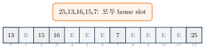{fig-alt="25,13,16,15,7이 각자 home slot에 놓인 상태" width="75%"}

## 2단계

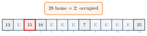{fig-alt="slot 2가 충돌로 표시되고 28 home=2: occupied라는 콜아웃이 붙은 상태" width="75%"}

## 3단계

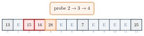{fig-alt="slot 2,3이 충돌로 표시되고 slot 4에 28이 놓인 상태" width="75%"}
:::

여러 key가 채워진 뒤 38(home 12)을 삽입하면 $12\to0\to1\to\cdots\to5$가 모두 점유되어 있어 wrap-around 끝에 첫 EMPTY인 6에 놓인다.

::: {.panel-tabset}
## 1단계

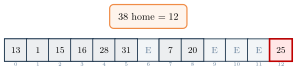{fig-alt="slot 12가 충돌로 표시되고 38 home=12라는 콜아웃이 붙은 상태" width="75%"}

## 2단계

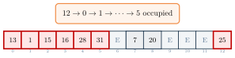{fig-alt="slot 12부터 wrap-around를 거쳐 slot 5까지 전부 충돌로 표시된 상태" width="75%"}

## 3단계

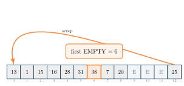{fig-alt="slot 12부터 5까지 충돌로 표시되고 wrap 화살표를 거쳐 slot 6에 38이 놓인 상태" width="75%"}
:::

| key | 25 | 13 | 16 | 15 | 7 | 28 | 31 | 20 | 1 | 38 |
|---|---|---|---|---|---|---|---|---|---|---|
| home | 12 | 0 | 3 | 2 | 7 | 2 | 5 | 7 | 1 | 12 |
| final | 12 | 0 | 3 | 2 | 7 | 4 | 5 | 8 | 1 | 6 |

{fig-alt="13칸 hash table에 13,1,15,16,28,31,38,7,20이 채워지고 세 칸은 비어있으며 마지막 칸에 25가 있는 다이어그램" width="70%"}

Primary clustering은 **자기 강화**된다 — run 앞이나 내부로 hash된 key가 끝에 붙고, 더 긴 run은 더 넓은 home range의 key를 흡수한다.

길이 3인 cluster에 home이 cluster 내부인 새 key가 들어와 run 끝에 붙으면서 cluster가 길이 4로 자라는 과정.

::: {.panel-tabset}
## 1단계

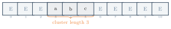{fig-alt="a,b,c 세 key가 이어진 길이 3 cluster에 brace로 length 3이 표시된 상태" width="70%"}

## 2단계

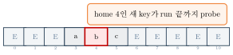{fig-alt="slot 4가 충돌로 표시되고 home 4인 새 key가 run 끝까지 probe한다는 콜아웃이 붙은 상태" width="70%"}

## 3단계

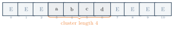{fig-alt="길이 3이던 cluster가 새 key를 흡수해 길이 4로 늘어난 상태" width="70%"}
:::

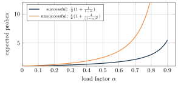{fig-alt="load factor가 커질수록 성공 탐색과 실패 탐색 모두 expected probe 수가 증가하는 두 곡선 그래프" width="70%"}

::: {.callout-warning title="주의: 이 곡선은 general uniform-hashing bound가 아니다"}
$$E[\text{successful}]\approx\frac12\left(1+\frac1{1-\alpha}\right),\qquad E[\text{unsuccessful}]\approx\frac12\left(1+\frac1{(1-\alpha)^2}\right)$$

위 곡선은 **고전적 linear-probing 공식을 그대로 직접 plot한 것**이며, arbitrary open addressing의 general uniform-hashing bound와는 다르다. $\alpha\to1$에서 급격히 증가한다.
:::

::: {.callout-caution collapse="true" title="확인 문제: Linear Probing Checkpoint"}
1. key 38의 probe sequence와 final slot은?
2. primary cluster가 자기 강화되는 이유는?
3. unsuccessful search는 언제 종료하는가?

**답**: 

1. $12,0,1,2,3,4,5,6$에서 6. 
2. run에 닿은 key가 끝에 붙어 run을 키우기 때문이다. 
3. EMPTY를 만나거나 $m$번 probe 후.
:::

## Part I. Quadratic Probing

$$h(k,i)=\bigl(h'(k)+c_1i+c_2i^2\bigr)\bmod m$$

원본 단순형은 $m=13,\ c_1=0,\ c_2=1$: $h(k,i)=(h'(k)+i^2)\bmod13$. offset이 $0,1,4,9,16,\ldots$로 커져 contiguous primary run의 영향을 완화한다.

home 4가 이미 점유된 상태에서 30을 삽입하면 $i=0,1,2$가 각각 $4,5,8$로 계산되어 slot 8에 놓인다.

::: {.panel-tabset}
## 1단계

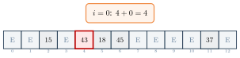{fig-alt="slot 4가 충돌로 표시되고 i=0: 4+0=4라는 콜아웃이 붙은 상태" width="75%"}

## 2단계

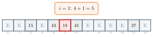{fig-alt="slot 5가 충돌로 표시되고 i=1: 4+1=5라는 콜아웃이 붙은 상태" width="75%"}

## 3단계

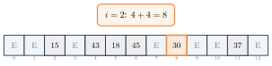{fig-alt="slot 4, 5가 충돌로 표시되고 slot 8에 30이 놓인 상태" width="75%"}
:::

::: {.callout-warning title="Coverage는 자동 보장이 아니다"}
$(h'+i^2)\bmod13$에서 $i=0,\ldots,7$의 $i^2\bmod13$은 $0,1,4,9,3,12,10,10$이다. $i=6$과 $i=7$부터 repeated offset이 나타난다 — $m,c_1,c_2$와 load에 따라 일부 slot을 방문하지 않아 table이 덜 찼어도 insertion이 실패할 수 있다.
:::

같은 initial hash value를 갖는 key들이 동일한 quadratic probe sequence를 따라가는 현상을 **secondary clustering**이라 한다.

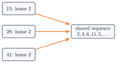{fig-alt="home 2를 공유하는 세 key가 모두 같은 probe sequence 상자로 화살표를 뻗는 다이어그램" width="55%"}

| | Primary | Secondary |
|---|---|---|
| 대표 방식 | linear probing | quadratic probing |
| 합쳐지는 key | 서로 다른 home도 가능 | 같은 home |
| 원인 | contiguous occupied run | 동일 offset sequence |
| 결과 | run의 자기 강화 | 같은 home끼리 같은 경로 |

::: {.callout-caution collapse="true" title="확인 문제: Quadratic Probing Checkpoint"}
1. 30의 probe indices는?
2. quadratic probing이 모든 slot을 방문한다고 말할 수 있는가?
3. secondary clustering의 정확한 정의는?

**답**: 

1. $4,5,8$. 
2. parameter/capacity policy 없이는 아니다. 
3. 같은 home key들이 같은 quadratic sequence를 공유하는 현상.
:::

## Part J. Double Hashing

$$h(k,i)=\bigl(h_1(k)+i\,h_2(k)\bigr)\bmod m$$

$h_1$은 home bucket, $h_2$는 step size다. $h_2(k)\ne0$이어야 하고, full cycle을 위해 $\gcd(h_2(k),m)=1$이 필요하다. $m$이 prime이면 $h_2(k)=1+(k\bmod(m-1))$ 같은 형태를 쓸 수 있다.

$m=13,\ h_1(k)=k\bmod13,\ h_2(k)=(k\bmod11)+1$일 때:

| key | $h_1$ | $h_2$ | $\gcd(h_2,13)$ | probe sequence | final |
|---|---|---|---|---|---|
| 15 | 2 | 5 | 1 | 2 | 2 |
| 19 | 6 | 9 | 1 | 6 | 6 |
| 28 | 2 | 7 | 1 | $2,9$ | 9 |
| 41 | 2 | 9 | 1 | $2,11$ | 11 |
| 67 | 2 | 2 | 1 | $2,4$ | 4 |

15, 19가 이미 놓인 상태에서 28, 41, 67을 각자의 $h_1,h_2$로 계산한 probe sequence를 따라 배치하는 애니메이션.

::: {.panel-tabset}
## 1단계

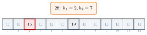{fig-alt="slot 2가 충돌로 표시되고 28: h1=2,h2=7이라는 콜아웃이 붙은 상태" width="75%"}

## 2단계

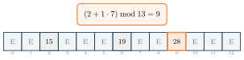{fig-alt="slot 9에 28이 놓이는 상태" width="75%"}

## 3단계

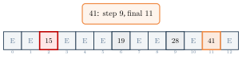{fig-alt="slot 9는 28로 확정되고 slot 11에 41이 놓이는 상태" width="75%"}

## 4단계

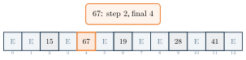{fig-alt="slot 2,6,9,11에 15,19,28,41이 놓이고 67이 slot 4로 향하는 상태" width="75%"}
:::

::: {.callout-warning title="Step과 Capacity가 서로소가 아니면"}
$m=12,\ h_2(k)=4$이면 probe sequence는 $j,j+4,j+8,j,\ldots$로 $\gcd(4,12)=4$라서 3개 slot만 순환한다. 빈 slot이 많아도 insertion이 실패할 수 있다.
:::

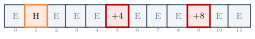{fig-alt="12칸 중 세 칸만 순환 대상으로 표시된 다이어그램" width="65%"}

| | Linear | Quadratic | Double |
|---|---|---|---|
| formula | $h'+i$ | $h'+c_1i+c_2i^2$ | $h_1+ih_2$ |
| primary cluster | 큼 | 완화 | 완화 |
| secondary cluster | 있음 | same home 공유 | 크게 완화 |
| coverage | 항상 full cycle | parameter 의존 | $\gcd(h_2,m)=1$ |
| locality | 좋음 | 중간 | 낮을 수 있음 |
| 계산 | 가장 단순 | 제곱 offset | 두 hash |

Double hashing도 collision을 제거하지 않는다. probe sequence를 다양하게 할 뿐이다.

::: {.callout-caution collapse="true" title="확인 문제: Double Hashing Checkpoint"}
1. key 67의 $h_1,h_2$, final slot은?
2. $\gcd(h_2,m)=1$이 필요한 이유는?
3. double hashing에도 collision이 가능한가?

**답**: 

1. $2,2$, final 4. 
2. 모든 slot을 순환하기 위해서다. 
3. 가능하다.
:::

## Part K. 삭제와 구현

key 38의 home은 12이고 probe sequence는 $12,0,1,2,3,4,5,6$이다. key 1은 그 경로 중간인 slot 1에 있다.

{fig-alt="13칸 hash table에 13,1,15,16,28,31,38,7,20이 채워지고 세 칸은 비어있으며 마지막 칸에 25가 있는 다이어그램" width="70%"}

::: {.callout-warning title="잘못된 삭제: slot 1을 EMPTY로"}
key 1을 지우며 slot 1을 EMPTY로 만들면, 이후 SEARCH 38이 $12\to0\to1$까지 갔을 때 slot 1이 EMPTY이므로 **거기서 조기 종료**해 false NOT_FOUND를 낸다 — 38은 실제로 slot 6에 있는데도 못 찾는다.
:::

key 1 삭제를 EMPTY로 처리하면 이후 SEARCH 38이 slot 1의 EMPTY에서 조기 종료해 false NOT_FOUND가 되는 5단계 트레이스.

::: {.panel-tabset}
## 1단계

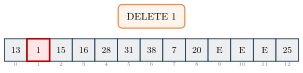{fig-alt="slot 1이 강조되고 DELETE 1이라는 콜아웃이 붙은 상태" width="75%"}

## 2단계

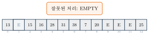{fig-alt="slot 1이 EMPTY로 표시되고 잘못된 처리: EMPTY라는 콜아웃이 붙은 상태" width="75%"}

## 3단계

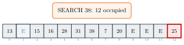{fig-alt="slot 12가 충돌로 표시되고 SEARCH 38: 12 occupied라는 콜아웃이 붙은 상태" width="75%"}

## 4단계

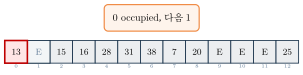{fig-alt="slot 0이 충돌로 표시되고 0 occupied, 다음 1이라는 콜아웃이 붙은 상태" width="75%"}

## 5단계

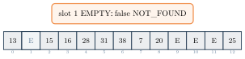{fig-alt="slot 1이 EMPTY로 표시되고 slot 1 EMPTY: false NOT_FOUND라는 콜아웃이 붙은 상태" width="75%"}
:::

**올바른 삭제**는 tombstone(DELETED)을 남긴다 — DELETED에서는 계속 probe하므로 SEARCH 38이 slot 1의 D를 통과해 slot 6에서 정상적으로 찾는다.

key 1 삭제를 DELETED(tombstone)로 처리하면 SEARCH 38이 slot 1의 D를 통과해 slot 6에서 찾는 4단계 트레이스.

::: {.panel-tabset}
## 1단계

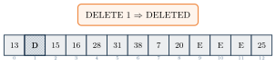{fig-alt="slot 1이 D(tombstone)로 표시되는 상태" width="75%"}

## 2단계

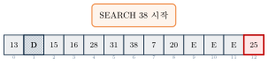{fig-alt="slot 12가 충돌로 표시되고 SEARCH 38 시작이라는 콜아웃이 붙은 상태" width="75%"}

## 3단계

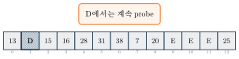{fig-alt="slot 1의 D를 지나쳐 계속 probe한다는 콜아웃이 붙은 상태" width="75%"}

## 4단계

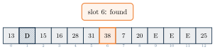{fig-alt="slot 1이 D로 표시되고 slot 6에서 38을 찾았다는 콜아웃이 붙은 상태" width="75%"}
:::

Tombstone reuse는 네 단계를 따른다: (1) PUT은 첫 DELETED index를 기억한다. (2) probe를 계속해 existing equal key가 없는지 확인한다. (3) EMPTY를 만나면 기억한 tombstone에 새 entry를 둔다. (4) active count는 증가하고 tombstone count는 감소한다. 즉시 쓰면 안 되는 이유는 같은 key가 tombstone 뒤에 있다면 duplicate entry를 만들 수 있기 때문이다.

Load에는 두 종류가 있다: $\alpha_{\text{logical}}=\text{active}/m$, $\alpha_{\text{probing}}=(\text{active}+\text{tombstones})/m$.

active 9개/capacity 20의 logical load(0.45)와, tombstone 5개를 더한 probing load(0.70)를 각각 게이지로 보여준다.

::: {.panel-tabset}
## Logical Load

{fig-alt="active 9개만 반영한 logical load 0.45 게이지" width="60%"}

## Probing Load

{fig-alt="active 9개에 tombstone 5개를 더한 probing load 0.70 게이지" width="60%"}
:::

검색 비용은 probing load의 영향을 받는다. active load가 낮아도 tombstone이 많으면 rehash가 필요할 수 있다.



`HashDelete`가 부르는 `FindSlot`은 별도로 정의되지 않는다 — `HashSearch`가 이미 보여준 것과 같은 probe 순회(EMPTY에서 종료, OCCUPIED면 equality 확인, DELETED는 통과)를 그대로 재사용한다는 뜻이다. Active key는 그 probe sequence에서 EMPTY보다 앞에 도달 가능해야 한다는 것이 삭제 후에도 유지해야 할 invariant다.

**구현**: linear probing 기반 open-address table에 10-key 예제(Part H)를 삽입하고, key 1을 삭제한 뒤에도 key 38 검색이 성공함을 확인하고, tombstone이 재사용되는 새 key를 삽입한다.

::: {.panel-tabset}
## Python
```{.python}

```
## Java
```{.java}

```
## C
```{.c}

```
:::

**실행 결과** (실제 컴파일·실행 캡처 — `gcc -Wall`, `javac`/`java`, `python3`): key 1을 삭제해도 `get(38)`은 계속 성공한다 — tombstone이 probe chain을 끊지 않는다는 증거다. (Java/C 원본 구현은 각자 다른 resize 임계값을 쓰므로, 정책에 의존하는 `capacity`/`tombstone` 개수는 여기서 출력하지 않는다.)

::: {.panel-tabset}
## Python
```{.default}

```
## Java
```{.default}

```
## C
```{.default}

```
:::

::: {.callout-caution collapse="true" title="확인 문제: Deletion Checkpoint"}
1. slot 1을 EMPTY로 만들면 왜 38을 잃는가?
2. DELETED의 search와 insert 의미는?
3. 어떤 load가 probe 길이에 더 직접적인가?

**답**: 

1. 검색이 slot 1에서 조기 종료되기 때문이다. 
2. search는 통과, insert는 후보로 기억한다. 
3. active+tombstone 기반 probing load.
:::

## Part L. Load Factor와 Expected Cost

$\alpha=n/m$이지만 chaining과 open addressing에서 의미가 다르다.

| | Chaining | Open addressing |
|---|---|---|
| $n$의 의미 | entry 수 | active entry 수 |
| 가능 범위 | $\alpha\ge0$, 1 초과 가능 | $0\le\alpha<1$ |
| 성능 원인 | expected chain length | empty slot까지 probe |
| 관리 목표 | bounded chain length | 충분한 empty capacity |

Resize가 없는 한 operation은 suitable hashing과 controlled load 아래 SEARCH, PUT, DELETE 모두 expected $\Theta(1)$이다. Resize까지 포함한 PUT은 amortized expected $\Theta(1)$이지만, resize를 일으킨 individual PUT은 $\Theta(n)$일 수 있다. Collision 집중, 높은 load, adversarial key에서는 worst case $\Theta(n)$이다.

| operation | expected, no resize | amortized, resize 포함 | worst |
|---|---|---|---|
| lookup | $\Theta(1)$ | $\Theta(1)$ | $\Theta(n)$ |
| insert/update | $\Theta(1)$ | expected $\Theta(1)$ | $\Theta(n)$ |
| delete | $\Theta(1)$ | $\Theta(1)$ | $\Theta(n)$ |
| resize/rehash | --- | operation sequence에 분산 | $\Theta(n)$ |

::: {.callout-warning title="필요한 가정"}
suitable hashing, equality/hash contract, controlled logical/probing load, bounded probe가 필요하다. Amortized는 개별 resize가 상수 시간이라는 뜻이 아니다.
:::

Chaining은 $\alpha>1$도 허용하며 chain representation과 workload에 따라 threshold가 다르다. Open addressing은 probe 급증을 피하려 더 낮은 $\alpha$를 유지한다. tombstone 비율도 cleanup/rehash trigger가 될 수 있다. 0.5나 0.75 같은 숫자는 universal law가 아니라 **구현 정책**이다.

::: {.callout-caution collapse="true" title="확인 문제: Load Factor와 Cost Checkpoint"}
1. chaining에서 $\alpha=1.5$가 가능한가?
2. OA에서 $\alpha=1$이면 새 insert가 가능한가?
3. expected와 worst bound를 함께 말하라.

**답**: 

1. 가능하다. 
2. EMPTY가 없어 불가능하다. 
3. resize 없는 연산은 suitable hashing/controlled load에서 expected $\Theta(1)$, resize 포함 PUT은 amortized expected $\Theta(1)$, individual resize와 worst case는 $\Theta(n)$.
:::

## Part M. Resize, Rehashing, Amortized Analysis

**resize**는 table capacity를 바꾸고, **rehash**는 active entry를 새 capacity 기준으로 다시 배치한다. 절차는 (1) capacity가 큰 새 table 할당, (2) 새 compression으로 bucket index 재계산, (3) 모든 active entry 재삽입하고 tombstone 제거, (4) 검증 후 old table 폐기다. logical key–value contents와 size는 보존하지만 physical bucket은 바뀐다 — index가 capacity에 의존하므로 단순 memory copy가 아니다.

old table($m=5$)의 active entry 2,7,12를 new table($m=11$)로 재배치하는 rehash 애니메이션 — $12\to1,\ 2\to2,\ 7\to7$.

::: {.panel-tabset}
## 1단계

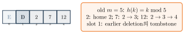{fig-alt="old table에서 2,7,12가 각자 home과 probe 위치에 놓이고 slot 1이 tombstone인 상태" width="65%"}

## 2단계

{fig-alt="새 table(m=11)이 할당되고 active 3, D 1이라는 콜아웃이 붙은 상태" width="65%"}

## 3단계

{fig-alt="old table의 active entry들이 새 hash 함수로 재계산되는 상태" width="65%"}

## 4단계

{fig-alt="old table의 2,7,12가 new table의 1,2,7번 슬롯으로 재배치된 최종 상태" width="65%"}
:::

Rehash 전후로 `get(2)`, `get(7)`, `get(12)`는 모두 성공해야 하고, size는 3, tombstone은 0으로 초기화된다.

Capacity growth policy로는 power-of-two doubling + bit mixing, next prime capacity + modulo reduction, implementation-specific growth factor가 있다 — **capacity policy, hash mixing, index reduction, collision scheme을 독립적으로 정하면 안 된다.**

{fig-alt="1,2,4,8,16,32로 두 배씩 커지는 6개 막대 그래프" width="60%"}

$$1+2+4+\cdots+n<2n$$

각 individual resizing PUT은 현재 entry 수에 비례해 $\Theta(n)$이지만, $n$번 PUT 동안 모든 migration의 합은 $O(n)$이므로 migration의 PUT당 amortized additional cost는 $O(1)$이다.

::: {.callout-tip title="정확한 결론"}
Suitable hashing과 controlled load 아래 resize 포함 PUT은 amortized expected $\Theta(1)$이다. 모든 PUT이 worst-case $\Theta(1)$이라는 뜻은 아니다.
:::

Resize 후 반드시 보존할 invariant: (1) 모든 active entry lookup 성공, (2) size 보존, (3) 새 capacity와 index 일치, (4) duplicate 없음, (5) old tombstone 제거, (6) load factor 재계산.

::: {.callout-note title="다음 단계: Incremental Rehashing"}
Stop-the-world resize는 한 operation이 전체 table을 옮겨 latency spike를 만든다. Incremental rehashing은 old/new table을 잠시 함께 두고 operation마다 몇 bucket씩 이동한다 — lookup은 migration 완료 전 두 table을 확인할 수 있고, 상태와 concurrency가 복잡해지지만 total work는 줄지 않고 latency만 분산한다.
:::

::: {.callout-caution collapse="true" title="확인 문제: Rehashing Checkpoint"}
1. resize가 copy만으로 끝나지 않는 이유는?
2. $1+2+\cdots+n$의 geometric sum bound는?
3. 한 번의 resize 비용과 amortized insertion 비용은?

**답**: 

1. index가 capacity에 의존하기 때문이다. 
2. $<2n$. 
3. resizing PUT은 $\Theta(n)$, 전체 sequence에서는 PUT당 추가 amortized $O(1)$이고 기본 hashing까지 포함하면 amortized expected $\Theta(1)$.
:::

## Part N. 구현과 API Contract

| API | 강의용 정책 |
|---|---|
| `put/get/containsKey/remove` | duplicate key는 value update |
| `size/capacity/loadFactor/clear` | 상태를 관찰·초기화 |
| null key/value | 금지해 구현 단순화 |
| equality | `equals` / integer equality |
| iteration order | 보장하지 않음 |
| thread safety | 제공하지 않음 |

operation 중 resize가 일어나 reference/index가 바뀔 수 있으므로 내부 slot pointer를 API 밖으로 노출하지 않는다.

Java의 계약: $a.equals(b)\Rightarrow a.hashCode()=b.hashCode()$, Python의 계약: $a=b\Rightarrow \mathrm{hash}(a)=\mathrm{hash}(b)$ — 두 언어 다 역은 성립하지 않는다($a.hashCode()=b.hashCode()\not\Rightarrow a.equals(b)$; $\mathrm{hash}(a)=\mathrm{hash}(b)\not\Rightarrow a=b$). collision 후 반드시 동등성 비교(`equals`/`__eq__`)로 logical key를 확인해야 하고, key가 table 안에 있는 동안 equality/hash-relevant field를 변경해서는 안 되며, custom key는 두 method를 함께 설계해야 한다.

::: {.callout-warning title="Mutable Key Failure"}
동등성(`equals`/`__eq__`)과 hash(`hashCode`/`__hash__`)가 `id` 필드에만 의존하는 key를 hash table(`HashMap`/`dict`)에 넣은 뒤 `key.id`를 바꾸면, entry는 여전히 **원래 id의 bucket**에 남아 있지만 lookup은 **바뀐 id**로 bucket을 다시 계산한다. Hash table은 mutated key를 자동으로 재배치할 의무가 없다 — key가 table 안에 있는 동안 동등성·hash에 관련된 field는 immutable이어야 한다.
:::

::: {.panel-tabset}
## Python
```{.python}

```
## Java
```{.java}

```
:::

**실행 결과** (실제 컴파일·실행 캡처 — `javac`/`java`, `python3`, `assert` 없이 관찰값을 직접 출력): `id`를 20으로 바꾼 뒤에는 mutated key 자체로도, `id=10`으로도, `id=20`으로도 **어느 쪽으로도 다시 찾을 수 없다** — entry는 사라지지 않았지만(size는 그대로 1) 도달 불가능해졌다. 두 언어 모두 같은 이유로 실패한다: bucket 위치는 삽입 시점의 hash로 고정되고, 이후 lookup은 그 순간의 hash를 다시 계산하므로 mutated key·원래 id·바뀐 id 중 무엇으로 찾아도 어긋난다.

::: {.panel-tabset}
## Python
```{.default}

```
## Java
```{.default}

```
:::

C 구현에서는 chaining은 integer key/value를 entry node가 소유하고 `destroy`가 모든 node와 bucket array를 해제하며, open addressing은 slot array가 value를 직접 보관하고 state enum이 EMPTY/OCCUPIED/DELETED를 구분한다. allocation failure는 false 반환과 원상태 보존으로 처리하고, negative key는 normalized modulo로 처리하며, dangling pointer를 API 밖으로 반환하지 않는다. 이 ownership 방식 때문에 Mutable Key Failure도 C에는 없다 — key는 slot에 **값으로 복사**돼 들어가므로 호출자가 들고 있는 변수와 table 내부의 key는 처음부터 별개다. 애초에 같은 객체를 공유하지 않으니 mutate로 끊어질 참조 자체가 없다.

| | 확인 대상 |
|---|---|
| Chaining | correct bucket, no duplicate, exact size, no cycle |
| Open addressing | reachable before EMPTY, no duplicate, active/D counts, bounded probe |
| Rehash | capacity changed, size preserved, all lookup, no old D |
| deterministic tests | empty, update, collision, wrap, middle delete, D reuse, repeated resize |
| Java differential | random operations vs `java.util.HashMap` |
| C randomized | reference key/value array와 비교 |

::: {.callout-tip title="구현의 마지막 단계"}
구현의 마지막 단계는 "동작하는 예"가 아니라 invariant를 자동 검사하는 것이다. 이 장의 Python/Java/C 구현은 모두 `dict`/`HashMap` oracle과 2만 회 randomized operation을 비교해 correctness를 검증했다.
:::

## Part O. 검색 트리와 비교

| Structure | Equality | Insert/Delete | Worst | Order/Range | Typical use |
|---|---|---|---|---|---|
| plain BST | $\Theta(h)$ | $\Theta(h)$ | $\Theta(n)$ | yes | small ordered set |
| AVL/RB | $\Theta(\log n)$ | $\Theta(\log n)$ | $\Theta(\log n)$ | yes | memory ordered map |
| B-Tree | $\Theta(\log_t n)$ I/O | same | $\Theta(\log_t n)$ I/O | yes | database index |
| chained hash | exp. $\Theta(1)$ | amort. exp. $\Theta(1)$ | $\Theta(n)$ | no | flexible map |
| open address | exp. $\Theta(1)$ | amort. exp. $\Theta(1)$ | $\Theta(n)$ | no | cache-friendly map |

검색 트리 장의 tree는 pointer node를, B-Tree는 page를, chaining은 bucket+node를, open addressing은 dense array를 memory pattern으로 쓴다.

| 요구 | 첫 후보 |
|---|---|
| exact username lookup | hash table |
| leaderboard sorted iteration | balanced search tree |
| database range scan | B-Tree family |
| memoization cache | hash table |
| untrusted adversarial key | mitigation을 갖춘 hash 또는 worst guarantee tree |
| prefix/range query | ordered/trie 계열 |

Chaining은 높은/변동 load, stable entry address가 중요할 때, linked allocation이 허용될 때 선택한다. Open addressing은 cache locality, 낮은 allocation overhead, 충분한 slack을 유지할 수 있을 때 선택한다.

::: {.callout-warning title="둘 다 확인할 것"}
hash quality, equality contract, resize latency, deletion workload, adversarial input.
:::

::: {.callout-tip title="구조 선택 Takeaway"}
먼저 필요한 operation과 guarantee를 고르고, 그다음 collision policy와 capacity policy를 설계한다.

- equality lookup/cache/compiler symbol table: hash table이 강한 첫 후보다.
- ordered map/range query/leaderboard: AVL 또는 Red-Black Tree.
- database·filesystem index와 page I/O: B-Tree 계열.
- adversarial worst-case 보장이 우선이면 balanced tree 또는 방어 정책을 갖춘 hash.
:::

## Part P. 보안: Hash Flooding과 검증 체크리스트

같은 bucket/probe로 가는 key를 대량 공급해 expected $\Theta(1)$을 worst $\Theta(n)$으로 악화시켜 DoS를 유발하는 공격을 **hash flooding**이라 한다. Randomized seed, stronger mixing, chain treeification, request limit, trusted/untrusted workload 분리로 완화한다 — 구체적인 threshold와 내부 algorithm은 language/library version에 따라 달라질 수 있다.

::: {.callout-caution title="확인: 왜 신뢰할 수 없는 입력에서 다시 문제가 되는가"}
Part C에서 "일반 hash에는 cryptographic 성질이 필수가 아니다"라고 했지만, 공격자가 key를 고를 수 있는 workload에서는 예측 가능한 hash function 자체가 취약점이 된다 — threat model이 바뀌면 같은 결론이 다시 뒤집힐 수 있다.
:::

Code validation checklist: Java는 custom same-hash unequal key, mutable-key warning, differential random test를 확인한다. C는 negative key, allocation ownership, randomized reference comparison을 확인한다. Probing은 $m$회 bounded loop로 infinite cycle을 방지한다. Resize는 all entries preserved, size stable, tombstone removed를 확인한다. Sanitizer가 있으면 C memory/leak 검사를 추가로 실행한다.

::: {.callout-tip title="확인 문제"}
Expected performance를 주장하기 전에 correctness invariant와 worst-case escape path부터 확인한다 — 이 장에서 계속 강조한 "expected 조건" 원칙의 마지막 적용이다.
:::

## 개념 지도

키에서 hash code, compression을 거쳐 bucket에 이르는 파이프라인을 중심으로, collision resolution이 separate chaining과 open addressing(선형/제곱/이중 해시)으로 갈라지고, 다시 삭제(tombstone)·load factor·resize가 공통으로 이어지는 전체 구조를 정리한다.

## 💡 배움 포인트

- Hash table은 key → hash code → compression → bucket index라는 파이프라인으로 동작한다 — 같은 hash code라도 capacity가 바뀌면 다른 bucket을 가리킬 수 있다.
- Collision은 오류가 아니라 pigeonhole principle에 따른 필연이다. Separate chaining과 open addressing(선형/제곱/이중 해시)은 collision **뒤**의 이동 정책만 다를 뿐, equality 검사와 bounded search가 필요하다는 공통 전제는 같다.
- EMPTY와 DELETED(tombstone)를 구분하지 못하면 open addressing의 SEARCH가 조기 종료해 실제로 존재하는 key를 잃는다.
- "hash operation은 $\Theta(1)$이다"는 항상 조건이 붙는다 — resize 없는 한 suitable hashing/controlled load 아래 expected $\Theta(1)$, resize 포함 PUT은 amortized expected $\Theta(1)$, individual resize와 worst case는 $\Theta(n)$이다.
- Resize는 단순 복사가 아니다 — index가 capacity에 의존하므로 모든 active entry를 재배치해야 하지만, 그 총비용은 $O(n)$이라 PUT당 amortized $O(1)$로 흡수된다.
- Hash table은 equality lookup에 강하지만 order·range가 없다 — leaderboard나 range scan에는 검색 트리 장의 balanced tree나 B-Tree가 더 나은 첫 후보다.

## 🧪 직접 해보기

::: {.callout-caution collapse="true" title="Hash와 String Quiz"}
1. key, hash code, bucket index를 한 문장씩 구분하라.
2. collision과 duplicate는 어떻게 다른가?
3. $m=13$에서 $h(29)$는? 어떤 stored key와 충돌하는가?
4. multiplication trace $k=25,m=13$의 결과는?
5. ASCII sum이 anagram을 구분하지 못하는 이유는?
6. Horner update와 Java equal-key contract는?

**정답**

1. key는 logical identity, hash code는 key에서 만든 integer, index는 capacity 범위로 줄인 위치다.
2. collision은 unequal key의 same index, duplicate는 equal logical key다.
3. $29\bmod13=3$, stored key 16과 collision.
4. multiplication 결과 5; ASCII sum은 order를 버린다.
5. 문자 순서를 반영하지 않기 때문이다.
6. `hash=hash*B+code(c)`; $a.equals(b)\Rightarrow$ equal hash code.
:::

::: {.callout-caution collapse="true" title="Chaining과 Probing Quiz"}
1. chaining $m=7$, keys $10,17,24$의 chain은?
2. linear example에서 38의 probe sequence/final slot은?
3. primary와 secondary clustering을 구분하라.
4. quadratic example에서 30의 probe sequence는?
5. double hash에서 67의 $h_1,h_2$, final slot은?
6. $h_2$와 $m$의 gcd 조건은 왜 필요한가?

**정답**

1. head insertion chain $24\to17\to10$.
2. 38: $12,0,1,2,3,4,5,6$, final 6.
3. primary는 different home도 contiguous run에 합류하는 것, secondary는 same home이 same quadratic sequence를 공유하는 것이다.
4. 30: $4,5,8$.
5. 67: $h_1=2,h_2=2$, final 4.
6. gcd가 1이어야 full cycle을 순환한다.
:::

::: {.callout-caution collapse="true" title="Deletion·Load·설계 Quiz"}
1. key 1을 EMPTY로 지우면 38 search가 실패하는 이유는?
2. tombstone reuse 전에 duplicate search를 계속하는 이유는?
3. chaining과 OA에서 $\alpha$의 가능한 범위 차이는?
4. resize가 단순 copy가 아닌 이유와 migration 총비용은?
5. expected, amortized, worst를 구분하라.
6. cache, leaderboard, range scan에는 각각 무엇을 선택하는가?

**정답**

1. EMPTY는 search를 조기 종료시켜 뒤의 38을 놓치지만, DELETED에서는 계속한다.
2. 같은 key가 tombstone 뒤에 있을 수 있어 update 여부를 먼저 확인해야 한다.
3. chaining은 $\alpha\ge0$이고 1 초과 가능하며, OA는 $0\le\alpha<1$이다.
4. capacity가 index를 바꾸므로 reinsert가 필요하고, doubling migration 합은 $<2n$이다.
5. resize 없는 연산의 expected는 hashing randomness에 대한 것이고, resize 포함 PUT은 amortized expected $\Theta(1)$이며, individual resizing PUT과 worst case는 $\Theta(n)$일 수 있다.
6. cache는 hash table, leaderboard는 balanced tree, range scan은 B-Tree 계열을 선택한다.
:::

## 요약

Hash table은 key에서 hash code, compression을 거쳐 bucket index에 이르는 파이프라인으로 동작하며, 유한 table로 압축하는 이상 pigeonhole principle에 따라 collision이 필연적으로 생긴다. Separate chaining은 bucket마다 연결 리스트를 두어 $\alpha=n/m$에 비례하는 $\Theta(1+\alpha)$ expected 비용을 갖고, open addressing은 EMPTY/OCCUPIED/DELETED 세 slot 상태와 probe sequence로 같은 table 안에서 collision을 해결한다 — 선형·제곱·이중 해시는 probe 공식만 다를 뿐 공통의 `HashSearch`/`HashPut` 구조를 공유한다. 삭제는 EMPTY가 아니라 tombstone으로 처리해야 probe chain이 끊기지 않고, load factor는 chaining과 open addressing에서 서로 다른 범위와 의미를 가지며, resize는 index가 capacity에 의존하기 때문에 단순 복사가 아니라 전체 재배치이지만 그 총비용은 amortized $O(1)$로 흡수된다. Resize 없는 SEARCH/PUT/DELETE는 suitable hashing과 controlled load 아래 expected $\Theta(1)$이고, resize를 포함한 PUT은 amortized expected $\Theta(1)$이지만, individual resizing PUT과 worst case(collision 집중, hash flooding 등 adversarial 상황 포함)는 $\Theta(n)$일 수 있다. Java의 equals/hashCode contract와 mutable-key 위험, C의 ownership 정책은 hash table을 안전하게 구현하는 데 필수적이다. 검색 트리와 달리 hash table은 order·range가 없지만 equality lookup에서는 여전히 강한 첫 후보이며, 실제 선택은 필요한 operation, guarantee, adversarial 가능성에 따라 달라진다.
