## 🎯 학습목표

- $G=(V,E)$와 그래프 종류·용어를 정확히 정의하고, matrix/list 표현을 만들고 비용을 표현과 함께 말한다.
- BFS/DFS의 queue, stack, parent, distance, time을 추적하고 위상 정렬(Kahn/DFS)을 수행한다.
- Spanning tree, MST, cut property를 설명하고 Prim/Kruskal의 PQ/DSU 상태를 추적한다.
- Relaxation과 predecessor path를 계산하고 BFS, DAG SP, Dijkstra, Bellman-Ford의 전제를 구분한다.
- 복잡도를 표현·자료구조 조건과 함께 말한다.

## Part A. Graph란 무엇인가?

::: {.callout-tip title="강의를 관통하는 질문"}
연결 구조를 어떻게 저장하고, 방문하고, 가장 싸게 연결하거나 이동할까?
:::

친구 관계, 도로, prerequisite, 통신 link — 현실의 연결 구조는 모두 같은 방식으로 추상화된다:
object는 vertex, relation은 edge, cost/time은 weight가 된다.

$$
G=(V,E),\qquad V=\{\text{vertices}\},\quad E=\{\text{edges}\}.
$$

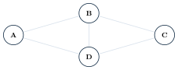{fig-alt="A, B, C, D 네 vertex가 사각형 형태로 연결되고 B-D 대각선이 추가된 그래프 다이어그램" width="45%"}

Adjacent는 두 vertex가 edge로 직접 연결됨을, incident는 edge와 그 endpoint의 관계를 말한다.

| | Undirected | Directed | Weighted |
|---|---|---|---|
| 정의 | $\{u,v\}=\{v,u\}$ | $(u,v)\ne(v,u)$ | $w(u,v)$는 거리·시간·비용·capacity 등 문맥을 가진다 |

::: {.callout-warning title="흔한 실수: MST와 최단 경로는 같은 weight 문제가 아니다"}
MST는 전체 연결 비용을 최소화하고, shortest path는 한 경로의 누적 비용을 최소화한다 — 이 장 뒷부분(Part K)에서 둘의 차이를 다시 짚는다.
:::

**Path**는 연속된 edge를 따라가는 vertex 나열이고, **simple path**는 vertex를 반복하지 않는
path다. **Cycle**은 시작과 끝이 같고 내부 vertex가 반복되지 않는 닫힌 path다. **Connected**는
undirected graph에서 모든 vertex 쌍 사이에 path가 있다는 뜻이고, 서로 도달 가능한 maximal
vertex 집합을 **connected component**라 한다(directed graph의 strong/weak connectivity는
부록에서 미리 본다).

Undirected graph에서 $\deg(v)$는 $v$에 incident한 edge 수이고 $\sum_v\deg(v)=2|E|$다.
Directed graph에서는 $\operatorname{indeg}(v)$(들어오는 edge)와 $\operatorname{outdeg}(v)$
(나가는 edge)를 구분한다. 이 책의 기본 예제는 vertex를 $0,\dots,n-1$ 또는 A, B, ...로 쓰고
parallel edge/self-loop는 제외하며, adjacency order를 항상 명시한다.

::: {.callout-caution collapse="true" title="확인 문제: Part A Checkpoint"}
| 질문 | 답 |
|---|---|
| $(u,v)$와 $(v,u)$가 다른 그래프 종류는? | directed graph |
| tree가 될 수 없는 연결 그래프의 징후는? | cycle |
| edge weight가 0이면 edge가 없는 것인가? | 아니다 — zero-weight edge와 no-edge는 별도 상태다 |
:::

## Part B. Graph Representation

**Adjacency Matrix**: $A[i][j]=1$이면 $(i,j)\in E$, $0$이면 아니다. directed에서는 row $i$가
source, column $j$가 destination이다(undirected는 $A=A^\mathsf{T}$). Edge 존재 확인은
$\Theta(1)$, 한 vertex의 이웃 나열은 $\Theta(V)$, 공간은 $\Theta(V^2)$다.

![$A[0][1]=1$은 $0\to1$ edge를 뜻한다 — 행은 source, 열은 destination.](../figures/08-graphs/02-matrix-direction.svg){fig-alt="0에서 1로 향하는 방향 edge와 그 옆에 2x2 인접행렬이 나란히 표시된 다이어그램" width="30%"}

::: {.callout-warning title="흔한 실수: Weighted Matrix의 0 함정"}
$$
W[i][j]=\begin{cases}0&i=j\\w(i,j)&(i,j)\in E\\\infty&(i,j)\notin E.\end{cases}
$$
실제 zero-weight edge는 $0$으로 저장할 수 있지만, no-edge도 $0$으로 쓰면 두 상태를 잃는다.
별도 boolean 또는 $\infty$ sentinel을 반드시 함께 쓴다(Part A Checkpoint에서 이미 짚은 구분).
:::

**Adjacency List**: $\operatorname{Adj}[u]=[(v_1,w_1),(v_2,w_2),\dots]$. 공간은
$\Theta(V+E)$, $u$의 이웃 나열은 $\Theta(\deg(u))$, 전체 edge 순회는 $\Theta(V+E)$다.
Undirected에서는 논리적으로 하나인 edge $\{u,v\}$를 $u\to v$, $v\to u$ 두 entry로 저장한다
(상수 2는 $\Theta(V+E)$에서 사라진다).

**Matrix에서 List로 변환**: 각 row를 스캔해 nonzero(또는 $\infty$가 아닌) column을 list entry로
옮긴다(예: row 0 = $0,1,1,0$ → $\operatorname{Adj}[0]=[1,2]$; row 1, 2, 3도 같은 방식으로
반복한다). 이 변환 자체는 matrix 전체를 훑어야 하므로 $\Theta(V^2)$이 걸리지만, 결과로 얻는
list는 실제 edge 수에 비례한 $\Theta(V+E)$ 공간만 쓴다 — 이것이 두 표현 사이의 공간
트레이드오프다.

| | Matrix | List |
|---|---|---|
| space | $\Theta(V^2)$ | $\Theta(V+E)$ |
| edge lookup | $\Theta(1)$ | $O(\deg(u))$ |
| neighbors | $\Theta(V)$ | $\Theta(\deg(u))$ |
| best fit | dense, lookup-heavy | sparse, traversal |
| weighted | sentinel 필요 | $(to,w)$ entry |

::: {.callout-warning title="흔한 실수: representation 없는 복잡도"}
"BFS는 $\Theta(V+E)$다"라고만 말하지 않는다 — list는 실제 저장된 adjacency entry만 훑으므로
$\Theta(V+E)$지만, matrix는 각 vertex의 row에서 가능한 $V$개 이웃을 모두 검사하므로
$V\cdot V=\Theta(V^2)$다. **알고리즘 이름만으로 시간복잡도를 말하지 말고 표현을 함께 말한다**
— 이 장 전체에서 지키는 규칙이다.
:::

이 책의 구현은 다음 정책을 따른다: vertex는 $0\le v<n$로 bounds를 검증하고, 동일한 $(u,v)$
edge는 weight를 update하며(추가하지 않음), weight $0$은 유효한 edge이고, undirected는 반대
방향 entry를 항상 함께 갱신하며, graph가 자신의 adjacency storage를 소유한다.

::: {.callout-caution collapse="true" title="확인 문제: Part B Checkpoint"}
| 질문 | 답 |
|---|---|
| sparse graph traversal에 자연스러운 표현은? | adjacency list |
| undirected 논리적 edge 하나는 list entry 몇 개인가? | 2개 |
| matrix BFS 비용은? | $\Theta(V^2)$ |
:::

## Part C. BFS

::: {.callout-note title="Mission"}
source에서 edge 수가 작은 layer부터 탐색하고 unweighted shortest-path distance를 계산한다.
:::

세 가지 색으로 vertex 상태를 구분한다: **WHITE**(undiscovered), **GRAY**(discovered and
queued), **BLACK**(fully processed).



::: {.callout-warning title="흔한 실수: dequeue할 때 발견 표시"}
두 frontier vertex가 같은 neighbor를 각각 enqueue하면 중복이 생긴다 — **enqueue할 때**
발견 표시를 해야 첫 발견이 slot을 예약해 각 vertex가 queue에 최대 한 번만 들어간다. GRAY는
"처리 완료"가 아니라 "이미 발견되어 queue에 있음"이다.
:::

**고정 BFS 예제** — adjacency order(오름차순 정렬):

$$
0:[1,2,3]\quad1:[0,4]\quad2:[0,4,5]\quad3:[0,6]\quad4:[1,2,7]\quad5:[2]\quad6:[3,7]\quad7:[4,6]
$$

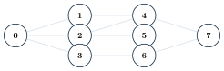{fig-alt="0부터 7까지 8개 vertex가 세 개의 열로 배치되고 9개 edge로 연결된 그래프" width="60%"}

**실행 추적** (source $=0$, Output에는 queue에서 제거되어 처리된 vertex만 기록):

::: {.panel-tabset}
## 1단계

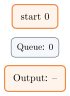{fig-alt="큐에 0만 있고 아직 아무것도 처리되지 않은 상태" width="10%"}

## 2단계

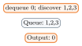{fig-alt="0이 dequeue되고 1,2,3이 큐에 들어간 상태" width="22%"}

## 3단계

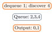{fig-alt="1이 dequeue되고 4가 큐에 들어간 상태" width="20%"}

## 4단계

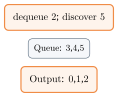{fig-alt="2가 dequeue되고 5가 큐에 들어간 상태" width="20%"}

## 5단계

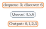{fig-alt="3이 dequeue되고 6이 큐에 들어간 상태" width="20%"}

## 6단계

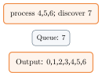{fig-alt="4,5,6이 순서대로 처리되고 7이 큐에 들어간 상태" width="22%"}

## 7단계

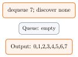{fig-alt="7까지 모두 처리되어 큐가 빈 최종 상태" width="22%"}
:::

$$
\begin{array}{c|cccccccc}v&0&1&2&3&4&5&6&7\\\hline dist&0&1&1&1&2&2&2&3\\parent&-&0&0&0&1&2&3&4\end{array}
$$

::: {.callout-tip title="Invariant"}
Queue에서 제거되는 vertex의 distance는 감소하지 않는다. 첫 발견보다 짧은 layer는 이미 모두
처리되었으므로 첫 $dist$가 최단이다.
:::

Adjacency order를 $[3,2,1]$로 바꾸면 같은 layer의 traversal order와 parent tree는 달라질 수
있지만, **distance layer와 shortest edge-count distance는 그대로 유지**된다 — BFS의 정확성은
adjacency order에 의존하지 않는다.

**Path Reconstruction**: parent chain을 거슬러 올라가 경로를 복원한다.

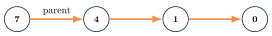{fig-alt="7,4,1,0 네 vertex가 parent 방향 화살표로 연결된 다이어그램" width="45%"}

Unreachable vertex는 $dist=\infty$, $parent=\NIL$이고 parent chain이 source에 도달하지 않는다.
Disconnected graph에서 single-source BFS는 source의 component만 방문한다 — 전체 component를
찾으려면 undiscovered source마다 새로 BFS를 시작하고 component id를 기록해야 한다(directed
graph에서 이 반복은 SCC 알고리즘이 아니다).

**복잡도**: adjacency list 기준 $\Theta(V+E)$(vertex enqueue/dequeue 최대 1회, directed edge
1회·undirected adjacency entry 2회 검사), adjacency matrix 기준 $\Theta(V^2)$.

**구현**: 세 언어 모두 같은 8-vertex 예제 그래프를 쓴다.

::: {.panel-tabset}
## Python
```{.python}

```
## Java
```{.java}

```
## C
```{.c}

```
:::

**실행 결과** (실제 컴파일·실행 캡처 — `gcc -Wall`, `javac`/`java`, `python3`):

::: {.panel-tabset}
## Python
```{.default}

```
## Java
```{.default}

```
## C
```{.default}

```
:::

::: {.callout-caution collapse="true" title="확인 문제: Part C Checkpoint"}
| 질문 | 답 |
|---|---|
| 왜 visited를 enqueue 시 표시하는가? | 중복 enqueue 방지 |
| 0에서 7까지 복원된 path는? | $0\to1\to4\to7$ |
| adjacency order가 바뀌어도 유지되는 값은? | shortest edge-count distance |
:::

## Part D. DFS

::: {.callout-note title="Mission"}
한 branch를 끝까지 내려가고 backtrack한다. Recursion stack과 finish order가 구조 정보를 만든다.
:::

Discovery order $\ne$ finish order $\ne$ 현재 recursion stack — 세 가지를 구분한다.



같은 8-vertex 예제 그래프에서 DFS를 추적한다(source 순회는 $0,1,\dots,7$ 순서, adjacency는
BFS와 같은 오름차순).

::: {.panel-tabset}
## 1단계

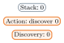{fig-alt="0만 discover되어 스택에 있는 상태" width="20%"}

## 2단계

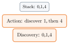{fig-alt="1과 4가 순서대로 discover되어 스택에 쌓인 상태" width="22%"}

## 3단계

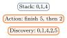{fig-alt="5와 2가 finish되어 스택에서 제거된 상태" width="20%"}

## 4단계

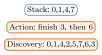{fig-alt="3과 6이 finish된 상태" width="22%"}

## 5단계

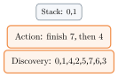{fig-alt="7과 4가 finish되어 스택이 0,1만 남은 상태" width="22%"}

## 6단계

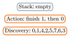{fig-alt="1과 0이 finish되어 스택이 빈 최종 상태" width="22%"}
:::

$$
\begin{array}{c|cccccccc}v&0&1&2&3&4&5&6&7\\\hline d&1&2&4&10&3&5&9&8\\f&16&15&7&11&14&6&12&13\end{array}
$$

::: {.callout-tip title="Parenthesis theorem"}
두 DFS interval $[d[u],f[u]]$는 disjoint이거나 하나가 다른 하나를 포함한다 — parent interval은
항상 child interval을 포함한다.
:::

Outer loop에서 WHITE vertex를 만날 때마다 새 DFS tree가 시작된다 — disconnected undirected
graph에서는 tree 수가 곧 component 수다(directed graph에서는 이 forest만으로 SCC를 구하지
못한다). **DFS tree edge는 parent relation이며 원래 graph의 모든 edge를 뜻하지 않는다.**

**Iterative DFS**: 재귀 없이 명시적 stack으로 순회한다.



::: {.callout-warning title="흔한 실수: visited-on-push는 정확한 재귀 DFS가 아니다"}
Tree나 단순 순회에서는 neighbor를 역순으로 push하면 recursive discovery order를 재현할 수
있다. 하지만 **일반 그래프에서 visited-on-push 방식은 exact recursive DFS tree와 finish
behavior를 보장하지 않는다** — 정확히 재현하려면 $(vertex, next\text{-}neighbor\text{-}index)$
프레임으로 재귀의 중단 상태를 저장하는 exact-simulation이 필요하다(본문에서는 개념만 설명하고,
아래 코드는 pseudocode 그대로의 단순 버전이다). 실제로 이 단순 버전을 우리 예제 그래프에서
실행하면 방문 순서가 $0,1,4,7,6,2,5,3$으로 나와, 재귀 DFS의 discovery order
$0,1,4,2,5,7,6,3$과 다르다 — 두 순서 모두 유효한 그래프 순회이지만, iterative 버전이 recursive
버전의 정확한 복제는 아니라는 점을 보여준다.
:::

**실행 결과**:

::: {.panel-tabset}
## Python
```{.python}

```
## Java
```{.java}

```
## C
```{.c}

```
:::

```{.default}

```

**복잡도**: adjacency list 기준 $\Theta(V+E)$, matrix 기준 $\Theta(V^2)$. 배열은 $\Theta(V)$,
recursion stack은 $O(depth)$(worst $O(V)$) — 매우 깊은 그래프는 iterative DFS가 stack
overflow를 피하는 데 유리하다.

**구현**: 재귀 DFS는 BFS와 같은 예제 그래프를 쓴다.

::: {.panel-tabset}
## Python
```{.python}

```
## Java
```{.java}

```
## C
```{.c}

```
:::

::: {.panel-tabset}
## Python
```{.default}

```
## Java
```{.default}

```
## C
```{.default}

```
:::

::: {.callout-caution collapse="true" title="확인 문제: Part D Checkpoint"}
| 질문 | 답 |
|---|---|
| discovery와 finish order가 같은가? | 아니다 |
| recursive와 iterative 순서를 맞추려면? | 단순 trace는 reverse push, exact simulation은 neighbor index를 가진 stack frame 필요 |
| DFS stack worst-case space는? | $O(V)$ |
:::

## Part E. DFS 활용과 Cycle Detection

Directed DFS edge는 네 종류로 분류된다: **tree**(WHITE vertex를 처음 발견), **back**(GRAY
ancestor로 이동), **forward**(BLACK descendant로 이동), **cross**(완료된 다른 branch로 이동).

::: {.callout-tip title="핵심"}
GRAY로 가는 back edge가 directed cycle의 증거다.
:::



::: {.panel-tabset}
## 1단계

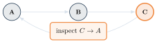{fig-alt="A,B,C 세 vertex가 순서대로 연결되고 C에서 A로 향하는 edge를 조사하는 상태" width="55%"}

## 2단계

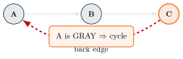{fig-alt="C에서 A로 가는 edge가 back edge로 강조되고 cycle이 확인된 상태" width="55%"}
:::

::: {.callout-warning title="흔한 실수: visited boolean만으로는 부족하다"}
이미 방문한 BLACK vertex로 가는 cross/forward edge까지 cycle로 오판하게 된다. 현재 recursion
stack에 있는 GRAY와 완료된 BLACK을 반드시 분리해야 한다.
:::

Undirected graph에서는 규칙이 다르다: visited neighbor $v$를 만났을 때 $v\ne parent[u]$이면
cycle이다. Undirected edge는 양방향 adjacency entry로 저장되므로, child에서 parent로
되돌아가는 entry는 cycle 증거가 아니다 — 이 parent 예외를 빼먹으면 모든 edge가 cycle로
오판된다.

::: {.callout-caution collapse="true" title="확인 문제: Part E Checkpoint"}
| 질문 | 답 |
|---|---|
| directed graph에서 cycle을 증명하는 색은? | GRAY |
| BLACK neighbor는 항상 cycle인가? | 아니다 |
| undirected parent edge는 cycle인가? | 아니다 |
:::

## Part F. Topological Sort

$$
(u,v)\in E\quad\Longrightarrow\quad pos[u]<pos[v].
$$

Directed graph가 topological order를 갖는다 $\Longleftrightarrow$ graph가 DAG다. Valid order는
여러 개일 수 있고, 어떤 tie/container 정책을 쓰느냐에 따라 concrete order가 달라진다.

### Kahn 알고리즘



::: {.callout-tip title="Kahn의 선택 정책"}
Zero-indegree vertex를 담는 container에 따라 순서와 비용이 달라진다 — queue(발견된 순서,
$\Theta(V+E)$), stack(최근 zero 먼저, $\Theta(V+E)$), min-heap(lexicographically smallest,
$O(E+V\log V)$). "random node"가 아니라 현재 zero-indegree container에서 정책에 따라 하나를
선택하는 것이다.
:::

**Kahn Trace: Min-Heap** — edges $0\to1,0\to3,1\to2,1\to4,2\to5,3\to5,4\to5$.

::: {.panel-tabset}
## 1단계

![Zero heap: [0]. Select: --. Output: [].](../figures/08-graphs/09-kahn-trace-step1.svg){fig-alt="zero-indegree heap에 0만 있는 초기 상태" width="15%"}

## 2단계

![Zero heap: [1,3]. Select: 0. Output: [0].](../figures/08-graphs/09-kahn-trace-step2.svg){fig-alt="0이 선택되고 1,3이 heap에 들어간 상태" width="15%"}

## 3단계

![Zero heap: [2,3,4]. Select: 1. Output: [0,1].](../figures/08-graphs/09-kahn-trace-step3.svg){fig-alt="1이 선택되고 2,4가 heap에 추가된 상태" width="15%"}

## 4단계

![Zero heap: [3,4]. Select: 2. Output: [0,1,2].](../figures/08-graphs/09-kahn-trace-step4.svg){fig-alt="2가 선택된 상태" width="15%"}

## 5단계

![Zero heap: [4]. Select: 3. Output: [0,1,2,3].](../figures/08-graphs/09-kahn-trace-step5.svg){fig-alt="3이 선택된 상태" width="15%"}

## 6단계

![Zero heap: [5]→[]. Select: 4 then 5. Output: [0,1,2,3,4,5].](../figures/08-graphs/09-kahn-trace-step6.svg){fig-alt="4와 5가 차례로 선택되어 heap이 빈 최종 상태" width="20%"}
:::

**Cycle Detection**: zero-indegree container가 비고 처리된 개수가 $|V|$보다 작으면 directed
cycle이다 — partial output을 full order로 반환하지 않는다.

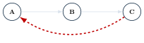{fig-alt="A,B,C가 삼각형으로 연결되고 C에서 A로 돌아가는 back edge가 강조된 다이어그램" width="45%"}

### DFS 위상 정렬



::: {.panel-tabset}
## 1단계

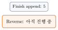{fig-alt="finish 순서에 5만 기록된 상태" width="30%"}

## 2단계

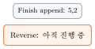{fig-alt="finish 순서에 5,2가 기록된 상태" width="30%"}

## 3단계

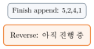{fig-alt="finish 순서에 5,2,4,1이 기록된 상태" width="30%"}

## 4단계

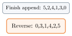{fig-alt="finish 순서가 완성되고 뒤집은 최종 위상 순서가 표시된 상태" width="30%"}
:::

::: {.callout-tip title="왜 reverse인가"}
Edge $u\to v$에서 cycle이 없다면 $v$의 DFS가 끝난 뒤 $u$가 끝나므로 $f[u]>f[v]$다. Decreasing
finish time은 edge 방향을 존중하므로, finish 순서를 뒤집으면 유효한 위상 순서가 된다.
:::

같은 그래프에서 Kahn은 $[0,1,2,3,4,5]$를, DFS 위상 정렬은 $[0,3,1,4,2,5]$를 반환한다 — 둘 다
유효한 위상 순서이지만 서로 다르다. **위상 순서는 유일하지 않다.**

| | Kahn | DFS |
|---|---|---|
| state | indegree | color, finish |
| cycle 신호 | processed $<V$ | GRAY back edge |
| order 제어 | queue/stack/min-heap | outer/adjacency order |
| storage | container | recursion stack |
| time (queue/stack) | $\Theta(V+E)$ | $\Theta(V+E)$ |
| time (min-heap) | $O(E+V\log V)$ | N/A |

위상 정렬은 prerequisite, build/package dependency, task dependency, DAG 최단경로에 쓰인다
(**동적 계획법 장의 DP evaluation order**와도 같은 개념이다 — Part M에서 다시 짚는다).
위상 순서만으로 resource와 duration을 고려한 최소 parallel schedule이 자동으로 나오지는
않는다는 점은 주의한다.

**구현**: 세 언어 모두 같은 6-vertex DAG를 쓰고, Kahn과 DFS 위상 정렬 두 결과를 함께 출력한다.

::: {.panel-tabset}
## Python
```{.python}



```
## Java
```{.java}

```
```{.java}

```
## C
```{.c}

```
```{.c}

```
:::

**실행 결과** (실제 컴파일·실행 캡처 — `gcc -Wall`, `javac`/`java`, `python3`):

::: {.panel-tabset}
## Python
```{.default}

```
## Java
```{.default}

```
## C
```{.default}

```
:::

::: {.callout-caution collapse="true" title="확인 문제: Part F Checkpoint"}
| 질문 | 답 |
|---|---|
| 위상 순서의 존재 조건은? | DAG |
| lexicographically smallest order에 쓸 container는? | min-heap |
| 두 방법의 cycle 신호는? | Kahn은 processed count, DFS는 GRAY back edge |
| min-heap Kahn의 list-graph 시간은? | $O(E+V\log V)$ |
:::

## Part G. Minimum Spanning Tree

::: {.callout-note title="전제"}
Undirected, connected graph $G=(V,E)$.
:::

**Spanning tree**는 모든 vertex를 포함하고 connected이며 acyclic이고 정확히 $|V|-1$개
edge를 가진다.

::: {.callout-warning title="Disconnected input"}
하나의 MST는 없다 — 각 component의 minimum spanning tree를 합친 **minimum spanning
forest(MSF)**는 가능하다.
:::

$$
T_{\mathrm{MST}}\in\arg\min_{T\text{ spanning tree}}\sum_{e\in T}w(e).
$$

::: {.callout-warning title="흔한 실수: MST에 source가 있다고 생각"}
MST는 특정 source에서의 path를 최소화하지 않는다 — 전체 tree edge weight의 합을 최소화한다.
:::

| | 목표 | source |
|---|---|---|
| MST | 전체 연결 edge 합 최소 | 없음 |
| shortest-path tree | source부터 각 path 최소 | 있음 |
| minimum-cost path | 한 source-target path 최소 | 있음 |

MST는 도로/광케이블/회로 배치, 클러스터링의 hierarchy, TSP 근사의 구성 요소로 쓰인다.
MST는 redundancy가 없으므로 edge 하나가 끊기면 취약하다 — fault tolerance에는 추가 edge가
필요하다.

**MST 기본 예제: A–G**:

$$
\{AB8,AC9,AD11,BE10,CD13,CE5,CF12,DF8,DG8,FG7\}.
$$

::: {.callout-tip title="Tie policy"}
동일 weight는 endpoint lexicographic order로 처리한다 — 다른 tie 순서를 쓰면 같은 optimum
weight를 갖는 다른 MST가 나올 수 있다.
:::

::: {.callout-caution collapse="true" title="확인 문제: Part G Checkpoint"}
| 질문 | 답 |
|---|---|
| $n$-vertex spanning tree edge 수는? | $n-1$ |
| disconnected graph에서 결과 이름은? | minimum spanning forest |
| MST에 source가 있는가? | 없다 |
:::

## Part H. Greedy와 Cut Property

::: {.callout-warning title="Greedy는 증명이 필요하다"}
동전 $\{1,3,4\}$로 6을 만들 때, greedy는 $4+1+1$(3개), optimal은 $3+3$(2개)다 — 그럴듯한
local choice가 항상 global optimum은 아니다.
:::

**Cut**은 vertex 집합을 $(S,V-S)$로 나눈 것이고, edge $(u,v)$는 $u\in S,\ v\notin S$이면 그
cut을 **crossing**한다.

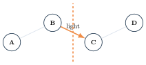{fig-alt="A-B, C-D가 각 그룹 안에서 연결되고 B에서 C로 향하는 crossing edge가 강조되며 그 사이에 cut 선이 그려진 다이어그램" width="50%"}

::: {.callout-tip title="Cut Property"}
현재 선택된 safe edge들과 양립하는 cut에서 가장 가벼운 crossing edge는 safe하다. Weight
tie이면 가장 가벼운 edge가 여러 개일 수 있고, 그중 하나를 선택해도 어떤 MST와는 양립한다.
:::

**Exchange Argument**: MST $T^*$가 light crossing edge $e$를 포함하지 않는다고 하자.

1. $T^*+e$는 cycle을 만든다.
2. 그 cycle에는 같은 cut을 건너는 다른 edge $f$가 있다.
3. $e$가 light edge이므로 $w(e)\le w(f)$.
4. $T'=T^*-f+e$도 spanning tree이고 $w(T')\le w(T^*)$.

따라서 $e$를 포함하는 MST가 존재한다. **Strict $<$가 아니라 $\le$이므로 tie도 포함한다** —
Dijkstra의 완화 조건과 마찬가지로 동점을 배제하지 않는다.

| | Prim | Kruskal |
|---|---|---|
| cut 관점 | 현재 한 tree와 outside 사이 cut의 light edge | 현재 forest component를 나누는 cut의 light feasible edge |

::: {.callout-caution collapse="true" title="확인 문제: Part H Checkpoint"}
| 질문 | 답 |
|---|---|
| greedy choice만으로 optimality가 보장되는가? | 아니다 |
| tie가 있으면 cut property가 깨지는가? | 아니다 |
| exchange에서 $e$를 추가하면 무엇이 생기는가? | cycle |
:::

## Part I. Prim Algorithm

::: {.callout-tip title="정렬 장의 heap이 여기서 돌아온다"}
Prim의 $Q$와(뒤에서 볼) Dijkstra의 우선순위 큐는 새 자료구조가 아니라 **정렬 장에서 다룬
(min-)heap**이다 — 정렬이 아니라 *동적 최소원소 추출기*로 쓴다.

| 연산 | 역할 | 비용 |
|---|---|---|
| ExtractMin() | 다음에 확정할 vertex 선택 | $\Theta(\log V)$ |
| DecreaseKey(v,k) | 더 싼 연결 발견 시 갱신 | $\Theta(\log V)$ |

전체 vertex $V$개를 꺼내고 edge $E$개마다 갱신하므로 $O((V+E)\log V)$다. 같은 heap이 상태공간
탐색 장의 A\*에서는 $f=g+h$를 key로 하는 min-PQ로 다시 등장한다.
:::

State: `key[v]`(현재 tree에 $v$를 연결하는 cheapest 단일 edge weight), `parent[v]`(그 edge의
tree-side endpoint), `Q`(아직 tree 밖에 있는 vertex의 min-priority queue).

::: {.callout-warning title="Dijkstra와 다름"}
Prim의 key는 **한 edge**의 weight이고, Dijkstra의 dist는 **source부터의 누적 path weight**다
— 이 둘을 혼동하지 않는다(Part P에서 다시 비교한다).
:::



**Prim Trace** (A–G 그래프, root $=A$; Extract A는 암묵적으로 $key[A]=0$에서 시작해
$B{:}8/A,\ C{:}9/A,\ D{:}11/A$를 갱신):

::: {.panel-tabset}
## 1단계

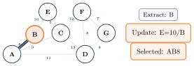{fig-alt="A-G 그래프에서 B가 추출되고 AB edge가 MST에 추가된 상태" width="70%"}

## 2단계

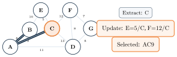{fig-alt="C가 추출되고 AC edge가 추가된 상태" width="75%"}

## 3단계

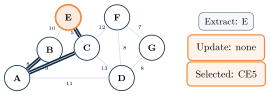{fig-alt="E가 추출되고 CE edge가 추가된 상태" width="65%"}

## 4단계

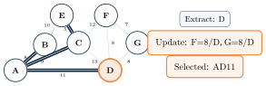{fig-alt="D가 추출되고 AD edge가 추가된 상태" width="70%"}

## 5단계

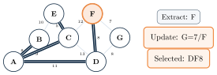{fig-alt="F가 추출되고 DF edge가 추가된 상태" width="70%"}

## 6단계

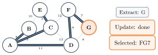{fig-alt="G가 추출되어 MST가 완성된 상태" width="65%"}
:::

$$
T=\{AB8,AC9,CE5,AD11,DF8,FG7\},\qquad w(T)=48.
$$

Edge 수 $=6=|V|-1$이고 connected이며 acyclic이고, 선택된 모든 edge가 실제로 입력에 존재한다.

::: {.callout-warning title="흔한 실수: Prim의 \"relaxation\"은 shortest-path relaxation이 아니다"}
$$
\text{if }w(u,v)<key[v]\text{ then }key[v]\gets w(u,v).
$$
$key[v]$에 $key[u]+w(u,v)$를 더하지 않는다 — current tree로 들어오는 가장 싼 **한 edge**만
비교한다.
:::

| implementation | time |
|---|---|
| binary heap + list | $O((V+E)\log V)$, connected면 $O(E\log V)$ |
| matrix + simple array | $O(V^2)$ |
| Fibonacci heap (이론) | $O(E+V\log V)$ |

**구현**: 세 언어 모두 같은 A–G 그래프를 쓴다(Kruskal과 코드+출력을 함께 묶어 아래에서 비교).

::: {.callout-caution collapse="true" title="확인 문제: Part I Checkpoint"}
| 질문 | 답 |
|---|---|
| Prim key의 의미는? | tree에 잇는 cheapest edge |
| parent를 왜 저장하는가? | 실제 MST edge 복원 |
| matrix Prim 비용은? | $O(V^2)$ |
:::

## Part J. Kruskal과 Disjoint Set

::: {.callout-note title="Mission"}
Edge를 가벼운 순서로 보고, 서로 다른 component를 잇는 edge만 accept해 forest를 합친다.
:::

Prim이 vertex priority로 tree를 키운다면, Kruskal은 **edge sorting**으로 forest를 합친다 —
cycle 검사는 DSU의 Find root 비교로 한다.



**Disjoint Set Union**: `MakeSet(x)`(singleton component), `Find(x)`(representative/root),
`Union(x,y)`(두 component 병합). Union by rank/size + path compression을 쓰면 amortized
$O(\alpha(V))$로, 실용적으로 거의 상수 시간이다.

Kruskal은 간선을 가중치 순으로 훑으며 "이 간선을 넣으면 사이클이 생기는가"를 매번 판정해야
한다. 이 판정을 빠르게 해주는 자료구조가 **Disjoint Set Union(DSU)**이다. 각 정점이 속한
컴포넌트를 대표원소(root)로 표현하고 두 연산을 제공한다 — `Find(x)`는 $x$가 속한 컴포넌트의
root를 반환하고, `Union(x, y)`는 두 컴포넌트를 하나로 합친다. 간선 $(u, v)$를 검사할 때
$Find(u) \ne Find(v)$이면 두 정점이 다른 컴포넌트에 있다는 뜻이므로 사이클 없이 안전하게
채택(accept)하고 `Union`으로 합친다. 같으면($Find(u) = Find(v)$) 이미 연결된 컴포넌트라
사이클이 생기므로 버린다(reject). 아래 애니메이션은 4개 정점 $\{A\}\{B\}\{C\}\{D\}$가 간선을
하나씩 처리하며 컴포넌트가 병합되는 과정을 보여준다.

**DSU Animation** (toy 4-vertex 예제 A, B, C, D — Kruskal의 A–G 그래프와는 별개의 작은 예시):

::: {.panel-tabset}
## 1단계

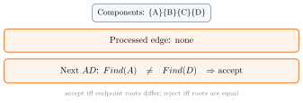{fig-alt="A와 B가 합쳐지고 C, D는 각각 독립인 상태" width="80%"}

## 2단계

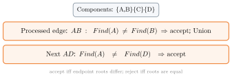{fig-alt="C와 D도 합쳐진 상태" width="80%"}

## 3단계

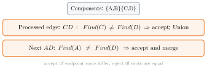{fig-alt="모든 vertex가 하나의 component로 합쳐진 상태" width="80%"}

## 4단계

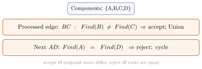{fig-alt="A와 D가 이미 같은 component라 reject되는 상태" width="80%"}
:::

**Kruskal Trace: A–G** (정렬된 edge: CE5, FG7, AB8, DF8, DG8, AC9, BE10, AD11, CF12, CD13):

::: {.panel-tabset}
## 1단계

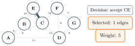{fig-alt="CE edge가 선택된 상태" width="70%"}

## 2단계

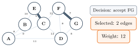{fig-alt="FG edge가 추가된 상태" width="70%"}

## 3단계

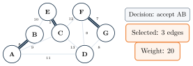{fig-alt="AB edge가 추가된 상태" width="70%"}

## 4단계

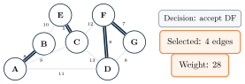{fig-alt="DF edge가 추가된 상태" width="70%"}

## 5단계

{fig-alt="DG edge가 이미 D-F-G로 연결되어 있어 reject되는 상태" width="70%"}

## 6단계

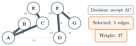{fig-alt="AC edge가 추가된 상태" width="70%"}

## 7단계

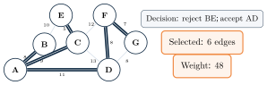{fig-alt="BE는 reject되고 AD가 추가되어 MST가 완성된 상태" width="75%"}
:::

`DG`는 이미 $D$–$F$–$G$로 같은 component이기 때문에 reject된다 — Kruskal도 Prim과 똑같이
$w(T)=48$에 도달하지만, 선택 방식(vertex 확장 vs edge 정렬)이 다르다.

- Accept 전 endpoint의 root가 다르다.
- Union 후 selected forest는 여전히 acyclic이다.
- Same-root edge는 cycle을 만들므로 reject한다.
- Connected graph에서 $V-1$개를 accept하면 종료한다.

$$
O(E\log E)+O(E\alpha(V))=O(E\log E).
$$

Simple graph는 $E\le V^2$이므로 $\log E=O(\log V)$, 따라서 $O(E\log V)$로도 쓸 수 있다.

**구현**: Prim과 Kruskal을 같은 A–G 그래프에서 함께 실행하고 결과를 비교한다.

::: {.panel-tabset}
## Python
```{.python}



```
## Java
```{.java}

```
```{.java}

```
## C
```{.c}

```
```{.c}

```
:::

**실행 결과** (실제 컴파일·실행 캡처 — `gcc -Wall`, `javac`/`java`, `python3`):

::: {.panel-tabset}
## Python
```{.default}

```
## Java
```{.default}

```
## C
```{.default}

```
:::

DSU 자체의 실행 결과(toy 예제, 위 애니메이션과 동일한 A, B, C, D 순서):

::: {.panel-tabset}
## Python
```{.python}

```
## Java
```{.java}

```
## C
```{.c}

```
:::

```{.default}

```

::: {.callout-caution collapse="true" title="확인 문제: Part J Checkpoint"}
| 질문 | 답 |
|---|---|
| $T$에 넣는 것은 vertex인가 edge인가? | $(u,v)$ edge |
| same-root edge는 왜 reject하는가? | cycle을 만들기 때문 |
| disconnected input 결과는? | minimum spanning forest |
:::

## Part K. MST Correctness와 비교

| | Prim | Kruskal |
|---|---|---|
| growth | one tree | forest merge |
| state | vertex key/parent | sorted edges, DSU |
| fit | matrix/dense도 자연스러움 | edge list/sparse |
| disconnected | 별도 restart 필요 | MSF 자연스럽게 생성 |
| tie | extract/key policy | edge order |

::: {.callout-tip title="MST Uniqueness"}
모든 edge weight가 distinct이면 MST는 unique다. 동일 weight가 있으면 여러 MST가 가능하지만,
모든 MST의 total weight는 같다.
:::

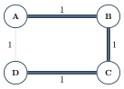{fig-alt="A,B,C,D가 정사각형으로 연결되고 모든 edge의 weight가 1로 표시된 다이어그램" width="30%"}

::: {.callout-warning title="흔한 실수: MST는 Shortest-Path Tree가 아니다"}
MST는 전체 selected edge 합이 최소이고, SPT(shortest-path tree)는 source-to-each-vertex path가
최소다. **MST 안의 두 vertex 사이 path가 원래 그래프의 shortest path일 필요는 없다.**
:::

MST Validator는 다섯 가지를 확인한다: selected edge 수가 $V-1$인지, DSU로 acyclic·connected인지,
모든 selected edge가 input에 존재하는지, total weight를 재계산해 일치하는지, 작은 그래프는
spanning-tree brute force oracle과 비교하는지.

::: {.callout-caution collapse="true" title="확인 문제: Part K Checkpoint"}
| 질문 | 답 |
|---|---|
| distinct weights이면 MST는? | unique |
| Prim/Kruskal 예제 optimum weight는? | 48 |
| MST path가 항상 shortest path인가? | 아니다 |
:::

## Part L. Shortest Paths와 Relaxation

$$
w(p)=\sum_{e\in p}w(e),\qquad \delta(s,v)=\min_{p:s\leadsto v}w(p).
$$

최단 경로 문제는 single-source, single-destination, single-pair, all-pairs로 나뉜다
(single-destination은 edge를 뒤집어 single-source로 바꿀 수 있다).

::: {.callout-warning title="Negative Cycle의 정확한 영향"}
Source에서 reachable한 negative cycle에서 target으로 갈 수 있으면 그 target의 infimum은
$-\infty$이고 finite shortest path가 없다. 그래프의 다른 component에 있는 negative cycle은
모든 source-target query를 무효로 만들지 않는다.
:::

**Relaxation**:

$$
\textbf{if }dist[u]\ne\infty\ \land\ dist[v]>dist[u]+w(u,v)
$$
$$
dist[v]\gets dist[u]+w(u,v),\qquad parent[v]\gets u.
$$

relaxation은 "$u$를 거쳐 $v$로 가는 경로가 지금까지 알던 것보다 짧은가"를 판정하는 연산이다.
$dist[u] + w(u, v)$가 **candidate**($u$ 경유 새 거리)이고, 이것이 기존 $dist[v]$보다 작으면
더 짧은 경로를 찾은 것이므로 $dist[v]$를 갱신하고 $parent[v]$를 $u$로 바꾼다. 아래 애니메이션은
$dist[u]=4$, $w(u, v)=-2$인 상황을 예로 든다 — candidate는 $4+(-2)=2$이고 기존 $dist[v]=7$보다
작으므로, 비교 후 $dist[v]$가 $2$로 갱신된다.

::: {.panel-tabset}
## 1단계

![$dist[u]=4,\ w(u,v)=-2$. Candidate $=2$, old $dist[v]=7$. compare.](../figures/08-graphs/17-relaxation-animation-step1.svg){fig-alt="dist[u]=4, w(u,v)=-2인 상태에서 후보값 2와 기존 dist[v]=7을 비교하는 상태" width="35%"}

## 2단계

![update $dist[v]=2,\ parent[v]=u$.](../figures/08-graphs/17-relaxation-animation-step2.svg){fig-alt="dist[v]가 2로 갱신되고 parent가 u로 설정되는 상태" width="40%"}

## 3단계

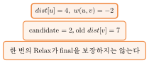{fig-alt="한 번의 relax만으로는 최종값이 아닐 수 있음을 알리는 상태" width="50%"}
:::

::: {.callout-warning title="흔한 실수: INF guard 없는 덧셈"}
Unreachable guard 없이 $\mathrm{INF}+w$를 계산하면 overflow와 false update가 가능하다 —
`dist[u]!=INF`를 항상 먼저 확인한다.
:::

**Invariant**: $dist[v]$는 실제 발견한 path weight이므로 $\delta(s,v)$보다 작아지지 않는다
(upper bound). Shortest path의 edge를 순서대로 relax하면 endpoint 값이 전달된다(path
relaxation). Parent edge를 역추적해 실제 path를 복원한다(predecessor).



Source에서 끝나면 valid reachable path이고, $dist=\infty$이면 unreachable이다. Negative cycle을
검출한 뒤에는 그 영향을 받은 parent chain을 finite shortest-path tree로 해석하지 않는다.

::: {.callout-caution collapse="true" title="확인 문제: Part L Checkpoint"}
| 질문 | 답 |
|---|---|
| Relax의 INF guard는 왜 필요한가? | overflow/false update 방지 |
| parent의 역할은? | 실제 path 복원 |
| unreachable distance는? | $\infty$ |
:::

## Part M. Unweighted·DAG Shortest Paths

모든 edge weight가 1이면 $dist[v]=$ source부터의 최소 edge 수다 — **BFS layer invariant가 곧
shortest-path correctness**다.

::: {.callout-warning title="흔한 실수: weighted graph에 BFS를 쓰면 틀릴 수 있다"}
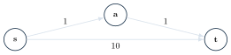{fig-alt="s에서 a를 거쳐 t로 가는 두 edge(각 weight 1)와 s에서 t로 직접 가는 weight 10 edge가 함께 그려진 다이어그램" width="55%"}
:::

**DAG Shortest Paths**: 위상 순서로 한 번씩만 relax한다.



- Cycle이 없으므로 negative cycle도 없다 — **DAG에서는 negative edge도 안전하게 허용된다.**
- 위상 순서가 모든 predecessor를 먼저 처리한다.
- 각 edge를 한 번만 relax하므로 adjacency list 기준 $\Theta(V+E)$다.

::: {.callout-tip title="동적 계획법 장과의 연결"}
위상 순서로 한 번씩 relax하는 이 evaluation order는 **동적 계획법 장의 DP evaluation order와
같은 구조**다 — 위상 순서는 "모든 의존 state가 먼저 계산되어 있는 순서"라는 DP의 요구사항을
그대로 만족시킨다. Relax 자체도 $dist[v]\gets\min(dist[v],\,dist[u]+w(u,v))$ 형태로, 동적
계획법 장에서 본 "현재 state를 더 작은 state들로부터 갱신"하는 DP transition과 같은 모양이다.
:::

DAG(방향 비순환 그래프)에서는 정점을 **topological order**로 나열한 뒤 그 순서대로 한 번씩
relax하면 최단 거리가 확정된다 — 각 정점을 처리할 때 그 정점으로 들어오는 모든 경로가 이미
처리돼 있기 때문이다. 사이클이 없으므로 Dijkstra의 우선순위 큐도, Bellman-Ford의 반복도 필요
없다. 아래 예는 topo order `s, a, b, c`를 따른다 — $s$를 relax하면 $d[a]=3$, $d[b]=2$가 되고,
$a$를 거쳐 $d[c]=3+(-4)=-1$(경로 $s \to a \to c$)이 확정된다. $b$를 거치는 후보 $d[b]+1=3$은
이미 확정된 $-1$보다 크므로 갱신하지 않는다. 음수 간선($-4$)이 있어도 topological order 덕분에
단 한 번의 pass로 정답을 얻는다.

**DAG Relaxation Trace** — $s\to a:3,\ s\to b:2,\ a\to c:-4,\ b\to c:1$, topo order $s,a,b,c$:

::: {.panel-tabset}
## 1단계

![after $s$: $d[a]=3,d[b]=2$.](../figures/08-graphs/19-dag-relaxation-trace-step1.svg){fig-alt="s를 처리한 뒤 a와 b의 거리가 갱신된 상태" width="40%"}

## 2단계

![after $a$: $d[c]=-1$.](../figures/08-graphs/19-dag-relaxation-trace-step2.svg){fig-alt="a를 처리한 뒤 c의 거리가 -1로 갱신된 상태" width="40%"}

## 3단계

![after $b$: candidate 3, no update. answer $d[c]=-1$, path $s\to a\to c$.](../figures/08-graphs/19-dag-relaxation-trace-step3.svg){fig-alt="b를 처리했지만 후보값 3이 기존 -1보다 크므로 갱신되지 않는 최종 상태" width="40%"}
:::

**구현**: 세 언어 모두 같은 4-vertex DAG($s,a,b,c$)를 쓴다.

::: {.panel-tabset}
## Python
```{.python}

```
## Java
```{.java}

```
## C
```{.c}

```
:::

**실행 결과** (실제 컴파일·실행 캡처 — `gcc -Wall`, `javac`/`java`, `python3`):

::: {.panel-tabset}
## Python
```{.default}

```
## Java
```{.default}

```
## C
```{.default}

```
:::

::: {.callout-caution collapse="true" title="확인 문제: Part M Checkpoint"}
| 질문 | 답 |
|---|---|
| unweighted SP 알고리즘은? | BFS |
| DAG SP가 negative edge를 허용하는 이유는? | cycle이 없고 topo order로 relax하기 때문 |
| DAG SP list 복잡도는? | $\Theta(V+E)$ |
:::

## Part N. Dijkstra Algorithm

::: {.callout-warning title="전제"}
$$
\forall (u,v)\in E,\qquad w(u,v)\ge0.
$$
:::

::: {.callout-tip title="핵심"}
Minimum tentative distance vertex를 extract하면 그 distance가 final이다.
:::

::: {.callout-warning title="흔한 실수: Discovered $\ne$ Finalized"}
priority queue에 들어갔다는 이유만으로 final이 아니다 — extract된 뒤에도 stale entry(현재
$dist$와 다른 값)일 수 있다.
:::



::: {.callout-tip title="정렬 장의 heap이 여기서도 다시 쓰인다"}
Prim에서 다시 쓴 정렬 장의 min-heap이 Dijkstra의 ExtractMin/Insert 자료구조로 그대로 이어진다 —
"discovered ≠ finalized" 문제 때문에 stale entry를 만나면 조용히 버리고 계속 진행한다는 점만
Prim의 단순 ExtractMin/DecreaseKey와 다르다.
:::

**고정 Dijkstra 예제** — directed edges: $SA4,\ SB2,\ BA1,\ AC5,\ BC8,\ BD10,\ CD2,\ CE6,\ DE3$.

::: {.callout-tip title="Tie policy"}
PQ는 $(distance, vertex)$ lexicographic 순서다. Stale entry는 extract 후 현재 $dist$와
다르면 버린다.
:::

::: {.panel-tabset}
## 1단계

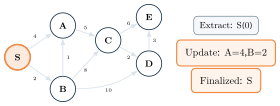{fig-alt="S가 finalize되고 A,B의 거리가 초기 갱신된 상태" width="70%"}

## 2단계

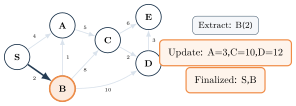{fig-alt="B가 finalize되고 A가 3으로 더 짧게 갱신된 상태" width="75%"}

## 3단계

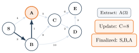{fig-alt="A가 finalize되고 C가 8로 갱신된 상태" width="70%"}

## 4단계

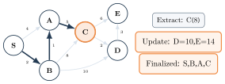{fig-alt="C가 finalize되고 D,E가 갱신된 상태" width="70%"}

## 5단계

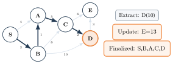{fig-alt="D가 finalize되고 E가 13으로 더 짧게 갱신된 상태" width="70%"}

## 6단계

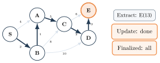{fig-alt="모든 vertex가 finalize된 최종 상태" width="65%"}
:::

$$
\begin{array}{c|rrrrrr}v&S&A&B&C&D&E\\\hline dist&0&3&2&8&10&13\\parent&-&B&S&A&C&D\end{array}
$$
$$
S\to B\to A\to C\to D\to E,\qquad 2+1+5+2+3=13.
$$

::: {.callout-tip title="왜 nonnegative가 필요한가"}
Minimum tentative $u$보다 더 짧은 path가 미확정 영역을 거쳐 온다면, 그 path의 첫 미확정
vertex는 nonnegative prefix 때문에 $u$보다 작은 tentative bound를 가져야 한다 — 모순이다.
:::

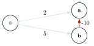{fig-alt="s에서 a로 직접(2), s에서 b로(5), b에서 a로 음수(-10) edge가 그려진 다이어그램" width="35%"}

::: {.callout-warning title="흔한 실수: negative edge에 Dijkstra를 그대로 적용"}
$a$는 distance 2로 먼저 finalize된다. 나중에 $b=5$에서 $b\to a=-10$을 보면 candidate는
$-5$지만, 이미 finalize된 $a$를 다시 열지 않는다. **정확한 결론**: negative edge가 있는 모든
그래프에서 수치가 반드시 틀린다는 뜻은 아니다 — Dijkstra의 correctness 보장이 사라진다는
뜻이다.
:::

| implementation | time |
|---|---|
| decrease-key heap + list | $O((V+E)\log V)$ |
| stale-entry heap | $O(E\log E)$, simple graph에서는 $O(E\log V)$ |
| array/matrix | $O(V^2)$ |

입력의 negative weight는 먼저 reject한다.

**구현**: 세 언어 모두 같은 6-vertex 예제 그래프를 쓴다(Bellman-Ford와 함께 아래에서 비교).

::: {.callout-caution collapse="true" title="확인 문제: Part N Checkpoint"}
| 질문 | 답 |
|---|---|
| PQ entry가 곧 finalized인가? | 아니다 |
| stale entry 판정은? | $du\ne dist[u]$ |
| 언제 $finalized[u]$를 true로 바꾸는가? | 유효한 minimum entry를 extract한 뒤 |
| negative edge에서 보장이 유지되는가? | 아니다 |
:::

## Part O. Bellman–Ford Algorithm

Negative edge를 허용하고, reachable negative cycle이 없으면 finite shortest path를 계산하며,
reachable negative cycle을 검출할 수 있다.

::: {.callout-warning title="표준 알고리즘"}
각 pass에 모든 edge를 순회한다 — queue-based SPFA와 섞지 않는다.
:::



::: {.callout-tip title="왜 |V|-1 pass인가"}
Reachable negative cycle이 없으면 shortest path를 simple path로 선택할 수 있고, simple
path는 최대 $|V|-1$개 edge다 — 반복되는 full pass가 path relaxation을 전달한다.
:::

::: {.callout-warning title="흔한 실수: pass 수를 edge 수로 오해"}
In-place edge 순서에 따라 한 pass에서 여러 edge가 연속 반영될 수 있다 — pass $k$가 정확히
$k$-edge path만을 뜻하지는 않는다.
:::

**Bellman-Ford 고정 예제** — vertices $s,a,b,c,d$; edge 순서(본문 트레이스가 쓰는 순서):

$$
(c,d,2),(a,c,-2),(b,c,3),(s,a,4),(s,b,5),(b,d,6).
$$

$$
\begin{array}{c|rrrrr}&s&a&b&c&d\\\hline
initial&0&\infty&\infty&\infty&\infty\\
pass~1&0&4&5&\infty&11\\
pass~2&0&4&5&2&11\\
pass~3&0&4&5&2&4\\
pass~4&0&4&5&2&4
\end{array}
$$

Pass 4에서 `changed=false`이므로 early exit한다. 정답: $dist=[0,4,5,2,4]$, path to $d$:
$s\to a\to c\to d$.

::: {.callout-note}
이 책의 Java/C 라이브러리 함수(`bellmanFord`/`graph_bellman_ford`)는 이 강의의 다른 모든
알고리즘처럼 항상 도착 vertex 오름차순으로 정렬된 adjacency list를 순회한다(BFS/DFS 순서
재현성을 위한 설계) — 그 결과 실제 edge 처리 순서는 위 트레이스가 쓰는 입력 순서와 다르다.
**최종 수렴 결과(최단 거리)는 edge 순서에 무관하게 항상 같지만, pass별 중간 스냅샷은 순서에
의존한다.** 아래 구현의 실행 결과는 최종 `dist`/경로만 보여준다 — 위 pass 트레이스와 같은
결론(같은 최종 거리와 경로)에 도달하지만, 중간 과정까지 한 줄씩 재현하지는 않는다.
:::

**Reachable Negative Cycle**: $s\to a{:}1,\ a\to b{:}-2,\ b\to a{:}-2$.

::: {.panel-tabset}
## 1단계

{fig-alt="V-1 패스 이후에도 relax가 가능하다는 안내와 a에서 b로 가는 edge를 조사하는 상태" width="55%"}

## 2단계

{fig-alt="negative cycle이 검출되었다는 붉은 강조 상태" width="55%"}
:::

::: {.callout-tip title="Bellman-Ford의 DP 해석 — 동적 계획법 장의 회수"}
$$
D_0(s)=0,\quad D_0(v)=\infty\ (v\ne s)
$$
$$
D_k(v)=\min\left(D_{k-1}(v),\ \min_{(u,v)\in E}\{D_{k-1}(u)+w(u,v)\}\right).
$$
이 recurrence는 **동적 계획법 장에서 배운 DP 다섯 요소**로 그대로 읽힌다 — state는 $(k,v)$("최대
$k$개 edge를 쓸 때 $v$까지의 최단 거리"), transition은 위 $\min$ 식, base는 $D_0$, evaluation
order는 $k=0,1,\dots,|V|-1$, answer는 $D_{|V|-1}(v)$다. **$D_{k-1}(v)$ 항(edge를 추가하지
않는 선택)을 빠뜨리면 안 된다** — 이 식은 각 pass가 오직 이전 row만 읽는 synchronous DP이고,
표준 in-place Bellman-Ford는 같은 pass의 앞선 update를 뒤 edge가 즉시 사용할 수 있다는 점만
다르다.
:::

$$
\Theta(VE)\text{ worst-case time},\qquad \Theta(V)\text{ arrays}.
$$

Early exit는 쉬운 입력의 시간을 줄일 수 있지만 worst case는 유지된다. Negative-cycle detection
pass는 $O(E)$다.

**구현**: 세 언어 모두 같은 5-vertex 예제 그래프를 쓰고, Dijkstra와 Bellman-Ford, negative
cycle 검출까지 함께 출력한다.

::: {.panel-tabset}
## Python
```{.python}



```
## Java
```{.java}

```
```{.java}

```
## C
```{.c}

```
```{.c}

```
:::

**실행 결과** (실제 컴파일·실행 캡처 — `gcc -Wall`, `javac`/`java`, `python3`):

::: {.panel-tabset}
## Python
```{.default}

```
## Java
```{.default}

```
## C
```{.default}

```
:::

::: {.callout-caution collapse="true" title="확인 문제: Part O Checkpoint"}
| 질문 | 답 |
|---|---|
| negative edge를 허용하는가? | 예 |
| cycle detection은 언제 하는가? | $V-1$ passes 후 extra pass |
| DP recurrence에 빠지면 안 되는 항은? | $D_{k-1}(v)$ |
:::

## Part P. 알고리즘 선택과 종합 비교

| Algorithm | Graph condition | Negative edge | Time (list) |
|---|---|---|---|
| BFS | unweighted or unit-weight | N/A | $\Theta(V+E)$ |
| DAG SP | DAG | 허용 | $\Theta(V+E)$ |
| Dijkstra | weighted | 금지 | $O(E\log V)$ heap |
| Bellman–Ford | weighted | 허용 | $\Theta(VE)$ |
| Floyd–Warshall | all pairs | 허용 | $\Theta(V^3)$ |

| method | signal |
|---|---|
| DAG SP | cycle이면 topo sort 자체가 실패 |
| Dijkstra | negative edge를 입력에서 reject |
| Bellman–Ford | extra pass relaxation 가능 |
| Floyd–Warshall (미리보기) | $dist[v][v]<0$ |

| | Prim | Dijkstra |
|---|---|---|
| value | $key[v]$ | $dist[v]$ |
| meaning | cheapest one edge | cheapest cumulative path |
| update | $w(u,v)<key[v]$ | $dist[u]+w<dist[v]$ |
| result | MST | shortest-path tree |

| Traversal | MST | Shortest Path |
|---|---|---|
| reachability/order | total connection cost | source-to-target path cost |

::: {.callout-warning title="흔한 실수 모음 I — 표현·순회·위상정렬"}
matrix row/column 방향 반전; $0$을 no-edge와 zero-weight edge에 동시에 사용; BFS visited를
dequeue 시 표시; concrete BFS/DFS order를 유일하다고 생각; discovery와 finish order 혼동;
boolean visited로 directed cycle 판정; cycle graph에서 topo partial output 반환.
:::

::: {.callout-warning title="흔한 실수 모음 II — MST·최단경로"}
Prim parent edge 누락, key와 dist 혼동; Kruskal DSU 없이 cycle 판정; MST와 SPT 혼동; negative
edge에 Dijkstra 적용; Bellman-Ford의 extra cycle pass 누락; $\mathrm{INF}+w$ overflow;
복잡도에서 표현/PQ 조건 생략.
:::

::: {.callout-caution collapse="true" title="확인 문제: Part P Checkpoint"}
| 질문 | 답 |
|---|---|
| negative edge가 있는 DAG에는? | DAG shortest path |
| nonnegative weighted graph에는? | Dijkstra |
| reachable negative cycle 검출에는? | Bellman–Ford |
:::

## 개념 지도

이 장은 하나의 그래프 $G=(V,E)$에서 출발해 세 갈래로 뻗어나간다: **순회**(BFS/DFS, 위상
정렬)는 도달 가능성과 순서를, **MST**(Prim/Kruskal)는 전체 연결 비용을, **최단 경로**(DAG
SP/Dijkstra/Bellman-Ford)는 source-to-target 비용을 다룬다. 세 갈래 모두 "표현(matrix/list)과
자료구조(heap/DSU) 조건을 함께 말해야 복잡도가 정확하다"는 원칙으로 수렴한다.

## 💡 배움 포인트

- 알고리즘 이름만으로 복잡도를 말하지 않는다 — 항상 표현(matrix/list)과 함께 말한다.
- BFS는 enqueue 시 발견 표시, DFS는 discovery/finish/recursion stack을 구분한다 — 구체적
  순회 순서는 adjacency order에 의존하지만 BFS distance와 DFS의 정확성은 그렇지 않다.
- 위상 정렬은 유일하지 않다 — Kahn과 DFS 기반 방법이 서로 다른 유효한 순서를 낼 수 있다.
- MST(Prim/Kruskal)는 정렬 장의 heap을 다시 쓰고, cut property의 exchange argument로 정당화된다
  — MST는 shortest-path tree가 아니다.
- Dijkstra는 nonnegative weight를 전제하고, Bellman-Ford는 negative edge를 허용하며 동적
  계획법 장의 DP recurrence로 재해석된다 — DAG에서는 위상 순서로 relax하면 negative edge도 안전하다.

## 🧪 직접 해보기

::: {.callout-caution collapse="true" title="Graph Basics·Traversal Quiz"}
1. weighted matrix에서 no-edge는 무엇으로 표현할까?
2. BFS에서 vertex를 언제 discovered로 표시할까?
3. adjacency order가 바뀌면 BFS distance가 바뀌는가?
4. directed cycle의 DFS 증거는?
5. list 기준 DFS 복잡도는?

**정답**

1. $\infty$ sentinel 또는 별도 boolean.
2. enqueue할 때.
3. 아니다 — distance는 유지되고, 같은 layer의 순서/parent만 달라질 수 있다.
4. GRAY back edge.
5. $\Theta(V+E)$.
:::

::: {.callout-caution collapse="true" title="DAG·MST Quiz"}
1. Kahn 결과 길이가 $V$보다 작으면?
2. min-heap Kahn의 list-graph 시간은?
3. DFS 위상 정렬에서 order는 무엇의 reverse인가?
4. Prim key와 Dijkstra dist의 차이는?
5. Kruskal에서 edge $DG8$은 왜 reject했는가?
6. A–G MST total은?

**정답**

1. directed cycle이 있다는 뜻이다.
2. $O(E+V\log V)$.
3. finish order.
4. one-edge key vs 누적 path dist.
5. $D$와 $G$가 이미 $D$-$F$-$G$로 같은 component이기 때문.
6. 48.
:::

::: {.callout-caution collapse="true" title="Shortest Paths Quiz"}
1. weighted graph에 BFS가 틀릴 수 있는 이유는?
2. Dijkstra의 필수 weight 조건은?
3. Bellman-Ford는 negative cycle을 어떻게 찾는가?
4. $dist[u]=\infty$일 때 Relax를 건너뛰는 이유는?
5. $E$가 negative edge를 가진 DAG라면 어떤 알고리즘인가?

**정답**

1. edge 수가 적은 path가 weight 합은 더 클 수 있기 때문(edge count $\ne$ weight sum).
2. 모든 edge가 nonnegative여야 한다.
3. $V-1$ passes 뒤에 한 번 더 relax가 가능한지 검사한다.
4. INF 연산에서 overflow/false update를 방지하기 위해.
5. topological-order DAG shortest path.
:::

::: {.callout-tip collapse="true" title="Exit Ticket"}
오늘 배운 세 갈래(순회·MST·최단경로) 중, Prim/Dijkstra의 heap이나 Bellman-Ford의 DP처럼
이전 장과 다시 연결된 부분 하나를 골라 그 연결을 한 문장으로 적어 보자.
:::

## 요약

그래프는 matrix(dense, $\Theta(V^2)$)와 list(sparse, $\Theta(V+E)$)로 표현하며, 어떤 알고리즘의
복잡도든 표현을 함께 말해야 정확하다. BFS는 enqueue 시 발견을 표시해 unweighted shortest-path
distance를 층별로 계산하고, DFS는 discovery/finish time과 recursion stack으로 tree/back/
forward/cross edge를 구분해 directed cycle(GRAY back edge)과 위상 정렬을 만들어낸다 — Kahn과
DFS 기반 위상 정렬은 서로 다른 유효한 순서를 낼 수 있다. Minimum Spanning Tree는 cut
property의 exchange argument로 정당화되며, Prim(vertex key + 정렬 장의 heap)과 Kruskal(edge
정렬 + DSU)은 같은 A–G 예제에서 같은 optimum weight 48에 도달한다 — MST는 source가 없고
shortest-path tree와 다르다. 최단 경로는 relaxation 하나로 통일되지만 전제가 다르다: BFS는
unweighted, DAG SP는 위상 순서 relax(동적 계획법 장의 DP evaluation order와 같은 구조), Dijkstra는
nonnegative weight(정렬 장의 heap을 다시 쓴다), Bellman-Ford는 negative edge를 허용하고 $|V|-1$
pass 뒤 한 번 더 relax해 negative cycle을 검출하며 동적 계획법 장의 DP recurrence로 재해석된다.
