## 🎯 학습목표

- text, pattern, alphabet, occurrence, shift를 정의하고 Naive의 alignment 수와 comparison 수를 구분한다.
- rolling hash로 O(1) window update를 유도하고, hash collision을 candidate로만 다뤄야 하는 이유를 설명한다.
- prefix, suffix, proper prefix, border를 구분하고 LPS를 만들어 KMP fallback을 추적한다.
- KMP의 Θ(n+m) worst-case 보장을 설명하고, full Boyer-Moore와 Horspool을 구분한다.
- Horspool shift table과 오른쪽부터의 비교를 추적하고, workload와 alphabet에 맞는 matcher를 선택한다.

## Part A. Exact String Matching 문제

::: {.callout-tip title="Mission"}
이미 비교한 정보를 재사용하여 불필요한 character comparison을 줄일 수 있는가?
:::

| 검색 | 분석 | 시스템 | 확장 |
|---|---|---|---|
| editor find, grep, log scan, document index | DNA, plagiarism, signature detection | lexer, intrusion signature, monitoring | multi-pattern, approximate, 2D matching |

$$T[0..n-1],\qquad P[0..m-1],\qquad T[i],P[j]\in\Sigma$$

Text index $i$는 현재 읽는 text 위치, pattern index $j$는 현재 비교하는 pattern 위치, shift $s$는 pattern 시작을 $T[s]$에 맞춘 alignment다.

::: {.callout-warning title="구현과 trace는 0-based indexing으로 통일한다"}
전체 장이 0-based를 쓴다. 1-based로 적힌 원본 표현은 모두 0-based로 교정했다.
:::

::: {.callout-note title="정의: Exact Occurrence"}
$$P\text{ occurs at }s \iff \forall j\in\{0,\ldots,m-1\},\quad T[s+j]=P[j]$$

$$0\le s\le n-m,\qquad\text{alignment 수}=n-m+1\quad(m\le n)$$

alignment는 검사할 후보 위치이고, occurrence는 모든 문자가 실제로 일치한 alignment다.
:::

API 정책을 먼저 정한다 — 경계 정책이 없으면 같은 알고리즘도 구현·테스트 결과가 달라진다.

| 상황 | 이 장의 policy |
|---|---|
| first match, empty pattern | 0 |
| all matches, empty pattern | $[0]$로 문서화 |
| $m>n$ | no match |
| first match 없음 | $-1$ / C에서는 `SIZE_MAX` |
| all matches 없음 | empty list |

::: {.callout-caution collapse="true" title="확인 문제"}
$T=\texttt{AAAAA}, P=\texttt{AAA}$의 all-match 결과는?

**답**: $[0,1,2]$ (overlapping occurrence를 포함한다).
:::

## Part B. Naive Matching



Naive alignment trace: $s=0$에서 $C\ne A$ mismatch → $s=1$에서 비교 시작 → $A=B=A$ prefix 확인 → match 확정까지 4단계.

::: {.panel-tabset}
## 1단계

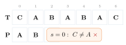{fig-alt="s=0에서 C와 A가 mismatch로 표시된 1단계 상태" width="45%"}

## 2단계

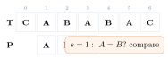{fig-alt="s=1에서 A와 B를 비교하는 상태" width="45%"}

## 3단계

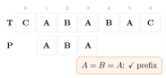{fig-alt="s=1에서 A,B,A 세 문자가 prefix로 확인되는 상태" width="45%"}

## 4단계

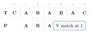{fig-alt="C,A,B,A,B,A,C 텍스트 위에서 s=1에 A,B,A 패턴을 맞춰 세 문자가 모두 일치해 match로 확정되는 4단계 트레이스의 마지막 상태" width="45%"}
:::

$$\#alignments=n-m+1,\qquad\#comparisons\le(n-m+1)m$$

alignment 하나가 곧 comparison 하나는 아니다 — mismatch 위치에 따라 같은 alignment의 비용이 달라진다.

`T=AAAAAAAAAAB`, `P=AAAAAB`에서 각 shift가 5개의 A를 재확인하다가 $s=5$에서 match하는 최악 예 3단계.

::: {.panel-tabset}
## 1단계

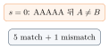{fig-alt="s=0에서 AAAAA까지 5개가 일치한 뒤 마지막에서 mismatch가 나는 상태" width="30%"}

## 2단계

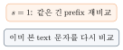{fig-alt="s=1에서 이미 비교했던 text 문자를 다시 비교하는 상태" width="30%"}

## 3단계

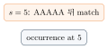{fig-alt="AAAAA 반복 뒤 mismatch가 나는 최악 사례에서 s=5에 이르러 occurrence를 찾는 3단계 트레이스의 마지막 상태" width="30%"}
:::

::: {.callout-warning title="중복 비교의 원인"}
일치했던 prefix 정보를 다음 shift에서 버리는 것이 중복 비교의 원인이다.
:::

$$\text{worst } \Theta((n-m+1)m)=O(nm),\qquad\text{best } \Theta(n-m+1)=O(n)$$

$m$이 고정이거나 $m\le cn$인 상수 $c<1$이면 best는 $\Theta(n)$으로 쓸 수 있다. space는 $\Theta(1)$(result 제외)이다.

**구현**: `T="acebbceeaabceedb"`, `P="eeaab"` 고정 예제(occurrence 6)로 검증한다.

::: {.panel-tabset}
## Python
```{.python}

```
## Java
```{.java}

```
## C
```{.c}

```
:::

**실행 결과** (실제 컴파일·실행 캡처 — `gcc -Wall`, `javac`/`java`, `python3`):

::: {.panel-tabset}
## Python
```{.default}

```
## Java
```{.default}

```
## C
```{.default}

```
:::

::: {.callout-caution collapse="true" title="확인 문제: Naive Matching Checkpoint"}
1. $n=12,m=4$이면 alignment 수는?
2. worst에서 한 alignment의 최대 comparison은?
3. overlapping occurrence를 허용하면 match 후 shift는?

**답**: 1. 9. 2. 4. 3. 다음 $s+1$도 검사한다.
:::

## Part C. 중복 비교는 왜 생기는가?

Naive는 shift마다 $j=0$으로 재시작하여 이전 matched prefix를 잊는다. Rabin-Karp는 window hash를, KMP는 border 정보를 재사용한다.

$$\text{Naive 직접 비교}\to\text{Rolling Hash}\to\text{Prefix/Suffix 재사용}\to\text{Character Skip}$$

| 질문 | Rabin-Karp | KMP |
|---|---|---|
| 무엇을 저장? | window fingerprint | matched prefix의 border |
| 어떻게 건너뜀? | hash 불일치 즉시 제외 | pattern index fallback |
| 추가 확인? | hash hit verification | 직접 character match |
| 보장 | expected linear 조건부 | worst-case linear |

::: {.callout-note title="확인 문제"}
Rolling Hash는 window 값을, KMP는 prefix/suffix를, Horspool은 mismatch character를 이용한다.
:::

## Part D. Rabin-Karp의 기본 아이디어

::: {.callout-tip title="Mission"}
각 window를 숫자 fingerprint로 요약해 대부분의 alignment를 값 하나로 제외한다.
:::

$$\text{equal strings}\Rightarrow\text{equal hash},\qquad\text{equal hash}\not\Rightarrow\text{equal strings}$$

::: {.callout-note title="정의: Candidate와 Verified Match"}
**pattern hash**는 $P$의 fingerprint, **window hash**는 $T[s..s+m-1]$의 fingerprint다. 두 hash가 같으면 **candidate hit**, 실제 문자도 모두 같으면 **valid hit**, hash만 같은 collision이면 **spurious hit**이다.
:::

$$\Sigma=\{a,b,c,d,e\},\quad code(a)=0,\ldots,code(e)=4,\quad d=5$$

`cad`를 5진법 자리값 $(2,0,3)_5$로 인코딩해 $2\cdot5^2+0\cdot5+3=53$을 계산하는 2단계.

::: {.panel-tabset}
## 1단계

{fig-alt="cad를 5진법 자리값 2,0,3으로 표현하는 1단계 상태" width="45%"}

## 2단계

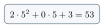{fig-alt="cad를 5진법 자리값으로 표현한 뒤 2*25+0*5+3=53을 계산하는 2단계 트레이스의 마지막 상태" width="45%"}
:::

::: {.callout-warning title="원본 교정"}
원본의 `cad=28`은 계산 오류이며 정확한 값은 **53**이다.
:::

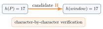{fig-alt="h(P)=17과 h(window)=17이 candidate 화살표로 이어지고 character-by-character verification이 필요하다는 설명이 붙은 다이어그램" width="50%"}

::: {.callout-warning title="흔한 실수"}
hash equality만으로 match를 확정하면 exact matcher가 아니다 — 반드시 verification이 필요하다.
:::

::: {.callout-caution collapse="true" title="확인 문제: Rabin-Karp Checkpoint"}
1. 같은 string이면 hash도 같은가?
2. 같은 hash이면 string도 같은가?
3. candidate hit 다음 단계는?

**답**: 1. 예. 2. 반드시 그렇지 않다. 3. 실제 문자 verification.
:::

## Part E. Rolling Hash

$$value(x)=x[0]d^{m-1}+\cdots+x[m-1],\qquad v\gets0;\ v\gets d\,v+code(c)\ \text{for each }c$$

power를 매번 만들지 않고 initial pattern/window value를 $\Theta(m)$에 계산한다.

::: {.callout-tip title="다리: 해시 테이블 장의 Horner 다항식 해시"}
해시 테이블 장에서 문자열 hash function으로 다룬 Horner's rule(`hash = hash*B + code(c)`)과 완전히 같은 식이다. 그 장에서는 정적 fingerprint 하나만 계산했지만, 여기서는 window가 한 칸씩 움직일 때마다 **다시 계산하지 않고 갱신**하는 rolling hash로 확장한다.
:::

$$current=value(T[s..s+m-1]),\qquad h=d^{m-1}$$

rolling update 유도 3단계: leading contribution 제거 → 남은 digit을 왼쪽으로 shift → 새 trailing character 추가.

::: {.panel-tabset}
## 1단계

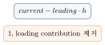{fig-alt="current에서 leading 항을 빼는 1단계 상태" width="45%"}

## 2단계

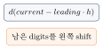{fig-alt="남은 값에 d를 곱해 왼쪽으로 shift하는 상태" width="45%"}

## 3단계

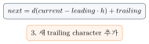{fig-alt="current에서 leading 항을 빼고 d를 곱한 뒤 trailing 문자를 더해 next 값을 얻는 3단계 트레이스의 마지막 상태" width="45%"}
:::

{fig-alt="old T[s] 기여 제거, x d, new T[s+m] 추가 세 상자가 화살표로 이어진 흐름도" width="60%"}

이전 window value와 미리 계산한 $h=d^{m-1}$만 있으면 재사용할 수 있다.

::: {.callout-warning title="단서"}
큰 정수를 그대로 쓰면 arithmetic 자체가 constant time이 아닐 수 있다.
:::

::: {.callout-note title="Rolling-Hash Invariant"}
shift $s$ 시작 시 $tHash$는 정확히 $T[s..s+m-1]$의 polynomial hash다.
:::

::: {.callout-caution collapse="true" title="확인 문제"}
initial $\Theta(m)$ 뒤 각 window update는 fixed-width modular arithmetic에서 $O(1)$이다.
:::

## Part F. Modular Hash와 Collision

$$value(x)=\Theta(d^m)\quad\Rightarrow\quad hash(x)=value(x)\bmod q$$

modulus는 **저장되는 hash 값**을 $0,\ldots,q-1$로 제한한다. intermediate multiplication/subtraction은 구현에서 별도로 overflow를 피해야 한다. $q$가 작을수록 collision 가능성이 커지며 $d,q$와 input 가정이 expected cost에 영향을 준다.

$$h=d^{m-1}\bmod q,\qquad next=\bigl(d(current-code(T[s])h)+code(T[s+m])\bigr)\bmod q$$

$$\operatorname{normalizedMod}(x,q)=((x\bmod q)+q)\bmod q$$

::: {.callout-warning title="Negative Remainder 함정"}
Java/C의 remainder는 $-3\bmod5$처럼 음수일 수 있다. 안전한 구현은 unsigned modular subtraction을 쓰거나, update 후 `hash<0`이면 $q$를 더한다.
:::

$h(P)=h(W)$이면 candidate일 뿐이고, $P\ne W$로 판명되면 collision(spurious hit)임을 보여주는 2단계.

::: {.panel-tabset}
## 1단계

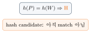{fig-alt="hash가 같아 candidate로 표시된 1단계 상태" width="35%"}

## 2단계

{fig-alt="hash가 같아 candidate로 표시된 뒤 실제로는 문자열이 달라 collision으로 확정되는 2단계 트레이스의 마지막 상태" width="35%"}
:::

::: {.callout-tip title="Exactness"}
collision이 많으면 느려질 뿐, verification이 있으면 결과의 정확성은 유지된다.
:::

## Part G. Rabin-Karp 분석과 활용



`RabinKarp`가 candidate hit마다 부르는 `EqualAt(T,P,s)`는 별도의 formal한 절차로 정의되지 않는다 — Part B의 Naive가 이미 보여준 `T[s+j]=P[j]` 문자별 비교와 정확히 같은 동작이다. 해시 테이블 장의 `Probe`가 linear/quadratic/double hashing 중 어떤 것으로도 채워질 수 있는 자리였던 것처럼, 여기서도 이름만 정해두고 본문에서 관계를 설명하는 편이 자연스럽다.

$$T=\texttt{acebbceeaabceedb},\quad P=\texttt{eeaab},\quad d=5,\ q=113$$

$$value(P)=3001,\quad pHash=3001\bmod113=63,\quad h=5^4\bmod113=60$$

첫 window `acebb`: raw 356, $tHash=17$.

| $s$ | 0 | 1 | 2 | 3 | 4 | 5 | 6 | 7 | 8 | 9 | 10 | 11 |
|---|---|---|---|---|---|---|---|---|---|---|---|---|
| $tHash$ | 17 | 87 | 65 | 33 | 91 | 42 | 63 | 21 | 39 | 86 | 94 | 58 |

한 update 예: $s=0\to1$: $(5(17-0\cdot60)+2)\bmod113=87$.

$s=6$에서 $tHash=pHash=63$인 candidate가 실제 문자 5개 모두 일치해 occurrence 6으로 확정되는 2단계.

::: {.panel-tabset}
## 1단계

{fig-alt="s=6에서 hash가 일치한 candidate eeaab를 검증하기 시작하는 1단계 상태" width="45%"}

## 2단계

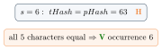{fig-alt="s=6에서 hash가 일치한 candidate가 eeaab 대 eeaab 검증을 거쳐 occurrence로 확정되는 2단계 트레이스의 마지막 상태" width="45%"}
:::

구현은 substring을 새로 할당하지 않고 $T[s+j]$와 $P[j]$를 직접 비교한다.

$$\Theta(m)+\Theta(n-m+1)+\Theta(km)=\Theta(n+m+km),\qquad k=z+c$$

$z$는 true occurrence, $c$는 spurious collision candidate 수다.

$$\Theta(n+m+(z+c)m)$$

- expected $\Theta(n+m)$은 expected total verification cost가 linear라는 가정이 필요하다.
- low collision probability만으로는 충분하지 않다 — all-match에서 true occurrence가 많아도 verification이 반복된다.
- worst case $\Theta(nm)$, extra state $\Theta(1)$(output 제외).

::: {.callout-warning title="Collision이 없어도 Verification이 많을 수 있다"}
$T=\texttt{AAAAAAAA}\ldots$, $P=\texttt{AAAA}\ldots$처럼 거의 모든 alignment가 true occurrence이면 $z=\Theta(n)$이고, 각 candidate를 $m$ characters 검증해 $\Theta(zm)=\Theta(nm)$이 된다. 좋은 hashing과 함께 **true-match verification 총비용도 linear한 workload 가정**이 필요하다.
:::

같은 길이의 여러 pattern fingerprint, duplicate substring/plagiarism signature, rolling-window/2D matching 미리보기에 Rabin-Karp가 적합하다.

::: {.callout-warning title="구분"}
rolling hash는 cryptographic hash가 아니다. adversarial collision resistance를 자동으로 제공하지 않는다.
:::

**구현**: `T="acebbceeaabceedb"`, `P="eeaab"`, base $d=5$, modulus $q=113$ 고정 예제로 검증한다.

::: {.panel-tabset}
## Python
```{.python}

```
## Java
```{.java}

```
## C
```{.c}

```
:::

**실행 결과** (실제 컴파일·실행 캡처 — `gcc -Wall`, `javac`/`java`, `python3`):

::: {.panel-tabset}
## Python
```{.default}

```
## Java
```{.default}

```
## C
```{.default}

```
:::

::: {.callout-caution collapse="true" title="확인 문제"}
single-pattern guaranteed linear이 필요하면 KMP가 더 직접적이다.
:::

## Part H. Prefix, Suffix와 Border

길이 $k$인 $X$에서 길이 $r$에 대해 $prefix_r=X[0..r-1]$, $suffix_r=X[k-r..k-1]$이다.

::: {.callout-note title="정의: Proper Prefix와 Border"}
**Proper prefix**는 전체 $X$보다 짧은 prefix, 즉 $0\le r<k$다. **Border**는 proper prefix이면서 suffix인 문자열이다. LPS 길이는 없으면 0이며 empty border를 허용한다.
:::

$$\underbrace{\texttt{BAA}}_{\text{prefix}}\texttt{BAB}\underbrace{\texttt{BAA}}_{\text{suffix}},\qquad\text{borders}=\{\epsilon,\texttt{BAA}\},\qquad LPS=3$$

::: {.callout-warning title="주의"}
전체 문자열 자신은 proper prefix가 아니므로 border 후보에서 제외한다.
:::

`BAAB`(border B, LPS 1) → `BAABA`(border BA, LPS 2) → `BAABABAA`(border BAA, LPS 3)로 이어지는 3단계.

::: {.panel-tabset}
## 1단계

{fig-alt="BAAB에서 border B가 강조되어 LPS 1이 확정된 1단계 상태" width="55%"}

## 2단계

{fig-alt="BAABA에서 border BA가 강조되어 LPS 2가 확정된 상태" width="55%"}

## 3단계

{fig-alt="BAAB, BAABA, BAABABAA 세 prefix에서 각각 border를 찾아 LPS 1,2,3을 확정하는 3단계 트레이스의 마지막 상태" width="55%"}
:::

prefix와 suffix가 같아도 전체 prefix보다 짧아야 한다.

| $i$ | 0 | 1 | 2 | 3 | 4 | 5 | 6 | 7 |
|---|---|---|---|---|---|---|---|---|
| $P[i]$ | B | A | A | B | A | B | A | A |
| $lps[i]$ | 0 | 0 | 0 | 1 | 2 | 1 | 2 | 3 |

각 $lps[i]$는 $P[0..i]$의 longest proper prefix that is also suffix 길이다.

::: {.callout-caution collapse="true" title="확인 문제: Border와 LPS Checkpoint"}
1. `BAABA`의 LPS 길이는?
2. 전체 문자열은 자신의 border인가?
3. standard $lps[0]$은?

**답**: 1. 2. 2. 아니다. 3. 0.
:::

## Part I. KMP의 핵심 아이디어

현재까지 $j$ characters가 일치했다면 $P[0..j-1]=T[i-j..i-1]$이다. 다음 $T[i]$에서 mismatch가 나도, 이 matched prefix의 suffix 중 pattern prefix인 부분은 재사용할 수 있다.

old $j=5$: `BAABA` matched, `X` mismatch → $lps[4]=2$로 border `BA` 재사용 → new $j=2$, 같은 text index $i=5$ → `X`를 $P[2]$와 재비교하는 4단계.

::: {.panel-tabset}
## 1단계

![old $j=5$: `BAABA` matched, current $T[i]=$`X` mismatch.](../figures/09-string-matching/10-mismatch-fallback-trace-step1.svg){fig-alt="BAABA까지 매칭된 뒤 X에서 mismatch가 나는 1단계 상태" width="65%"}

## 2단계

![$lps[4]=2$: matched text suffix `BA` = pattern prefix `BA`.](../figures/09-string-matching/10-mismatch-fallback-trace-step2.svg){fig-alt="lps[4]=2인 border BA가 matched text suffix와 일치함을 보이는 상태" width="65%"}

## 3단계

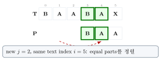{fig-alt="j가 2로 fallback되고 같은 text index i=5에서 정렬하는 상태" width="65%"}

## 4단계

![suffix `BA` = prefix `BA`; $i=5$는 고정이고 `X`를 $P[2]$와 다시 비교.](../figures/09-string-matching/10-mismatch-fallback-trace-step4.svg){fig-alt="BAABA까지 매칭된 뒤 X에서 mismatch가 나 lps[4]=2인 border BA로 fallback해 같은 text index에서 재비교하는 4단계 트레이스의 마지막 상태" width="65%"}
:::

::: {.callout-warning title="과도한 표현 금지"}
"각 text 문자를 정확히 한 번 비교"하는 것은 아니다.
:::

::: {.callout-note title="Mismatch Invariant"}
$j>0$인 mismatch에서는 text index $i$를 고정하고 $j\gets lps[j-1]$만 수행한다. $i$는 감소하지 않으며, 같은 $T[i]$가 여러 pattern position과 비교될 수 있어도 전체 comparison 수는 linear하게 bounded된다.
:::

::: {.callout-caution collapse="true" title="확인 문제: KMP 핵심 아이디어 Checkpoint"}
1. mismatch이고 $j>0$이면 무엇이 변하는가?
2. fallback 값은 어디서 얻는가?
3. text index가 왼쪽으로 가는가?

**답**: 1. $j$만. 2. $lps[j-1]$. 3. 아니다.
:::

## Part J. LPS/Failure Table

$$lps[i]=\max\{r:0\le r<i+1,\ P[0..r-1]=P[i-r+1..i]\}$$

$$\texttt{BAABABAA}\Rightarrow[0,0,0,1,2,1,2,3]$$

::: {.callout-warning title="주의"}
$i$는 character index, $lps[i]$는 length다. 둘을 혼동하지 않는다.
:::

| prefix | longest border | length |
|---|---|---|
| `BAAB` | `B` | 1 |
| `BAABAB` | `B` | 1 |
| `BAABABAA` | `BAA` | 3 |

$len\gets lps[len-1]$은 더 짧은 border 후보를 따라가는 fallback chain이다.

| Convention | base value | mismatch |
|---|---|---|
| standard LPS | $lps[0]=0$ | $j\gets lps[j-1]$ |
| sentinel failure | $failure[0]=-1$ | $j\gets failure[j]$ |

::: {.callout-warning title="본문 정책"}
standard LPS만 사용한다. 원본의 length 0 → $-1$ row는 다른 convention이다(부록에서만 참고로 다룸).
:::

## Part K. KMP Preprocessing



$i$는 지금 $lps[i]$를 채울 prefix ending position이고, $len$은 현재 시도하는 valid border length다. $lps[i]$를 채우기 전 $len$은 $P[0..i-1]$의 유효한 border 길이라는 invariant가 유지된다.

`BAABABAA`의 LPS를 채우는 과정: $i=1,2$ mismatch → $i=3$ 매칭 → ... → $i=7$까지 6단계 만에 `[0,0,0,1,2,1,2,3]` 완성.

::: {.panel-tabset}
## 1단계

![$i=1,2$: $A\ne B\Rightarrow lps[1]=lps[2]=0$. `[0,0,0]`.](../figures/09-string-matching/11-lps-construction-trace-step1.svg){fig-alt="i=1,2에서 A≠B로 lps가 0,0,0까지 채워진 1단계 상태" width="70%"}

## 2단계

![$i=3$: $B=B\Rightarrow lps[3]=1$. `[0,0,0,1]`.](../figures/09-string-matching/11-lps-construction-trace-step2.svg){fig-alt="i=3에서 B=B로 lps가 1까지 채워진 상태" width="70%"}

## 3단계

![$i=4$: $A=A\Rightarrow lps[4]=2$. `[0,0,0,1,2]`.](../figures/09-string-matching/11-lps-construction-trace-step3.svg){fig-alt="i=4에서 A=A로 lps가 2까지 채워진 상태" width="70%"}

## 4단계

![$i=5$: $B\ne A$, len:$2\to0$, $B=B\Rightarrow1$. `[0,0,0,1,2,1]`.](../figures/09-string-matching/11-lps-construction-trace-step4.svg){fig-alt="i=5에서 fallback 후 lps가 1로 채워진 상태" width="70%"}

## 5단계

![$i=6$: $A=A\Rightarrow2$. `[0,0,0,1,2,1,2]`.](../figures/09-string-matching/11-lps-construction-trace-step5.svg){fig-alt="i=6에서 lps가 2로 채워진 상태" width="70%"}

## 6단계

![$i=7$: $A=A\Rightarrow3$. `[0,0,0,1,2,1,2,3]` 완성.](../figures/09-string-matching/11-lps-construction-trace-step6.svg){fig-alt="BAABABAA의 각 인덱스마다 lps 값을 채워나가 최종적으로 0,0,0,1,2,1,2,3 표를 완성하는 6단계 트레이스의 마지막 상태" width="70%"}
:::

$$P[i]\ne P[len],\ len>0\quad\Rightarrow\quad len\gets lps[len-1]$$

같은 $P[i]$를 더 짧은 border 후보와 아직 비교해야 한다. 후보가 0까지 사라진 뒤에만 $lps[i]=0$으로 확정하고 $i$를 증가시킨다.

$$\Theta(m)\text{ time},\qquad\Theta(m)\text{ table space}$$

::: {.callout-caution collapse="true" title="확인 문제: BuildLPS Checkpoint"}
1. `AAAAA`의 LPS는?
2. `ABCDABD`의 마지막 LPS는?

**답**: 1. $[0,1,2,3,4]$. 2. 0.
:::

## Part L. KMP Search



`KMPSearch`가 부르는 `BuildLPS`는 Part K에서 이미 완결된 독립 procedure다 — 검색 트리 장의 BST가 successor/predecessor를 부르거나 해시 테이블 장의 ChainedPut이 ChainedSearch를 부르는 것과 같은, "완결된 절차 간 정상 참조"다.

$$T=\texttt{BAABXBAABABAA},\qquad P=\texttt{BAABABAA},\qquad lps=[0,0,0,1,2,1,2,3]$$

첫 네 문자 `BAAB` 뒤 $T[4]=\texttt{X}$에서 mismatch가 나고, 실제 occurrence는 shift 5다.

$i=4,j=4$에서 X≠A mismatch → $j\gets lps[3]=1$ → 다시 mismatch, $j\gets lps[0]=0$ → $i\gets5$ → shift 5에서 전체 매칭 완료까지 5단계.

::: {.panel-tabset}
## 1단계

{fig-alt="i=4,j=4에서 X와 A가 mismatch인 1단계 상태" width="70%"}

## 2단계

![$j\gets lps[3]=1$: 길이 1의 border만 재사용하고 같은 `X`를 비교한다.](../figures/09-string-matching/12-kmp-mismatch-recovery-trace-step2.svg){fig-alt="j가 lps[3]=1로 fallback되는 상태" width="70%"}

## 3단계

![다시 mismatch이므로 $j\gets lps[0]=0$. text index $i$는 아직 4다.](../figures/09-string-matching/12-kmp-mismatch-recovery-trace-step3.svg){fig-alt="다시 mismatch가 나 j가 0으로 fallback되는 상태" width="70%"}

## 4단계

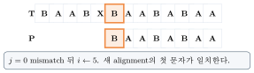{fig-alt="i가 5로 이동해 새 alignment의 첫 문자가 일치하는 상태" width="70%"}

## 5단계

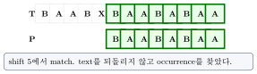{fig-alt="BAABX 뒤 mismatch가 나 lps 값을 따라 두 번 fallback한 뒤 shift 5에서 BAABABAA 전체가 매칭되는 5단계 트레이스의 마지막 상태" width="70%"}
:::

$$T=\texttt{AAAAA},\quad P=\texttt{AAA},\quad lps=[0,1,2]$$

match at 0 뒤 $j\gets lps[2]=2$로 fallback해 overlap을 포함한 matches $[0,1,2]$를 모두 찾는 2단계.

::: {.panel-tabset}
## 1단계

![match at 0; $j\gets lps[2]=2$.](../figures/09-string-matching/13-kmp-overlapping-match-step1.svg){fig-alt="match 0 확정 뒤 j가 lps[2]=2로 fallback되는 1단계 상태" width="55%"}

## 2단계

![continue $\Rightarrow$ matches $[0,1,2]$.](../figures/09-string-matching/13-kmp-overlapping-match-step2.svg){fig-alt="AAAAA에서 AAA 패턴이 match 0 뒤 overlap을 유지해 matches 0,1,2를 모두 찾는 2단계 트레이스의 마지막 상태" width="55%"}
:::

match 후 $j=0$으로 초기화하면 overlap 정보를 버린다.

**구현**: `BAABABAA`의 LPS 계산과 함께, `T="acebbceeaabceedb"`, `P="eeaab"` 고정 예제로 검증한다.

::: {.panel-tabset}
## Python
```{.python}

```
## Java
```{.java}

```
## C
```{.c}

```
:::

**실행 결과** (실제 컴파일·실행 캡처 — `gcc -Wall`, `javac`/`java`, `python3`):

::: {.panel-tabset}
## Python
```{.default}

```
## Java
```{.default}

```
## C
```{.default}

```
:::

::: {.callout-caution collapse="true" title="확인 문제: KMP Search Checkpoint"}
1. mismatch이고 $j>0$이면 $i$는 증가하는가?
2. $j=0$ mismatch이면?
3. match 후 overlap을 위해 $j$는?

**답**: 1. 아니다. 2. $i\gets i+1$. 3. $lps[m-1]$.
:::

## Part M. KMP Correctness와 Complexity

loop의 다음 comparison 직전에 $P[0..j-1]=T[i-j..i-1]$이다. $j$는 현재 text prefix의 suffix와 일치하는 pattern prefix 길이다.

mismatch 전 matched prefix의 가능한 재정렬은 그 prefix의 border에서만 시작할 수 있다. $lps[j-1]$은 가장 긴 후보이므로 더 긴 불가능한 shift를 모두 안전하게 제거한다 — fallback 뒤에도 이미 확인된 suffix=prefix 관계가 invariant를 보존한다.

$$\underbrace{\Theta(m)}_{\text{BuildLPS}}+\underbrace{\Theta(n)}_{\text{Search}}=\Theta(n+m),\qquad space=\Theta(m)$$

$i$는 감소하지 않는다. $j$의 증가와 fallback 총량은 linear하게 bounded된다.

::: {.callout-tip title="KMP Takeaway"}
KMP는 text를 왼쪽으로 되돌리지 않고 border를 재사용해 worst-case linear time을 보장한다.
:::

::: {.callout-caution collapse="true" title="확인 문제"}
search만 $\Theta(n)$이라 말할 때도 preprocessing $\Theta(m)$을 함께 명시한다.
:::

## Part N. Boyer-Moore의 아이디어

::: {.callout-tip title="Mission"}
pattern의 오른쪽부터 비교하고 mismatch 정보를 이용해 여러 text position을 건너뛴다.
:::

pattern은 text에 align되고, comparison은 $j=m-1$에서 왼쪽으로 진행한다.

$$\text{pattern}\to\text{shift table}\to\text{mismatch}\to\text{shift distance}\to\text{next alignment}$$

`CATIG` 위에 `TIGER`를 놓고 끝 문자 G/R mismatch만으로 큰 shift의 근거를 얻은 뒤, 오른쪽에서 왼쪽으로 비교해 전체가 일치하는 2단계.

::: {.panel-tabset}
## 1단계

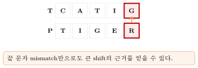{fig-alt="CATIG 위에 TIGER를 놓고 끝 문자 G/R이 mismatch로 표시된 1단계 상태" width="70%"}

## 2단계

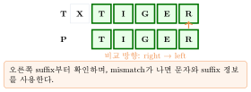{fig-alt="CATIG 위에 TIGER를 놓고 끝 문자부터 비교해 mismatch 근거를 얻은 뒤 이동해 전체 일치를 확인하는 2단계 트레이스의 마지막 상태" width="70%"}
:::

| | Full BM | Horspool |
|---|---|---|
| bad-character | 사용 | 단순화해 사용 |
| good-suffix | 사용 | 사용하지 않음 |
| shift 기준 | mismatch character/window | window 마지막 character |
| 구현 | 복잡 | 간결 |

::: {.callout-caution collapse="true" title="확인 문제: Boyer-Moore Family Checkpoint"}
1. 비교 방향은?
2. Horspool이 사용하지 않는 table은?
3. 둘은 같은 알고리즘인가?

**답**: 1. 오른쪽에서 왼쪽. 2. good-suffix. 3. 같은 family지만 동일하지 않다.
:::

## Part O. Bad-Character Rule

window 마지막 text character $c=T[s+m-1]$를 pattern의 오른쪽 끝 이전 rightmost $c$와 맞춘다.

$$shift[c]=m-1-\max\{j<m-1:P[j]=c\}$$

그런 $j$가 없으면 $m$이다.

`TIGER`의 shift table: $T=4,I=3,G=2$까지 계산하고 $E=1,R=5,\text{other}=5$까지 마무리하는 2단계.

::: {.panel-tabset}
## 1단계

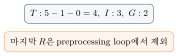{fig-alt="TIGER의 T,I,G 세 문자의 shift 값이 4,3,2로 계산된 1단계 상태" width="45%"}

## 2단계

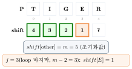{fig-alt="TIGER 각 문자의 shift 값을 하나씩 계산해 T=4,I=3,G=2,E=1,R=5,other=5를 완성하는 2단계 트레이스의 마지막 상태" width="45%"}
:::

마지막 $R$은 preprocessing loop에서 제외한다.

`P=TIGER`에서 window 마지막 문자가 `b`(pattern에 없음)이면 $shift[b]=5$로 window 전체를 건너뛴다.

::: {.panel-tabset}
## 1단계

![$\texttt{b}\notin P[0..3]$.](../figures/09-string-matching/16-absent-character-shift-step1.svg){fig-alt="window 끝 문자 b가 TIGER 패턴 어디에도 없음이 표시된 1단계 상태" width="55%"}

## 2단계

![$shift[\texttt{b}]=5$: window 전체 jump(skipped region에는 시작 가능한 occurrence가 없다).](../figures/09-string-matching/16-absent-character-shift-step2.svg){fig-alt="TIGER 패턴에 없는 문자 b가 window 끝에 오면 shift 5로 전체 window를 건너뛰는 2단계 트레이스의 마지막 상태" width="55%"}
:::

skipped region에는 시작 가능한 occurrence가 없다.

$$P=\texttt{TIGER},\qquad shift[\texttt{I}]=5-1-1=3$$

pattern의 $I$를 현재 window 끝의 $I$에 맞추도록 3칸 이동한다.

::: {.callout-note title="Full Boyer-Moore Preview"}
full algorithm은 bad-character shift와 good-suffix shift를 모두 계산하고 안전한 더 큰 shift를 사용한다. 이 장의 구현과 트레이스는 good-suffix table이 없는 **Boyer-Moore-Horspool**이다.
:::

## Part P. Boyer-Moore-Horspool



같은 문자가 반복되면 더 오른쪽 occurrence가 나중에 더 작은 distance로 덮어쓴다.

`RATIONAL`에서 반복되는 `A`: 왼쪽 A를 먼저 표시했다가, 더 오른쪽 A(index 6)로 덮어써 $shift[A]=7-6=1$을 확정하는 3단계.

::: {.panel-tabset}
## 1단계

{fig-alt="RATIONAL의 마지막 문자 L이 회색으로 제외 표시된 1단계 상태" width="70%"}

## 2단계

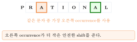{fig-alt="RATIONAL의 왼쪽 A와 오른쪽 A가 모두 표시되고 오른쪽 occurrence 사용이 강조된 상태" width="70%"}

## 3단계

![$\operatorname{last}(\texttt{A})=6,\quad shift[\texttt{A}]=7-6=1$.](../figures/09-string-matching/17-rational-repeated-character-step3.svg){fig-alt="RATIONAL의 두 A 중 더 오른쪽 A를 사용해 shift[A]=1을 확정하는 3단계 트레이스의 마지막 상태" width="70%"}
:::

마지막 문자 `L`은 전처리에서 제외한다. 왼쪽 `A`를 사용하면 유효한 alignment를 건너뛸 수 있다.



`Horspool`이 부르는 `BuildShiftTable`은 바로 위에서 완결된 독립 procedure다 — Part L의 `KMPSearch`가 `BuildLPS`를 부르는 것과 같은 정상 참조 패턴이다.

::: {.callout-tip title="Progress Invariant"}
$shift[c]\ge1$이므로 mismatch도 $s$를 반드시 증가시키며 infinite loop가 불가능하다.
:::

`CATIGER`에서 `TIGER`의 끝 G/R mismatch 뒤 shift 2로 이동 → 오른쪽부터 전체 검증까지 4단계.

::: {.panel-tabset}
## 1단계

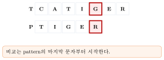{fig-alt="TIGER의 마지막 문자 R과 window의 G가 mismatch로 표시된 1단계 상태" width="70%"}

## 2단계

{fig-alt="G가 window 끝으로 오도록 shift 2만큼 이동하는 상태" width="70%"}

## 3단계

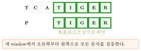{fig-alt="새 window에서 R,E,G,I,T 순으로 모든 문자가 검증되는 상태" width="70%"}

## 4단계

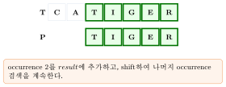{fig-alt="CATIGER에서 TIGER 끝 문자 mismatch 후 shift 2로 이동해 오른쪽부터 왼쪽으로 전체 문자를 검증하는 4단계 트레이스의 마지막 상태" width="70%"}
:::

비교는 pattern의 마지막 문자부터 시작하고, 새 window에서도 오른쪽부터 왼쪽으로 검증한다.

$$T=\texttt{AAAAA},\quad P=\texttt{AAA},\quad shift[\texttt{A}]=1$$

match 후에도 현재 window 마지막 character $A$를 조회하므로 shift $0,1,2$를 모두 방문하고 overlap을 놓치지 않는다.

- preprocessing: dense alphabet $\Theta(|\Sigma|+m)$, map은 expected $\Theta(m)$.
- search worst: $\Theta(nm)$.
- 큰 alphabet·긴 pattern·오른쪽 mismatch가 잦으면 실제 검사 위치를 많이 건너뜀.

::: {.callout-warning title="정확한 표현"}
검사한 text position 수가 $n$보다 작을 수 있다는 뜻이지, running time이 $O(n)$보다 작은 점근 bound라는 뜻은 아니다.
:::

**구현**: `TIGER`/`RATIONAL` shift table과 `T="acebbceeaabceedb"`, `P="eeaab"` 고정 예제로 검증한다.

::: {.panel-tabset}
## Python
```{.python}

```
## Java
```{.java}

```
## C
```{.c}

```
:::

**실행 결과** (실제 컴파일·실행 캡처 — `gcc -Wall`, `javac`/`java`, `python3`):

::: {.panel-tabset}
## Python
```{.default}

```
## Java
```{.default}

```
## C
```{.default}

```
:::

::: {.callout-caution collapse="true" title="확인 문제: Horspool Checkpoint"}
`TIGER`에서 absent character는 5칸, $I$는 3칸 shift한다.
:::

## Part Q. 알고리즘 비교와 선택

| Algorithm | Preprocess | Worst search | Expected/practical | Space | Key idea |
|---|---|---|---|---|---|
| Naive | $\Theta(1)$ | $\Theta(nm)$ | tiny input | $\Theta(1)$ | all alignments |
| Rabin-Karp | $\Theta(m)$ | $\Theta(nm)$ | conditional $\Theta(n+m)$ | $\Theta(1)$ | rolling hash |
| KMP | $\Theta(m)$ | $\Theta(n)$ | guaranteed | $\Theta(m)$ | border reuse |
| Horspool | $\Theta(|\Sigma|+m)$ | $\Theta(nm)$ | often skips | table | bad-character |

$m\le n$이면 candidate alignment 수는 $n-m+1$이다. Rabin-Karp의 expected linear bound는 expected verification 총비용도 linear라는 가정이 필요하다.

| workload | 자연스러운 선택 |
|---|---|
| 짧은 text, 한 번 검색 | Naive |
| adversarial input, linear guarantee | KMP |
| 많은 equal-length fingerprint | Rabin-Karp |
| ASCII prose, 긴 pattern | Horspool |
| same pattern repeated | KMP/Horspool preprocessing reuse |

Streaming에는 KMP state를 이어가기 쉽다. Collision adversary가 우려되면 single small-modulus Rabin-Karp를 피하거나 verification과 stronger hashing을 쓴다. Approximate matching(edit distance)은 이 네 exact matcher만으로 해결하지 않는다. Multi-pattern에는 Aho-Corasick이나 grouped fingerprint를 고려한다.

::: {.callout-warning title="Unicode에서 \"Character\"란?"}
Java String은 UTF-16 code unit이라 `char` index와 code point index가 다를 수 있다. C UTF-8은 byte sequence라 byte matching과 user-visible character matching이 다르다. 눈에 같은 문자열도 code-point sequence가 다를 수 있어, Unicode-aware search는 normalization/tokenization 정책이 필요하다.
:::

::: {.callout-caution collapse="true" title="확인 문제: 알고리즘 선택 Checkpoint"}
1. worst-case linear이 필수면?
2. 여러 equal-length fingerprint면?
3. large alphabet의 긴 pattern이면?
4. Unicode에서 byte match가 충분한가?

**답**: 1. KMP. 2. Rabin-Karp. 3. Horspool 후보. 4. 요구 semantics에 따라 다르다.
:::

## Part R. 구현과 테스트

Java API는 `naiveAll`, `rabinKarp`, `buildLps`/`kmpSearch`, `buildHorspoolShift`/`horspoolSearch`로 구성되고, first-match wrapper는 $-1$을 반환하며 empty pattern all-match 정책은 $[0]$이다. main comparison loop는 substring을 할당하지 않는다.

C API는 명시적 `unsigned char *`와 `size_t` 길이를 쓰고 byte-oriented exact semantics를 따른다. first-match sentinel은 `SIZE_MAX`이며, growable result는 allocation-failure를 전파하고, portable overflow-safe modular add/subtract/multiply를 쓴다.

| 검증 대상 | 확인 내용 |
|---|---|
| 모든 matcher | strictly increasing, true match, oracle 대비 no omission |
| Rabin-Karp | window hash가 매 shift마다 재생성한 값과 일치 |
| BuildLPS | 각 entry와 multi-fallback chain 확인 |
| KMP | fallback과 overlap 출력이 Naive와 일치 |
| Horspool | positive shift, mismatch progress, 전체 occurrence 일치 |

테스트 행렬은 empty/$m>n$/no/begin/end/overlap/repeated 경우, 의도적 collision과 negative rolling 식, 4개 고정 LPS table(연속 fallback chain 포함), TIGER/RATIONAL table과 긴 mismatch progress regression, Java UTF-16 code-unit·C UTF-8 byte-offset 예제, 언어당 고정 seed 6,000-case random test, C의 ASan/UBSan bounds check를 포함한다.

::: {.callout-tip title="구현의 핵심"}
built-in `indexOf`를 구현에 사용하지 않는다 — 직접 character/byte 비교로 검증한다. Java code unit과 C byte는 string unit이 다르다.
:::

::: {.callout-caution collapse="true" title="확인 문제"}
1. built-in `indexOf`를 구현에 사용했는가?
2. collision candidate를 어떻게 검증하는가?
3. Java와 C의 string unit은 같은가?

**답**: 1. 아니다. 2. 직접 character/byte 비교. 3. Java code unit과 C byte로 다르다.
:::

## Part S. 보안과 확장: Hash Flooding과 Multi-Pattern 미리보기

`failure[0]=-1`, $j\gets failure[j]$ 방식의 sentinel failure convention도 올바르게 구현할 수 있다. 그러나 standard LPS와 table 크기·index 의미·pseudocode를 섞으면 out-of-bounds와 fallback 오류가 난다 — 이 장의 본문과 Java/C 구현은 $lps[0]=0$ convention만 쓴다.

modulus 없이 $d^m$ 크기의 정수를 그대로 유지하면 digit 수가 $m$과 함께 증가한다. 이때 곱셈·덧셈을 unit-cost로 보는 $O(1)$ rolling update는 bit complexity 관점에서 성립하지 않을 수 있다 — 수학적 modular arithmetic, fixed-width machine implementation의 intermediate overflow, arbitrary-precision bit complexity는 서로 다른 문제다.

$$P=\texttt{AAAAABAAAAAC}\Rightarrow lps=[0,1,2,3,4,0,1,2,3,4,5,0]$$

마지막 `C`에서 $len=5$로 시작하면 $5\to lps[4]=4\to lps[3]=3\to lps[2]=2\to lps[1]=1\to lps[0]=0$으로 연속 fallback한다. 한 번 fallback한 후보도 mismatch일 수 있으므로 같은 $P[i]$를 더 짧은 border들과 연속 비교해야 하기 때문이다.

UTF-16 surrogate pair는 두 `char` code unit이고, UTF-8 code point는 1–4 byte다. grapheme cluster는 여러 code point일 수 있고, canonical normalization 전에는 시각적 동등성과 byte/code-unit equality가 다를 수 있다.

equal-length pattern hash를 set으로 묶으면 한 scan에서 여러 pattern의 candidate를 찾을 수 있다. Aho-Corasick은 여러 pattern의 prefix automaton을 공유하고, 2D Rabin-Karp는 row/column rolling fingerprint로 확장할 수 있다.

::: {.callout-warning title="확인 전략"}
모든 all-match 결과 $s_0<s_1<\cdots$는 $\forall k,\ T[s_k..s_k+m-1]=P$를 만족하며, 정책상 가능한 모든 valid occurrence를 포함해야 한다. Naive를 작은 input의 trusted oracle로 두고 세 optimized matcher와 differential test한다 — 이 장의 Python/Java/C 구현 모두 이 방식으로 5,000회 이상의 무작위 사례를 검증했다.
:::

## 💡 배움 포인트

- Naive는 shift마다 matched prefix 정보를 버려서 중복 비교가 생긴다 — Rabin-Karp는 window fingerprint를, KMP는 border를 재사용해 이 낭비를 없앤다.
- Rabin-Karp의 rolling hash는 해시 테이블 장의 Horner 다항식 해시와 같은 식이다 — 다만 hash 일치는 candidate일 뿐이며 반드시 character-by-character verification을 거쳐야 exact match가 된다.
- Border(proper prefix이면서 suffix인 문자열)와 LPS는 KMP fallback의 근거다 — mismatch에서 text index $i$는 절대 감소하지 않고 pattern index $j$만 $lps[j-1]$로 fallback한다.
- KMP는 $\Theta(m)$ preprocessing + $\Theta(n)$ search로 worst-case조차 $\Theta(n+m)$을 보장하는 유일한 이 장의 알고리즘이다.
- Boyer-Moore 계열은 오른쪽부터 비교해 mismatch 문자 하나로 여러 위치를 건너뛴다 — 이 장의 Horspool은 bad-character rule만 쓰는 실용적 단순화이고, good-suffix rule까지 쓰는 full Boyer-Moore는 별개다.
- 알고리즘 선택은 workload(반복 검색 여부), alphabet 크기, adversarial 가능성, 그리고 Unicode에서 "문자"의 정의(code unit/code point/byte)에 따라 달라진다.

## 🧪 직접 해보기

::: {.callout-caution collapse="true" title="Problem · Naive Quiz"}
1. valid shift 범위는?
2. occurrence와 alignment 차이는?
3. $T=\texttt{AAAAA},P=\texttt{AAA}$ 결과는?
4. Naive worst와 best time은?
5. empty pattern first-match policy는?

**정답**

1. $0\le s\le n-m$.
2. candidate 위치 vs 완전 일치 위치.
3. $[0,1,2]$.
4. worst $\Theta((n-m+1)m)$; best $\Theta(n-m+1)=O(n)$.
5. 0.
:::

::: {.callout-caution collapse="true" title="Rabin-Karp Quiz"}
1. base 5에서 `cad` 값은?
2. rolling update의 세 단계는?
3. hash가 같으면 바로 match인가?
4. expected와 worst time은?
5. negative remainder는 어떻게 처리하는가?

**정답**

1. 53.
2. leading 제거, base shift, trailing 추가.
3. verification 필요.
4. $\Theta(n+m+(z+c)m)$; verification 총비용이 linear이면 expected $\Theta(n+m)$, worst $\Theta(nm)$.
5. normalized modulo/unsigned subtraction.
:::

::: {.callout-caution collapse="true" title="Border · KMP Quiz"}
1. proper prefix란?
2. `BAABABAA`의 LPS는?
3. mismatch $j>0$에서 $i,j$는?
4. match 후 overlap을 위한 $j$는?
5. total complexity는?

**정답**

1. 전체보다 짧은 prefix.
2. $[0,0,0,1,2,1,2,3]$.
3. $i$ 유지, $j=lps[j-1]$.
4. $lps[m-1]$.
5. $\Theta(n+m)$.
:::

::: {.callout-caution collapse="true" title="Horspool · Design Quiz"}
1. `TIGER`에서 $shift[I]$는?
2. absent character shift는?
3. `RATIONAL`에서 $shift[A]$는?
4. full BM과 Horspool의 차이는?
5. worst-case linear guarantee가 필요하면?

**정답**

1. 3.
2. $m=5$.
3. 1.
4. full BM은 good-suffix도 사용; Horspool은 window-last bad-character만.
5. KMP.
:::

## 요약

문자열 매칭은 text/pattern/alphabet과 0-based shift로 정의되며, alignment(검사 후보)와 occurrence(완전 일치)를 구분하는 데서 시작한다. Naive는 매 shift마다 matched prefix 정보를 버려 worst $\Theta(nm)$이 되고, 이 낭비를 줄이는 두 방향이 Rabin-Karp와 KMP다. Rabin-Karp는 해시 테이블 장의 Horner 다항식 해시를 rolling hash로 확장해 window fingerprint를 $O(1)$에 갱신하지만, hash 일치는 candidate일 뿐이라 반드시 character-by-character verification을 거쳐야 하고 expected $\Theta(n+m)$은 verification 총비용도 linear라는 가정 아래에서만 성립한다. KMP는 border(proper prefix이면서 suffix)를 LPS 표로 미리 계산해, mismatch에서 text index를 절대 되돌리지 않고 pattern index만 fallback시켜 worst-case조차 $\Theta(n+m)$을 보장한다. Boyer-Moore 계열은 반대로 오른쪽부터 비교해 mismatch 문자 하나로 여러 alignment를 건너뛰며, 이 장이 다루는 Horspool은 bad-character rule만 쓰는 실용적 단순화다(good-suffix까지 쓰는 full Boyer-Moore는 별개). 넷 모두 실제 선택은 반복 검색 여부, alphabet 크기, adversarial 입력 가능성, 그리고 Unicode에서 "문자"를 code unit/code point/byte 중 무엇으로 볼지에 따라 달라진다.
