## 🎯 학습목표

- state, decision, candidate, feasible, optimal solution을 구분하고 같은 state space를 DFS, BFS, best-first로 탐색할 수 있음을 설명한다.
- Backtracking의 feasibility pruning과 Branch-and-Bound의 objective pruning을 구분하고, 순열·N-Queens·Subset Sum·Graph Coloring을 state-space tree로 모델링한다.
- incumbent와 optimistic bound로 최적화 subtree를 prune하고, 0/1 Knapsack의 fractional-relaxation upper bound를 계산한다.
- A*의 g, h, f=g+h와 admissibility·consistency를 설명하고 언제 종료해야 하는지 정확히 말한다.
- pruning의 soundness와 최악의 exponential complexity를 함께 판단하고, generated/expanded/pruned node와 frontier 크기로 성능을 측정한다.

## Part A. State-Space Search Fundamentals

::: {.callout-tip title="Mission"}
가능한 결정은 많지만, 정답을 잃지 않으면서 만들 필요가 없는 subtree를 조기에 제거하자.
:::

$$\text{model state}\ \longrightarrow\ \text{choose order}\ \longrightarrow\ \text{prove pruning safe}$$

::: {.callout-warning title="핵심 질문"}
"빨라 보이는 규칙"이 아니라 "왜 이 branch에는 필요한 답이 없는가?"를 증명해야 한다.
:::

**State**는 지금까지 내린 결정이 만든 partial solution과 앞으로 필요한 정보다. **Decision**은 현재 state에서 child state로 가는 한 번의 선택이다. 예를 들어 binary selection에서 state $=(i,\text{selected},\text{sum})$, decision $=$ $w[i]$의 include/exclude다.

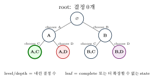{fig-alt="빈 상태를 root로 A, B 두 child가 갈라지고 다시 각각 두 child로 확장되며 valid, dead, bound 상태가 표시된 트리 다이어그램" width="65%"}

level/depth는 내린 결정 수이고, leaf는 complete 또는 더 확장할 수 없는 state다.

::: {.callout-note title="정의: Candidate, Feasible, Optimal"}
**Candidate**는 모든 결정이 끝난 complete state다. **Feasible**은 모든 constraint를 만족한 candidate다. **Optimal**은 feasible candidate 중 objective가 가장 좋은 해다. **Dead state**는 어떤 descendant도 feasible일 수 없는 state이고, **Bounded state**는 feasible descendant는 가능하지만 incumbent(지금까지 찾은 best feasible solution — 자세한 정의는 Part C 참고)를 개선할 수 없는 state다.
:::

::: {.callout-caution collapse="true" title="확인 문제"}
complete라고 해서 feasible은 아니며, feasible이라고 해서 optimal도 아니다.
:::

현재 state에서 필요한 child만 생성한다 — DFS는 recursion stack, BFS/best-first는 frontier에 live node를 저장하며, prune된 subtree는 node 자체를 만들지 않을 수 있다.

$$\text{binary depth }n:\ 2^n\text{ leaves},\quad 2^{n+1}-1\text{ nodes}\qquad\text{permutation leaves}:n!$$

::: {.panel-tabset}
## 1단계

{fig-alt="트리에 root 노드 R 하나만 표시된 상태" width="17%"}

## 2단계

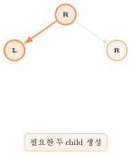{fig-alt="root에서 두 자식 L, R로 가지가 뻗어 나온 상태" width="38%"}

## 3단계

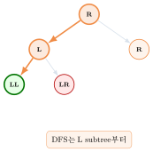{fig-alt="L 노드 아래에 LL, LR 두 자식이 추가된 상태" width="46%"}

## 4단계

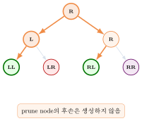{fig-alt="R 노드 아래에 RL, RR 두 자식이 추가되고 RR이 bounded 표시로 강조된 상태" width="53%"}
:::

| Order | Container | 장점 | 위험 |
|---|---|---|---|
| DFS | recursion/stack | memory $\Theta(\text{depth})$ | 깊은 나쁜 branch |
| BFS | queue | shallow solution 먼저 | 큰 frontier |
| Best-first | priority queue | 유망 node 집중 | 평가·memory 비용 |

::: {.callout-warning title="중요"}
Backtracking과 Branch-and-Bound의 차이는 DFS/BFS가 아니라 pruning의 의미다.
:::

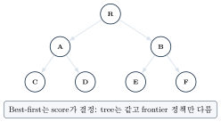{fig-alt="같은 7-node 트리에서 DFS 순서와 BFS 순서를 비교하고 best-first는 frontier 정책만 다르다는 콜아웃이 붙은 3단계 트레이스의 마지막 상태" width="60%"}

$$\text{complete enumeration}\quad+\quad\text{sound pruning}\quad=\quad\text{정답을 보존한 state-space search}$$

pruning이 전혀 작동하지 않으면 원래 exponential tree를 탐색한다 — pruning effectiveness는 입력과 state/bound 설계에 의존한다.

::: {.callout-caution collapse="true" title="확인 문제: 탐색 순서 Checkpoint"}
1. 전체 tree를 memory에 materialize해야 하는가?
2. BFS의 frontier가 DFS보다 커질 수 있는 이유는?
3. best-first가 항상 polynomial인가?

**답**: 1. 아니다. 2. 한 level의 많은 live node를 보관하기 때문이다. 3. 아니다, 최악에는 exponential이다.
:::

### 순열과 조합 생성

::: {.callout-note title="문제 (Permutation/Combination Generation)"}
**Input**: 정수 $n,k$ ($0\le k\le n$).\
**Output**: $\{0,\ldots,n-1\}$에서 중복 없이 $k$개를 고르는 모든 순열($_nP_k$)과 조합($_nC_k$).
:::

`ChoosePermutation`은 $\{0,\ldots,n-1\}$에서 중복 없이 $k$개를 고르는 0-based 알고리즘이다 — 예를 들어 `pick(5,...,4)`는 $0,\ldots,4$에서 중복 없이 4개를 고르는 $5P_4$ 생성을 의미한다.



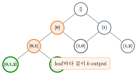{fig-alt="빈 리스트에서 시작해 unused value를 선택하며 확장되고 leaf마다 길이 k인 output을 만드는 4단계 트레이스의 마지막 상태" width="55%"}

$$P(n,k)=\frac{n!}{(n-k)!},\qquad P(5,4)=120$$

모든 output은 길이 $k$, 원소는 distinct다. full permutation은 $n!$ leaves이고, 각 output을 복사하면 출력 비용만 $\Omega(kP(n,k))$다. recursion stack과 `choice`는 $\Theta(k)$, `used`는 $\Theta(n)$이다.

**Combination**은 순서를 제거한다 — `start`로 같은 집합의 다른 순서를 재생성하지 않는다.



| Permutation | Combination |
|---|---|
| $[0,1]\ne[1,0]$ | $\{0,1\}=\{1,0\}$ |
| branch: unused value | branch: increasing value |
| count $P(n,k)$ | count $\binom nk$ |

$$P(5,4)=120,\qquad\binom54=5$$

**구현**: $5P_4$와 $\binom54$를 실제로 세어 검증한다.

::: {.panel-tabset}
## Python
```{.python}

```
## Java
```{.java}

```
## C
```{.c}

```
:::

**실행 결과** (실제 컴파일·실행 캡처 — `gcc -Wall`, `javac`/`java`, `python3`):

::: {.panel-tabset}
## Python
```{.default}

```
## Java
```{.default}

```
## C
```{.default}

```
:::

::: {.callout-caution collapse="true" title="확인 문제: 순열과 조합 Checkpoint"}
1. `used`와 choice prefix의 invariant는?
2. combination에서 `start`가 필요한 이유는?

**답**: 1. `used[v]`가 참 iff $v$가 prefix에 정확히 한 번 존재한다. 2. 같은 집합의 다른 순서를 생성하지 않기 위해서다.
:::

## Part B. Backtracking

::: {.callout-tip title="Mission"}
Partial solution을 보통 DFS로 확장하되, constraint상 feasible descendant가 불가능하면 subtree를 제거한다.
:::

::: {.callout-warning title="Backtracking ≠ DFS"}
"깊이 간다"만으로 Backtracking이 되는 것은 아니다. 핵심은 feasibility를 보존하는 **promising predicate**다.
:::



`Backtrack`은 개념 골격이다 — `IsComplete`/`IsFeasible`/`Report`/`Candidates`/`Apply`/`IsPromising`/`Undo`는 모두 이름만 정해두고, 아래 N-Queens/Subset Sum/Graph Coloring이 각각 자신의 state에 맞게 이 자리들을 구체화한다.

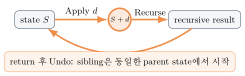{fig-alt="state S에서 Apply로 자식 상태로 갔다가 recurse한 뒤 Undo로 다시 정확히 원래 state S로 돌아오는 3단계 트레이스의 마지막 상태" width="60%"}

$$\neg Promising(s)\ \Longrightarrow\ \text{descendants}(s)\text{에 feasible solution이 없다}$$

::: {.callout-warning title="오해 금지"}
$Promising(s)$는 "해가 반드시 있다"가 아니라 "해 가능성을 아직 배제할 수 없다"이다.
:::

| 판정 오류 | 결과 | 영향 |
|---|---|---|
| false negative | 실제 해가 있는 subtree prune | incorrect |
| false positive | 해 없는 subtree를 계속 탐색 | correct but slower |

강한 조건은 pruning이 많지만 soundness 증명이 어렵고, 약한 조건은 안전하지만 느릴 수 있다.

**Correctness template**: (1) pruning 없는 search는 모든 candidate를 열거한다. (2) prune node의 descendant에는 feasible solution이 없음을 증명한다. (3) 따라서 pruning은 valid solution을 잃지 않는다. (4) report된 complete state는 feasibility 검사를 통과한다. $\therefore$ 모든 해를 빠짐없이, 잘못된 해 없이 보고한다.

::: {.callout-tip title="Backtracking Takeaway"}
Backtracking의 correctness는 DFS 자체가 아니라 Apply/Undo invariant와 sound promising predicate에서 나온다.
:::

### N-Queens

::: {.callout-note title="문제 (N-Queens)"}
**Input**: 정수 $n$.\
**Output**: $n\times n$ 판에 $n$개의 퀸을 어떤 두 퀸도 같은 행·열·대각선에 있지 않게 배치하는 모든 방법(`position[row]=column` 표현, 행 충돌은 구조적으로 배제된다).
:::

퀸은 행·열·대각선을 공격하므로, 한 행에 하나씩만 놓으면 열과 두 대각선의 충돌만 검사하면 된다 — 이것이 Promising 조건이다.

| | |
|---|---|
| State | row $0,\ldots,r-1$ 배치, $position[row]=column$ |
| Decision | row $r$에 queen을 놓을 column |
| Promising | 같은 column과 diagonal에 이전 queen이 없음 |
| Complete | $r=n$ |

$$c_1=c_2\quad\text{or}\quad|r_1-r_2|=|c_1-c_2|\quad\Longrightarrow\quad conflict$$

![4-Queens의 해 [1,3,0,2]: 네 퀸이 서로 열도 대각선도 공유하지 않는 배치.](../figures/10-state-space-search/06-four-queens-board-trace-step6.svg){fig-alt="4x4 체스판에 네 퀸이 row 0 col 1, row 1 col 3, row 2 col 0, row 3 col 2에 놓여 서로 충돌하지 않는 완성된 배치" width="45%"}

![4-Queens partial state tree: [1,3,0] conflict로 dead, [1,3,0,2]와 [2,0,3,1] 두 solution.](../figures/10-state-space-search/07-four-queens-partial-tree.svg){fig-alt="빈 상태에서 [1], [1,3]으로 확장되고 [1,3,0]은 conflict로 dead, [1,3,0,2]가 valid인 부분 상태 트리, 또 다른 가지 [2,0,3,1]도 valid로 표시된 다이어그램" width="40%"}



Naive promising check는 새 queen을 이전 $r$개와 비교해 $O(r)$이지만, `usedColumn[c]`/`diag1[r-c+n-1]`/`diag2[r+c]` boolean array를 쓰면 check/update가 $O(1)$이다.

::: {.callout-warning title="여전히 exponential"}
한 node의 검사가 빨라질 뿐, 최악의 state count는 polynomial로 바뀌지 않는다.
:::

$$\text{rows }0..r-1\text{ conflict-free}\quad\Longleftrightarrow\quad\texttt{usedColumn},\texttt{diag1},\texttt{diag2}=\texttt{position[0..r-1]}$$

::: {.callout-caution collapse="true" title="확인 문제"}
Undo에서 diagonal 하나라도 복구하지 않으면 이후 sibling의 valid placement를 잘못 prune한다.
:::

$$N(1)=1,\quad N(2)=N(3)=0,\quad N(4)=2,\quad N(8)=92$$

각 solution의 column uniqueness와 두 diagonal을 validator로 재검사하고, deterministic column order로 결과 순서를 재현한다.

::: {.callout-tip title="N-Queens Takeaway"}
N-Queens는 state를 한 row씩 확장하고, local conflict가 모든 descendant에도 남는다는 사실로 subtree를 안전하게 prune한다.
:::

**구현**: $N(4)=2$, $N(8)=92$를 실제로 세어 검증한다.

::: {.panel-tabset}
## Python
```{.python}

```
## Java
```{.java}

```
## C
```{.c}

```
:::

**실행 결과** (실제 컴파일·실행 캡처 — `gcc -Wall`, `javac`/`java`, `python3`):

::: {.panel-tabset}
## Python
```{.default}

```
## Java
```{.default}

```
## C
```{.default}

```
:::

### Subset Sum

양의 정수 $w[0..n-1]$과 target $W$에 대해 합이 $W$인 index subset을 모두 보고한다.

| | |
|---|---|
| State | $i,currentSum,remainingSum,selected$ |
| Decision | $w[i]$ include 또는 exclude |
| Leaf | $2^n$ possible subsets |
| 중복 정책 | 같은 값이라도 index가 다르면 다른 선택 |

$$currentSum>W\ \Longrightarrow\ P\qquad currentSum+remainingSum<W\ \Longrightarrow\ P$$

::: {.callout-warning title="전제"}
모든 weight가 양수이므로 앞으로 합은 줄지 않고, 남은 값을 모두 더한 것이 최대 도달 합이다. 음수가 있으면 첫 조건은 일반적으로 안전하지 않다.
:::



![Include/Exclude tree: [3,4,5,6], W=9 — {3,6}과 {4,5} 두 solution, 나머지는 overshoot(dead)로 제거된다.](../figures/10-state-space-search/08-subset-sum-include-exclude-tree.svg){fig-alt="i0,s0,r18에서 시작해 3을 포함하는 가지와 제외하는 가지로 나뉘고 최종적으로 {3,6}과 {4,5} 두 valid subset을 찾는 다이어그램" width="65%"}

::: {.panel-tabset}
## 1단계

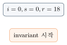{fig-alt="state box에 i=0, s=0, r=18이 표시되고 note에 invariant 시작이라고 쓰인 상태" width="25%"}

## 2단계

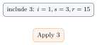{fig-alt="state box가 include 3: i=1, s=3, r=15로 갱신되고 note에 Apply 3라고 표시된 상태" width="25%"}

## 3단계

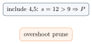{fig-alt="state box에 include 4,5: s=12>9⇒P가 표시되고 note에 overshoot prune이라고 쓰인 상태" width="25%"}

## 4단계

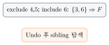{fig-alt="state box가 exclude 4,5; include 6: {3,6}⇒F로 바뀌고 note에 Undo 후 sibling 탐색이라고 표시된 상태" width="25%"}

## 5단계

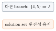{fig-alt="state box에 다른 branch: {4,5}⇒F가 표시되고 note에 solution set 완전성 유지라고 쓰인 상태" width="25%"}
:::

완전탐색은 모든 16 leaves를 검사해 동일한 solution $\{3,6\},\{4,5\}$를 찾지만, pruned search는 overshoot와 unreachable subtree를 제거하고도 같은 solution set을 낸다 — generated, expanded, pruned node 수를 함께 기록해야 pruning 효과를 비교할 수 있다.

$$currentSum=\sum_{j\in selected}w[j],\qquad remainingSum=\sum_{j=i}^{n-1}w[j]$$

Apply/Undo 뒤 두 식이 항상 성립해야 한다.

::: {.callout-caution collapse="true" title="확인 문제: Subset Sum Checkpoint"}
1. target 0은 어떤 정책인가?
2. $currentSum+remainingSum<W$가 안전한 이유는?

**답**: 1. empty subset을 한 해로 즉시 보고한다. 2. 남은 양수를 모두 포함해도 target에 못 미치기 때문이다.
:::

**구현**: $[3,4,5,6]$, $W=9$ 고정 예제(solution 2개)로 검증한다.

::: {.panel-tabset}
## Python
```{.python}

```
## Java
```{.java}

```
## C
```{.c}

```
:::

**실행 결과** (실제 컴파일·실행 캡처 — `gcc -Wall`, `javac`/`java`, `python3`):

::: {.panel-tabset}
## Python
```{.default}

```
## Java
```{.default}

```
## C
```{.default}

```
:::

### Graph Coloring

::: {.callout-note title="문제 (Graph Coloring)"}
**Input**: 무방향 그래프 $G=(V,E)$와 색 수 $m$.\
**Output**: 인접한 두 vertex가 같은 색이 아니도록 모든 vertex에 $1..m$ 중 하나의 색을 배정한 것(존재하면 하나) — **$m$-coloring** 문제.
:::

| | |
|---|---|
| State | 정해진 order의 first $k$ vertices가 colored |
| Decision | vertex $k$에 color $1..m$ |
| Promising | 이미 colored인 neighbor와 다른 color |
| Complete | 모든 vertex가 colored |

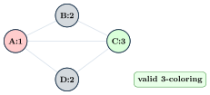{fig-alt="A,B,C,D 네 vertex 그래프에서 A에 색 1, B에 색 2를 배정한 뒤 C에 색 1을 시도했다가 conflict로 prune하고 결국 C:3, D:2로 3-coloring을 완성하는 4단계 트레이스의 마지막 상태" width="55%"}



높은 degree 또는 제약이 강한 vertex를 먼저 고르면 conflict를 일찍 발견할 수 있다. order가 바뀌어도 모든 color를 시도하면 completeness는 유지된다 — 동적 "most constrained variable"은 CSP heuristic의 예다.

**Correctness**: 각 level은 한 vertex의 모든 color를 열거하고, 이미 같은 색 neighbor가 있으면 그 conflict는 descendant에서도 사라지지 않으므로 prune은 sound하다.

::: {.callout-tip title="Graph Coloring Takeaway"}
Graph Coloring도 같은 Backtracking skeleton을 사용한다. 달라지는 것은 state, Candidates, Promising뿐이다.
:::

**구현**: A-B-C-D-A cycle과 A-C 대각선을 가진 4-vertex graph를 3색으로 칠한다(위 트레이스와 같은 예제).

::: {.panel-tabset}
## Python
```{.python}

```
## Java
```{.java}

```
## C
```{.c}

```
:::

**실행 결과** (실제 컴파일·실행 캡처 — `gcc -Wall`, `javac`/`java`, `python3`):

::: {.panel-tabset}
## Python
```{.default}

```
## Java
```{.default}

```
## C
```{.default}

```
:::

### 등차수열 찾기 {#sec-ap .unnumbered}

::: {.callout-note title="선택 심화"}
정렬 후 index가 증가하는 subset에서 가장 긴 등차수열(arithmetic progression)을 찾는 예제다. 입력 값은 distinct라고 가정하고, 길이 1과 2도 등차수열로 인정한다.
:::

$$S=\{4,1,3,5,7\}\quad\to\quad A=[1,3,4,5,7]$$

| | |
|---|---|
| State | next $i$, selected sequence, difference $d$ 또는 unset, incumbent |
| Feasibility | length $<2$면 선택 가능; 이후 $A[i]-last=d$ |
| Objective UB | $selectedCount+(n-i)$ |

$$selectedCount+(n-i)\le incumbent\quad\Longrightarrow\quad P$$

::: {.callout-warning title="Pruning 시점"}
$[1,3,4,5]$까지 확장한 뒤 판정하지 않고, $[1,3,4]$에서 즉시 feasibility prune한다 — 이미 선택한 prefix의 adjacent difference($3-1=2$, $4-3=1$)가 다르면 이후 값을 추가해도 기존 두 차이는 바뀌지 않기 때문이다.
:::

::: {.panel-tabset}
## 1단계

![1을 선택 — [1]. 원소가 하나뿐이라 공차는 아직 정해지지 않았다.](../figures/10-state-space-search/11-arithmetic-progression-trace-step1.svg){fig-alt="state box에 choose 1: [1]이 표시되고 note에 difference unset이라고 쓰인 상태" width="22%"}

## 2단계

![3을 선택 — [1,3]. 여기서 공차 d=2가 고정된다.](../figures/10-state-space-search/11-arithmetic-progression-trace-step2.svg){fig-alt="state box가 choose 3: [1,3],d=2로 갱신되고 note에 difference fixed라고 표시된 상태" width="22%"}

## 3단계

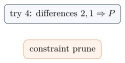{fig-alt="state box에 try 4: differences 2,1⇒P가 표시되고 note에 constraint prune이라고 쓰인 상태" width="22%"}

## 4단계

![대신 5와 7을 이어 선택 — [1,3,5,7], 모든 인접 차이가 2로 유지된다.](../figures/10-state-space-search/11-arithmetic-progression-trace-step4.svg){fig-alt="state box가 choose 5,7: [1,3,5,7]로 바뀌고 note에 same difference 2라고 표시된 상태" width="22%"}

## 5단계

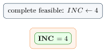{fig-alt="state box에 complete feasible: INC←4가 표시되고 note에 INC=4 badge가 나타난 상태" width="22%"}
:::

selected length가 1이고 남은 원소가 3개라면 최대 길이는 $1+3=4$이므로 $1+3\le4$면 동률만 가능해 더 긴 해는 불가능하다.

| Pruning | 질문 | 예 |
|---|---|---|
| Backtracking feasibility | 해가 존재할 수 있는가? | $[1,3,4]$ |
| B&B objective bound | incumbent보다 좋아질 수 있는가? | length UB $\le4$ |

::: {.callout-tip title="다리: 동적 계획법 장의 DP 테이블"}
$dp[i][d]=$ index $i$에서 끝나고 difference $d$인 최대 길이로 정의하면 hash map을 사용한 일반적 구현으로 $O(n^2)$ time에 풀 수 있다 — 동적 계획법 장에서 다룬 subproblem overlap 재사용과 같은 아이디어다. 이 예제는 pruning을 설명하는 도구이지, longest arithmetic subsequence의 최선 알고리즘이라는 주장은 아니다.
:::

::: {.callout-caution collapse="true" title="확인 문제: Arithmetic Progression Checkpoint"}
1. $[1,3,4]$는 어느 pruning인가?
2. $INC=4$, selected 2개, remaining 2개이면?

**답**: 1. feasibility pruning. 2. upper bound $2+2=4$라 개선 불가, objective-bound pruning.
:::

**참고 구현** (Java만 — 선택 심화 예제라 3언어 포팅은 하지 않는다):

::: {.panel-tabset}
## Java
```{.java}

```
:::

**실행 결과** (실제 컴파일·실행 캡처 — `javac`/`java`):

```{.default}

```

## Part C. Bounding and Optimization

::: {.callout-tip title="Mission"}
최적화 state-space tree에서 optimistic objective bound를 계산하고, incumbent를 개선할 수 없는 subtree를 prune한다.
:::

| | |
|---|---|
| Incumbent | 지금까지 찾은 best feasible solution |
| Live node | frontier에 있어 향후 확장할 node |
| Expanded node | frontier에서 꺼내 child를 만든 node |
| Dead node | infeasible, bounded, 또는 확장이 끝난 node |

::: {.callout-warning title="Branch-and-Bound ≠ Backtracking"}
| | Backtracking | Branch-and-Bound |
|---|---|---|
| 목표 | feasible solution 탐색 | optimal solution 탐색 |
| prune 증거 | feasible descendant 없음 | incumbent 개선 불가 |
| 핵심 | feasibility / promising | objective, incumbent, safe bound |
| 순서 | 흔히 DFS지만 correctness는 DFS에 비의존 | FIFO, LIFO, best-first 모두 가능 |

이 강의에서 **promising**은 feasibility 가능성만 뜻한다. 최적화 prune은 "bound can improve incumbent"로 표현한다.
:::

| Maximization | Minimization |
|---|---|
| $UB(node)\ge OPT_{\mathrm{desc}}(node)$ | $LB(node)\le OPT_{\mathrm{desc}}(node)$ |
| $UB(node)\le INC\Rightarrow P$ | $LB(node)\ge INC\Rightarrow P$ |

::: {.callout-note title="Safe-bound proof"}
Prune 조건이 성립하면 모든 feasible descendant도 incumbent보다 좋을 수 없으므로, 더 나은 해는 제거되지 않는다.
:::

Maximization UB가 실제 가능한 최고값보다 작으면 optimal branch를 잘못 제거할 수 있고, Minimization LB가 실제 가능한 최저값보다 크면 같은 문제가 생긴다 — loose하지만 safe한 bound는 correct, tight하지만 unsafe한 bound는 incorrect다.



`BranchAndBound`도 개념 골격이다 — `RepresentsFeasibleSolution`/`IsComplete`/`Expand`/`FeasibilityPossible`는 이름만 정해두고, Part D의 Knapsack B&B가 이 자리들을 구체화한다.

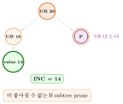{fig-alt="UB 20인 root에서 UB 16과 UB 12 두 child로 확장되고 UB 16 쪽에서 value 14인 feasible solution을 찾아 incumbent를 갱신한 뒤 UB 12 child가 prune되는 4단계 트레이스의 마지막 상태" width="50%"}

$$\text{total work}\approx\text{expanded nodes}\times\text{bound cost}$$

| Bound | 장점 | 단점 |
|---|---|---|
| loose | 계산이 빠름 | pruning 적음 |
| tight | pruning 많음 | 계산이 비쌀 수 있음 |

::: {.callout-tip title="Branch-and-Bound Takeaway"}
Branch-and-Bound는 탐색 순서가 아니라 incumbent와 safe objective bound의 관계로 정의된다.
:::

## Part D. 0/1 Knapsack Branch-and-Bound

$$\max\sum p_ix_i\quad\text{s.t.}\quad\sum w_ix_i\le W,\quad x_i\in\{0,1\}$$

| | |
|---|---|
| State | next item, current weight/profit, selected set, upper bound |
| Order | profit/weight ratio 내림차순 |
| Decision | item include/exclude |

::: {.callout-tip title="Partial state도 feasible solution"}
현재 weight가 $W$ 이하이면, 남은 item을 모두 exclude하여 지금 selected set을 그대로 완성할 수 있다. 따라서 leaf 전에도 current profit으로 incumbent를 갱신할 수 있다.
:::

| item | weight | profit | ratio |
|---|---|---|---|
| A | 2 | 40 | 20 |
| B | 5 | 30 | 6 |
| C | 10 | 50 | 5 |
| D | 5 | 10 | 2 |

$W=16$. 검증된 optimum: A와 C, weight 12, profit 90.

0/1 constraint를 완화해 마지막 item의 fraction을 허용하면 $UB(root)=40+30+\frac{9}{10}\cdot50=115$다 — fractional optimum은 0/1 feasible set을 포함하는 relaxation의 optimum이므로 실제 0/1 optimum보다 작지 않다.

**Bound 계산 절차**: (1) 현재 profit에서 시작한다. (2) 남은 capacity를 ratio 순 complete item으로 채운다. (3) 마지막 item은 가능한 fraction만 채운다.

::: {.callout-warning title="Overflow safety"}
weight/profit 합은 넓은 정수형과 덧셈 guard를 사용하고, ratio 비교는 cross multiplication을 안전하게 처리한다.
:::

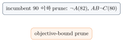{fig-alt="root에서 A 포함/제외로 나뉘고 B, C를 거쳐 weight 12 profit 90인 최적해를 찾은 뒤 남은 후보를 모두 prune하는 7단계 트레이스의 마지막 상태" width="30%"}

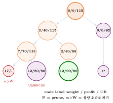{fig-alt="root 0/0/115에서 A 포함 2/40/115와 A 제외 0/0/82로 갈라지고, A 포함 쪽이 다시 7/70/115와 2/40/98 두 형제로 나뉘어 2/40/98 아래에만 12/90이 달린 트리. A 제외 쪽 아래에는 prune을 뜻하는 P 노드가 있다." width="45%"}

$$currentWeight=\sum_{i\in selected}w_i,\qquad currentProfit=\sum_{i\in selected}p_i,\qquad UB(node)\ge\text{true best feasible descendant profit}$$

작은 instance에서는 각 node의 descendant를 brute force로 열거해 모든 displayed bound를 검사한다.

::: {.callout-tip title="Knapsack Takeaway"}
Fractional knapsack은 0/1 feasible set을 완화하므로 maximization의 safe upper bound를 제공한다. 최악 시간은 여전히 exponential이다.
:::

**구현**: 위 A/B/C/D, $W=16$ 예제로 optimum(profit 90, weight 12)을 실제로 계산해 검증한다.

::: {.panel-tabset}
## Python
```{.python}

```
## Java
```{.java}

```
## C
```{.c}

```
:::

**실행 결과** (실제 컴파일·실행 캡처 — `gcc -Wall`, `javac`/`java`, `python3`):

::: {.panel-tabset}
## Python
```{.default}

```
## Java
```{.default}

```
## C
```{.default}

```
:::

### FIFO·LIFO·Least-Cost 탐색 순서 {.unnumbered}

::: {.callout-note title="선택 심화"}
Branch-and-Bound는 어느 frontier 정책을 써도 optimum이 바뀌지 않는다 — 성능과 memory만 달라진다.
:::

| Policy | Container | 다음 node | 특징 |
|---|---|---|---|
| FIFO | queue | 가장 오래된 live node | level-order |
| LIFO | stack | 가장 최근 live node | DFS-like |
| Best-bound | PQ | 가장 좋은 UB/LB | 평가 집중 |

{fig-alt="A,B,C 세 live node에서 FIFO, LIFO, best-bound가 각각 다른 node를 다음으로 선택하지만 optimality는 유지된다는 설명이 붙은 3단계 트레이스의 마지막 상태" width="65%"}

LIFO가 좋은 깊은 해를 빨리 찾으면 이후 많은 node를 prune할 수 있고, best-bound는 bound가 정확할 때 좋은 branch에 집중하며, FIFO는 shallow structure를 고르게 보지만 frontier가 커질 수 있다.

Minimization에서는 lower bound가 가장 작은 node를 먼저 꺼내므로 **least-cost B&B**라 부른다.

$$\text{maximization: ExtractMax(UB)},\qquad\text{minimization: ExtractMin(LB)}$$

::: {.callout-note title="동일한 전제"}
complete expansion, sound feasibility pruning, safe objective bound, 올바른 종료 조건 — 이 전제 아래 순서는 성능과 memory를 바꾸지만 optimum 자체는 바꾸지 않는다.
:::

::: {.callout-caution collapse="true" title="확인 문제: Frontier Policy Checkpoint"}
1. memory가 가장 커질 가능성이 높은 정책은?
2. maximization best-bound의 PQ key는?

**답**: 1. FIFO 또는 넓은 best-first frontier. 2. upper bound가 큰 순서.
:::

## Part E. A\* Search

$$g(n)=\text{start부터 알려진 path cost},\qquad h(n)=\text{남은 최적 비용 추정},\qquad f(n)=g(n)+h(n)$$

OPEN에서 $f$가 최소인 state를 확장한다. 본문은 nonnegative edge cost와 consistent heuristic을 기본 전제로 한다.

::: {.callout-tip title="다리: 그래프 장의 heap과 Dijkstra"}
그래프 장에서 Prim/Dijkstra의 우선순위 큐로 다시 쓴 정렬 장의 min-heap이 여기서 또 등장한다 — 이번엔 $f=g+h$를 key로 하는 min-PQ다. 그리고 $h(n)=0$으로 두면 $f(n)=g(n)$이 되어 동일한 tie-breaking에서 A\*의 expansion priority는 **Dijkstra와 같다**(뒤에서 직접 확인한다).
:::





`AStar`가 부르는 `Relax`는 같은 파일에서 이미 완결된 procedure다 — 문자열 매칭 장의 `KMPSearch`가 `BuildLPS`를 부르는 것과 같은 정상 참조다. `entryG≠g[u]`이면 continue하는 stale-$g$-snapshot 검사는 일반 floating-point 구현에서 exact $f$ equality 대신 쓰는 안전장치다.

4-neighbor, unit cost grid에서 $h(r,c)=|r-r_G|+|c-c_G|$(Manhattan heuristic)를 쓴다.

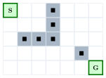{fig-alt="5행 7열 격자에서 여섯 개의 장애물 칸이 회색으로 표시되고 왼쪽 위에 S, 오른쪽 아래에 G가 있는 다이어그램" width="35%"}

::: {.panel-tabset}
## 1단계

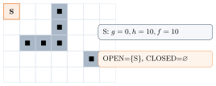{fig-alt="격자에서 시작 칸 S만 OPEN으로 표시되고 나머지 칸은 비어 있는 상태" width="65%"}

## 2단계

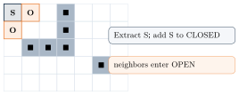{fig-alt="격자에서 시작 칸 S가 CLOSED로 표시되고 인접한 두 칸이 OPEN으로 열린 상태" width="65%"}

## 3단계

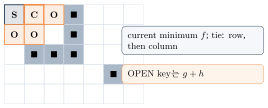{fig-alt="격자에서 현재 확장 중인 칸이 굵은 테두리로 강조되고 주변에 OPEN 칸들이 늘어난 상태" width="65%"}

## 4단계

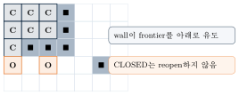{fig-alt="격자 왼쪽 위 블록의 여러 칸이 CLOSED로 채워지고 벽 아래쪽에 OPEN 칸 두 개가 열린 상태" width="65%"}

## 5단계

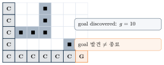{fig-alt="격자 왼쪽 열과 아래쪽 행을 따라 CLOSED 칸들이 이어지고 목표 칸이 OPEN으로 표시된 상태" width="65%"}

## 6단계

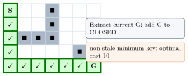{fig-alt="격자에서 시작부터 목표까지의 경로 칸들이 체크 표시와 함께 확정된 상태" width="65%"}
:::

::: {.panel-tabset}
## 1단계

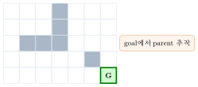{fig-alt="격자에서 목표 칸 G만 확정 표시되고 나머지 칸은 비어 있는 상태" width="35%"}

## 2단계

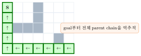{fig-alt="목표에서 시작까지 격자를 따라 화살표들이 이어지고 시작 칸 S가 표시된 상태" width="35%"}

## 3단계

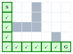{fig-alt="시작 칸 S부터 목표 칸 G까지 전체 경로가 체크 표시로 확정된 상태" width="35%"}
:::

::: {.callout-note title="정의: Admissible Heuristic"}
$$0\le h(n)\le h^*(n),\qquad h(goal)=0$$

남은 실제 optimal cost를 과대평가하지 않는다. optimal path의 frontier node는 실제 optimum보다 큰 $f$로 밀려나지 않으므로, tree-search A\*가 더 비싼 goal을 먼저 확정하지 않는다.
:::

::: {.callout-note title="정의: Consistent Heuristic"}
$$h(u)\le w(u,v)+h(v)\qquad\text{for every edge }(u,v)$$

$u$를 거치는 tentative candidate path의 $f$-value는 $f(u)$보다 작지 않다: $f_{\mathrm{via}\ u}(v)=g(u)+w(u,v)+h(v)\ge g(u)+h(u)$. 기존 best-known $g(v)$는 이미 더 작을 수 있다는 점에 주의한다.
:::

::: {.callout-warning title="Admissible but Inconsistent (Advanced, 선택 심화)"}
admissibility만 있고 consistency가 없으면 더 좋은 path가 이미 closed된 node에 나중에 도착할 수 있다. 본문 pseudocode와 Java/C 구현은 consistent $h$, permanent CLOSED, reopening 없음을 전제한다 — admissible but inconsistent $h$라면 더 작은 $g$가 발견될 때 CLOSED node를 reopen하거나 permanent closure가 없는 formulation을 써야 한다. admissibility만으로 no-reopening graph-search A\*의 optimality가 보장되지는 않는다.
:::

$$h(n)=0\quad\Rightarrow\quad f(n)=g(n)$$

따라서 동일한 tie-breaking에서 expansion priority는 Dijkstra와 같다 — 좋은 heuristic은 optimality를 보존하면서 goal과 무관한 state 확장을 줄일 수 있다.

::: {.callout-tip title="A* Takeaway"}
A*는 $g+h$로 frontier를 정렬하며 goal을 current minimum으로 extract할 때 종료한다. consistent $h$에서는 CLOSED reopening이 필요 없다.
:::

**구현**: 위 5×7 grid에서 A*(Manhattan)와 $h=0$(Dijkstra와 동치)의 cost가 모두 10으로 일치함을 검증한다.

::: {.panel-tabset}
## Python
```{.python}

```
## Java
```{.java}

```
## C
```{.c}

```
:::

**실행 결과** (실제 컴파일·실행 캡처 — `gcc -Wall`, `javac`/`java`, `python3`): `cost`(Manhattan heuristic)와 `dijkstra_cost`($h=0$)가 모두 10으로 같다 — 이 grid에서는 장애물이 Manhattan distance보다 더 긴 우회를 강제하지 않는다는 뜻이다.

::: {.panel-tabset}
## Python
```{.default}

```
## Java
```{.default}

```
## C
```{.default}

```
:::

## Part F. Comparison, Implementation, Summary, and Quiz

A*와 Branch-and-Bound는 frontier, best-first 가능, optimistic estimate, worst-case exponential이라는 공통점이 있지만, A*는 path cost $g+h$와 heuristic 조건을, B&B는 일반 최적화와 subtree bound·incumbent를 쓴다 — 관련된 best-first framework이지만 동의어는 아니다.

| | Backtracking | B&B | A* |
|---|---|---|---|
| main goal | feasible solution | optimal solution | least-cost path |
| typical order | DFS | DFS/BFS/best-first | best-first |
| evaluation | promising | objective UB/LB | $f=g+h$ |
| best known | optional | incumbent | $g$, goal cost |
| structure | recursion/stack | stack/queue/PQ | min-PQ |
| correctness | sound feasibility prune | safe bound | admissible/consistent policy |
| examples | queens, coloring | knapsack, assignment | pathfinding |
| memory | usually depth | frontier-dependent | OPEN/CLOSED can be large |

Backtracking의 worst case는 subset $O(2^n)$, permutation $O(n!)$이다. Branch-and-Bound는 bound가 도움이 없으면 exponential tree 전체를 본다. A*는 약한 heuristic과 큰 state space에서는 exponential time/memory가 가능하다 — theoretical worst case, expanded-node count, bound/heuristic cost, peak frontier size를 구분해서 봐야 한다.

::: {.callout-warning title="Pruning은 Heuristic인가?"}
sound pruning은 correctness를 희생하지 않는 논리적 제거다. heuristic은 탐색 순서나 optimistic estimate를 제공할 수 있다. unsafe heuristic으로 prune하면 더 빨라질 수 있지만 exact algorithm이 아니다.
:::

::: {.callout-caution collapse="true" title="확인 문제: 세 탐색 기법 Checkpoint"}
1. feasibility와 objective pruning의 질문은 각각 무엇인가?
2. $h=0$인 A*는?
3. pruning이 polynomial을 보장하는가?

**답**: 1. 해가 가능한가 / incumbent 개선 가능한가. 2. Dijkstra priority. 3. 아니다.
:::

### 구현·테스트·성능 측정

공통 metric: **generated**(child state로 만든 node), **evaluated**(feasibility/bound를 검사한 node), **inserted**(frontier에 실제 넣은 node), **expanded**(frontier에서 꺼내 child를 만든 node), **pruned**(feasibility 또는 bound로 제거한 node), **peak frontier**(frontier의 최대 크기), feasibility tests, bound computations, first feasible 시간, final optimum 시간, elapsed 시간. 고정 input·seed·tie-breaking으로 pruning 없음/weak/strong, DFS/best-first, $h=0$/Manhattan을 비교하면 재현 가능하다.

Java 구현은 `PermutationGenerator`, `NQueensSolver`, `SubsetSumSolver`, `GraphColoringSolver`, `ArithmeticProgressionSearch`, `KnapsackBranchAndBound`, `AStarGrid`로 구성되며 모든 traversal은 deterministic하고 반환 solution을 별도 validator로 확인한다. C 구현은 explicit pointer와 size, caller-owned output buffer, allocation failure와 integer overflow guard, recursion state restoration assertion, sanitizer-friendly cleanup을 쓴다 — 각 API는 caller가 제공한 buffer를 채우거나 명시적인 cleanup 함수를 제공한다.

작은 permutation/subset/AP/knapsack은 brute-force oracle과 비교하고, N-Queens는 $n=1,2,3,4,8$ count와 conflict validator로, 모든 test grid에서 A* cost를 Dijkstra oracle과 비교하고 parent chain·path cost를 재계산한다. goal 발견 전 종료 금지와 consistent/no-reopen 대 inconsistent/reopen 정책을 regression test하고, 모든 bound가 true descendant optimum보다 optimistic인지 검사한다.

| Example | Expected |
|---|---|
| $5P_4$ | 120 unique outputs |
| 4-Queens | 2 solutions |
| Subset Sum $[3,4,5,6],9$ | $\{3,6\},\{4,5\}$ |
| AP $[1,3,4,5,7]$ | $[1,3,5,7]$, length 4 |
| Knapsack | $\{A,C\}$, profit 90 |
| A* grid | Dijkstra와 같은 cost 10 |

이 장의 Python/Java/C 구현은 위 예제를 포함해 permutation/n-queens/subset-sum/graph-coloring/knapsack은 brute-force oracle과, A*는 BFS(unit-cost 등가) oracle과 각각 100~300회 randomized case로 비교해 검증했다.

::: {.callout-caution collapse="true" title="확인 문제: 구현·테스트 Checkpoint"}
1. built-in library 탐색/정렬 함수를 구현에 사용했는가?
2. Java와 C 중 어느 쪽이 실제 solution을 반환하는가?

**답**: 1. 아니다, 직접 backtracking/branch-and-bound 재귀로 구현했다. 2. Java는 실제 solution(순열, queen 위치, subset, color, 선택 item, path)을, C는 개수·metrics·최적값을 반환한다 — 이 장의 데모는 두 언어가 공통으로 낼 수 있는 값(개수, 최적 profit/weight, cost, graph-coloring의 실제 color 배열)만 비교한다.
:::

## 💡 배움 포인트

- State-space tree는 state와 decision으로 이루어진 implicit model이다 — 전체 tree를 미리 만들지 않고 필요한 child만 on-demand로 생성한다.
- **Backtracking ≠ DFS**다. DFS는 탐색 순서 중 하나일 뿐이고, Backtracking의 정의적 특징은 promising predicate가 보장하는 sound feasibility pruning이다.
- **Branch-and-Bound ≠ Backtracking**이다. 목표(feasible 탐색 vs optimal 탐색)와 prune 증거(feasibility vs incumbent를 개선할 수 없는 objective bound)가 다르며, B&B는 FIFO/LIFO/best-first 어느 순서든 optimum을 바꾸지 않는다.
- 안전한 bound는 최적해를 잃지 않는 것이 최우선이다 — loose하지만 safe한 bound는 correct, tight하지만 unsafe한 bound는 incorrect다.
- A*는 그래프 장의 heap(우선순위 큐)을 $f=g+h$ key로 다시 쓰는 best-first search다. consistent heuristic 아래에서는 CLOSED를 permanent하게 유지해도 optimality가 보장되며, $h=0$이면 Dijkstra와 동일한 확장 순서가 된다.
- 세 기법 모두 pruning이 효과가 없으면 최악의 경우 exponential이다 — sound pruning이 correctness를 보존한다고 해서 polynomial을 보장하지는 않는다.

## 🧪 직접 해보기

::: {.callout-caution collapse="true" title="State-Space Basics Quiz"}
1. binary decision depth $n$의 leaves는?
2. candidate와 feasible의 차이는?
3. implicit tree의 의미는?

**정답**

1. $2^n$.
2. candidate는 complete state, feasible은 constraint를 만족한 complete state다.
3. 필요한 child만 on demand로 생성한다.
:::

::: {.callout-caution collapse="true" title="Backtracking Quiz"}
1. promising false가 보장해야 하는 것은?
2. false positive의 영향은?
3. Apply 뒤 반드시 대응해야 하는 연산은?

**정답**

1. 어떤 descendant도 feasible하지 않음.
2. 느려지지만 correctness는 유지된다.
3. Undo.
:::

::: {.callout-caution collapse="true" title="Examples Quiz"}
1. N-Queens diagonal conflict 식은?
2. positive Subset Sum의 두 prune 조건은?
3. $[1,3,4]$가 AP에서 즉시 prune되는 이유는?

**정답**

1. $|r_1-r_2|=|c_1-c_2|$.
2. $s>W$, $s+r<W$.
3. adjacent difference가 이미 2와 1로 다르기 때문이다.
:::

::: {.callout-caution collapse="true" title="Branch-and-Bound Quiz"}
1. maximization prune inequality는?
2. fractional knapsack이 safe UB인 이유는?
3. least-cost B&B는 어떤 PQ를 쓰는가?

**정답**

1. $UB\le INC$.
2. 0/1 constraint를 완화한 superset의 optimum이기 때문이다.
3. lower bound min-PQ.
:::

::: {.callout-caution collapse="true" title="A* Quiz"}
1. $g=7,h=4$이면 $f$는?
2. goal 발견 즉시 종료해도 되는가?
3. consistency 식은?
4. inconsistent $h$에서 필요한 정책은?

**정답**

1. 11.
2. 아니다 — current non-stale minimum으로 extract할 때 종료한다.
3. $h(u)\le w(u,v)+h(v)$.
4. 더 좋은 $g$가 오면 CLOSED를 reopen한다.
:::

::: {.callout-tip collapse="true" title="Final Checkpoint"}
"왜 이 subtree를 보지 않아도 되는가?"를 feasibility contradiction, incumbent bound, 또는 admissible heuristic의 언어로 정확히 답할 수 있어야 한다.
:::

## 요약

State-space tree search는 state(지금까지의 결정)와 decision(다음 선택)으로 이루어진 implicit tree를 필요한 만큼만 생성하며 탐색한다. Backtracking은 promising predicate로 sound feasibility pruning을 수행한다 — "깊이 간다"는 DFS의 특징일 뿐, Apply/Undo invariant와 pruning의 soundness가 correctness의 근거다. N-Queens는 O(1) conflict check로, Subset Sum은 두 sound pruning 조건으로, Graph Coloring은 같은 Backtracking skeleton에 state만 바꿔 구체화된다. Branch-and-Bound는 Backtracking과 목표와 증거가 다르다 — incumbent와 safe objective bound(maximization UB, minimization LB)로 subtree를 제거하며, 탐색 순서(FIFO/LIFO/best-first)는 optimum을 바꾸지 않는다. 0/1 Knapsack은 fractional relaxation이 안전한 upper bound를 제공하는 대표 사례다. A*는 $g+h$를 key로 하는 best-first search로, 그래프 장의 heap을 다시 쓰고 consistent heuristic 아래 permanent CLOSED와 non-stale-minimum 종료 조건으로 optimality를 보장하며, $h=0$이면 Dijkstra와 정확히 같은 확장 순서가 된다. 세 기법 모두 sound pruning이 correctness는 보존하지만 최악의 경우 여전히 exponential일 수 있다 — 실제 선택은 문제가 feasible solution만 필요한지, optimal solution이 필요한지, 아니면 최단 path인지에 따라 달라진다.
